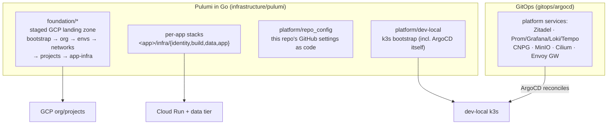

# Quick start — platform engineer

You change infrastructure: the GCP foundation, per-app Pulumi stacks, the dev-local
k8s platform, or the repo's own governance. This page orients you in the estate and
its rules.

## The estate in one diagram



Start by reading, in order:

1. [Monorepo architecture](../concepts/monorepo-architecture.md) — the two planes and
   how they relate.
2. [Core vs. application infrastructure](../engineering/core-vs-application-infrastructure.md)
   — **the boundary doc**: what belongs in a foundation leaf vs an app's own stack.
3. [Infrastructure architecture](../infrastructure/architecture.md) +
   [user guide](../infrastructure/user-guide.md) — the Pulumi estate in depth.

## The rules that bind every infra change

- **Bazel wrappers only.** `bazel run //<project>:{setup,preview,up,…}` — never
  ambient `pulumi`/`kubectl`/`helm`. The wrapper injects the correct GCP identity per
  project from `infrastructure/gcp-identities.tsv` and fails fast otherwise.
- **The pipeline applies; you preview.** Local `:up` is break-glass. Every stack must
  be applyable in CI, and work that ends in "then run X locally" is unfinished
  ([Principles §2.14](../engineering/application-development-principles.md#214-the-pipeline-is-the-only-trigger-nothing-waits-on-a-humans-keystroke)).
- **GitOps closed loop.** The dev-local cluster changes only via git → ArgoCD. Manual
  cluster writes need explicit per-instance approval and immediate backfill to git.
- **Secrets:** sealed-secrets for k8s, `secrets.EnvOrConfig` for Pulumi stacks, GCP
  Secret Manager for app runtime. Never a `secure:` blob in a committed file.
- **Expand → deploy → contract.** Infra lands before the app that needs it; destructive
  contraction happens after the old revision drains
  ([Principles §2.15](../engineering/application-development-principles.md#215-infra-lands-before-the-app-that-needs-it--expand-deploy-contract)).
- **Pulumi-in-Go is the only IaC.** No Terraform/CDK; a new tool needs explicit
  sign-off first ([Principles §2.13](../engineering/application-development-principles.md#213-sanctioned-tools-only-a-new-tool-needs-explicit-sign-off)).

## A typical infra change

```bash
bazel run //tools/worktree -- my-infra-change
# edit the Pulumi program / gitops manifests
bazel run //infrastructure/pulumi/platform/repo_config:preview   # see the diff
bazel run //:tidy && bazel test //...
git push && gh pr create
# PR: pulumi-preview / foundation-preview post the diff as a comment;
#     gitops-validate kubeconform-checks any gitops/** change
# merge queue → main → the apply workflow (or ArgoCD) does the actual apply
```

Foundation changes promote per-stage through `foundation-release.yaml`
(projects → environments → networks → app-infra), each stage also independently
dispatchable for break-glass.

## Going deeper

- [Infrastructure reference](../infrastructure/reference.md) — cheat sheet: projects,
  verbs, identities, file locations.
- [dev-local cluster architecture](../infrastructure/dev-local-cluster.md) — nodes,
  Cilium, ingress, storage, observability.
- [dev-local vs GKE](../infrastructure/dev-local-vs-gke.md) — parity map for
  production-shaped thinking.
- [Resilience catalog](../infrastructure/resilience-catalog.md) — what survives node
  loss, and the hardening backlog.
- [Bazel targets & tools](../reference/bazel-targets.md) — the full ops-target
  catalog, including cluster and sealed-secrets custody targets.
- [Domain zone conventions](../engineering/domain-zone-conventions.md) — which DNS
  zone a service lands in.
