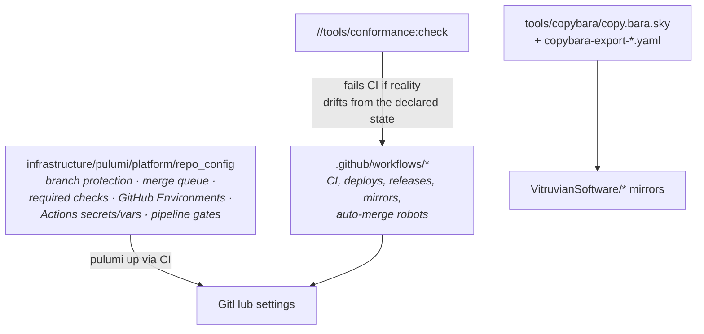

# Quick start — repo admin

You govern the repo itself: branch protection, the merge queue and its required
checks, CI health, mirrors, releases, and secrets/identity custody. In this repo,
**governance is code** — nearly everything you administer is a Pulumi program or a
workflow file, not a settings page.

## The admin surfaces

Start by reading:

1. [Merge automation](../../.github/workflows/README.md) — the queue, the
   release-PR/dependabot auto-merge robots, and how to hold a release
   (`do-not-automerge` label or draft state).
2. [CI/CD approach](../engineering/ci-cd-approach.md) +
   [CI vocabulary](../../.github/CI_DEFINITIONS.md) — affected targets, the safety
   floor, fail-open deploys.
3. [Copybara sync](../admin/copybara-sync.md) — the complete mirror runbook: shapes,
   operations, failure modes, seeding a new mirror.

## Invariants you are the guardian of

- **The required-check list lives in code** (`repo_config/main.go`,
  `mergeQueueRequiredChecks`) and `//tools/conformance:check` asserts every name is
  produced by a job reporting on `merge_group`. Add/remove checks there, never in the
  UI.
- **Required checks never get workflow-level `paths:` filters.** A path-filtered
  required check never reports and wedges every PR (this happened once). Gate the
  *work inside* the job instead.
- **Pipeline gates** (`REPO_CONFIG_AUTO_APPLY`, `SYNC_AUTH_AUTO_APPLY`, …) switch IaC
  workflows between advisory and applying. They are Pulumi-managed (`pipelineGates`)
  — never hand-set.
- **An imperative one-off is never the source of truth.** `gh secret set` or a
  console click during bring-up is debt until it's declared in `repo_config`
  ([Principles §2.18](../engineering/application-development-principles.md#218-every-change-ships-as-code--iac-gitops-or-a-pipeline-never-an-imperative-one-off)).
- **Bot PRs flow through the queue** like everything else; majors are never
  auto-merged.

## Routine admin tasks

| Task | How |
|---|---|
| Change branch protection / required checks / environments | Edit `repo_config`, `bazel run //infrastructure/pulumi/platform/repo_config:preview`, PR; CI applies |
| Hold a release | Label the release-please PR `do-not-automerge` (or convert to draft) |
| Rotate an Actions secret | [Key rotation](../operations/key-rotation.md); values sync via `//tools/sync-env-secrets:apply` |
| Add a mirrored component | Copybara `COMPONENTS` list + a thin `copybara-export-<app>.yaml` caller — see [the runbook](../admin/copybara-sync.md) |
| Seed a brand-new empty mirror | First export with `--init-history` (once) |
| Investigate a red nightly sweep | The P0 issue is auto-filed; dispatch `culprit-finder.yaml` with the good/bad range |
| Un-quarantine a flaky e2e spec | Green-streak evidence from the nightly quarantine lane — [flaky tests](../engineering/flaky-tests.md) |

## Governance standards

Every first-party app carries the governance quartet (`LICENSE` — MIT,
VitruvianSoftware — `CONTRIBUTING.md`, `CLA.md`, `CODE_OF_CONDUCT.md`), enforced
in spirit by `license-check` and tracked honestly in the
[alignment gaps](../engineering/application-alignment-gaps.md). The
[app launch status](../engineering/app-launch-status.md) registry gates which apps
tolerate disruptive change.
