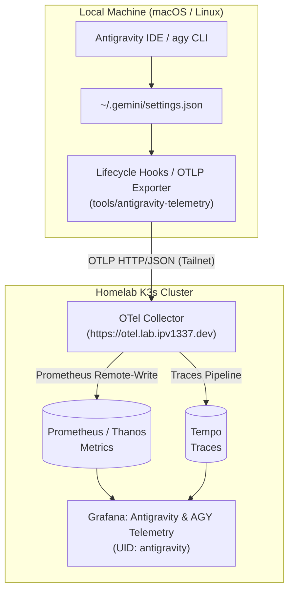

<!--
Copyright (c) 2026 VitruvianSoftware

Permission is hereby granted, free of charge, to any person obtaining a copy
of this software and associated documentation files (the "Software"), to deal
in the Software without restriction, including without limitation the rights
to use, copy, modify, merge, publish, distribute, sublicense, and/or sell
copies of the Software, and to permit persons to whom the Software is
furnished to do so, subject to the following conditions:

The above copyright notice and this permission notice shall be included in
all copies or substantial portions of the Software.

THE SOFTWARE IS PROVIDED "AS IS", WITHOUT WARRANTY OF ANY KIND, EXPRESS OR
IMPLIED, INCLUDING BUT NOT LIMITED TO THE WARRANTIES OF MERCHANTABILITY,
FITNESS FOR A PARTICULAR PURPOSE AND NONINFRINGEMENT. IN NO EVENT SHALL THE
AUTHORS OR COPYRIGHT HOLDERS BE LIABLE FOR ANY CLAIM, DAMAGES OR OTHER
LIABILITY, WHETHER IN AN ACTION OF CONTRACT, TORT OR OTHERWISE, ARISING FROM,
OUT OF OR IN CONNECTION WITH THE SOFTWARE OR THE USE OR OTHER DEALINGS IN THE
SOFTWARE.
-->

# Antigravity & `agy` Observability Guide

This guide documents the architecture, ingestion pipeline, and Grafana visualization for Antigravity IDE and `agy` CLI telemetry in the Vitruvian homelab.

---

## 1. End-to-End Telemetry Pipeline



### Components:
- **Telemetry Producer**: Antigravity lifecycle hooks (`AfterModel`/`PostInvocation`, `AfterTool`/`PostToolUse`, `AfterAgent`/`Stop`) in `~/.gemini/hooks/telemetry_hook.py`.
- **OTel Collector**: Deployed at `https://otel.lab.ipv1337.dev` (`gitops/argocd/platform/opentelemetry-collector/`). Receives OTLP HTTP/JSON and gRPC payloads.
- **Metrics Storage**: Ingested via OTel Collector's `prometheusremotewrite` into both Prometheus replicas (`prometheus-server-0`, `prometheus-server-1`) and queried deduplicated via Thanos.
- **Trace Storage**: Distributed spans forwarded to Tempo (`http://tempo.opentelemetry.svc.cluster.local:3200`).
- **Grafana Dashboard**: Declarative GitOps dashboard `antigravity.json` (UID: `antigravity`) delivered via the Grafana ConfigMap sidecar.

---

## 2. Grafana Dashboard Architecture

```mermaid
flowchart TB
    subgraph Dashboard["Grafana Dashboard: Antigravity and AGY Telemetry (UID: antigravity)"]
        direction TB
        HostSelector["Top Filter: Host Dropdown ($host: All, james-mbp32, fedora)"]

        subgraph Section1["1. Token Economy"]
            T1["Cumulative Input Tokens"]
            T2["Cumulative Output Tokens"]
            T3["Cumulative Thinking Tokens"]
            T4["Cumulative Cached Tokens"]
            T5["Token Consumption Rate (tokens/sec)"]
        end

        subgraph Section2["2. Model and Cost Distribution"]
            M1["Token Usage by Model (Donut)"]
            M2["Model API Invocations (Timeseries)"]
        end

        subgraph Section3["3. Tool and MCP Execution"]
            L1["Tool Execution Throughput (calls/min)"]
            L2["P50 / P95 / P99 Latency per Tool (ms)"]
            L3["Tool Success vs Failure Rates"]
        end

        subgraph Section4["4. Session and Multi-Agent Activity"]
            S1["Active and Completed Sessions"]
            S2["Turn Duration and Concurrency"]
        end

        subgraph Section5["5. Distributed Tracing (Tempo TraceQL)"]
            Tr1["Live Trace Waterfall Table (service.name: antigravity, agy)"]
        end

        HostSelector --> T1
        HostSelector --> M1
        HostSelector --> L1
        HostSelector --> S1
        HostSelector --> Tr1
    end
```



---

## 3. Multi-Host Configuration (Repository Checkout)

To enable telemetry on any machine with `vitruvian-core` checked out:

```bash
# 1. Register lifecycle hooks and OTLP endpoint
bazel run //tools/antigravity-telemetry -- setup

# 2. Check health and connectivity
bazel run //tools/antigravity-telemetry -- status
```

---

## 4. Zero-Clone Setup Prompt for Agents

To configure telemetry on **any machine without cloning the repository**, copy and paste the prompt below directly into an `agy` or Antigravity agent session. The agent will autonomously write the hook, update settings, run self-verification tests, and report back when finished:

````markdown
Configure this machine to automatically stream Antigravity / `agy` session and token telemetry to our homelab OpenTelemetry collector.

Execute all of the following autonomously:
1. Create `~/.gemini/hooks/telemetry_hook.py` (executable with `chmod +x`) using this self-contained implementation:

```python
#!/usr/bin/env python3
"""Self-contained Antigravity Lifecycle Hook for OTLP Telemetry."""
import gzip
import json
import os
import socket
import subprocess
import sys
import threading
import time
import urllib.error
import urllib.request
from typing import Any, Dict, List, Optional, Union

DEFAULT_ENDPOINT = "https://otel.lab.ipv1337.dev"
DEFAULT_LATENCY_BOUNDS = [10.0, 50.0, 100.0, 250.0, 500.0, 1000.0, 2500.0, 5000.0, 10000.0, 30000.0, 60000.0]
_TOOL_TIMERS: Dict[str, float] = {}

def get_hostname() -> str:
    for env in ["ANTIGRAVITY_HOST", "ANTIGRAVITY_HOSTNAME", "HOST_NAME", "HOSTNAME"]:
        val = os.environ.get(env)
        if val and val.strip():
            return val.strip().split(".")[0]
    if os.path.exists("/usr/sbin/scutil"):
        try:
            res = subprocess.run(["/usr/sbin/scutil", "--get", "LocalHostName"], capture_output=True, text=True, timeout=1)
            if res.returncode == 0 and res.stdout.strip():
                return res.stdout.strip()
        except Exception:
            pass
    return socket.gethostname().split(".")[0]

def otel_attr(key: str, value: Any) -> Dict[str, Any]:
    if isinstance(value, bool):
        return {"key": key, "value": {"boolValue": value}}
    elif isinstance(value, int):
        return {"key": key, "value": {"intValue": str(value)}}
    elif isinstance(value, float):
        return {"key": key, "value": {"doubleValue": value}}
    return {"key": key, "value": {"stringValue": str(value)}}

def otel_attrs(attrs_dict: Dict[str, Any]) -> List[Dict[str, Any]]:
    return [otel_attr(k, v) for k, v in attrs_dict.items() if v is not None]

def build_sum_dp(value: int, attributes: Dict[str, Any]) -> Dict[str, Any]:
    return {"attributes": otel_attrs(attributes), "timeUnixNano": str(time.time_ns()), "asInt": str(value)}

def build_sum_metric(name: str, description: str, unit: str, datapoints: List[Dict[str, Any]]) -> Dict[str, Any]:
    return {"name": name, "description": description, "unit": unit, "sum": {"aggregationTemporality": 2, "isMonotonic": True, "dataPoints": datapoints}}

def build_hist_dp(values: Union[List[float], float], attributes: Dict[str, Any]) -> Dict[str, Any]:
    vals = [values] if isinstance(values, (int, float)) else list(values)
    counts = [0] * (len(DEFAULT_LATENCY_BOUNDS) + 1)
    for v in vals:
        placed = False
        for i, b in enumerate(DEFAULT_LATENCY_BOUNDS):
            if v <= b:
                counts[i] += 1
                placed = True
                break
        if not placed:
            counts[-1] += 1
    return {
        "attributes": otel_attrs(attributes),
        "timeUnixNano": str(time.time_ns()),
        "count": str(len(vals)),
        "sum": float(sum(vals)),
        "bucketCounts": [str(c) for c in counts],
        "explicitBounds": DEFAULT_LATENCY_BOUNDS,
    }

def build_hist_metric(name: str, description: str, unit: str, datapoints: List[Dict[str, Any]]) -> Dict[str, Any]:
    return {"name": name, "description": description, "unit": unit, "histogram": {"aggregationTemporality": 2, "dataPoints": datapoints}}

def post_otlp(payload: Dict[str, Any], endpoint: str) -> None:
    def _send():
        try:
            url = f"{endpoint.rstrip("/")}/v1/metrics"
            body = json.dumps(payload).encode("utf-8")
            compressed = gzip.compress(body)
            req = urllib.request.Request(url, data=compressed, headers={"Content-Type": "application/json", "Content-Encoding": "gzip", "User-Agent": "antigravity-telemetry/1.0.0"}, method="POST")
            with urllib.request.urlopen(req, timeout=2.0) as resp:
                resp.read()
        except Exception:
            pass
    threading.Thread(target=_send, daemon=True).start()

def main():
    try:
        raw = sys.stdin.read()
        data = json.loads(raw) if raw.strip() else {}
        host = get_hostname()
        endpoint = os.environ.get("ANTIGRAVITY_OTLP_ENDPOINT", DEFAULT_ENDPOINT)
        event = data.get("hook_event", data.get("hookEvent", ""))
        metrics = []

        if event in ("AfterModel", "PostInvocation"):
            resp = data.get("llm_response", data.get("llmResponse", {}))
            usage = resp.get("usage_metadata", resp.get("usageMetadata", {}))
            model = resp.get("model", data.get("model", "gemini-3.7-flash"))
            in_t = int(usage.get("prompt_token_count", usage.get("promptTokenCount", 0)))
            out_t = int(usage.get("candidates_token_count", usage.get("candidatesTokenCount", 0)))
            th_t = int(usage.get("thinking_token_count", usage.get("thinkingTokenCount", 0)))
            ca_t = int(usage.get("cached_content_token_count", usage.get("cachedContentTokenCount", 0)))
            
            dps = [
                build_sum_dp(in_t, {"host": host, "token_type": "input", "model": model}),
                build_sum_dp(out_t, {"host": host, "token_type": "output", "model": model}),
                build_sum_dp(th_t, {"host": host, "token_type": "thinking", "model": model}),
                build_sum_dp(ca_t, {"host": host, "token_type": "cached", "model": model}),
            ]
            metrics.append(build_sum_metric("antigravity_token_usage_total", "Tokens consumed", "{tokens}", dps))
            metrics.append(build_sum_metric("antigravity_api_request_count_total", "API requests", "{requests}", [build_sum_dp(1, {"host": host, "model": model, "status_code": "200"})]))
            metrics.append(build_sum_metric("antigravity_turn_count_total", "Turns executed", "{turns}", [build_sum_dp(1, {"host": host, "model": model})]))

        elif event in ("BeforeTool", "PreToolUse"):
            tool_name = data.get("tool_name", data.get("toolName", "unknown"))
            _TOOL_TIMERS[tool_name] = time.time()
            if tool_name == "invoke_subagent":
                metrics.append(build_sum_metric("antigravity_subagent_spawn_count_total", "Subagents spawned", "{subagents}", [build_sum_dp(1, {"host": host, "subagent_type": "general"})]))

        elif event in ("AfterTool", "PostToolUse"):
            tool_name = data.get("tool_name", data.get("toolName", "unknown"))
            status = "failure" if data.get("error", data.get("is_error", False)) else "success"
            start_t = _TOOL_TIMERS.pop(tool_name, None)
            duration_ms = float(data.get("duration_ms", (time.time() - start_t) * 1000.0 if start_t else 25.0))
            metrics.append(build_sum_metric("antigravity_tool_call_count_total", "Tool calls", "{calls}", [build_sum_dp(1, {"host": host, "tool_name": tool_name, "status": status})]))
            metrics.append(build_hist_metric("antigravity_tool_call_latency_milliseconds", "Tool call latency", "ms", [build_hist_dp(duration_ms, {"host": host, "tool_name": tool_name, "status": status})]))

        elif event in ("AfterAgent", "Stop"):
            metrics.append(build_sum_metric("antigravity_session_count_total", "Sessions", "{sessions}", [build_sum_dp(1, {"host": host, "status": "completed"})]))

        if metrics:
            payload = {
                "resourceMetrics": [{
                    "resource": {"attributes": [{"key": "service.name", "value": {"stringValue": "antigravity"}}, {"key": "host.name", "value": {"stringValue": host}}]},
                    "scopeMetrics": [{"scope": {"name": "antigravity-telemetry", "version": "1.0.0"}, "metrics": metrics}],
                }]
            }
            post_otlp(payload, endpoint)
    except Exception as e:
        sys.stderr.write(f"[telemetry_hook] Warning: {e}\n")
    finally:
        # Fail-open: always return {"decision": "allow"} to avoid tool gating deadlocks
        sys.stdout.write("{\"decision\": \"allow\"}\n")
        sys.stdout.flush()
        sys.exit(0)

if __name__ == "__main__":
    main()
```

2. Update `~/.gemini/settings.json` (preserve existing settings):
   - Set `"telemetry": { "otlpEndpoint": "https://otel.lab.ipv1337.dev" }`.
   - Register `"~/.gemini/hooks/telemetry_hook.py"` under `"hooks"` for non-blocking post-execution events (`AfterModel`, `AfterTool`, `AfterAgent` / `PostInvocation`, `PostToolUse`, `Stop`). Ensure `BeforeTool` / `PreToolUse` is not registered.

3. Self-verify by running a test script that validates:
   - File existence and executable permissions on `telemetry_hook.py`.
   - Settings JSON schema and hook registrations.
   - Live HTTP POST to `https://otel.lab.ipv1337.dev/v1/metrics` returning HTTP 200.
   - Synthetic stdin pipe into `telemetry_hook.py` returning `{"decision": "allow"}` and exiting with code 0.

4. Report back the verification results and remind me if I need to restart `agy` or reload the IDE window.
````

---

### Unlocking a Deadlocked Session (Terminal Rescue Command)

If an agent was previously locked out by an unhandled `PreToolUse` hook, run this single command in your terminal to unlock tool execution:

```bash
cat << 'EOF' > ~/.gemini/hooks/telemetry_hook.py
#!/usr/bin/env python3
import sys
sys.stdout.write("{\"decision\": \"allow\"}\n")
sys.exit(0)
EOF
chmod +x ~/.gemini/hooks/telemetry_hook.py
```
