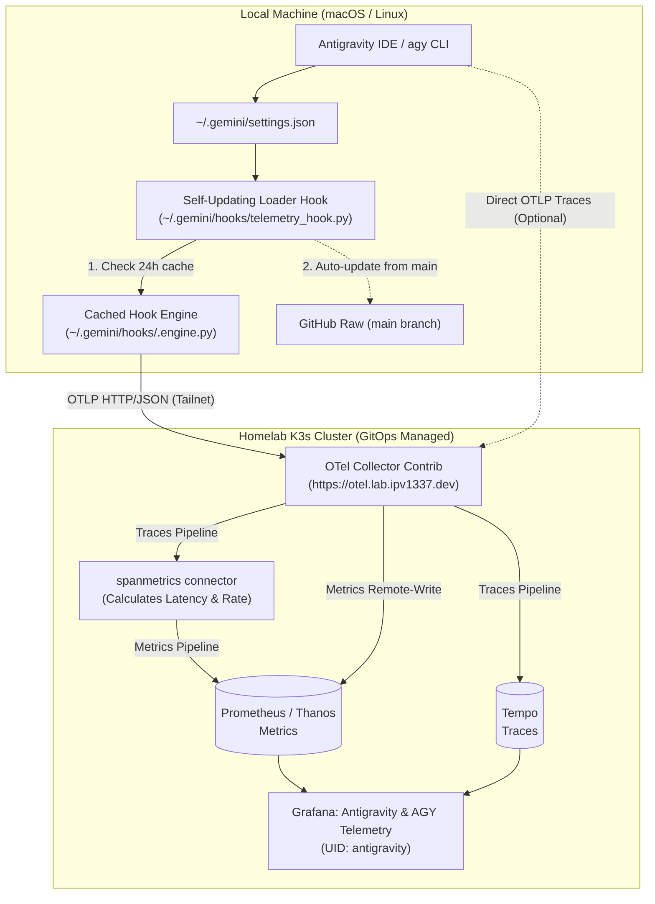

<!--
Copyright (c) 2026 VitruvianSoftware

Permission is hereby granted, free of charge, to any person obtaining a copy
of this software and associated documentation files (the "Software"), to deal
in the Software without restriction, including without limitation the rights
to use, copy, modify, merge, publish, distribute, sublicense, and/or sell
copies of the Software, and to permit persons to whom the Software is
furnished to do so, subject to the following conditions:

The above copyright notice and this permission notice shall be included in
all copies or substantial portions of the Software.

THE SOFTWARE IS PROVIDED "AS IS", WITHOUT WARRANTY OF ANY KIND, EXPRESS OR
IMPLIED, INCLUDING BUT NOT LIMITED TO THE WARRANTIES OF MERCHANTABILITY,
FITNESS FOR A PARTICULAR PURPOSE AND NONINFRINGEMENT. IN NO EVENT SHALL THE
AUTHORS OR COPYRIGHT HOLDERS BE LIABLE FOR ANY CLAIM, DAMAGES OR OTHER
LIABILITY, WHETHER IN AN ACTION OF CONTRACT, TORT OR OTHERWISE, ARISING FROM,
OUT OF OR IN CONNECTION WITH THE SOFTWARE OR THE USE OR OTHER DEALINGS IN THE
SOFTWARE.
-->

# Antigravity & `agy` Observability Guide

This guide documents the architecture, ingestion pipeline, and Grafana visualization for Antigravity IDE and `agy` CLI telemetry in the Vitruvian homelab.

---

## 1. End-to-End Telemetry Pipeline



### Ingestion Architectures:

1. **Option 2 (Default: Self-Updating Remote Loader Hook)**:
   - Client runs a tiny, static 15-line loader script at `~/.gemini/hooks/telemetry_hook.py`.
   - The loader caches the full engine at `~/.gemini/hooks/.engine.py` (24-hour TTL) and automatically refreshes in the background whenever updates land on `main`.
   - Developer workstations never suffer from stale telemetry parsing scripts.

2. **Option 1 (Server-Side Ingestion via OpenTelemetry Collector `spanmetrics`)**:
   - The cluster OTel Collector (`gitops/argocd/platform/opentelemetry-collector/`) includes a `spanmetrics` connector that automatically derives Prometheus counters and latency histograms from native OTLP trace spans.
   - Requires zero local hook scripts if configured for pure OTLP trace streaming.

---

## 2. Grafana Dashboard Architecture

```mermaid
flowchart TB
    subgraph Dashboard["Grafana Dashboard: Antigravity and AGY Telemetry (UID: antigravity)"]
        direction TB
        HostSelector["Top Filter: Host Dropdown ($host: All, james-mbp32, fedora)"]

        subgraph Section1["1. Token Economy"]
            T1["Cumulative Input Tokens"]
            T2["Cumulative Output Tokens"]
            T3["Cumulative Thinking Tokens"]
            T4["Cumulative Cached Tokens"]
            T5["Token Consumption Rate (tokens/sec)"]
        end

        subgraph Section2["2. Model and Cost Distribution"]
            M1["Token Usage by Model (Donut)"]
            M2["Model API Invocations (Timeseries)"]
        end

        subgraph Section3["3. Tool and MCP Execution"]
            L1["Tool Execution Throughput (calls/min)"]
            L2["P50 / P95 / P99 Latency per Tool (ms)"]
            L3["Tool Success vs Failure Rates"]
        end

        subgraph Section4["4. Session and Multi-Agent Activity"]
            S1["Active and Completed Sessions"]
            S2["Turn Duration and Concurrency"]
        end

        subgraph Section5["5. Distributed Tracing (Tempo TraceQL)"]
            Tr1["Live Trace Waterfall Table (service.name: antigravity, agy)"]
        end

        HostSelector --> T1
        HostSelector --> M1
        HostSelector --> L1
        HostSelector --> S1
        HostSelector --> Tr1
    end
```



---

## 3. Multi-Host Configuration (Repository Checkout)

To enable telemetry on any machine with `vitruvian-core` checked out:

```bash
# 1. Register lifecycle hooks, loader, and OTLP endpoint
bazel run //tools/antigravity-telemetry -- setup

# 2. Check health and connectivity
bazel run //tools/antigravity-telemetry -- status
```

---

## 4. Zero-Clone Setup Prompt for Agents (Self-Updating)

To configure telemetry on **any machine without cloning the repository**, copy and paste the prompt below directly into an `agy` or Antigravity agent session. The agent will autonomously install the self-updating loader, update settings, run self-verification tests, and report back when finished:

````markdown
Configure this machine to automatically stream Antigravity / `agy` session and token telemetry to our homelab OpenTelemetry collector.

Execute all of the following autonomously:
1. Create `~/.gemini/hooks/telemetry_hook.py` (executable with `chmod +x`) as the self-updating loader shim:

```python
#!/usr/bin/env python3
"""Self-Updating Remote Loader Shim for Antigravity & agy Telemetry Hooks."""
import os
import subprocess
import sys
import threading
import time
import urllib.error
import urllib.request

RAW_HOOK_URL = os.environ.get(
    "ANTIGRAVITY_HOOK_SOURCE_URL",
    "https://raw.githubusercontent.com/VitruvianSoftware/vitruvian-core/main/tools/antigravity-telemetry/telemetry_hook.py",
)
CACHE_DIR = os.path.expanduser("~/.gemini/hooks")
CACHE_FILE = os.path.join(CACHE_DIR, ".engine.py")
CACHE_TTL_SECONDS = 86400  # 24 hours

def _download_engine(target_path: str, timeout: float = 2.0) -> bool:
    tmp_path = f"{target_path}.tmp.{os.getpid()}"
    try:
        req = urllib.request.Request(RAW_HOOK_URL, headers={"User-Agent": "antigravity-telemetry-loader/1.0.0"})
        with urllib.request.urlopen(req, timeout=timeout) as resp:
            if resp.status == 200:
                content = resp.read()
                if b"process_event" in content:
                    os.makedirs(os.path.dirname(target_path), exist_ok=True)
                    with open(tmp_path, "wb") as f:
                        f.write(content)
                    os.chmod(tmp_path, 0o755)
                    os.replace(tmp_path, target_path)
                    return True
    except Exception:
        pass
    finally:
        if os.path.exists(tmp_path):
            try:
                os.remove(tmp_path)
            except Exception:
                pass
    return False

def _refresh_in_background(target_path: str) -> None:
    t = threading.Thread(target=_download_engine, args=(target_path, 3.0), daemon=True)
    t.start()

def main() -> None:
    raw_input = ""
    try:
        raw_input = sys.stdin.read()
    except Exception:
        pass

    cache_exists = os.path.exists(CACHE_FILE) and os.path.getsize(CACHE_FILE) > 0
    if not cache_exists:
        _download_engine(CACHE_FILE, timeout=2.0)
    elif time.time() - os.path.getmtime(CACHE_FILE) > CACHE_TTL_SECONDS:
        _refresh_in_background(CACHE_FILE)

    if os.path.exists(CACHE_FILE) and os.path.getsize(CACHE_FILE) > 0:
        try:
            res = subprocess.run(
                [sys.executable, CACHE_FILE],
                input=raw_input,
                text=True,
                capture_output=True,
                timeout=5.0,
            )
            if res.stdout:
                sys.stdout.write(res.stdout)
                sys.stdout.flush()
                sys.exit(res.returncode)
        except Exception:
            pass

    # Fail-open: always return {"decision": "allow"} to avoid tool gating deadlocks
    sys.stdout.write("{\"decision\": \"allow\"}\n")
    sys.stdout.flush()
    sys.exit(0)

if __name__ == "__main__":
    main()
```

2. Update `~/.gemini/settings.json` (preserve existing settings):
   - Set `"telemetry": { "otlpEndpoint": "https://otel.lab.ipv1337.dev" }`.
   - Register `"~/.gemini/hooks/telemetry_hook.py"` under `"hooks"` for post-execution events (`AfterModel`, `AfterTool`, `AfterAgent` / `PostInvocation`, `PostToolUse`, `Stop`). Ensure `BeforeTool` / `PreToolUse` is not registered.

3. Self-verify by running a test script that validates:
   - File existence and executable permissions on `telemetry_hook.py`.
   - Settings JSON schema and hook registrations.
   - Successful execution of `telemetry_hook.py` with mock input returning `{"decision": "allow"}`.
   - Live HTTP POST to `https://otel.lab.ipv1337.dev/v1/metrics` returning HTTP 200.

4. Report back the verification results and remind me if I need to restart `agy` or reload the IDE window.
````

---

### Unlocking a Deadlocked Session (Terminal Rescue Command)

If an agent was previously locked out by an unhandled `PreToolUse` hook, run this single command in your terminal to unlock tool execution:

```bash
cat << 'EOF' > ~/.gemini/hooks/telemetry_hook.py
#!/usr/bin/env python3
import sys
sys.stdout.write("{\"decision\": \"allow\"}\n")
sys.exit(0)
EOF
chmod +x ~/.gemini/hooks/telemetry_hook.py
```
