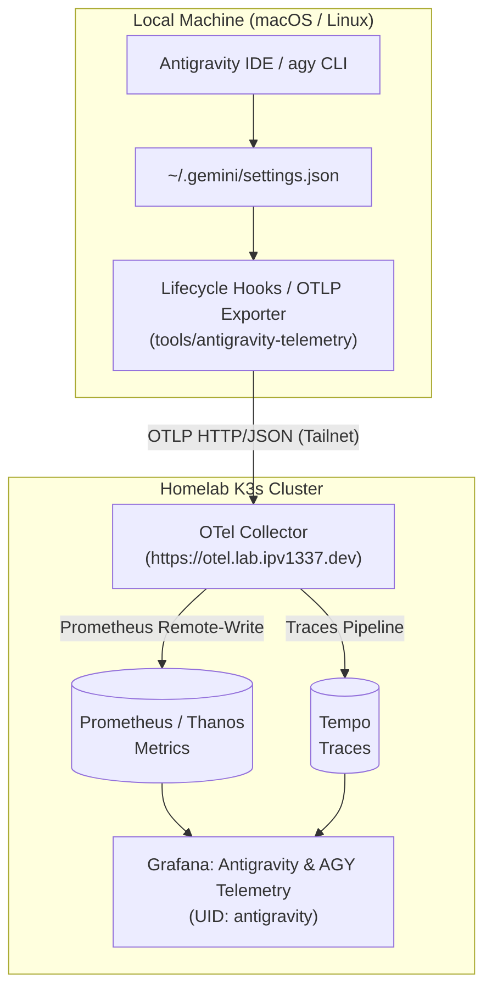

<!--
Copyright (c) 2026 VitruvianSoftware

Permission is hereby granted, free of charge, to any person obtaining a copy
of this software and associated documentation files (the "Software"), to deal
in the Software without restriction, including without limitation the rights
to use, copy, modify, merge, publish, distribute, sublicense, and/or sell
copies of the Software, and to permit persons to whom the Software is
furnished to do so, subject to the following conditions:

The above copyright notice and this permission notice shall be included in
all copies or substantial portions of the Software.

THE SOFTWARE IS PROVIDED "AS IS", WITHOUT WARRANTY OF ANY KIND, EXPRESS OR
IMPLIED, INCLUDING BUT NOT LIMITED TO THE WARRANTIES OF MERCHANTABILITY,
FITNESS FOR A PARTICULAR PURPOSE AND NONINFRINGEMENT. IN NO EVENT SHALL THE
AUTHORS OR COPYRIGHT HOLDERS BE LIABLE FOR ANY CLAIM, DAMAGES OR OTHER
LIABILITY, WHETHER IN AN ACTION OF CONTRACT, TORT OR OTHERWISE, ARISING FROM,
OUT OF OR IN CONNECTION WITH THE SOFTWARE OR THE USE OR OTHER DEALINGS IN THE
SOFTWARE.
-->

# Antigravity & `agy` Observability Guide

This guide documents the architecture, ingestion pipeline, and Grafana visualization for Antigravity IDE and `agy` CLI telemetry in the Vitruvian homelab.

---

## 1. End-to-End Telemetry Pipeline



### Components:
- **Telemetry Producer**: Antigravity lifecycle hooks (`AfterModel`, `BeforeTool`, `AfterTool`, `AfterAgent`) in `~/.gemini/hooks/telemetry_hook.py`.
- **OTel Collector**: Deployed at `https://otel.lab.ipv1337.dev` (`gitops/argocd/platform/opentelemetry-collector/`). Receives OTLP HTTP/JSON and gRPC payloads.
- **Metrics Storage**: Ingested via OTel Collector's `prometheusremotewrite` into both Prometheus replicas (`prometheus-server-0`, `prometheus-server-1`) and queried deduplicated via Thanos.
- **Trace Storage**: Distributed spans forwarded to Tempo (`http://tempo.opentelemetry.svc.cluster.local:3200`).
- **Grafana Dashboard**: Declarative GitOps dashboard `antigravity.json` (UID: `antigravity`) delivered via the Grafana ConfigMap sidecar.

---

## 2. Grafana Dashboard Architecture

```mermaid
flowchart TB
    subgraph Dashboard["Grafana Dashboard: Antigravity and AGY Telemetry (UID: antigravity)"]
        direction TB
        HostSelector["Top Filter: Host Dropdown ($host: All, james-mbp32, fedora)"]

        subgraph Section1["1. Token Economy"]
            T1["Cumulative Input Tokens"]
            T2["Cumulative Output Tokens"]
            T3["Cumulative Thinking Tokens"]
            T4["Cumulative Cached Tokens"]
            T5["Token Consumption Rate (tokens/sec)"]
        end

        subgraph Section2["2. Model and Cost Distribution"]
            M1["Token Usage by Model (Donut)"]
            M2["Model API Invocations (Timeseries)"]
        end

        subgraph Section3["3. Tool and MCP Execution"]
            L1["Tool Execution Throughput (calls/min)"]
            L2["P50 / P95 / P99 Latency per Tool (ms)"]
            L3["Tool Success vs Failure Rates"]
        end

        subgraph Section4["4. Session and Multi-Agent Activity"]
            S1["Active and Completed Sessions"]
            S2["Turn Duration and Concurrency"]
        end

        subgraph Section5["5. Distributed Tracing (Tempo TraceQL)"]
            Tr1["Live Trace Waterfall Table (service.name: antigravity, agy)"]
        end

        HostSelector --> T1
        HostSelector --> M1
        HostSelector --> L1
        HostSelector --> S1
        HostSelector --> Tr1
    end
```



---

## 3. Multi-Host Configuration

To enable telemetry on any machine running Antigravity or `agy`:

```bash
# 1. Register lifecycle hooks and OTLP endpoint
bazel run //tools/antigravity-telemetry -- setup

# 2. Check health and connectivity
bazel run //tools/antigravity-telemetry -- status
```

Telemetry is streamed immediately over the tailnet without local daemon requirements.
