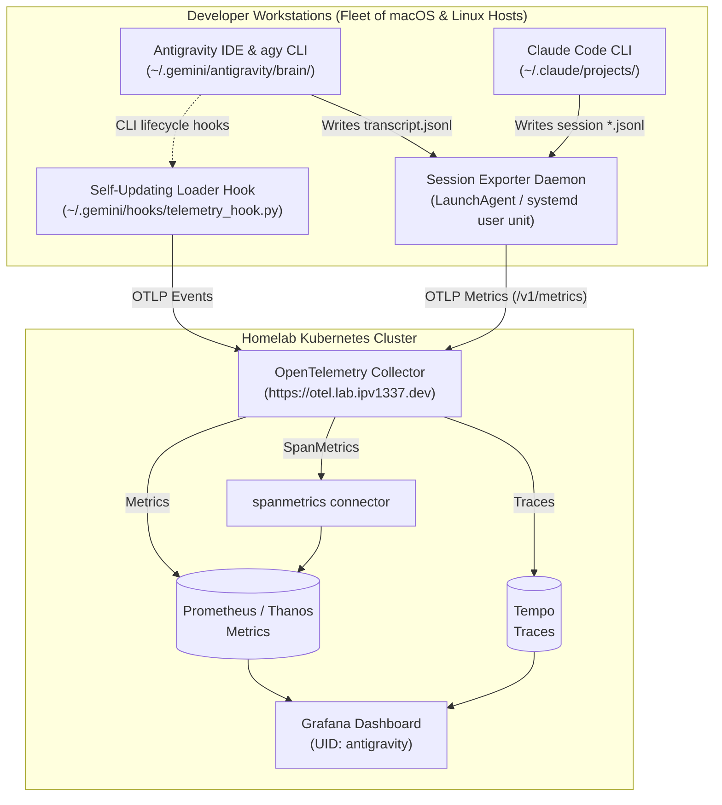

<!--
Copyright (c) 2026 VitruvianSoftware

Permission is hereby granted, free of charge, to any person obtaining a copy
of this software and associated documentation files (the "Software"), to deal
in the Software without restriction, including without limitation the rights
to use, copy, modify, merge, publish, distribute, sublicense, and/or sell
copies of the Software, and to permit persons to whom the Software is
furnished to do so, subject to the following conditions:

The above copyright notice and this permission notice shall be included in
all copies or substantial portions of the Software.

THE SOFTWARE IS PROVIDED "AS IS", WITHOUT WARRANTY OF ANY KIND, EXPRESS OR
IMPLIED, INCLUDING BUT NOT LIMITED TO THE WARRANTIES OF MERCHANTABILITY,
FITNESS FOR A PARTICULAR PURPOSE AND NONINFRINGEMENT. IN NO EVENT SHALL THE
AUTHORS OR COPYRIGHT HOLDERS BE LIABLE FOR ANY CLAIM, DAMAGES OR OTHER
LIABILITY, WHETHER IN AN ACTION OF CONTRACT, TORT OR OTHERWISE, ARISING FROM,
OUT OF OR IN CONNECTION WITH THE SOFTWARE OR THE USE OR OTHER DEALINGS IN THE
SOFTWARE.
-->

# AI Coding & Agent Observability Guide (Antigravity & Claude Code)

This guide documents the architecture, ingestion pipeline, background daemon, and Grafana visualization for **Antigravity IDE**, **`agy` CLI**, and **Claude Code** (`claude` CLI) telemetry across the Vitruvian homelab and developer fleet.

---

## 1. End-to-End Telemetry Architecture



---

## 2. Supported Agents & Metric Telemetry

The ingestion daemon automatically maps telemetry across multiple AI coding tools to standardized OpenTelemetry metrics:

| Attribute | Antigravity / `agy` | Claude Code |
| :--- | :--- | :--- |
| **Service Name** (`service`) | `antigravity` | `claude-code` |
| **Source Log Directory** | `~/.gemini/antigravity/brain/*/transcript.jsonl` | `~/.claude/projects/*/*.jsonl` |
| **Model Names** (`model`) | `gemini-3.7-flash`, `gemini-3-pro` | `claude-opus-5`, `claude-opus-4-8`, `claude-sonnet-5`, `claude-fable-5` |
| **Token Usage** (`antigravity_token_usage_total`) | Input, Output, Thinking, Cached | Input, Output, Cached Read, Cached Creation |
| **Tool Execution** (`antigravity_tool_call_count_total`) | `run_command`, `replace_file_content`, `view_file` | `Bash`, `Edit`, `Read`, `Write`, `Glob`, `Grep` |
| **Subagent Spawns** (`antigravity_subagent_spawn_count_total`) | `invoke_subagent` calls | `Agent` / `Subagent` tool invocations |
| **Session & Turns** | `antigravity_turn_count_total` | `antigravity_turn_count_total` |

---

## 3. Grafana Dashboard Architecture

```mermaid
flowchart TB
    subgraph Dashboard["Grafana: AI Coding & Agent Telemetry (UID: antigravity)"]
        direction TB
        Filters["Filters: Host ($host: All, local, fedora, nuc9i5...) & Agent ($service: All, antigravity, claude-code)"]

        subgraph Section1["1. Token Economy"]
            T1["Cumulative Input Tokens"]
            T2["Cumulative Output Tokens"]
            T3["Cumulative Thinking Tokens"]
            T4["Cumulative Cached Tokens"]
            T5["Token Consumption Rate (tokens/sec)"]
        end

        subgraph Section2["2. Model & Cost Distribution"]
            M1["Token Distribution by Model (Donut)"]
            M2["Model API Invocations (Timeseries)"]
        end

        subgraph Section3["3. Tool & MCP Execution"]
            L1["Tool Throughput (calls/min)"]
            L2["P50 / P95 / P99 Latency per Tool (ms)"]
            L3["Tool Success vs Failure Rates"]
        end

        subgraph Section4["4. Multi-Agent & Session Activity"]
            S1["Active & Completed Turns"]
            S2["Subagent Spawns & Concurrency"]
        end

        Filters --> T1
        Filters --> M1
        Filters --> L1
        Filters --> S1
    end
```



---

## 4. Background Exporter Daemon Management

The `session_exporter` runs persistently in the background on every developer host.

### macOS (LaunchAgent)
Managed via `launchd` in `~/Library/LaunchAgents/com.google.antigravity.telemetry.plist`:
```bash
# Check status
launchctl list | grep com.google.antigravity.telemetry

# View live daemon logs
tail -f ~/.gemini/antigravity/logs/session_exporter.log

# Restart service
launchctl unload ~/Library/LaunchAgents/com.google.antigravity.telemetry.plist
launchctl load -w ~/Library/LaunchAgents/com.google.antigravity.telemetry.plist
```

### Linux (systemd user unit)
Managed via systemd in `~/.config/systemd/user/antigravity-telemetry.service`:
```bash
# Check status
systemctl --user status antigravity-telemetry.service

# View live daemon logs
journalctl --user -u antigravity-telemetry.service -f

# Restart service
systemctl --user restart antigravity-telemetry.service
```

---

## 5. Ad-Hoc CLI Usage

```bash
# Run a one-time scan of both Antigravity and Claude Code sessions
bazel run //tools/antigravity-telemetry:session-exporter -- --once

# Perform a full historical backfill across all past transcripts
bazel run //tools/antigravity-telemetry:session-exporter -- --backfill
```
