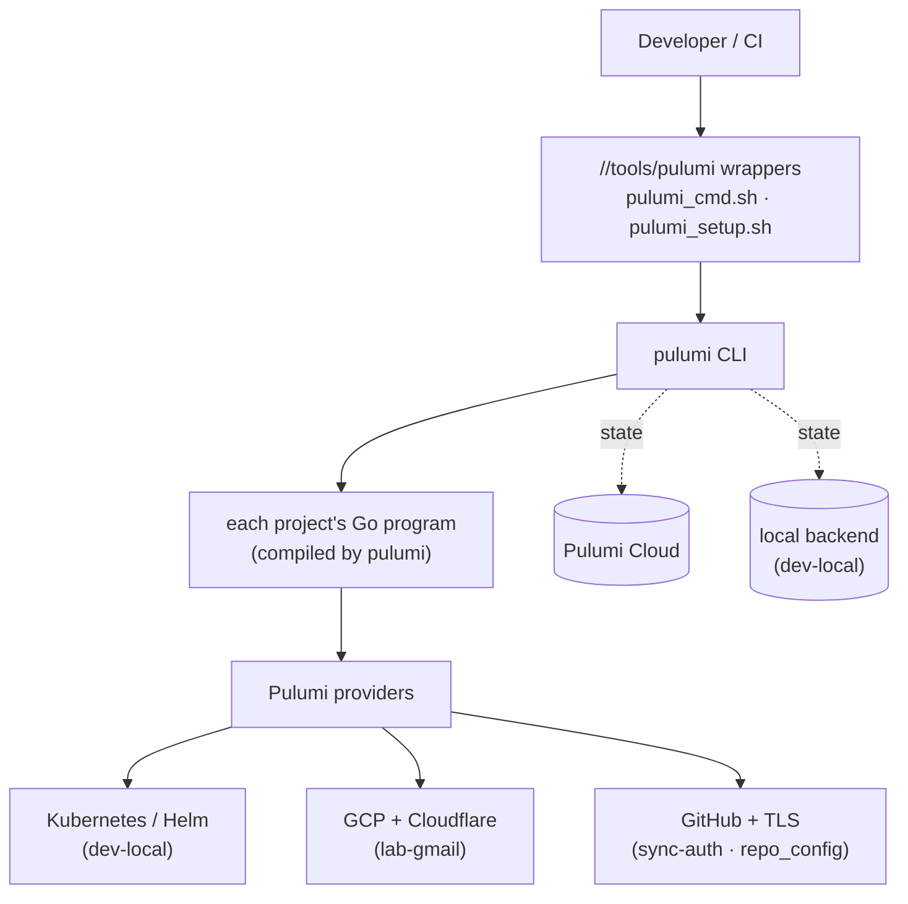
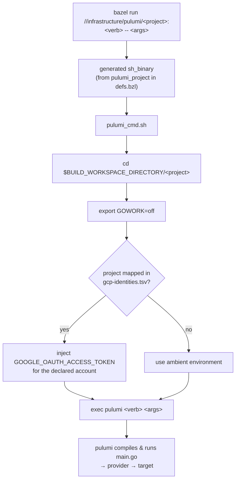
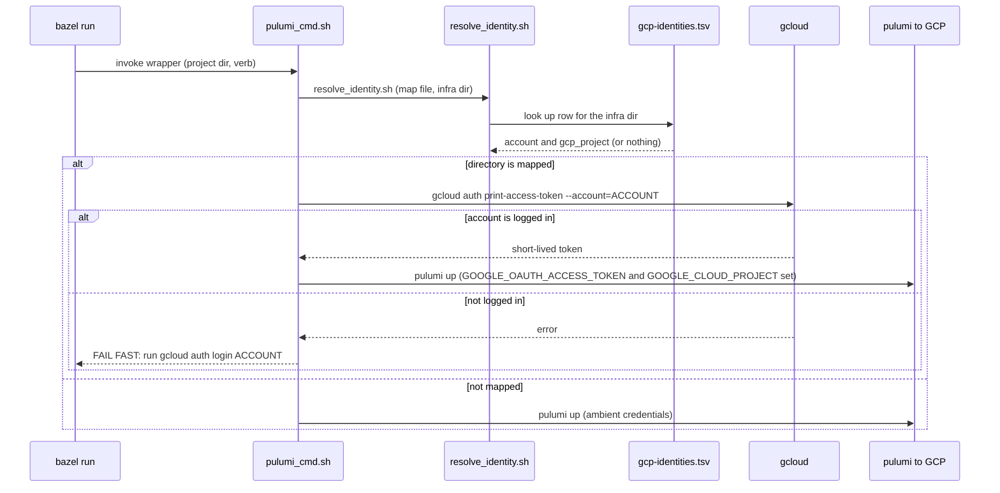
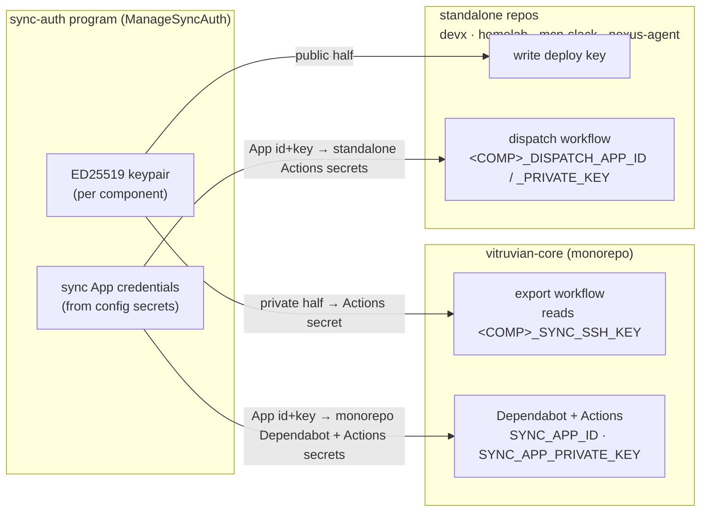
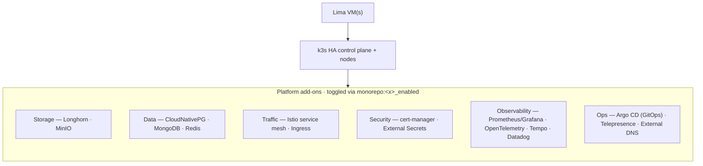
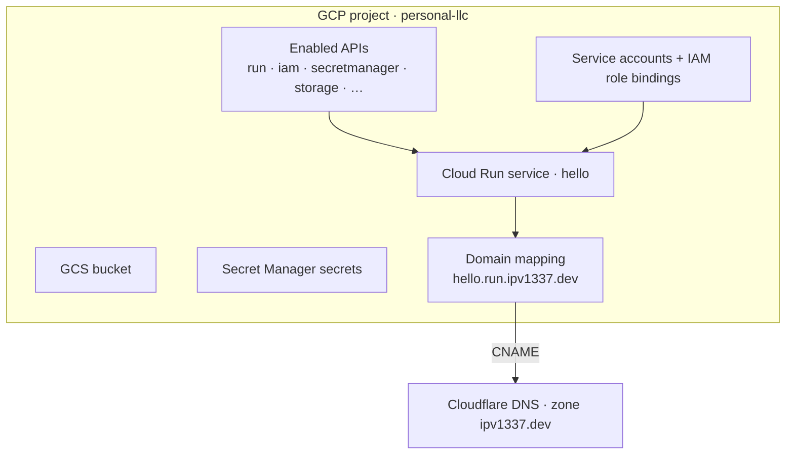
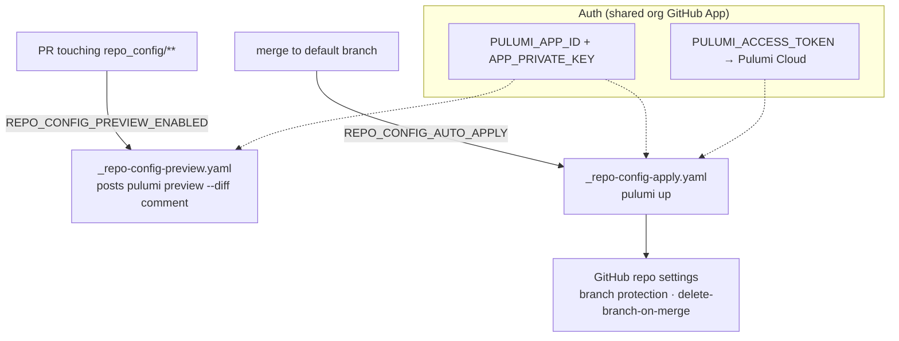

# Infrastructure Architecture

How the infrastructure estate is built, why it is shaped this way, and what each
project provisions. For step-by-step operations see the
[User guide](user-guide.md); for a terse fact/command lookup see the
[Reference](reference.md).

## Context & goals

The estate exists to manage four very different surfaces — a local Kubernetes
dev cluster, personal Google Cloud resources, this repository's GitHub settings,
and Copybara sync credentials — with one consistent, reproducible workflow.

The design optimizes for a few things:

- **One interface.** A developer should not have to remember per-project
  `pulumi` incantations, which backend a project uses, or which cloud account is
  correct. `bazel run //<project>:<verb>` is the whole interface.
- **Safe by default.** The wrong cloud identity should fail loudly, secrets
  should never land in git, and a destructive apply should always be preceded by
  a reviewable preview.
- **Isolation.** Each project is independent (its own Go module, state, and
  identity) so a change to one cannot break another.

## The big picture

## The Pulumi-behind-Bazel pattern

Every project is a standalone Pulumi Go program, but developers drive it through
Bazel, not the raw CLI. The macro
[`pulumi_project`](../../tools/pulumi/defs.bzl) generates six `sh_binary` run
targets per project — `preview`, `up`, `destroy`, `refresh`, `config`, and a
guided `setup` — by baking the project directory and subcommand into a thin
wrapper.

Two design choices make this work:

- **`GOWORK=off`.** These modules are intentionally excluded from the repo-level
  `go.work` (see [dependency versioning](../dependency-versioning/index.md)).
  Inside a monorepo that has a `go.work`, Pulumi's internal `go build` would fail
  with *"not a known dependency"*. The wrapper disables workspace mode so each
  module resolves from its own `go.mod`.
- **Run from the workspace tree, not the sandbox.** Pulumi compiles and runs the
  Go program itself, so the wrapper `cd`s into the real project directory under
  `$BUILD_WORKSPACE_DIRECTORY` rather than Bazel's runfiles sandbox. Anything
  after `--` is forwarded to `pulumi` verbatim.

The CLI itself is **not** vendored — the wrappers exec your installed `pulumi`.
`bazel run //<project>:setup` bootstraps prerequisites, login, and stack
selection.

## GCP identity pinning

This machine has several Google accounts (personal, abrial, Vitruvian sandbox).
GCP auth must **never** depend on whichever account `gcloud` happens to be set
to. The mapping of infrastructure directory → Google account → default project
lives in [`infrastructure/gcp-identities.tsv`](../../infrastructure/gcp-identities.tsv);
the resolver is [`tools/pulumi/resolve_identity.sh`](../../tools/pulumi/resolve_identity.sh)
(unit-tested via `//tools/pulumi:resolve_identity_test`).

Key properties:

- **Fail-fast, never silent fallback** for *mapped* projects: if the declared
  account isn't logged in, the wrapper aborts and tells you exactly which
  `gcloud auth login` to run, rather than succeeding against the wrong project.
- **Unmapped projects are unaffected** — they use the ambient environment, so
  non-GCP projects (dev-local, sync-auth, repo_config) are never touched by
  injection.
- **Same map for ad-hoc work.** For one-off `gcloud`/`gsutil` commands, look up
  the account and `export GOOGLE_OAUTH_ACCESS_TOKEN="$(gcloud auth print-access-token --account=<account>)"`.
  Adding a GCP project? Add a row to the map **first** (see [AGENTS.md](../../AGENTS.md)).

## State & secrets model

| Concern | Cloud-facing projects (sync-auth, lab-gmail, repo_config) | dev-local |
|---|---|---|
| State backend | **Pulumi Cloud** (`app.pulumi.com`) | **Local / self-managed** (`pulumi login --local`) |
| Why | durable, shared, encrypted-secret storage | a throwaway local cluster has no durable state worth keeping |
| Secret values | encrypted `secure:` blobs in committed `Pulumi.<stack>.yaml` | local `Pulumi.local.yaml` + `.env`, **git-ignored** |
| Plaintext config | committed (non-secret keys only) | `*.example` templates committed; real values local |

A few rules hold everywhere:

- **`Pulumi.<stack>.yaml` that holds real, non-encrypted config is git-ignored**
  and kept locally; only `*.example` templates are committed.
- **Secrets are set with `--secret`**, so they are stored as encrypted `secure:`
  values and never appear in plaintext in state or outputs.
- Rotating any of the GitHub/RBE secrets these projects rely on follows the
  [key-rotation SOP](../key-rotation.md).

## Per-project architecture

### sync-auth (`infrastructure/pulumi`)

Pulumi project `vitruvian-core-infra`. Provisions the GitHub auth that backs
[Copybara bidirectional sync](../copybara-bidi-sync.md) between the monorepo and
each standalone component repo. For every component (`mcp-slack`, `devx`,
`homelab`, `nexus-agent`) it creates a fresh ED25519 key pair and wires the two
halves where each side of the sync needs them; it also places the shared sync
App's credentials for the Dependabot reconcile + auto-merge automation.

The GitHub App itself is created **manually**; Pulumi only places its
credentials, supplied as config secrets. Onboarding another component is a
one-line append to the `syncedProjects` list in
[`sync.go`](../../infrastructure/pulumi/pkg/copybara_sync/sync.go).

### dev-local (`infrastructure/pulumi/dev-local`)

Pulumi project `monorepo` (stack `local`, local backend). Brings up a local
[k3s](https://k3s.io/) HA cluster on a [Lima](https://lima-vm.org/) VM and layers
on a configurable platform. Every add-on is gated by a `monorepo:<name>_enabled`
config flag, so you deploy only what you need.

Helm values live as YAML under
[`dev-local/values/`](../../infrastructure/pulumi/dev-local/values) (separated
from deployment logic); each component is a Go file under `pkg/applications/`.
Deep component details are documented next to the code in
[`dev-local/docs/COMPONENTS.md`](../../infrastructure/pulumi/dev-local/docs/COMPONENTS.md)
and the [dev-local README](../../infrastructure/pulumi/dev-local/README.md).

### lab-gmail (`infrastructure/pulumi/lab-gmail`)

Pulumi project `pulumi_lab_gmail` (GCP project `personal-llc`). Provisions a
personal Cloud Run footprint and the DNS to reach it.

An optional `multiServices` config array deploys additional Cloud Run services
from one list. Cloudflare DNS automation is optional and guarded: if a custom
domain is set with an API token but no zone, the deploy fails fast. This is the
only **GCP** project, so it is the only row currently in the identity map. Full
config reference: the [lab-gmail README](../../infrastructure/pulumi/lab-gmail/README.md).

### repo_config (`infrastructure/pulumi/repo_config`)

Pulumi project `vitruvian-core-repo-config`. Manages **this** repository's own
GitHub settings — and does so by **adopting** the existing repo via
`pulumi.Import` rather than creating it, using `pulumi.IgnoreChanges` so Pulumi
owns only `DeleteBranchOnMerge` plus the default-branch protection, and never
clobbers attributes you manage elsewhere.

Branch protection is fully config-driven (required reviews, status checks,
enforce-admins, …). Force-pushes and branch deletions on the protected branch
are **always** blocked. Config reference: the
[repo_config README](../../infrastructure/pulumi/repo_config/README.md).

## CI/CD automation

Most projects are run by a human from a laptop. Two are wired into GitHub
Actions:

- **repo_config** — opt-in preview-on-PR and apply-on-merge (the two
  `REPO_CONFIG_*` repo variables above), authenticated by a shared org GitHub
  App created once via `bazel run //tools/pulumi:create-app`.
- **sync-auth** — not run on a schedule; it is applied when sync credentials
  change. The credentials it places are consumed by the Copybara
  [export/import workflows](../copybara-bidi-sync.md) and the Dependabot
  automation.

The repository's main [CI](../../.github/workflows/ci.yaml) (`build-test` on RBE,
`build-macos`, `license-check`) builds and tests everything, including these
modules. Note: `license-check` exempts `docs/**` and `Pulumi.*.yaml`, so docs
pages and stack config carry no MIT header.

## Key design decisions

| Decision | Why | Trade-off |
|---|---|---|
| Drive Pulumi through Bazel wrappers | one interface; no per-project CLI knowledge; identity + `GOWORK` handled for you | an extra indirection layer to learn once |
| Standalone Go modules outside `go.work` | Pulumi's internal `go build` resolves cleanly; isolates dependency closures | each module manages its own `go.mod`/`go.sum` |
| Pin GCP identity in a committed map | wrong account fails fast instead of mutating the wrong project | new GCP projects must be added to the map first |
| Pulumi Cloud for cloud projects, local for dev-local | durable encrypted state where it matters; nothing to store for a throwaway cluster | two backends to understand |
| Adopt (import) the repo in repo_config | manage settings without recreating a brownfield repo | first apply must import before it can manage |
