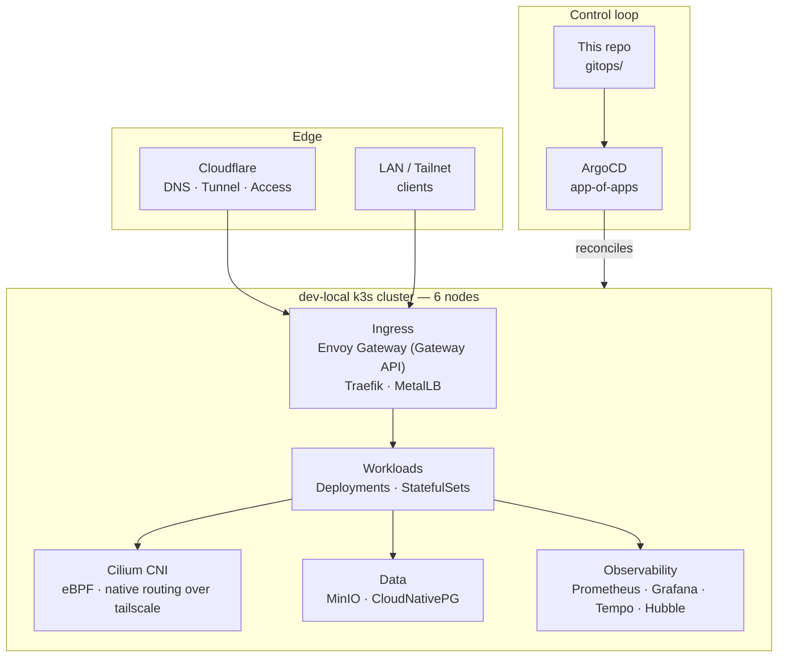
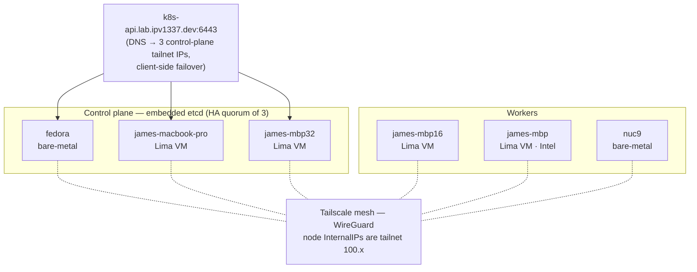
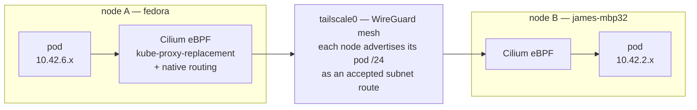
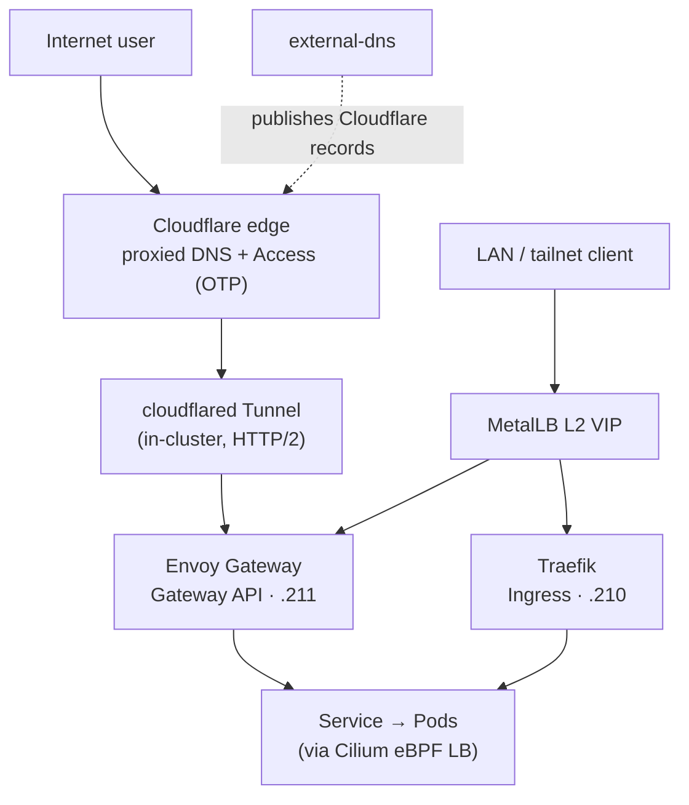
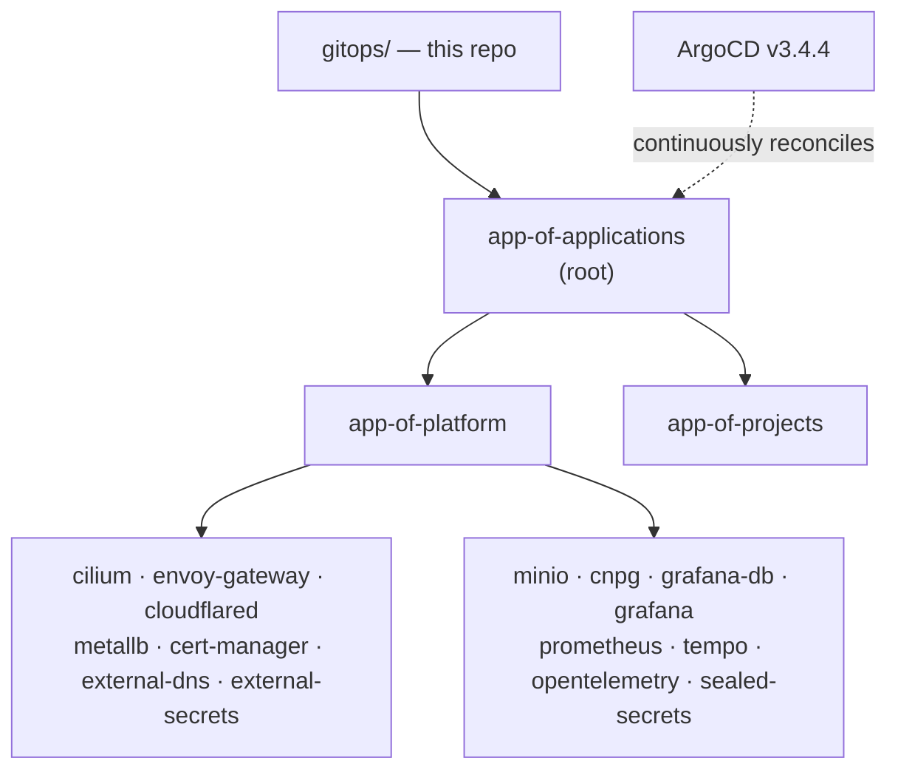

# dev-local Cluster Architecture

The runtime architecture of **dev-local** — the local Kubernetes development
cluster. This is the platform *running on* the cluster: its nodes, network,
ingress, GitOps loop, and data planes. For how the cluster (and the rest of the
estate) is *provisioned* see [Architecture](architecture.md); for operating it —
drains, recovery, hardening — see the [Resilience catalog](resilience-catalog.md);
for how every layer maps to a real Google Kubernetes Engine cluster see
[dev-local vs GKE](dev-local-vs-gke.md).

## Context & goals

dev-local is a **GKE-shaped** cluster running on hardware you already own — four
laptops and a NUC. The shape is deliberate: it mirrors the primitives an
application meets on GKE (Gateway API, an eBPF dataplane, `LoadBalancer`
Services, external-dns, GitOps) so that *the manifests a developer writes locally
are the manifests that run in production*. You develop against the abstraction,
not the implementation.

Three goals drive the design:

- **Production parity.** Every edge of the cluster — ingress, networking,
  secrets, storage, observability — is the closest self-hostable analog of its
  GKE counterpart, so behaviour is consistent local → prod. See
  [dev-local vs GKE](dev-local-vs-gke.md).
- **Closed-loop GitOps.** The cluster reconciles entirely from this repo via
  ArgoCD app-of-apps. An out-of-band `kubectl` change is *drift*, not config —
  the loop is the source of truth.
- **Resilience on consumer hardware.** The nodes are laptops that sleep,
  throttle, and roam networks; the platform is built to tolerate that — an HA
  control plane, replicated data, and app-level redundancy.

## The big picture

## Node topology

Six heterogeneous nodes — a mix of macOS laptops (running Kubernetes inside
[Lima](https://lima-vm.io/) VMs) and Fedora bare-metal — joined over a
[Tailscale](https://tailscale.com/) mesh. The control plane is **three embedded
`etcd` members** for HA; the API is reached through a single DNS name that
resolves to all three control-plane tailnet IPs, with client-side failover.

| Node | Role | Host OS / runtime | Pool | Pod CIDR | Tailnet IP |
|---|---|---|---|---|---|
| `fedora` | control-plane + etcd | Fedora 44 Silverblue · bare-metal | `linux` | `10.42.6.0/24` | `100.97.82.15` |
| `james-macbook-pro` | control-plane + etcd | Ubuntu 24.04 · Lima VM (macOS) | `laptop-cp-1` | `10.42.0.0/24` | `100.98.214.120` |
| `james-mbp32` | control-plane + etcd | Ubuntu 24.04 · Lima VM (macOS) | `laptop-cp-3` | `10.42.2.0/24` | `100.90.162.27` |
| `james-mbp16` | worker | Ubuntu 24.04 · Lima VM (macOS) | `laptop-cp-2` | `10.42.5.0/24` | `100.86.151.46` |
| `james-mbp` | worker | Ubuntu 24.04 · Lima VM (macOS, Intel) | `laptop-worker-1` | `10.42.3.0/24` | `100.96.146.43` |
| `nuc9` | worker | Fedora 44 Workstation · bare-metal | `nuc-worker-1` | `10.42.1.0/24` | `100.96.128.107` |

Everything runs on a single binary per node: **k3s `v1.35.3+k3s1`** (a conformant
Kubernetes distribution). k3s' bundled `servicelb` is disabled (MetalLB owns
`LoadBalancer` IPs) and Flannel has been replaced by Cilium (below).

## Networking & the CNI

The most distinctive part of dev-local. The CNI is **Cilium 1.17.17** running in
**native routing mode over the Tailscale mesh** — *not* an overlay/VXLAN. This is
what gives the cluster GKE Dataplane V2 parity (GKE Dataplane V2 *is* Cilium/eBPF).

- **Address plan.** Pods `10.42.0.0/16` (a `/24` per node, from
  `Node.spec.podCIDR`), Services `10.43.0.0/16`, and the MetalLB LB pool
  `10.44.86.210-215`.
- **Pod routing over tailscale.** Each node advertises its own pod `/24` as a
  Tailscale *subnet route*; every node runs `tailscale --accept-routes`. Cilium
  then routes pod traffic **natively** over `tailscale0` (WireGuard) — no second
  encapsulation. (VXLAN-over-tailscale silently dropped pod-egress on the Mac
  Lima VMs; native routing sidesteps it.)
- **kube-proxy-replacement.** Cilium replaces kube-proxy entirely with eBPF for
  Service load-balancing, so `ClusterIP`/`LoadBalancer`/`NodePort` resolution
  happens in the datapath. The API server is reached directly at
  `k8s-api.lab.ipv1337.dev` (no kube-proxy to front it).
- **BPF masquerade** on each node's LAN NIC (`enp+`/`eno+` on Fedora, `lima+` on
  the VMs) for off-cluster egress; pod-to-pod within `10.42.0.0/16` is not
  masqueraded.
- **Hubble** (relay + UI) provides flow visibility, the local analog of GKE's
  Dataplane V2 observability.

## Ingress & the edge

Two ingress paths, split by audience:

- **Internal — `*.lab.ipv1337.dev`.** Resolves to a **MetalLB L2 VIP** announced
  on the LAN. Two controllers sit behind MetalLB: **Traefik** (k3s' bundled
  ingress, VIP `10.44.86.210`) serves the platform UIs declared as classic
  `Ingress` (ArgoCD, Grafana), and **Envoy Gateway** (VIP `10.44.86.211`) serves
  **Gateway API** `HTTPRoute`s. Envoy Gateway is the *GKE-shaped* path — it is
  the local stand-in for the GKE Gateway controller, and new ingress should use
  Gateway API.
- **External — `*.ipv1337.dev` (public).** A Cloudflare proxied record points at
  a **cloudflared Tunnel** running in-cluster; Cloudflare Access gates it with
  OTP. The tunnel forwards to the Envoy Gateway VIP. No port is exposed on the
  home network — the tunnel dials out (HTTP/2, since QUIC/UDP egress is blocked).
- **DNS.** `external-dns` publishes records to Cloudflare from `Ingress`,
  `HTTPRoute`, and `DNSEndpoint` resources — the same controller and annotations
  you would run on GKE.

## GitOps & the control loop

The cluster is **entirely reconciled from `gitops/`** by **ArgoCD `v3.4.4`** in an
app-of-apps hierarchy. A root `app-of-applications` owns `app-of-platform` and
`app-of-projects`, which in turn own ~25 platform `Application`s (one per
component). Nothing is applied by hand; changes land as PRs to this repo and
ArgoCD rolls them out.

- **Secrets** are sealed at rest (**Sealed Secrets** `0.38.1`) and synced from
  stores at runtime (**External Secrets** `0.14.4`) — External Secrets is the
  portable layer, the local analog of GKE Workload Identity + Secret Manager.
- **CRDs** are split into their own sync wave (`platform-crds`) so controllers
  install before the resources that use them.
- Cluster/IaC operations are driven through `bazel run //tools/gitops` and
  `//tools/pulumi`, never ad-hoc `helm`/`kubectl`.

## Data & storage

Three storage tiers, each chosen for a GKE-portable interface:

- **Object storage — MinIO** (`RELEASE.2024-12-18`). A distributed, erasure-coded,
  **S3-API** store across the nodes. It backs the container registry, CNPG
  backups, and Tempo traces. Application code targets the S3 API, so it ports to
  GCS (or any S3) unchanged.
- **PostgreSQL — CloudNativePG** (`1.25.1`, Postgres 16). The CNPG operator runs
  two HA clusters (`cnpg-cluster`, `grafana-db`), each a primary + two streaming
  replicas with continuous WAL archiving (Barman) to MinIO. CNPG runs the same
  on GKE — or swap to Cloud SQL at the connection-string boundary.
- **Block storage** — `local-path` (hostPath, the default class) plus
  **csi-driver-nfs** to a Synology NAS for backups and the registry. (Longhorn
  was removed; storage is local-path + app-level replication + NAS.)

## Observability

A self-hosted stack that mirrors what you would wire to Google Cloud Operations:
**Prometheus** (metrics), **Grafana `12.3.1`** (dashboards, on a CNPG-backed DB),
**Tempo `2.9.0`** (traces, MinIO-backed), the **OpenTelemetry** collector +
operator (the portable instrumentation layer), and **Hubble** (Cilium network
flows).

## Component inventory

| Component | Version | Role | GKE analog |
|---|---|---|---|
| k3s | `v1.35.3+k3s1` | Kubernetes distribution | GKE managed control plane |
| Cilium | `1.17.17` | CNI · eBPF · kube-proxy-replacement | GKE Dataplane V2 |
| Envoy Gateway | `v1.8.1` | Gateway API ingress | GKE Gateway controller |
| Traefik | k3s-bundled | classic `Ingress` (internal UIs) | GKE Ingress (legacy) |
| MetalLB | `v0.14.9` | `LoadBalancer` IPs (L2) | Google Cloud Load Balancing |
| cloudflared | `2026.6.1` | public ingress (Tunnel + Access) | external LB + IAP / Cloud Armor |
| external-dns | `v0.15.0` | DNS automation → Cloudflare | external-dns → Cloud DNS |
| cert-manager | (gitops) | TLS certificates | cert-manager / Google-managed certs |
| ArgoCD | `v3.4.4` | GitOps reconciliation | ArgoCD / Config Sync |
| Sealed Secrets | `0.38.1` | secrets at rest | (local-only) |
| External Secrets | `0.14.4` | secrets at runtime | External Secrets + Workload Identity |
| MinIO | `2024-12-18` | S3 object storage | Google Cloud Storage |
| CloudNativePG | `1.25.1` (PG 16) | Postgres HA operator | CNPG on GKE / Cloud SQL |
| Prometheus / Grafana / Tempo | `12.3.1` / `2.9.0` | metrics · dashboards · traces | Managed Prometheus / Cloud Trace |
| OpenTelemetry | (collector + operator) | instrumentation pipeline | OTel (portable) |
| Hubble | `1.17.17` | network-flow observability | Dataplane V2 observability |

## Operating the cluster

dev-local is GitOps-reconciled and laptop-hosted — operate it accordingly:

- Change the cluster by **PR to `gitops/`**, not `kubectl`. Out-of-band changes
  need explicit per-instance approval and are reconciled away otherwise.
- Drive cluster/IaC actions via `bazel run //tools/gitops` / `//tools/pulumi`.
- For drains, node sleep/recovery, the cluster-level ceilings, and the hardening
  log, see the [Resilience catalog](resilience-catalog.md).
- For what a developer can rely on being identical to production — and the
  local-isms to avoid — see [dev-local vs GKE](dev-local-vs-gke.md).
