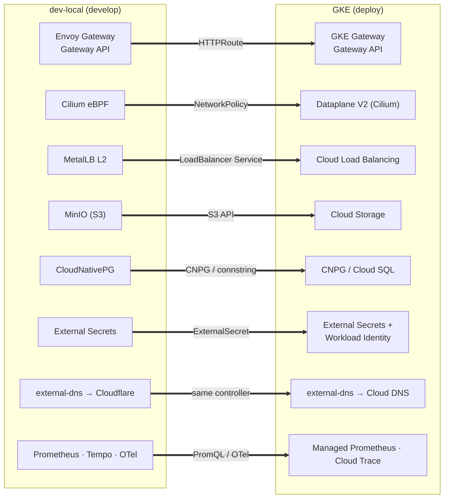

# dev-local vs GKE — Local / Production Parity

You build and test against [dev-local](dev-local-cluster.md); your application
ships to **Google Kubernetes Engine**. This page maps every layer of dev-local to
its GKE counterpart so you know — before you deploy — what is **identical** (code
against it freely), what is **analogous** (same Kubernetes contract, different
engine underneath), and what is genuinely **different** (the local-isms to keep
out of your manifests).

## The principle: code against the Kubernetes contract

dev-local is [GKE-shaped](dev-local-cluster.md#context--goals) on purpose. The API
objects you author — `Deployment`, `Service`, `HTTPRoute`, `PersistentVolumeClaim`,
`ConfigMap`, `ExternalSecret` — behave the same on both clusters because both are
conformant Kubernetes with the *same* upstream primitives. The implementations
beneath them differ; the contract does not.

> **Rule of thumb.** If your application only touches standard Kubernetes objects,
> the **Gateway API**, and the **External Secrets** / **external-dns**
> abstractions, your manifests port to GKE essentially unchanged. The moment you
> reach for something cluster-specific — a `StorageClass` name, a MetalLB IP, a
> sealed secret — you have written a local-ism. The tables below mark every one.

## The parity map

Legend: ✅ identical contract · ≈ same contract, different engine · ⚠ divergent.

### Compute & cluster

| Concern | dev-local | GKE | |
|---|---|---|---|
| Kubernetes API | k3s `v1.35.3` (conformant) | GKE managed control plane | ✅ same API & objects |
| Control-plane HA | 3 embedded `etcd` members | Google-managed (regional = multi-zone) | ≈ both HA; one is self-managed |
| Nodes | 6 fixed, heterogeneous (Mac Lima VMs + Fedora bare-metal, laptops) | Managed node pools, uniform machine types | ⚠ fixed & heterogeneous vs pooled |
| Autoscaling | none (fixed nodes) | Cluster Autoscaler / Node auto-provisioning / Autopilot | ⚠ no autoscaling locally |
| Scheduling (requests/limits, affinity, taints) | standard scheduler | standard scheduler | ✅ identical |

### Networking & ingress

| Concern | dev-local | GKE | |
|---|---|---|---|
| CNI / dataplane | **Cilium 1.17** — eBPF, kube-proxy-replacement | **GKE Dataplane V2** (*is* Cilium/eBPF) | ✅ same eBPF dataplane |
| `Service` / `ClusterIP` | Cilium eBPF LB | Dataplane V2 eBPF LB | ✅ identical |
| `NetworkPolicy` / `CiliumNetworkPolicy` | Cilium-enforced | Dataplane V2-enforced | ✅ portable (incl. Cilium CRDs) |
| Network-flow visibility | Hubble | Dataplane V2 observability (Hubble-based) | ≈ same lineage |
| Gateway API ingress | **Envoy Gateway** (`HTTPRoute`, `Gateway`) | **GKE Gateway controller** (`gke-l7-*` classes) | ✅ same Gateway API — `HTTPRoute` portable |
| Classic `Ingress` | Traefik (k3s-bundled, internal UIs) | GCE Ingress controller → external LB | ≈ same `Ingress` object, different controller |
| `LoadBalancer` Service | MetalLB L2 (`10.44.86.210-215`) | Google Cloud Load Balancing | ≈ same object; **never hard-code the IP** |
| DNS automation | external-dns → Cloudflare | external-dns → Cloud DNS | ✅ same controller & annotations |
| Public edge / auth | cloudflared Tunnel + Cloudflare Access | external LB + IAP / Cloud Armor | ⚠ different edge product |
| Pod network underlay | Tailscale (WireGuard) over a home LAN | Google VPC, alias-IP, high bandwidth | ⚠ high-latency mesh vs VPC (see caveat) |
| TLS certificates | cert-manager | cert-manager / Google-managed certs | ✅ cert-manager identical |

### State, secrets & identity

| Concern | dev-local | GKE | |
|---|---|---|---|
| Object storage | **MinIO** (S3 API) | **Google Cloud Storage** | ≈ code to the S3 API → portable |
| PostgreSQL | **CloudNativePG** (in-cluster operator) | CloudNativePG on GKE, or **Cloud SQL** | ✅ identical if CNPG both sides; ≈ Cloud SQL at the connection string |
| Block storage (`PVC`) | `local-path` + csi-driver-nfs (NAS) | PD CSI (`pd-balanced`/`pd-ssd`), Filestore | ≈ same `PVC` contract; **don't name a specific `StorageClass`** |
| Secrets at runtime | **External Secrets** | External Secrets / Secrets Store CSI | ✅ same `ExternalSecret` object |
| Secrets at rest | Sealed Secrets | (n/a — use Secret Manager) | ⚠ Sealed Secrets is local-only |
| Workload identity | Tailscale + k3s tokens (no cloud IAM) | **Workload Identity** (KSA → GSA) | ⚠ different — bind via External Secrets, not node creds |
| Container registry | in-cluster MinIO-backed registry | Artifact Registry | ≈ same OCI pull contract |

### Delivery & observability

| Concern | dev-local | GKE | |
|---|---|---|---|
| GitOps | **ArgoCD** app-of-apps | ArgoCD or Config Sync (ACM) | ✅ same manifests reconcile |
| Metrics | Prometheus | Google Cloud Managed Service for Prometheus | ≈ PromQL portable, backend differs |
| Dashboards | Grafana | Grafana / Cloud Monitoring | ✅ dashboards portable |
| Traces | Tempo (MinIO-backed) | Cloud Trace | ≈ instrument with OTel → portable |
| Instrumentation | OpenTelemetry collector + operator | OpenTelemetry | ✅ OTel is the portable layer |

## ✅ Identical — code against these freely

These are the same object, same behaviour, same controller on both clusters. Use
them without a second thought:

- **Workloads & scheduling** — `Deployment`, `StatefulSet`, `Job`, `CronJob`,
  requests/limits, probes, affinity, topology spread, PDBs.
- **Services & policy** — `Service`/`ClusterIP`, `NetworkPolicy` and
  `CiliumNetworkPolicy` (both run Cilium/Dataplane V2), DNS.
- **Gateway API** — `Gateway`, `HTTPRoute`. Envoy Gateway locally, GKE Gateway in
  prod; the routes are the same. *Prefer Gateway API over classic `Ingress`.*
- **Config & secrets interfaces** — `ConfigMap`, `Secret`, `ExternalSecret`.
- **cert-manager**, **external-dns**, **ArgoCD**, **OpenTelemetry**, **CNPG** —
  same operators and CRDs.

## ≈ Analogous — same contract, different engine

The Kubernetes object is portable; the implementation underneath is swapped. Code
to the *interface* and parameterise the *binding*:

- **`LoadBalancer` Services** — you get a `LoadBalancer` Service either way, but
  the address comes from MetalLB locally and Google Cloud LB in prod. **Never
  hard-code `10.44.86.x`**; read the Service's assigned address.
- **Object storage** — target the **S3 API** (endpoint + bucket from config). The
  same code reaches MinIO locally and GCS in prod (GCS via its S3-compatible
  endpoint, or swap the SDK at one boundary).
- **`PersistentVolumeClaim`s** — request capacity and an access mode, **not a
  named `StorageClass`** (`local-path` doesn't exist on GKE; `pd-balanced`
  doesn't exist locally). Leave `storageClassName` unset to use each cluster's
  default, or template it.
- **PostgreSQL** — CNPG runs identically on GKE; if prod uses Cloud SQL instead,
  keep the difference at the connection string (host/secret), not in app code.
- **Metrics/traces** — emit Prometheus + OTel; the *backend* (self-hosted vs
  Managed Prometheus / Cloud Trace) is a scrape/exporter config, not app code.

## ⚠ Divergent — the local-isms to keep out

These have no clean GKE equivalent. They're fine to *rely on the cluster
providing*, but they must never leak into an application's manifests:

- **Sealed Secrets.** A `SealedSecret` is encrypted to *this* cluster's key and is
  meaningless on GKE. App secrets belong behind **External Secrets** (→ Secret
  Manager in prod); sealing is a platform/GitOps concern only.
- **Cloud identity.** There is no Workload Identity locally — pods get cloud
  credentials via External Secrets, not a KSA→GSA binding. Don't write manifests
  that assume node-attached cloud credentials.
- **The Tailscale underlay & laptop latency.** Inter-node traffic crosses a
  WireGuard mesh between machines that throttle and sleep; cross-node RTT can
  spike to hundreds of ms (vs ~1 ms on a GKE VPC). Most workloads don't notice,
  but **latency-sensitive, chatty cross-node paths** (e.g. distributed object
  locking) behave very differently than on a VPC — don't tune timeouts to the
  local mesh.
- **Fixed, heterogeneous nodes.** No autoscaling, mixed arch (ARM Macs + Intel),
  and nodes that disappear when a lid closes. Don't assume horizontal headroom or
  a uniform node shape; *do* set realistic requests, PDBs, and anti-affinity.
- **The public edge.** cloudflared Tunnel + Cloudflare Access ≠ a GKE external LB
  + IAP. Treat "how it's exposed publicly" as platform config, not app config.

## Porting an app from dev-local to GKE — checklist

If you built against dev-local and kept to the contract, deploying to GKE is
mostly verification:

1. **Ingress** uses `HTTPRoute` (Gateway API), not a Traefik-specific `Ingress`.
2. **No hard-coded IPs** — read `LoadBalancer` addresses from the Service.
3. **`PVC`s** don't pin `storageClassName` to `local-path`.
4. **Object storage** reads endpoint/bucket from config (S3 API), not `minio.minio.svc`.
5. **Secrets** come from `ExternalSecret`, never an inline `SealedSecret`.
6. **Cloud access** is via External Secrets / Workload Identity, not node creds.
7. **No timeouts tuned to the local mesh** — re-check anything you relaxed for
   cross-node latency.
8. **Same `Deployment`/`Service`/`NetworkPolicy`** — these need no change.

## How it maps

## See also

- [dev-local Cluster Architecture](dev-local-cluster.md) — the full architecture
  this page compares against.
- [Resilience catalog](resilience-catalog.md) — the operational ceilings that
  *are* unique to running on laptops.
