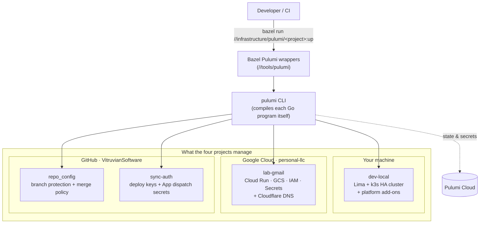

# Infrastructure

This section documents the infrastructure that lives under
[`infrastructure/`](../../infrastructure) — a small estate of
[Pulumi](https://www.pulumi.com/) programs (written in Go) that manage a local
Kubernetes development cluster, a personal Google Cloud footprint, this
repository's own GitHub settings, and the auth that backs Copybara sync.

Everything here is **infrastructure as code**: you don't click around in cloud
consoles, you change a Go program (or a config value) and run a Bazel command.
There is no separate `pulumi` CLI to memorize — every project is driven through
the same `bazel run` wrappers.

- **New here?** Start with the landscape below, then read the
  [Architecture](architecture.md).
- **Need to run something?** Jump to the [User guide](user-guide.md).
- **Just want a command or a fact?** See the [Reference](reference.md).
- **Wondering what survives a node failure?** See the
  [Resilience catalog](resilience-catalog.md).
- **Curious how the dev cluster actually runs?** See the
  [dev-local Cluster Architecture](dev-local-cluster.md) — nodes, the Cilium CNI,
  ingress, GitOps, and data planes.
- **Building locally and shipping to GKE?** See [dev-local vs GKE](dev-local-vs-gke.md)
  for what's identical, analogous, and divergent between the two.

## The estate at a glance

| Project | Directory | Manages | State backend | Identity |
|---|---|---|---|---|
| **sync-auth** | [`infrastructure/pulumi`](../../infrastructure/pulumi) | Copybara deploy keys + GitHub App dispatch secrets | Pulumi Cloud | GitHub App / token |
| **dev-local** | [`infrastructure/pulumi/dev-local`](../../infrastructure/pulumi/dev-local) | Local k3s cluster + platform add-ons | Pulumi Cloud | kubeconfig `~/.kube/cluster.yaml` (context `default`) |
| **lab-gmail** | [`infrastructure/pulumi/lab-gmail`](../../infrastructure/pulumi/lab-gmail) | Personal GCP: Cloud Run, GCS, IAM, Secret Manager + Cloudflare DNS | Pulumi Cloud | `james.nguyen@gmail.com` (GCP) |
| **repo_config** | [`infrastructure/pulumi/repo_config`](../../infrastructure/pulumi/repo_config) | This repo's GitHub branch protection + merge policy | Pulumi Cloud | GitHub App / token |

Each project is a **standalone Go module** with its own `go.mod` — deliberately
kept out of the repo's `go.work` — and its own `Pulumi.yaml`. They share nothing
at runtime; the only thing they have in common is *how they are driven*.

## Landscape

## Core ideas

A handful of conventions are shared by every project; the
[Architecture](architecture.md) explains each in depth.

- **Pulumi-Go behind Bazel.** `bazel run //infrastructure/pulumi/<project>:{preview,up,refresh,destroy,config,setup}`
  is the canonical interface. The wrapper `cd`s into the project, sets `GOWORK=off`
  so the standalone module resolves cleanly, and execs the real `pulumi` CLI.
- **Identity is pinned, never ambient.** GCP auth is resolved from
  [`infrastructure/gcp-identities.tsv`](../../infrastructure/gcp-identities.tsv)
  and injected per-run, so a command can never accidentally run against the wrong
  Google account. Wrong/missing login **fails fast**.
- **One state backend.** All four projects keep state (and encrypted secrets)
  in **Pulumi Cloud** under the `ipv1337` account — dev-local's stack is
  `monorepo/local`; its config passphrase lives in the project's gitignored
  `.env`.
- **Secrets stay out of git.** `Pulumi.<stack>.yaml` files that hold real config
  live locally and are git-ignored; only `*.example` templates and encrypted
  `secure:` values are committed.

## Related documentation

This section covers the Pulumi estate and how it is operated. Adjacent platform
topics have their own docs — they are referenced here rather than duplicated:

- [Copybara bidirectional sync](../copybara-bidi-sync.md) — the sync mechanism
  that **sync-auth** provisions credentials for.
- [Remote Build Execution](../remote-build.md) — BuildBuddy RBE used by CI.
- [Secret & API-key rotation](../key-rotation.md) — SOP for the secrets these
  projects depend on.
- [Dependency versioning](../dependency-versioning/index.md) — the One Version
  Rule and why these Pulumi modules sit *outside* `go.work`.
- [Agent guide](../../AGENTS.md) — the canonical note on GCP identity pinning.
