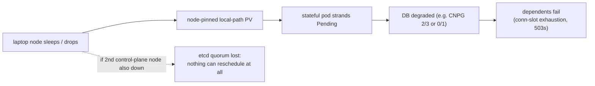

# dev-local Resilience Catalog

Per-application answer to: **can it withstand 1–2 nodes going down or becoming
unresponsive?** Built from a live read-only audit of the cluster on
**2026-06-12** and validated the same day with a controlled drain experiment
(see [below](#validated-drain-experiment-james-mbp-2026-06-12)). Re-audit after
topology or storage changes.

## Cluster topology

| Node | Roles | Notes |
|---|---|---|
| `james-mbp32` | control-plane, etcd | **workload magnet**: hosts most singletons + both DB primaries |
| `james-mbp16` | control-plane, etcd | hosts prometheus-server PV |
| `james-macbook-pro` | control-plane, etcd | smallest (2 CPU / 4 Gi) |
| `james-mbp` | worker | laptop; sleeps/drops — source of recurring strandings |
| `100.97.82.15` (`fedora`) | worker | largest (24 CPU / 62 Gi); mostly idle before 2026-06-12 |

Access: `KUBECONFIG=$HOME/.kube/cluster.yaml kubectl --context default …`
(ambient kubectl is not configured).

## The two cluster-level ceilings

1. **etcd quorum caps everything at 1 node.** 3 voters → tolerates exactly
   **1** control-plane loss. Any 2 of {mbp32, mbp16, macbook-pro} down ⇒ etcd
   quorum lost ⇒ API read-only: **no rescheduling, no failover, no operator
   reconciliation for any app**, however redundant the app itself is. Running
   pods keep serving; nothing self-heals. The only benign 2-node pair is
   {james-mbp, fedora}. Five voters would tolerate 2 — but voters must not share
   one power/network domain, or the math is fiction.
2. **All 11 PVs are node-pinned `local-path`.** A stateful pod whose node dies
   cannot move — it strands `Pending` until that exact node returns. Longhorn
   (replicated, relocatable) is installed and healthy on all 5 nodes but carries
   **zero volumes**. Both `local-path` *and* `longhorn` are annotated as the
   default StorageClass — an invalid double-default (exactly one must win).

## Catalog

**Verdicts assume the lost node is the worst case for that app** (usually
`james-mbp32`), and the 2-node verdict is additionally capped by ceiling #1.

### Survives 1 node: NO — fix first

| App | Why it dies | Fix |
|---|---|---|
| `cnpg-cluster` Postgres (`cnpg-cluster`) | 1 instance, PV pinned to mbp32 → total DB outage, unrecoverable until that node returns | **3 instances** (PR #61) + Longhorn storage |
| coredns (`kube-system`) | single replica (on mbp32) → cluster-wide DNS outage until reschedule | 2–3 replicas + required anti-affinity (k3s default is 1) |
| prometheus-server (`monitoring`) | 1 replica, PV pinned to mbp16 | relocatable (Longhorn) storage |
| alertmanager (`monitoring`) | 1 replica, PV pinned to mbp32 | 3-replica gossip cluster + relocatable storage |
| MinIO (`minio`) | 4 drives but **2 co-located on mbp32**; losing it breaches the EC:2 erasure set's write quorum | required anti-affinity: 4 drives → 4 distinct nodes |

### Survives 1 node: DEGRADED (serves, but on thin ice)

| App | Behavior on node loss | Gap |
|---|---|---|
| traefik (ingress) | 1 of 2 replicas survives | no anti-affinity (replicas can co-locate), no PDB |
| grafana CNPG Postgres | **validated**: stays writable at 2/3; stranded replica `Pending` until its node returns | local-path pinning prevents re-cloning elsewhere |
| cert-manager (+webhook, cainjector) | leader-elected; 1 replica suffices | webhook has no PDB/anti-affinity — its loss blocks cert API ops |
| external-secrets, cnpg-operator, otel-collector/operator, longhorn-ui | leader-elected / 2 replicas; 1 survives | no anti-affinity, no PDBs |
| external-dns, metallb-controller, metrics-server, kube-state-metrics, pushgateway, local-path-provisioner, devx-registry | stateless singletons — reschedule if quorum holds | brief outage window; registry storage backend unverified |
| Longhorn CSI controllers (attacher/provisioner/resizer/snapshotter) | leader-elected, 3 replicas each | *preferred* anti-affinity silently co-locates 2 of 3 on mbp32 |

### Survives 1 node: YES

| App | Why |
|---|---|
| grafana (app) | 2 replicas with **required** anti-affinity; stateless (state in CNPG) — **validated**: served continuously through the drain |
| tempo | 2 replicas, required anti-affinity, **no PVC at all** (verified — tracing data is ephemeral; the `storage-tempo-0` PV is orphaned) |
| All DaemonSets (longhorn manager/csi-plugin/engine-image, metallb speaker, node-exporter) | per-node by design; losing a node only loses that node's pod |

### Survives 2 nodes

**No app fully survives 2 arbitrary nodes**, because the dangerous pairs
include 2 etcd voters (ceiling #1). With the *benign* pair
({james-mbp, fedora}): everything above keeps its 1-node verdict. After the
hardening plan (5 voters, relocatable storage, anti-affinity), the answer
becomes "yes for HA apps, degraded for singletons."

## Validated drain experiment (james-mbp, 2026-06-12)

Cordon (passive — all 21 pods stayed) → drain `--ignore-daemonsets
--delete-emptydir-data` (~32 s, exit 0) → observe → uncordon.

| Prediction | Outcome |
|---|---|
| All stateless evictees reschedule | ✅ 15/15 rescheduled and went Ready; `fedora` absorbed ~10 (its first real load) |
| Only `grafana-db-cluster-12` strands (pinned PV) | ✅ `Pending`; CNPG stayed **writable at 2/3** (PDB allowed exactly 1 disruption) |
| API unaffected (non-voter node) | ✅ |
| Drain blocks on Longhorn instance-manager PDB (`allowed=0`) | ❌ **Did not block** — Longhorn relaxes the PDB when no volumes are attached; drains stay safe while Longhorn is unused |
| Recovery on uncordon | ✅ replica rescheduled in ~30 s, `pg_rewind` re-sync, 3/3 healthy |

Grafana served continuously; the evicted replica took ~2 min to Ready on
fedora (DB reconnect-gated).

## Hardening plan (priority order)

1. ~~`cnpg-cluster` → 3 instances~~ — **PR #61**.
2. **Single default StorageClass** — remove the default annotation from
   `local-path`, keep `longhorn` (k3s re-asserts its manifest on server
   restart; if it reappears, fix at the k3s server config level).
3. **coredns → 2–3 replicas + required anti-affinity** (k3s-owned; live-scaled
   2026-06-12 — k3s restart may revert; permanent fix belongs in the k3s
   server manifest).
4. **Migrate stateful PVs local-path → Longhorn** (DBs first — CNPG can roll
   replicas onto a new storage class; then prometheus/alertmanager/MinIO).
   Precondition: fix CSI-controller spread (required anti-affinity) first.
5. **Required anti-affinity + PDBs** for traefik, MinIO (4 drives → 4 nodes),
   cert-manager-webhook/cainjector, external-secrets, cnpg-operator,
   otel-collector/operator.
6. **Scale leader-elected singletons to 2** (metallb-controller, external-dns).
7. **etcd 3 → 5 voters** (promote fedora + james-mbp) *only if* they can sit on
   separate power/network domains.
8. Verify `devx-registry` storage backend; decide whether tempo should be
   persistent (today it isn't).

## Known operational quirks

- `james-mbp` is a laptop: when it sleeps, expect the [stranding cascade](#the-two-cluster-level-ceilings)
  until it wakes (CNPG drops to 2/3 but stays writable; clear any
  crash-looping Grafana replica after recovery).
- `fedora` host: `enp109s0` had `ipv4.never-default yes` (no internet egress —
  broke image pulls, external-dns, package installs) and was missing
  `open-iscsi` (Longhorn prerequisite). Both fixed live 2026-06-12; the
  `nmcli` fix persists, but verify after a reboot.
- High lifetime restart counts on `james-mbp`-hosted DaemonSet pods are churn
  from its sleep cycles, not live failures.
