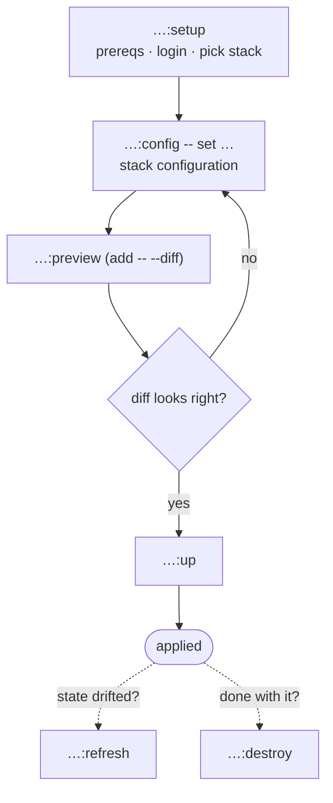

# Infrastructure User Guide

How to actually operate the infrastructure projects: set up your machine, run a
project, and handle the common cases. For *why* it is shaped this way, see the
[Architecture](architecture.md); for a one-screen cheat sheet, the
[Reference](reference.md).

## Prerequisites

You need these on your `PATH` (the repo's `direnv` / `bazel_env` setup provides
most of them):

- **Bazel** (via the repo's `bazelisk`/`.bazelversion`) — the entry point for
  every command here.
- **Pulumi CLI** — the wrappers exec your installed `pulumi`; they do not vendor
  it.
- **Go** — Pulumi compiles each project's Go program with it.
- **gcloud** — only for GCP projects (lab-gmail), used to mint the pinned
  identity's token.
- A **Pulumi login** — Pulumi Cloud (`pulumi login`, the default). All four
  projects keep state in Pulumi Cloud (dev-local's stack is `monorepo/local`).

The guided helper checks all of this for you:

```bash
bazel run //infrastructure/pulumi/<project>:setup
```

It verifies prerequisites, runs `go mod tidy` (with `GOWORK=off`), logs you in,
helps you select or create a stack, and prints any project-specific hints. It is
idempotent — safe to re-run any time.

## The universal command pattern

Every project exposes the same six verbs. Replace `<project>` with one of
`dev-local`, `lab-gmail`, `repo_config`, or use the root `infrastructure/pulumi`
for sync-auth:

```bash
bazel run //infrastructure/pulumi/<project>:preview     # dry-run: show the diff
bazel run //infrastructure/pulumi/<project>:up          # apply changes
bazel run //infrastructure/pulumi/<project>:refresh     # reconcile state with reality
bazel run //infrastructure/pulumi/<project>:destroy     # tear down
bazel run //infrastructure/pulumi/<project>:config -- set <key> <value>
bazel run //infrastructure/pulumi/<project>:setup       # guided bootstrap
```

Anything after `--` is forwarded to `pulumi` verbatim, so the full CLI is still
available, e.g.:

```bash
bazel run //infrastructure/pulumi/accounts/personal:preview -- --diff --stack dev
bazel run //infrastructure/pulumi/platform/repo_config:up -- --yes
```

### The normal workflow



**Always `preview` before `up`.** On a stack that hasn't been touched in a
while, `preview -- --refresh --diff` first (reconcile against reality, then show
the diff) before applying.

## GCP identity: what you'll see

For GCP-backed projects the wrapper prints the identity it injected:

```
→ GCP identity: james.nguyen@gmail.com (project personal-llc) for infrastructure/pulumi/accounts/personal
```

If the pinned account isn't logged in, it **fails fast** with the exact fix:

```
ERROR: infrastructure/pulumi/accounts/personal is pinned to GCP identity 'james.nguyen@gmail.com'
(infrastructure/gcp-identities.tsv) but no valid credentials were found.
Log in with:  gcloud auth login james.nguyen@gmail.com
```

Run that `gcloud auth login` and retry. You do **not** touch `gcloud config` —
the wrapper injects the token for that one run, regardless of your ambient
account. (See [Troubleshooting](#troubleshooting) for the 403 case.)

## Per-project runbooks

### dev-local — local cluster

1. `bazel run //infrastructure/pulumi/platform/dev-local:setup` (stack `local`, Pulumi Cloud backend; source the project's gitignored `.env` for `PULUMI_CONFIG_PASSPHRASE`).
2. Choose components by setting `monorepo:<name>_enabled` flags (e.g.
   `cert_manager_enabled`, `istio_enabled`, `monitoring_enabled`) in your local
   `Pulumi.local.yaml`, or via `…:config -- set monorepo:istio_enabled true`.
3. `…:preview` then `…:up`.
4. Verify: `kubectl get pods --all-namespaces`.
5. Tear down when done: `…:destroy`.

Component-level configuration and access tips (Grafana, Redis, Istio gateway,
etc.) are documented next to the code in the
[dev-local README](../../infrastructure/pulumi/platform/dev-local/README.md) and
[COMPONENTS.md](../../infrastructure/pulumi/platform/dev-local/docs/COMPONENTS.md).

### lab-gmail — personal GCP

1. Ensure the pinned account is logged in: `gcloud auth login james.nguyen@gmail.com`.
2. `…:preview -- --refresh --diff` to see drift (the stack is long-lived).
3. Review, then `…:up`.
4. Custom domains and multi-service deploys are config-driven — see the
   [lab-gmail README](../../infrastructure/pulumi/accounts/personal/README.md).

### repo_config — this repo's GitHub settings

1. `…:setup` — prints the adoption note and offers to enable CI automation.
2. Set the owner: `…:config -- set repoOwner <org-or-user>`.
3. First `…:up` **imports** the existing repo into state (it does not create it);
   if the import fails, fix `repoName`/`repoOwner` (and the `GITHUB_TOKEN`
   account) and retry — nothing is created until the import resolves.
4. Tighten/loosen protection by changing config keys and re-running `…:up`.

Or let CI drive it: enable `REPO_CONFIG_PREVIEW_ENABLED` (preview on PRs) and
`REPO_CONFIG_AUTO_APPLY` (apply on merge). The shared org App must exist
(`bazel run //tools/pulumi:create-app`, once per org) and be installed on the
repo.

### sync-auth — Copybara credentials

Run from the repo root project when sync credentials change (e.g. onboarding a
component or rotating the App):

```bash
bazel run //infrastructure/pulumi:preview
bazel run //infrastructure/pulumi:up
```

It needs `GITHUB_TOKEN` and the App credentials as Pulumi config secrets. The
credentials it places are consumed by the
[Copybara sync workflows](../admin/copybara-sync.md); rotating them follows the
[key-rotation SOP](../operations/key-rotation.md).

## Troubleshooting

| Symptom | Cause | Fix |
|---|---|---|
| `403 ... does not have <perm>` / `caller does not have permission` on every GCP resource | wrong Google identity (ambient account, not the pinned one) | the wrapper pins it for you; ensure the **pinned** account is logged in (`gcloud auth login james.nguyen@gmail.com`) and re-run |
| `gcloud auth login <account>` fail-fast message | pinned account has no valid local credentials | run exactly the command it prints, then retry |
| `not a known dependency` during a Pulumi build | `go.work` interfering with the standalone module | use the Bazel wrapper (it sets `GOWORK=off`); don't run raw `pulumi` from inside `go.work` |
| `pulumi CLI not found` | Pulumi not installed/loaded | `bazel run //<project>:setup`, or install per the message |
| repo_config first `up` fails to import | wrong `repoName`/`repoOwner` or token account | fix config + `GITHUB_TOKEN` and retry — nothing is created until import resolves |
| dev-local: `no stack selected` | stack not selected in this shell | `…:config -- --stack local`, pass `-- --stack local` to any verb, or run `…:setup` |

## Safety notes

- **Preview before apply**, and `--refresh` first on stale stacks.
- **Never commit secrets.** Real `Pulumi.<stack>.yaml` config and `.env` files
  are git-ignored; commit only `*.example` templates and encrypted `secure:`
  values.
- **`destroy` is irreversible** for cloud resources — double-check the project
  and stack first.
- **Identity is pinned, not ambient** — don't work around the wrapper by
  exporting your own GCP credentials unless you know why.
