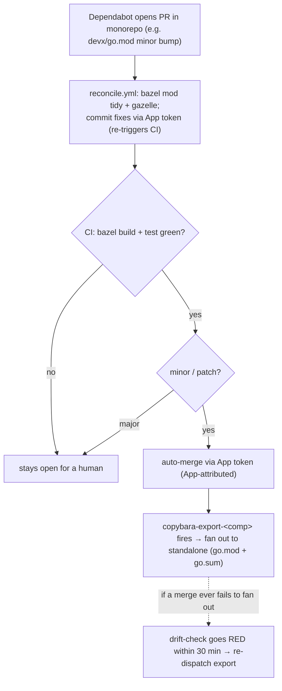

# Centralized Dependabot for vitruvian-core + Copybara bidi-sync — Design

**Status:** approved design (2026-05-26), pending implementation plan.
**Related:** [`docs/copybara-bidi-sync.md`](../copybara-bidi-sync.md) (sync runbook),
[`docs/planning/2026-05-25-copybara-bidi-sync-plan.md`](2026-05-25-copybara-bidi-sync-plan.md).

## Goal

Run **Go (`gomod`) and GitHub-Actions dependency updates from the monorepo** (one PR queue,
fanned out to the standalones by the existing Copybara export), while **npm stays per-standalone**.
Make the monorepo Dependabot PRs **auto-reconcile** the Bazel build and **auto-merge** (minor/patch)
via the GitHub App token so the merge fans out. Fill the remaining coverage gaps. The Copybara
sync machinery itself is unchanged.

## Why (context)

Each component (`mcp-slack`, `devx`, `homelab`, `nexus-agent`) is bidirectionally synced between
`vitruvian-core/<comp>/` and its standalone repo. Dependency files behave differently across the
boundary:

- **`go.mod` + `go.sum`** sync both ways → a Go bump made in the monorepo fans out **completely** to
  the standalone. Centralizing Go is clean.
- The monorepo's Bazel build resolves Go deps via `MODULE.bazel` →
  `go_deps.from_file(go_work = "//:go.work")` (covers `./devx`, `./homelab`; the root `//:go.mod`
  module `example.com/scaffold_test_1245` is an empty placeholder) plus gazelle-generated
  **`**/BUILD`** files, which are **monorepo-only** (excluded from sync). A *version-only* bump of an
  existing dep builds clean (versions re-resolve; `BUILD`/`use_repo` only change when the dep *set*
  changes); a dep-set change needs `bazel mod tidy` + gazelle.
- **npm**: the monorepo uses a root `pnpm-lock.yaml`; each standalone has its own `package-lock.json`,
  which is **standalone-only** (excluded). The two package managers don't share a lockfile, so npm
  doesn't centralize cleanly — it stays on the standalones, which own their `package-lock.json`.
- **`github-actions`**: Dependabot only scans the **repo-root** `.github/workflows/`, so the monorepo
  config can own only the **root** workflows; each component's own workflow pins stay standalone-driven.

## Decisions (all confirmed with the operator)

1. **npm stays per-standalone**; `gomod` + root `github-actions` centralize in the monorepo.
2. **Auto-reconcile** Dependabot Go PRs (gazelle/`mod tidy`), committing fixes to the PR branch.
3. **Auto-merge via the GitHub App token** (so the merge is App-attributed and triggers the export).
4. **Auto-merge minor/patch only; major bumps are left for manual review.**
5. **Centralize + fill all gaps** (homelab + nexus-agent get configs).
6. App credentials are added to vitruvian-core as a **Dependabot secret** (+ an Actions secret),
   via Pulumi, reusing the one existing App (App ID 3863936).

## Config layout

`dependabot.yml` files and where each one *runs*. The standalone configs live in the monorepo
**subtrees**, so they are authored here and fan out via the export — every component's Dependabot is
managed from the monorepo even though npm/component-workflow updates *run* on the standalones.

| File (runs in) | Ecosystems / dirs | Change |
|---|---|---|
| `vitruvian-core/.github/dependabot.yml` (monorepo root) | `gomod` `/devx`; `gomod` `/homelab`; `github-actions` `/` | **NEW.** At repo root → outside every `<comp>/**` glob, so it never syncs to a standalone. Owns Go + the root workflows (`ci`, `weekly_tag`, `copybara-*`, `_copybara-*`). Group minor/patch per ecosystem; `chore(deps)` / `chore(ci)` commit prefixes. |
| `devx/.github/dependabot.yml` (→ devx standalone) | keep `github-actions` `/`, `npm` `/docs` | **Remove the `gomod` entry** (now central — avoids duplicate Go PRs + a sync collision). |
| `mcp-slack/.github/dependabot.yml` (→ standalone) | `npm` `/`, `github-actions` `/` | Unchanged. |
| `homelab/.github/dependabot.yml` (→ standalone) | `github-actions` `/` | **NEW** (gap-fill; Go is central). |
| `nexus-agent/.github/dependabot.yml` (→ standalone) | `npm` `/`, `github-actions` `/` | **NEW** (gap-fill). |

> The root config watching `github-actions` `/` covers all root workflows including the `copybara-*`
> action pins (`actions/checkout`, `actions/create-github-app-token`, `bazel-contrib/setup-bazel`).
> It does **not** touch the `olivr/copybara@sha256` image — that's a `docker run` arg, not a `uses:`,
> so it remains a manual pin (see the sync runbook §10 GHCR hand-off).

## Auth addition (Pulumi)

The reconcile + auto-merge automation needs the GitHub App token **inside vitruvian-core**, but the
App creds currently live only in the standalones. Extend `infrastructure/pulumi/pkg/copybara_sync/sync.go`
to also place, on **vitruvian-core**, the reused App's id + private key as:

- a **`github.DependabotSecret`** (`SYNC_APP_ID` / `SYNC_APP_PRIVATE_KEY`) — Dependabot-triggered
  workflow runs cannot read normal Actions secrets, so the reconcile/merge automation reads these; and
- a matching **`github.ActionsSecret`** (same names) — for any non-Dependabot-context step
  (e.g. a `workflow_run` fallback merge).

Values come from the existing per-component config secrets (reuse the one App). One `pulumi up`
(`GOWORK=off`, `github:owner=VitruvianSoftware` — see sync runbook §6).

## Automation (two workflows in vitruvian-core)

### 1. `dependabot-bazel-reconcile.yml`
- **Trigger:** `pull_request` (branches: main) — guarded to `github.actor == 'dependabot[bot]'` and
  paths `**/go.mod`, `**/go.sum`.
- **Permissions:** minimal; the push uses the App token (Dependabot secret), not `GITHUB_TOKEN`.
- **Steps:** mint App token → checkout the PR head → set up Bazel → `bazel mod tidy` +
  `bazel run //:gazelle` → if `git status` shows changes, commit them ("chore(deps): bazel reconcile")
  and **push to the PR branch via the App token** (which re-triggers CI on the reconciled commit).
  No-op for version-only bumps (the common case).
- **Safety:** runs only gazelle/`mod tidy` (parse/resolve — does **not** execute dependency code).
  `bazel build` (which compiles) runs in the separate CI job under the default read-only Dependabot
  token, with no App secret.

### 2. `dependabot-auto-merge.yml`
- **Trigger:** `pull_request` (Dependabot) — uses `dependabot/fetch-metadata` to read the update type.
- **Logic:** if `update-type` is `version-update:semver-minor` or `...-patch`, enable merge with the
  **App token** (`gh pr merge --squash --auto`, authenticated as the App) so it merges once required
  checks (incl. the reconcile-triggered CI) pass. **Major** updates: no auto-merge (left for a human).
- **Fan-out attribution:** the merge must be **App-attributed** so the resulting push to `main`
  triggers `copybara-export-<comp>` (a `GITHUB_TOKEN`-attributed merge would NOT — that's the
  recursion-prevention the import side relies on). If GitHub's native `--auto` merge attribution
  proves not to trigger the export, the plan's fallback is a **`workflow_run`-after-CI** step that
  performs a **direct** `gh pr merge` with the App token (deterministically App-attributed). Either
  way the **drift-check backstop** (below) makes a missed fan-out loud, so neither is silent.

## Fan-out + backstop

Merge (App-attributed) → push under `<comp>/**` → `copybara-export-<comp>` fires → exports to the
standalone. Go is fully consistent across the boundary (`go.mod` + `go.sum` both sync). The existing
**30-min `copybara-drift-check`** is the loud backstop: if a merged bump ever fails to fan out, the
monorepo subtree and standalone diverge and the drift check goes **red** → re-run that export via
`workflow_dispatch`.

## Removing duplicates

Removing `gomod` from `devx/.github/dependabot.yml` is done **in the monorepo subtree**; the export
fans the edit out to the devx standalone (the config file syncs). Same mechanism creates the new
homelab/nexus-agent standalone configs (commit them under `<comp>/.github/`, export fans them out).
Net: no component has two Dependabot sources for the same manifest.

## Security posture

- **Auto-merge is minor/patch only** — major bumps require a human, limiting supply-chain blast radius.
- **No untrusted code runs with the App secret.** The reconcile only parses/resolves (gazelle,
  `mod tidy`); compilation (`bazel build`, which could run dep code) is the CI job under the
  read-only Dependabot token.
- App creds live as a **Dependabot secret** (scoped to Dependabot-triggered runs) rather than being
  exposed to all `pull_request` runs.
- The App is already least-privilege (Contents: write on vitruvian-core only).

## Testing / validation

1. `actionlint` clean on both new workflows; sanity-check every `dependabot.yml` (valid v2 schema).
2. **Reconcile dry-run (local):** bump a dep in `devx/go.mod` that adds a transitive dep, run
   `bazel mod tidy` + `bazel run //:gazelle`, confirm it produces the expected `BUILD`/`MODULE.bazel`
   delta (and is a clean no-op for a version-only bump).
3. **End-to-end:** drive one Dependabot-style PR (real, or a simulated branch) through
   reconcile → CI → auto-merge → export → standalone; confirm the standalone updates and the drift
   check is green.
4. Confirm a **major** bump is NOT auto-merged.

## Docs

Add a **"Dependency updates (Dependabot)"** section to `docs/copybara-bidi-sync.md`: the split model
(Go/actions central, npm per-standalone), the reconcile→auto-merge→fan-out pipeline, the major-bump
manual path, the drift backstop, and "manage standalone Dependabot configs from the monorepo subtree".

## Out of scope

- npm/pnpm unification across the boundary (the lockfile impedance is accepted; npm stays
  per-standalone).
- The GHCR image-pin migration (separate hand-off, sync runbook §10).
- bzlmod/`MODULE.bazel` `bazel_dep` updates (Dependabot has no bzlmod support; tracked separately,
  e.g. the rules_swift release tracking).
- Decentralizing the sync architecture.
