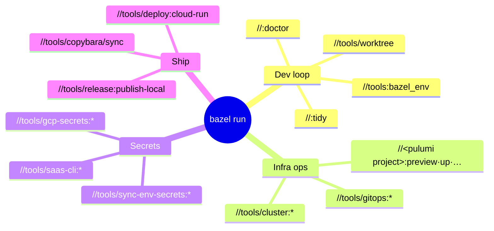

# Bazel targets & tools catalog

Every operational and developer-facing `bazel run` target in the repo, grouped by
purpose. This is the practical index behind the rule that **all tooling is a
discoverable Bazel target, never a bare script**
([Principles §2.2](../engineering/application-development-principles.md#22-infra-ops-run-only-through-the-bazel-wrappers)).

Discover targets live with `bazel query //tools/...` — if this page and the build
graph disagree, the graph wins.



## Dev loop & repo hygiene

| Target | What it does |
|---|---|
| `//:doctor` | Verifies your core toolchain (bazel, git required; node/pnpm/go/gh/gcloud/docker/direnv advisory) |
| `//<app>:doctor` | Same check scoped to one app's exact requirements (`//tabula:doctor`, `//devx:doctor`, …) |
| `//tools/ci-preflight` | The repo-side counterpart to `//:doctor`: every `secrets.*`/`vars.*` the workflows reference, and whether it is actually configured. Flags secrets that PR-triggered workflows read but the **Dependabot** store lacks — those silently resolve to `""` on dependency PRs. `-- --list` for the required set without touching the network |
| `//tools/gomod:tidy` | `go mod tidy` across the `replace`-coupled Go modules (library ↔ go-foundation examples), which Dependabot cannot keep in step on its own. The fix side of `//tools/gomod:check` |
| `//tools/worktree -- <branch>` | Creates an isolated git worktree with its own Bazel server. `-- --list`, `-- --remove <branch>`. Branch work in the primary checkout is blocked — this is the sanctioned path |
| `//:tidy` | **The single hygiene entrypoint**: gazelle → python manifest → all formatters. Required check (`tidy-check`); run before every PR |
| `//:gazelle` | Regenerate `BUILD` files after adding/moving code |
| `//tools:bazel_env` | Exposes every Bazel-managed tool (go, node, pnpm, python, prettier, …) on your `$PATH` via direnv |
| `//tools/remote:setup` | Opt-in build caching / RBE bootstrap — writes `user.bazelrc` for BuildBuddy or any REAPI provider. See [build cache](../guides/build-cache.md) / [remote build](../guides/remote-build.md) |

## Checks (run locally what CI gates)

| Target | Gate |
|---|---|
| `//tools/license:check` / `:verify` / `:add` | License headers: presence, MIT+holder content, auto-fix |
| `//tools/conformance:check` | Version canonicalization, merge-queue check names, app metadata ↔ CODEOWNERS, visibility firewall, nightly-sweep pairing |
| `//tools/osv-scan` | Lockfiles vs. the OSV advisory database (Go, npm, PyPI, Cargo). Gate: `osv-scan` |
| `//tools/gomod:check` | The `replace`-coupled Go modules (`pulumi/library/go` ↔ `pulumi/examples/go-foundation`) are in sync. Read-only. Gate: a step in `example-build`. Fix with `//tools/gomod:tidy` |
| `aspect lint //...` | rules_lint linters (eslint, golangci via nogo, ruff, …) |

## Infrastructure — Pulumi

Every Pulumi project package (app stacks, foundation stages, platform projects)
carries the same nine verbs, generated by the `pulumi_project` macro:

```
bazel run //<project-package>:{setup,preview,up,refresh,destroy,config,stack,state,import}
```

- **Identity is injected, never ambient** — the wrapper resolves the correct GCP
  account per project from `infrastructure/gcp-identities.tsv` and fails fast if it
  isn't logged in.
- `:preview` is your everyday verb. `:up` from a workstation is **break-glass only** —
  the pipeline is the trigger for applies
  ([Principles §2.14](../engineering/application-development-principles.md#214-the-pipeline-is-the-only-trigger-nothing-waits-on-a-humans-keystroke)).
- `:import` is the one sanctioned local state-write: adopting an existing cloud
  resource into state.

Project packages include: `//infrastructure/pulumi` (sync-auth),
`//infrastructure/pulumi/platform/{repo_config,dev-local,zitadel-apps}`,
`//infrastructure/pulumi/foundation/...` (all stages × environments),
`//tabula/infra/{identity,build,data,app}`,
`//oauth-user-inspector/infra/{identity,app}`. Full estate map:
[infrastructure reference](../infrastructure/reference.md).

## Infrastructure — GitOps & cluster

| Target | What it does |
|---|---|
| `//tools/gitops:{apply,delete,diff,get,patch,status,helm,kubeseal}` | kubectl/helm/kubeseal passthroughs with the right kubeconfig baked in |
| `//gitops/argocd/platform/<component>:{apply,diff,delete}` | Per-component manifest ops (cert-manager, cilium, cnpg, prometheus, grafana, …) |
| `//tools/gitops:sealed-secrets-{backup,restore,verify}` | Bitwarden-backed custody of the sealed-secrets controller keys — **losing these loses every sealed secret** |
| `//tools/gitops:argocd-secret-{backup,restore,verify}` | Same custody pattern for the ArgoCD server secret |
| `//tools/cluster:{kubectl,cordon,uncordon,drain,delete-node,label-node}` | Live-node operations |
| `//tools/cluster:{balance,placement,minio-status}` | Read-only cluster diagnostics |

Remember the GitOps rule: these are for diffing, diagnostics, and sanctioned
break-glass — the cluster's source of truth is git, reconciled by ArgoCD.

## Secrets

| Target | What it does |
|---|---|
| `//tools/gcp-secrets:status -- <app-infra-dir>` | Which GCP Secret Manager secrets still need a value |
| `//tools/gcp-secrets:seed` | Seed/rotate a secret value — **value on stdin**, never argv or logs |
| `//tools/sync-env-secrets:{apply,set,bw-push,bw-pull,unlock,lock}` | Sync GitHub Actions environment secrets from the Bitwarden-backed store |
| `//tools/rotate-buildbuddy-key` | Guided BuildBuddy API key rotation |
| `//tools/saas-cli:{neon,upstash,whoami}` | Pre-authenticated vendor CLIs for troubleshooting. **Read-mostly** — provisioning belongs to the Pulumi data stacks, not these CLIs |

The three-tier secrets model itself (Secret Manager / sealed-secrets / env-injected
stack config) is in [CONTRIBUTING §7](../../CONTRIBUTING.md#7-secrets-handling).

## Ship: deploy, release, mirror

| Target | What it does |
|---|---|
| `//tools/deploy:cloud-run` | The generic blue-green sequencer (candidate at 0% → smoke → promote). The reusable deploy workflow calls exactly this, so the same rollout runs from a workstation when Actions is down |
| `//tabula/infra/app:deploy`, `//oauth-user-inspector/infra/app:deploy` | Per-app wrappers with service/region/smoke baked in; support `--dry-run` |
| `//tabula/api:image_push` | Push the API image to Artifact Registry |
| `//tabula/api:migrate_deploy_bin` | Prisma migrations (`--phase expand` / `--phase contract`) |
| `//tools/release:publish-local` | Break-glass local publisher for mirror releases (dry-run by default; `--execute` to publish) |
| `//tools/copybara/sync -- export <component>` | Drive a mirror export (CI does this on push; local = break-glass) |
| `//tools/copybara/sync -- import_pr <component> <pr>` | Import an external mirror PR as a monorepo PR |

## App binaries (inner loop)

`//tabula/cli:tabcli` · `//tabula/api:api_bin` · `//devx:devx` ·
`//homelab/cmd/homelab` · `//nexus-agent:bot` · macOS app:
`bazel build --config=macos-app //nexus-agent/macos:NexusAgent`.

## CI helper scripts (context, not targets)

`tools/ci/` holds the scripts the pipeline calls: `affected-targets.sh` (what to
test), `deploy-affected.sh` (whether to deploy — fail-open), `migration-safety.sh`,
`gitops-validate.sh`, `bisect-culprit.sh`, and friends. You rarely run these by hand;
read [CI/CD approach](../engineering/ci-cd-approach.md) for how they fit together.
