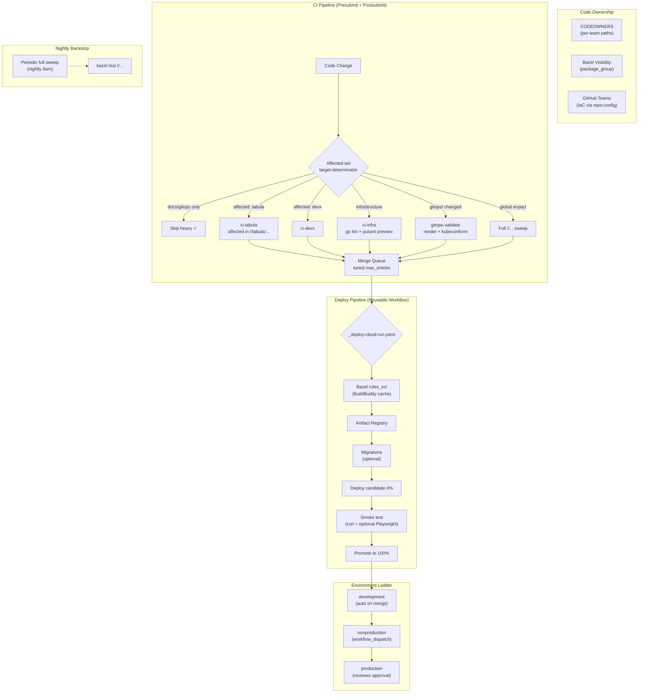

# vitruvian-core — Comprehensive Repo Assessment & Scaling Roadmap

> **Scope:** Full survey of the monorepo's architecture, applications, infrastructure-as-code, CI/CD pipelines, code ownership, and developer workflows — followed by a detailed assessment of what would need to change to support hundreds of applications and thousands of engineers working concurrently.
>
> **Revision 5 (consolidated final):** Reconciled against an independent full-repo analysis and a review pass. Every disputed claim was verified against the working tree (including an empirical test of the license gate); corrections and prioritization are baked in. Per-revision change-markers and the review audit-trail were removed for readability — the full history lives in git.
>
> **Related:** [CI/CD Terminology Reference](/.github/CI_DEFINITIONS.md)

> [!NOTE]
> **R6 status (2026-07-02): the P0 and P1 tiers of this roadmap are SHIPPED.** Beyond the §7.1 items (closed via #454–#462), the 2026-07-01 follow-up assessment's bottleneck list landed as: merge-queue/postsubmit **affected-target sharding + nightly full-sweep backstop** (#494), **aux-job path gating** (#495), **inter-app visibility firewalls** (#496), **worktree enforcement** (#508), **governance apply serialization + pipeline gates as code + zitadel import guard + advisory previews** (#509), **graph-gated deploys** (#510), **per-app metadata catalog + reusable `_deploy-cloud-run.yaml` + deploy de-race** (#511), and **flaky quarantine + culprit-finder** (#513). Sections below describing those as gaps/targets (§5.5–§5.7, parts of §7.1/Part II) are retained as design rationale; the *current* contributor-facing truth is [CONTRIBUTING.md](/CONTRIBUTING.md). Remaining open tier: P2 (#497 staging ladder, #503, #504, #506, #507).

---

## Part I: Current State (What Exists Today)

### 1. Repo Identity

A **polyglot Bazel monorepo** (Bazel 9.1.x via Bzlmod) serving as the single source of truth for 6 first-party applications, shared infrastructure, developer tooling, and a homelab Kubernetes cluster.

| Dimension | Value |
|-----------|-------|
| Build system | Bazel 9.1.x (Bzlmod), Aspect CLI |
| Remote cache/RBE | BuildBuddy |
| CI/CD | GitHub Actions (23 workflows) — **monorepo is the single CI authority** |
| IaC | Pulumi (Go) only, ArgoCD (GitOps) |
| Cloud | GCP (Cloud Run, Secret Manager, Artifact Registry, IAM/WIF, Cloud Storage) |
| Code sync | Copybara (one-way export + PR-import for 5 components) |
| Package managers | pnpm (JS), go.work (Go), uv (Python); Cargo (Rust) & Bundler (Ruby) toolchains are **wired but dormant** (no in-tree consumers) |
| Dependency policy | One Version Rule per ecosystem |
| Config management | Homelab cluster provisioned via [homelab CLI](/homelab) (Lima VZ + K3s) — **no Ansible** |

---

### 2. Naming Convention

> [!IMPORTANT]
> **Adopt `kebab-case` (hyphens) as the universal naming convention** for all *new* directories, Pulumi projects, GitHub environments, workflows, and GCP resources. Adopting the convention is a zero-cost Phase-1 decision. **Renaming existing directories is deferred** to Phase 3 / the Pulumi reorg (§4.2) — those renames churn Pulumi project names and can orphan stack state, so they only ride along with the reorg that already touches those names.

**Convention:**

| Scope | Convention | Example |
|-------|-----------|---------|
| Directories | `kebab-case` | `oauth-user-inspector/`, `mcp-slack/` |
| Pulumi project names | `kebab-case` | `oauth-user-inspector`, `repo-config` |
| Pulumi stack names | `kebab-case` | `development`, `nonproduction`, `production` |
| GitHub Environments | `{app}-{env}` kebab-case | `tabula-development`, `oauth-user-inspector-production` |
| GitHub workflow files | `{app}-{action}.yaml` kebab-case | `tabula-deploy.yaml`, `oauth-user-inspector-deploy.yaml` |
| Bazel targets | `snake_case` (Bazel convention) | `image_push`, `migrate_deploy_bin` |
| Go packages | `snake_case` (Go convention) | `cloud_run`, `secret_manager` |
| GCP project IDs | `{app}-{env}-{seq}` kebab-case | `tabula-development-0001` |
| GCP resources | `{app}-{qualifier}-{env}` kebab-case | `tabula-api-development` |

**Existing-dir renames (deferred to Phase 3, ride the Pulumi reorg):**

| Current | Proposed | Type |
|---------|----------|------|
| `repo_config/` | `repo-config/` | Directory |
| `dev-local/` | `dev-local/` | ✅ Already correct |
| `lab-gmail/` | `accounts/personal/` (rename + restructure) | Directory + purpose |
| `oauth-user-inspector-deploy-identity/` | **Keep as a separate bootstrap stack** (replicate the pattern to tabula — see §4.2 #4) | Trust boundary |
| `copy.bara.sky` component names | Already kebab-case ✅ | Config |

**Bazel exception:** Bazel targets use `snake_case` per Bazel convention (e.g., `go_binary`, `ts_project`). This is a widely understood exception — don't fight the build system's own conventions.

**Go exception:** Go package names use `snake_case` per Go convention. Same reasoning. (This is also why the `repo_config` / `copybara_sync` renames are low-value — they are Go/Pulumi project dirs, and the rename churns more than it clarifies.)

---

### 3. Application Catalog

| App | Type | Language(s) | Ship Model | Deploy Target |
|-----|------|-------------|------------|---------------|
| [tabula](/tabula) | SaaS platform (API + extension + web + CLI) | TypeScript | Continuous deploy | Cloud Run (blue-green) |
| [oauth-user-inspector](/oauth-user-inspector) | SaaS web app | TypeScript/React + Express | Continuous deploy | Cloud Run (blue-green — to be aligned) |
| [devx](/devx) | CLI tool | Go | Bazel build → GoReleaser (distribution) | N/A (released) |
| [homelab](/homelab) | CLI (k3s/Lima provisioner) | Go | Bazel build → GoReleaser (distribution) | N/A — *provisions* the cluster; not deployed to it |
| [mcp-slack](/mcp-slack) | MCP server | TypeScript | npm publish | N/A (released) |
| [nexus-agent](/nexus-agent) | macOS app + bot | Swift, Node.js | DMG via GitHub Releases + npm | N/A — released (local bot + macOS app); no hosted deploy |

---

### 4. Infrastructure as Code

#### 4.1 Pulumi (Go) — Current Structure

| Pulumi Project | What It Manages | GCP Project |
|---------------|-----------------|-------------|
| Root (`vitruvian-core`) | Copybara sync auth (deploy keys, GitHub secrets) | — |
| `lab-gmail/` | Personal GCP infra — Cloud Run (lab-gmail), Cloud Build, Secret Manager, IAM, Storage | `personal-llc` |
| `tabula/` | Tabula API — Cloud Run v2 (blue-green), Artifact Registry, 5 secrets | `tabula-dev-0001` |
| `oauth-user-inspector/` | OAuth Inspector — Cloud Run v2, Artifact Registry | `gen-lang-client-0352693779` |
| `oauth-user-inspector-deploy-identity/` | WIF pool + OIDC provider, deploy/runtime SAs | `gen-lang-client-0352693779` |
| `dev-local/` | Homelab k8s platform components (Helm charts) | — |
| `zitadel-apps/` | Zitadel OIDC application registrations | — |
| `repo_config/` | GitHub repo settings (environments, branch protection, merge queue) | — |

#### 4.2 Proposed Reorganization

```
infrastructure/pulumi/
├── pkg/                                  # Shared library (EXPAND)
│   ├── cloudrun/                         # Unified Cloud Run v2 helper (blue-green)
│   ├── identity/                         # WIF + deploy SA + runtime SA
│   ├── secrets/                          # Secret Manager helpers
│   ├── registry/                         # Artifact Registry helpers
│   └── copybara-sync/                    # (existing, renamed from copybara_sync)
│
├── accounts/                             # Account-level resources
│   └── personal/                         # james.nguyen@gmail.com account
│       ├── Pulumi.yaml
│       └── main.go                       # API enablement, shared IAM
│
├── apps/                                 # Per-app infra (uses pkg/)
│   ├── tabula/                           # deploy stack — 3 envs: dev/nonprod/prod
│   ├── tabula-deploy-identity/           # bootstrap: WIF pool/provider + SAs (separate lifecycle)
│   ├── oauth-user-inspector/             # deploy stack — 3 envs
│   └── oauth-user-inspector-deploy-identity/  # bootstrap: WIF (kept separate, not folded in)
│                                         # nexus-agent has no hosted infra today —
│                                         # add apps/nexus-agent/ only if it gets a hosted backend
│
├── platform/                             # Cross-cutting platform infra
│   ├── dev-local/                        # Homelab k8s platform
│   ├── repo-config/                      # GitHub repo settings (renamed)
│   └── zitadel-apps/                     # OIDC app registrations
│
└── vitruvian-core/                       # Copybara sync auth
```

**Key changes:**
1. **`lab-gmail` → `accounts/personal/`** — Manages account-level resources only (Cloud Run for lab-gmail, shared IAM, API enablement). nexus-agent has *no* hosted infra today, so there is nothing to extract; if it ever grows a hosted backend, add `apps/nexus-agent/` then.
2. **`pkg/` expanded** — Unified helpers for Cloud Run, identity, secrets, registry. Eliminates the current ~2x duplication (tabula + oauth today) and, more importantly, stops every *future* app from re-deciding these patterns. The secrets helper now exists as the shared `infrastructure/pulumi/pkg/secrets` module (`EnvOrConfig` / `EnvOrConfigOptional`, promoted from `copybara_sync`), which `copybara_sync` and `repo_config` route through so no new stack repeats the committed-secret mistake (§7.1 item C).
3. **`apps/` grouping** — All app-specific infra. Each uses shared `pkg/` patterns.
4. **Consistent WIF pattern, identity kept SEPARATE** — Every app builds its deploy-identity from `pkg/identity/`, but each app's WIF pool/provider + SAs stay in their **own bootstrap stack** (`apps/<app>-deploy-identity/`), *not* folded into the deploy stack. Rationale: the identity stack is what a deploy authenticates *with*; it needs higher-privilege, lower-frequency applies, so coupling it to steady-state deploys inverts the trust boundary. `oauth-user-inspector-deploy-identity` is already the reference pattern — replicate it to tabula, don't collapse it.
5. **`repo_config` → `repo-config` / `copybara_sync` → `copybara-sync`** — Kebab-case rename, deferred to Phase 3. These are Go module + Pulumi *project* directories; renaming churns the gazelle prefix, BUILD files, workflow path filters, and the Pulumi project name (which can orphan stack state) for no functional gain. Do it only alongside this `apps/`/`platform/` move (which already touches project names), never as a standalone change.

#### 4.3 ArgoCD / GitOps

App-of-apps pattern deploys homelab Kubernetes workloads (~35 platform components + first-party apps). Self-heal enabled. **Note:** `gitops/**` changes are not validated in CI before they reconcile live — see §7.1 item A.

---

### 5. CI/CD Pipeline Architecture

#### 5.1 Deploy Workflow Alignment — Current vs Target

> [!IMPORTANT]
> **All SaaS/web apps should follow tabula's mature pattern** as the reference implementation: Bazel `rules_oci`, blue-green deploy, 3 standardized environments, BuildBuddy remote cache.

**Current state (inconsistencies highlighted):**

| Dimension | tabula (reference) | oauth-user-inspector (to align) |
|-----------|-------------------|-------------------------------|
| Container build | ✅ Bazel `rules_oci` | ⚠️ Docker Buildx (Vite 6/Rolldown bindings break in Bazel sandbox; deploy workflow supports Docker via `dockerfile-dir`) |
| Deploy mechanism | ✅ Blue-green (candidate → smoke → promote) | ✅ Blue-green (via reusable workflow) |
| DB migrations | ✅ Prisma (vendored, Bazel-built) | ✅ None (by design — no DB backend) |
| Pre-deploy infra | ✅ Zitadel OAuth app managed by `zitadel-apps/` | ⚠️ All GCP project resources should be IaC-managed |
| Smoke test | ⚠️ `curl /health` | ⚠️ Headless Chrome → **standardize approach** |
| Environments | ✅ development / nonproduction / production | ❌ development only → **add nonproduction + production** |
| Bazel integration | ✅ Full | ⚠️ Partial (compiles backend but skips rules_oci) |
| Remote cache | ✅ BuildBuddy | ❌ N/A |

**Target state — all SaaS/web apps share:**

| Dimension | Standard |
|-----------|----------|
| Container build | Bazel `rules_oci` (`node_image` + `oci_push`) |
| Deploy | Blue-green via reusable `_deploy-cloud-run.yaml` |
| Environments | `development` / `nonproduction` / `production` (consistent naming) |
| Auth | WIF (keyless), environment-scoped variables |
| Remote cache | BuildBuddy (`--config=remotecache`) |
| IaC | Each app's GCP project resources managed in `apps/{app}/` Pulumi |

#### 5.2 Smoke Test Standardization

> You asked: _"I'm not sure if standardizing on Playwright or some free alternative to Postman for API smoke tests is a better approach?"_

**Recommended tiered approach:**

| Tier | Tool | When | Example |
|------|------|------|---------|
| **Health check** (always) | `curl --fail --retry` | Every deploy, every app | `curl /health` — verifies the process started and responds |
| **API smoke** (API apps) | `curl` + `jq` assertions | API apps post-deploy | `curl /api/v1/status | jq -e '.version == "..."'` |
| **UI smoke** (web apps) | Playwright (already hermetic in Bazel) | Web apps with a frontend | Verify the React app mounts, key routes render |

**Why this layering:**
- `curl` is zero-dependency and runs in any CI environment — it's the universal health gate
- Playwright is already set up in the repo (`rules_playwright` in `MODULE.bazel` with hermetic browsers) — use it for UI verification
- No need for Postman/Newman — `curl` + `jq` covers API smoke tests without adding a tool, and Playwright covers UI. Both are free and already available.

**In the reusable deploy workflow:**

```yaml
# Tier 1: Always (health endpoint)
- name: Health check (candidate)
  run: curl --fail --retry 10 --retry-delay 5 "${CANDIDATE_URL}/health"

# Tier 2: Optional (app-specific smoke script)
- name: App-specific smoke test
  if: inputs.smoke_script != ''
  run: bash ${{ inputs.smoke_script }} "${CANDIDATE_URL}"
```

Each app provides its own smoke script if it needs more than a health check. Tabula might test `/api/v1/status`, oauth-user-inspector might run a Playwright script to verify React mounts.

#### 5.3 Reusable Deploy Workflow

```yaml
# .github/workflows/_deploy-cloud-run.yaml (reusable)
on:
  workflow_call:
    inputs:
      app-name:             { required: true, type: string }
      environment:          { required: true, type: string }    # development|nonproduction|production
      bazel-image-target:   { required: true, type: string }    # //tabula/api:image_push
      pulumi-dir:           { required: true, type: string }    # infrastructure/pulumi/apps/tabula
      smoke-url-path:       { required: false, type: string, default: '/health' }
      smoke-script:         { required: false, type: string }   # Optional app-specific smoke
      run-migrations:       { required: false, type: boolean, default: false }
      migration-target:     { required: false, type: string }

jobs:
  deploy:
    runs-on: ubuntu-latest
    environment: ${{ inputs.app-name }}-${{ inputs.environment }}
    steps:
      - uses: actions/checkout@v7
      - uses: ./.github/actions/setup-bazel

      # Auth (WIF — keyless, environment-scoped vars)
      - uses: google-github-actions/auth@v3
        with:
          workload_identity_provider: ${{ vars.GCP_WORKLOAD_IDENTITY_PROVIDER }}
          service_account: ${{ vars.GCP_DEPLOY_SERVICE_ACCOUNT }}

      # Build + push OCI image (always Bazel rules_oci)
      - run: |
          bazel run --config=remotecache \
            --remote_header=x-buildbuddy-api-key=$BUILDBUDDY_API_KEY \
            ${{ inputs.bazel-image-target }} -- \
            --repository "${GCP_REGION}-docker.pkg.dev/${GCP_PROJECT_ID}/${{ inputs.app-name }}/api" \
            --tag "${GITHUB_SHA}" --tag latest

      # Migrate (optional)
      - if: inputs.run-migrations
        run: bazel run ${{ inputs.migration-target }}

      # Deploy candidate at 0% (Pulumi blue-green)
      # NOTE: this presumes a committed Pulumi.<env>.yaml — see §7.1 note on the
      # env ladder; --create must not silently spin up an empty, config-less stack.
      - working-directory: ${{ inputs.pulumi-dir }}
        run: |
          pulumi stack select "${{ inputs.environment }}"
          pulumi config set imageTag "$GITHUB_SHA"
          pulumi config set promote false
          pulumi up --yes

      # Smoke test (always health, optionally app-specific)
      - run: curl --fail --retry 10 --retry-delay 5 "${CANDIDATE_URL}${{ inputs.smoke-url-path }}"
      - if: inputs.smoke-script != ''
        run: bash ${{ inputs.smoke-script }} "${CANDIDATE_URL}"

      # Promote to 100%
      - working-directory: ${{ inputs.pulumi-dir }}
        run: |
          pulumi config set promote true
          pulumi up --yes
```

**Each app's deploy workflow becomes a thin caller:**

```yaml
# tabula-deploy.yaml
uses: ./.github/workflows/_deploy-cloud-run.yaml
with:
  app-name: tabula
  environment: ${{ inputs.environment || 'development' }}
  bazel-image-target: //tabula/api:image_push
  pulumi-dir: infrastructure/pulumi/apps/tabula
  run-migrations: true
  migration-target: //tabula/api:migrate_deploy_bin

# oauth-user-inspector-deploy.yaml (after alignment)
uses: ./.github/workflows/_deploy-cloud-run.yaml
with:
  app-name: oauth-user-inspector
  environment: ${{ inputs.environment || 'development' }}
  bazel-image-target: //oauth-user-inspector:image_push
  pulumi-dir: oauth-user-inspector/infra/app
  smoke-script: oauth-user-inspector/scripts/smoke-playwright.sh
```

#### 5.4 CLI Build Strategy — GoReleaser + Bazel

> You asked: _"Would it be better to use Bazel build here so we could benefit from Bazel deps and everything else Bazel provides?"_

**Recommendation: Use Bazel for building, GoReleaser for distribution.**

| Concern | Bazel | GoReleaser | Recommendation |
|---------|-------|------------|---------------|
| **Compiling Go binary** | ✅ Hermetic, cached, shared dep graph | ✅ Also works but doesn't share cache | **Bazel** — benefits from remote cache + shared deps |
| **Cross-compilation** (darwin/linux × amd64/arm64) | ✅ Via `--platforms` | ✅ Built-in CGO_ENABLED=0 cross-compile | Either works |
| **GitHub Release creation** | ❌ No built-in support | ✅ Creates releases, changelogs, checksums | **GoReleaser** |
| **Homebrew formula** | ❌ No built-in support | ✅ Auto-updates tap formula | **GoReleaser** |
| **Signing / SBOM** | ❌ Manual | ✅ Built-in cosign + SBOM | **GoReleaser** |

**Hybrid approach:**

```yaml
# In .goreleaser.yml
builds:
  - id: devx
    # Let GoReleaser call bazel instead of `go build`
    builder: prebuilt
    prebuilt:
      path: bazel-bin/devx/devx_/devx_{{ .Os }}_{{ .Arch }}
    # ... or use GoReleaser's go build but with Bazel-managed deps

# In the release workflow
steps:
  # Build all platform binaries with Bazel (benefits from cache)
  - run: |
      bazel build --config=remotecache \
        //devx:devx_linux_amd64 \
        //devx:devx_linux_arm64 \
        //devx:devx_darwin_amd64 \
        //devx:devx_darwin_arm64

  # Use GoReleaser only for release/distribution (GitHub Release, Homebrew, checksums)
  - uses: goreleaser/goreleaser-action@v6
    with:
      args: release --clean
```

This gives you:
- ✅ Bazel's hermetic builds, remote cache, and shared dependency graph for compilation
- ✅ GoReleaser's mature release tooling (GitHub Releases, Homebrew, checksums, changelogs)
- ✅ BuildBuddy caching benefits for CLI builds too

#### 5.5 Postsubmit Strategy — Per-App Sharding, driven by the Bazel graph (Option B)

> You chose: _"Let's go with Option B."_ — kept, with the *scope key* corrected below.

**Design: Postsubmit runs per-app CI jobs in parallel, each testing only the affected targets in its own subtree. A _nightly_ periodic sweep tests cross-app integration.**

> [!WARNING]
> **Do not key the shard on `dorny/paths-filter` (directory globs). Key it on the Bazel graph (`target-determinator`) — the same engine `tools/ci/affected-targets.sh` already uses for presubmit.** Path-filters are strictly coarser than the graph: they **over-trigger** (any file under `tabula/**` reruns *all* of `//tabula/...`, even a docs-only or `cli`-only change) **and** — the failure that matters for a "hundreds of apps" target — they **under-trigger**, because a change to a shared Bazel library that isn't under any single app dir won't route to the affected app's tests. The dependency graph catches exactly that; a path glob cannot. The repo *already* computes the correct affected set — the shard should **bucket that set by owning app for per-app status**, not recompute a worse one. Keep the `push:main` full `//...` as the postsubmit floor and demote the periodic sweep to **nightly** (not weekly) so a cross-app break is caught in ≤24h, not ≤7 days.

```yaml
# In ci.yaml — postsubmit (push to main)
jobs:
  determine-scope:
    if: github.event_name == 'push'
    runs-on: ubuntu-latest
    outputs:
      apps:   ${{ steps.affected.outputs.apps }}    # JSON array of affected app names
      global: ${{ steps.affected.outputs.global }}  # true if a global-impact file changed
    steps:
      - uses: actions/checkout@v7
        with: { fetch-depth: 0 }                     # merge-base must be present (#81)
      - uses: ./.github/actions/setup-bazel
      # Reuse the SAME engine as presubmit: compute the affected target set from the
      # Bazel graph (target-determinator), write it to affected.txt, then bucket by
      # owning app (label prefix //<app>/...) to decide which per-app jobs fan out.
      # Global-impact files (MODULE.bazel/.bazelrc/tools/**/root BUILD/…) still
      # short-circuit to global=true → full //... . Graph-correct: a shared-library
      # change lands in whatever apps actually depend on it, which a directory
      # path-filter would silently miss.
      - id: affected
        run: bash tools/ci/affected-apps.sh   # new: wraps affected-targets.sh, emits affected.txt + apps[] + global

  # Global-impact change → full sweep (safety floor, same as today)
  postsubmit-full:
    needs: determine-scope
    if: needs.determine-scope.outputs.global == 'true'
    runs-on: ubuntu-latest
    steps:
      - run: bazel build --config=remote ... //...
      - run: bazel test  --config=remote ... //...

  # Per-app postsubmit — one matrix job per AFFECTED app (from the graph output),
  # each testing that app's targets INTERSECTED with the affected set — graph-scoped,
  # not path-scoped. Feed the target list via --target_pattern_file (sorted; avoids
  # ARG_MAX from splatting the list on the command line).
  postsubmit-app:
    needs: determine-scope
    if: needs.determine-scope.outputs.global != 'true' && needs.determine-scope.outputs.apps != '[]'
    strategy:
      fail-fast: false
      matrix:
        app: ${{ fromJSON(needs.determine-scope.outputs.apps) }}
    runs-on: ubuntu-latest
    steps:
      - run: |
          grep "^//${{ matrix.app }}/" affected.txt > app-affected.txt || true
          [ -s app-affected.txt ] && bazel test --config=remote ... --target_pattern_file=app-affected.txt

  # Infra-only changes → IaC-specific checks (only the affected stacks)
  postsubmit-infra:
    needs: determine-scope
    if: needs.determine-scope.outputs.global != 'true' && contains(fromJSON(needs.determine-scope.outputs.apps), 'infra')
    runs-on: ubuntu-latest
    steps:
      - run: golangci-lint run ./infrastructure/pulumi/...
      - run: pulumi preview --expect-no-changes  # per changed stack
```

**Nightly periodic full sweep (backstop):**

```yaml
# .github/workflows/periodic-full-sweep.yaml
on:
  schedule:
    - cron: '0 6 * * *'  # nightly 6am UTC — bounds any missed cross-app break to <24h
jobs:
  full-sweep:
    runs-on: ubuntu-latest
    timeout-minutes: 60
    steps:
      - run: bazel build --config=remote ... //...
      - run: bazel test  --config=remote ... //...
```

**Benefits:**
- Most postsubmit runs complete in minutes (affected apps only) instead of the full graph
- Global-impact changes still get the full `//...` sweep (unchanged safety floor)
- Nightly full sweep catches anything the affected-set sharding might miss, within a day
- Each app gets its own postsubmit status in the GitHub UI — the real win of Option B
- **Scope is graph-correct**: a shared-lib change fans out to its true dependents, not just the directory it lives in

#### 5.6 Per-App CI Jobs (Presubmit)

Same graph-based pattern as postsubmit, but for PRs. Each app gets its own visible status **whose scope is the affected set ∩ that app**, not `//<app>/...` wholesale:

```yaml
# Presubmit per-app jobs (matrix over affected apps from determine-scope)
ci-app:
  needs: determine-scope
  if: needs.determine-scope.outputs.global != 'true' && needs.determine-scope.outputs.apps != '[]'
  strategy: { fail-fast: false, matrix: { app: ${{ fromJSON(needs.determine-scope.outputs.apps) }} } }
  runs-on: ubuntu-latest
  steps:
    - run: |
        grep "^//${{ matrix.app }}/" affected.txt > app-affected.txt || true
        [ -s app-affected.txt ] && bazel test --config=remote ... --target_pattern_file=app-affected.txt
```

> [!IMPORTANT]
> **Keep `build-test` (the existing whole-affected-set job) as the single always-reporting *required* check, and treat the per-app `ci-app` jobs as *additional* status for team visibility.** GitHub cannot safely *require* a check that is sometimes skipped: a required check that never runs on a given PR leaves the merge queue **stuck "pending" forever**. The pattern the repo already relies on (`tools/ci/relevant-paths.sh`) is to always *run* the gate job and let it finish green in seconds when there is nothing to do — mirror that before promoting any per-app check to *required*.

**Per-app checks managed in `repo-config` Pulumi:**

```go
// Per-app ci-app jobs give each team their own visible status.
// Keep them ADVISORY (not required) UNLESS each is wired to always report a
// result (run-then-noop), or a skipped required check will wedge the queue.
```

#### 5.7 Pre-merge validation that is currently missing

Two gates are absent today and both are cheap, high-leverage, and belong in Phase 1:

- **GitOps manifest validation (`gitops-validate.yaml`) — P0.** `gitops/**` changes are **not validated in CI** before ArgoCD `selfHeal` reconciles them *live* against the single cluster (and `app-of-platform` *prunes*). A bad `goTemplate` brace, sync-wave, or `include:` glob reaches `main` and applies itself — the documented failure class. Add a gate that renders each `platform/*/applicationset*.yaml` (e.g. `argocd appset generate` / `helm template`) and runs `kubeconform` over the rendered manifests + `applications/*.yaml`, then add it to `mergeQueueRequiredChecks` in `repo-config`. This is the single highest-blast-radius-per-cost gap in the repo.
- **`actionlint` — P1.** The entire ownership/CI plumbing is a large hand-tuned workflow tree, and it is **unlinted** (`actionlint` is referenced in docs but wired nowhere). A malformed required-check *name* silently wedges the merge queue. Add a SHA-pinned `actionlint` job, and extend `//tools/conformance:check` to assert the required-check names in `repo-config` exactly match the `name:` surface of `ci.yaml`/`tidy-check.yaml`/`conformance-check.yaml`.

---

### 6. Code Ownership & Governance

#### 6.1 CODEOWNERS → Team-Based Ownership (P0)

**Create teams in `repo-config` Pulumi now**, even with a single member:

```go
// infrastructure/pulumi/platform/repo-config/main.go
teams := map[string]string{
    "tabula-team":           "Tabula application team",
    "devx-team":             "Developer experience CLI team",
    "homelab-team":          "Homelab CLI and k8s apps team",
    "mcp-slack-team":        "MCP Slack server team",
    "nexus-agent-team":      "Nexus Agent team",
    "oauth-inspector-team":  "OAuth User Inspector team",
    "platform-team":         "Platform, build, and infrastructure team",
}
for name, desc := range teams {
    team, _ := github.NewTeam(ctx, name, &github.TeamArgs{
        Name:        pulumi.String(name),
        Description: pulumi.String(desc),
        Privacy:     pulumi.String("closed"),
    })
    github.NewTeamMembership(ctx, name+"-james", &github.TeamMembershipArgs{
        TeamId:   team.ID(),
        Username: pulumi.String("ipv1337"),
        Role:     pulumi.String("maintainer"),
    })
}
```

Seed each team with `@ipv1337` today so nothing deadlocks, then switch the per-app `CODEOWNERS` lines from `@ipv1337` to the team handles. Only enable "Require review from Code Owners" once a team has a second member (a solo owner cannot approve their own PR).

#### 6.2 Bazel Visibility Boundaries + Shared Package Discovery (P0)

Lock down visibility per app so an app's internals are `//<app>/...:__subpackages__` only and cross-app deps must go through a declared public API package. Today isolation holds by directory convention, not by allowlist; make it a firewall. Extract shared `pkg/` helpers (§4.2) so "no duplication" doesn't require "no boundary."

#### 6.3 GCP Project Convention (P1)

**Naming:** `{app}-{env}-{seq}` kebab-case (e.g., `tabula-development-0001`).
**Driven by Pulumi config**, never hardcoded. GitHub Environment variables hold the project ID.

**GCP Organization/Folders are NOT possible with a personal `@gmail.com` account.** The naming convention serves as your logical hierarchy until a Workspace domain is adopted.

---

### 7. What's Already Good (Strengths)

| Strength | Evidence |
|----------|----------|
| ✅ Bazel graph-based affected-target CI | `target-determinator` in use for PRs |
| ✅ Keyless cloud auth | WIF/OIDC everywhere |
| ✅ IaC for repo settings | `repo-config` Pulumi module |
| ✅ Hermetic, reproducible builds | Bazel Bzlmod + BuildBuddy |
| ✅ Multi-language lint/format | `--config=lint` aspects, `bazel run //:tidy` (lint is opt-in, not yet a required gate) |
| ✅ Smart CI short-circuits | Docs-only skip, macOS path-gating |
| ✅ Blue-green deploys | Tabula (reference implementation) |
| ✅ Copybara sync with conflict detection | Pre-check tool, 15-min PR-import poll |
| ✅ Conformance checks | Version pin consistency |
| ✅ CODEOWNERS scaffolding | Per-app paths defined |
| ✅ Monorepo as single CI authority | Standalone CI retired |
| ✅ Dependency update automation | Dependabot → Bazel reconcile → auto-merge |

> [!NOTE]
> **Two of these "strengths" currently give false assurance — verified against the tree:**
> - **License check does not enforce MIT or the holder.** The gate is `bazel run //tools/license:check` (`addlicense -check -l mit -c VitruvianSoftware`, via multitool). Tested empirically with the pinned `addlicense@v1.2.0`: `-check` is **presence-only** — the `-l`/`-c` flags apply only when *adding* headers, so a file carrying an Apache-2.0 header with a wrong holder passes clean. `mcp-slack` ships Apache source headers today and the check is green. The "MIT enforced repo-wide" invariant is not real (§7.1 item D).
> - **Dependabot coverage has holes.** It watches `gomod` for `/devx` + `/homelab` and `github-actions` for root only — **not** the pnpm workspaces (tabula/oauth/mcp-slack/nexus-agent) and **not** the `infrastructure/pulumi/*` `go.mod`s. Large parts of the dependency surface get no automated bumps.

---

### 7.1 Known Correctness & Safety Gaps — fix before scaling

The doc above is strong on deploy *standardization* but light on operational blast-radius and correctness. These are the highest-priority items surfaced by the independent pass, ordered by risk:

| # | Gap | Why it matters | Priority |
|---|-----|----------------|----------|
| A | **No `gitops/` CI validation** (see §5.7) | A bad AppSet/`goTemplate`/sync-wave reaches `main` and `selfHeal` reconciles it live against the one cluster; `app-of-platform` *prunes* | **P0** |
| B | **Developer workspace isolation** | Multiple sessions share one checkout and one Bazel server → stomp `HEAD`, contend on `output_base`. The #1 concurrent-*developer* hazard, convention-only (git worktrees) — and it is *already biting* (a workflow file shifted underneath an active session). Ship a `bazel run //tools:worktree` helper that creates a worktree **and** pins a per-session `--output_user_root`, and make it the documented entry point | **P0** |
| C | **Secrets-model violation** | `repo-config/Pulumi.dev.yaml` commits a Pulumi-`secure:` **BuildBuddy key** read via `cfg.RequireSecret` with no env fallback. Remove it, **rotate the key** (it is in git history), and route through the shared `pkg/secrets` helper (§4.2 #2) | **P0** |
| D | **License check is presence-only** (see §7 note) | The "MIT enforced repo-wide" invariant does not hold — an Apache header passes. Add a real MIT+holder content gate and relicense the three Apache apps | **P0** |
| E | **`actionlint` absent** (§5.7) | The whole scaling plan rests on hand-tuned workflow YAML that nothing lints; a drifted required-check name silently wedges the queue | **P1** |
| F | **ArgoCD AppProjects are wildcard** | `clusterResourceWhitelist: '*'`, destinations `'*'` — no per-app namespace/RBAC scoping, so any app's manifests can write any namespace. Split `applications-project` per app | **P1** |
| G | **Single cluster / single env for the platform** | The Cloud Run ladder adds dev→nonprod→prod for *apps*, but the GitOps platform itself is one cluster / one ArgoCD / permissive projects — every platform change is cluster-wide blast radius | **P2** |
| H | **No cross-workflow concurrency on `tabula-release` / `charts-publish`** | Two rapid merges can race a release tag / GHCR chart push (`tabula-deploy` and `oauth-deploy` already guard this; release/publish don't) | **P2** |

> **Note on the reusable deploy workflow (§5.3):** `pulumi stack select "${env}"` presumes a committed `Pulumi.<env>.yaml` per app+env. Today only `development`/`dev` stacks exist — **there are zero `nonproduction`/`production` stacks**. The env ladder is not traversable until those stack files are committed; do not `--create` empty, config-less stacks on the fly. Commit the missing stacks as part of the oauth alignment / ladder work.

---

## Part II: Scaling Roadmap

### 8. Recommended Implementation Priority

#### Phase 1: Foundation (Do Now — Solo Maintainer)

The four P0 correctness/safety items (§7.1) lead. Also adopted here as a **decision only (no code change): the kebab-case naming convention for all new dirs/projects/workflows (§2);** existing-dir renames are deferred to Phase 3 (item 23).

| # | Item | Effort | Impact |
|---|------|--------|--------|
| 1 | **P0 · GitOps validation gate** — render AppSets + `kubeconform`, add to required checks (§5.7) | M | Stops bad platform manifests reconciling live |
| 2 | **P0 · Secrets-model fix** — remove committed BuildBuddy `secure:` key, **rotate it**, route via `pkg/secrets` | S | Closes a live secret-in-git violation |
| 3 | **P0 · Real license gate** — enforce MIT + holder (content match); relicense the 3 Apache apps | S | Makes a claimed invariant actually true |
| 4 | **P0 · Worktree isolation helper** — `bazel run //tools:worktree` + per-session `--output_user_root` | M | Ends the shared-`HEAD` stomp (top dev-concurrency hazard; already biting) |
| 5 | **Bazel visibility boundaries** — `package_group` per app | M | Prevents accidental coupling |
| 6 | **Expand Pulumi `pkg/`** — Shared Cloud Run, secrets, identity, registry helpers | M | Eliminates the current ~2x IaC duplication + stops future re-decisions |
| 7 | **Reusable deploy workflow** (`_deploy-cloud-run.yaml`) + commit the missing `Pulumi.<env>.yaml` stacks | M | Standardizes deploy; makes the env ladder traversable |
| 8 | **Align oauth-user-inspector** — Bazel `rules_oci` + blue-green + BuildBuddy + 3 envs | L | Eliminates biggest deployment inconsistency |
| 9 | **Infra-only CI path** — Go lint + `pulumi preview` for IaC changes | S | Right CI for the right change type |
| 10 | **`actionlint` gate + required-check-name conformance assertion** | S | Protects the merge-gate plumbing |
| 11 | **Create GitHub teams in `repo-config`** — Solo member, enables team CODEOWNERS | S | Scaffolding ready for contributors |
| 12 | **Tune merge queue** — Increase `max_entries_to_build` in `repo-config` | S | Faster merge throughput |

#### Phase 2: Alignment (Before Adding Contributors)

| # | Item | Effort | Impact |
|---|------|--------|--------|
| 13 | **Per-app CI jobs — graph-based, advisory** — bucket the `target-determinator` affected set by app for per-team status; keep `build-test` as the one required check (§5.6) | M | Each team sees their own CI, no queue-wedge risk |
| 14 | **Per-app postsubmit sharding — graph-keyed + _nightly_ sweep** — affected-set ∩ app, not path globs (§5.5) | M | Much cheaper postsubmit, correct for shared libs |
| 15 | **Pulumi reorganization** — `accounts/`, `apps/`, `platform/` structure | L | Clean separation of concerns |
| 16 | **CLI hybrid builds** — Bazel for compilation + GoReleaser for distribution | M | Remote cache benefits for CLI builds |
| 17 | **App scaffold (`devx scaffold`)** — Spring Initializr-style generator | L | Eliminate hand-wiring |
| 18 | **Enable RBE** (`--config=remote`) in all CI jobs | S | Faster builds |

#### Phase 3: Scale (Hundreds of Apps)

| # | Item | Effort | Impact |
|---|------|--------|--------|
| 19 | **Merge queue partitioning** — Per-app queues via Graphite/Trunk | L | Eliminates cross-app serialization |
| 20 | **MODULE.bazel decomposition** — Per-app module extensions | L | Breaks global-dep chokepoint |
| 21 | **GCP Organization migration** — Workspace domain with folders | L | Org-level policies |
| 22 | **Developer portal** — Backstage. `catalog-info.yaml` + `mkdocs.yml` are still the stale Aspect scaffold (wrong name/owner/repo URL). *Fixing* them into real per-app Component metadata (owner = the CODEOWNERS team) is **S/P1 and can be pulled into Phase 1**; the full portal is Phase 3 | S (fix) / L (portal) | Discoverability + ownership index at scale |
| 23 | **Naming convention renames** — execute `repo_config`→`repo-config`, `copybara_sync`→`copybara-sync` *with* the `apps/`/`platform/` Pulumi move (item 15), never standalone (state-orphan risk). The convention itself is adopted in Phase 1 | S | Consistency for automation |

---

### 9. Architecture Diagram (Target State)



---

### 10. Summary

**The repo is remarkably well-engineered for its current scale.** The foundations — Bazel graph-aware CI, keyless WIF, IaC for repo settings, monorepo as single CI authority, Copybara sync, and the One Version Rule — are exactly right, and much of the Google-scale spine (`target-determinator` presubmit, BuildBuddy RBE, merge queue, GitOps closed loop) is genuinely in place.

**But "well-engineered" is not the same as "safe to scale as-is."** Standardizing tabula's deploy pattern is necessary but *not sufficient*: four correctness/safety P0s (§7.1) must land alongside it, or scaling multiplies live-blast-radius. So the highest-impact Phase 1 work is:

1. **The four P0s (§7.1)** — GitOps validation gate, secrets-key removal+rotation, a real license gate, and worktree isolation. These close live correctness/security/concurrency holes that standardization does not touch.
2. **Reusable deploy workflow + oauth-user-inspector alignment** — eliminates the biggest inconsistency (two different deploy mechanisms for the same archetype); commit the missing `nonproduction`/`production` stacks so the ladder is traversable.
3. **Shared Pulumi `pkg/`** — eliminates the current ~2x Cloud Run duplication and routes all secret-bearing stacks through one helper.
4. **Per-app CI + postsubmit sharding — driven by the Bazel graph, not path globs (§5.5/§5.6)** — cheaper CI and per-team visibility, *without* the shared-library blind spot a `paths-filter` shard would introduce.
5. **GitHub teams** — scaffolding for contributors (the naming *convention* is adopted now; the existing-dir *renames* are deferred to Phase 3).

The architecture is designed to scale. The work is about **standardizing the patterns that already exist in tabula** (3-environment blue-green deploy, Bazel OCI builds, BuildBuddy caching, environment-scoped variables) across all apps — **while closing the safety/validation gaps that a single maintainer on a single cluster has been able to hold in their head, but a larger team cannot.**
