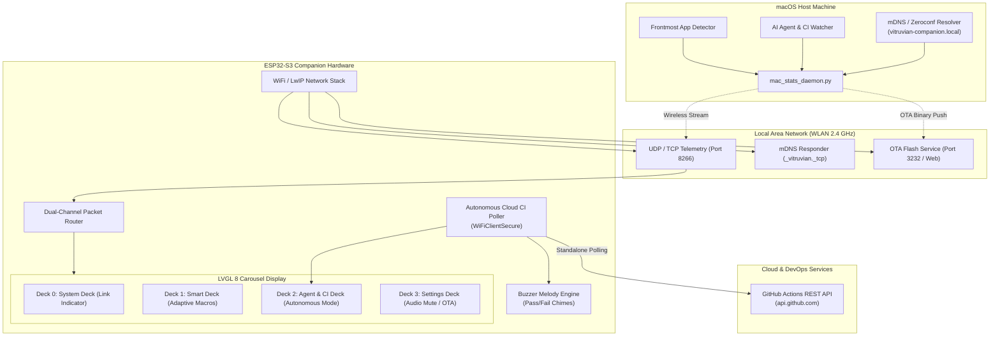

# ESP32-S3 Untethered Wireless Desk Companion & Autonomous Cloud CI/CD Monitor — Design Spec

**Document**: `docs/superpowers/2026-09-04-esp32-s3-wireless-untethered-and-cloud-monitor-design.md`  
**Status**: Approved for Implementation  
**Date**: 2026-09-04  
**Target Platform**: ESP32-S3-DevKitC-1-N8 (16MB Flash, 8MB PSRAM, 240x280 IPS LCD, CST816S Touch, Active Buzzer)  
**Host Environment**: macOS (Darwin arm64)

---

## 1. Executive Summary

Now that Wi-Fi station connectivity and SoftAP provisioning are functional on the ESP32-S3 Mac Desktop Companion, this design document establishes two foundational capabilities:

1. **Direction 1 — Untethered Wireless Desk Companion**:
   - Eliminates physical USB tethering by introducing local network telemetry streaming (over UDP / TCP socket on port 8266) and mDNS discovery (`vitruvian-companion.local`).
   - Enables dual-channel packet routing: whether connected via USB CDC or Wi-Fi LAN, the device seamlessly updates CPU, RAM, active app shortcuts, and AI agent metrics.
   - Adds Over-The-Air (OTA) firmware update support (`ArduinoOTA` / HTTP `/update`), allowing all future firmware iterations to be flashed wirelessly.
   - Enhances Deck 0 link status to differentiate `● USB` (tethered), `📶 Wi-Fi` (untethered LAN), and `● Standby` (disconnected).

2. **Direction 2 — Autonomous Cloud CI/CD & DevOps Monitor**:
   - Converts the companion into an ambient build and release beacon that operates autonomously when the host Mac is asleep, offline, or untethered.
   - Queries GitHub Actions REST API directly over HTTPS (`WiFiClientSecure`) to monitor repository CI/CD pipeline health and commit statuses.
   - Integrates rich audio chimes via the onboard piezo buzzer (triumphant chime on passing build, distinct alert on failure, with an NVS-persisted mute toggle in Settings).
   - Extends the SoftAP Web Portal (`http://192.168.4.1`) and Settings Deck to configure target repositories and authentication credentials.

---

## 2. Architecture & System Topography

---

## 3. Direction 1 Detailed Specification: Untethered Wireless Mode

### 3.1 Network Discovery & mDNS
- **Host Name**: `vitruvian-companion.local`
- **Service Name**: `_vitruvian._tcp` on port `8266`
- **TXTPers**: `version=0.1.3`, `chip=esp32s3`, `id=A0F262E4C310`
- Upon acquiring an IP address from DHCP in `wifi_manager.cpp`, the firmware invokes `MDNS.begin("vitruvian-companion")` and registers the TCP/UDP service.

### 3.2 Dual-Channel Packet Router (`src/packet_router.cpp`, `src/packet_router.h`)
- **Transport Abstraction**:
  - `CHANNEL_USB_SERIAL`: TinyUSB CDC (current implementation)
  - `CHANNEL_WIFI_NET`: UDP listener on port `8266` (payloads <= 1024 bytes)
- **Arbitration & Fallback**:
  - If `millis() - last_usb_rx_ms < 3000`: Primary transport is USB CDC. Display shows `● USB` (Green).
  - Else if `millis() - last_net_rx_ms < 3000`: Primary transport is Wi-Fi LAN. Display shows `📶 Wi-Fi` (Blue/Green).
  - Else: Standby mode. Display shows `● Standby` (Orange).
- **Outbound Command Delivery**:
  - Touch button actions (`run_checks`, `open_pr`, `refresh`) are emitted back across the most recently active channel. If untethered Wi-Fi, the packet is transmitted via UDP back to the client host IP.

### 3.3 Over-The-Air (OTA) Updates
- Embedded `ArduinoOTA` listener initialized once Wi-Fi connects.
- Embedded HTTP endpoint `/update` on the web server (port 80) accepting `multipart/form-data` `.bin` files directly from browser.
- Security: Requires device authentication or active local subnet presence.

---

## 4. Direction 2 Detailed Specification: Autonomous Cloud CI/CD Monitor

### 4.1 Autonomous Polling Engine (`src/cloud_ci.cpp`, `src/cloud_ci.h`)
- **Activation Logic**:
  - Automatically activates when Wi-Fi is connected AND neither USB nor LAN daemon packets have been received for > 15 seconds.
  - Periodic polling interval: Every 60 seconds (configurable via Settings).
- **Endpoint**:
  - `https://api.github.com/repos/{owner}/{repo}/actions/runs?per_page=1`
  - Headers:
    - `User-Agent: Vitruvian-ESP32-S3`
    - `Accept: application/vnd.github+json`
    - `Authorization: Bearer <token>` (if PAT configured; public repositories supported without token up to rate limits)
- **JSON Field Extraction** (via streaming `ArduinoJson` parser with limited memory footprint):
  - `workflow_runs[0].name` (Workflow name)
  - `workflow_runs[0].status` (`completed`, `in_progress`, `queued`)
  - `workflow_runs[0].conclusion` (`success`, `failure`, `cancelled`, etc.)
  - `workflow_runs[0].head_sha` (7-char prefix)
  - `workflow_runs[0].run_number`

### 4.2 Audio & Haptic Melodies (`src/buzzer.cpp`, `src/buzzer.h`)
The onboard buzzer is driven via PWM (`ledc` on ESP32-S3 pin GPIO 42):
- **CI Succeeded Chime**:
  - Pitch progression: C5 (523 Hz, 80ms) -> E5 (659 Hz, 80ms) -> G5 (784 Hz, 120ms) -> C6 (1046 Hz, 200ms)
- **CI Failed Alert**:
  - Pitch progression: F5 (698 Hz, 150ms) -> D5 (587 Hz, 150ms) -> B4 (494 Hz, 300ms)
- **Mute Control**:
  - Settings toggle: `Audio Chimes` (On/Off). Persisted in NVS (`settings:chimes_muted`).

---

## 5. Verification & Test Strategy

1. **Unit & Stress Testing**:
   - Add Python test suite for UDP packet transmission and mDNS discovery.
   - Add C++ unit tests for cloud JSON payload extraction and state transitions.
2. **Memory & Concurrency Validation**:
   - Assert LVGL thread isolation during HTTPS TLS handshakes (offloaded to secondary FreeRTOS task to prevent UI stutter).
   - Keep heap usage under 70% with PSRAM allocation for TLS buffers.
3. **Monorepo Conformance**:
   - `bazel run //:tidy`
   - `tools/conformance/check.sh`
   - PlatformIO build `pio run -d iot/esp32-s3`
