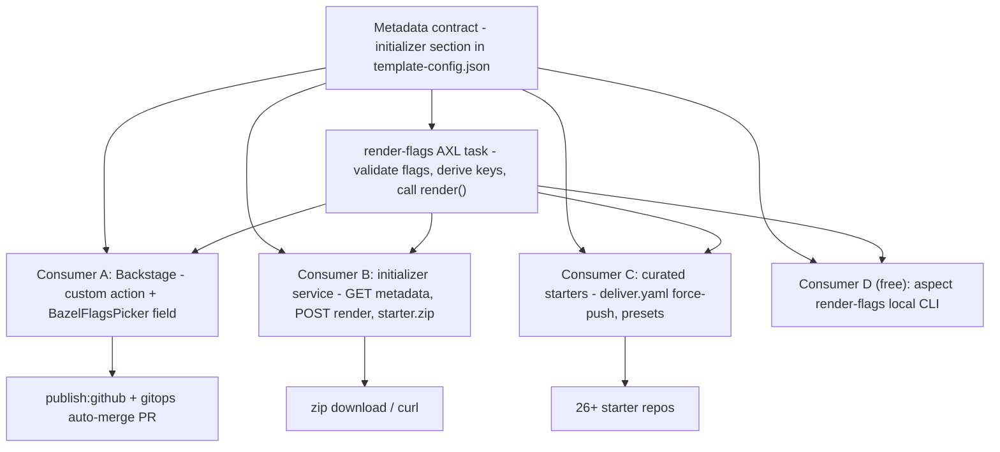

# Universal Initializer — Design

**Date:** 2026-08-18
**Status:** Approved in conversation; awaiting written-spec review
**Branch:** `docs/universal-initializer-spec`
**Requested by:** James Nguyen
**Scope:** Spring-Initializr-class scaffolding for every language `aspect-workflows-template`
supports, exposed through Backstage, a REST service, and curated starter repos — all driven
by one composition core.

This is the initiative's **root spec**. Per-phase implementation plans derive from it
(spec-driven flow, §13), and architecture/technology decisions are recorded as ADRs (§11)
— including ones made after this document lands. Open questions needing James's decision
are consolidated in §12 and referenced inline as `OQ-n`.

## 1. Purpose and success criteria

Today the Backstage Create page offers 13 fixed presets whose only parameters are
name/description/owner. The generator underneath is composable (21 orthogonal flags) but
nothing exposes composition, and a scaffolded project stops at "compiles, tests pass."

Success bar (chosen 2026-08-18): **"deploys itself"** — a scaffolded service, out of the
box:

1. compiles and its tests pass (today's bar);
2. runs a real HTTP service: routing, graceful shutdown, `/healthz` + `/readyz`,
   structured JSON logging, typed config loading;
3. ships observability pre-wired: **OpenTelemetry SDK → OTLP → the platform
   Prometheus/Grafana stack** (open frameworks preferred everywhere — explicit
   requirement);
4. optionally ships a Postgres data layer (client + migrations);
5. deploys itself: OCI image build CI, k8s manifests, ArgoCD Application, image-updater
   wiring — live in the cluster minutes after Create, **with no human gate** (see ADR-007
   for how this respects the merge queue).

Wave-1 languages for the full concern stack: **Go, TypeScript/JS, Python, Java+Kotlin**
(JVM is one track). The other seven languages keep their existing compile+test starters
until a later wave.

## 2. Context: what exists today (verified 2026-08-18)

Facts established by direct inspection of `aspect-workflows-template@platform-v2.0` and
the deployed Backstage (`plugin-scaffolder-backend@4.0.2`, `plugin-scaffolder-node@0.13.6`,
`plugin-scaffolder@1.38.1`, RJSF 5.24.13):

- `template-config.json` declares **21 boolean flags** (11 language, 10 feature) and
  **28 presets** (dicts of flag values, plus two derived non-flag keys: `platforms`,
  `copybara_components`). `rules` is a file-inclusion gate (AND/OR predicates over flags,
  no NOT), `no_render` lists verbatim-copy files, `executable` lists chmod+x globs.
- The renderer is the Aspect CLI's embedded AXL runtime (`render.axl` + minijinja for the
  Jinja conditionals). `render()` **already accepts an arbitrary flags dict**; only the
  CLI task (`aspect render-preset`) is preset-locked. Rendering is pure templating: no
  bazel, no network — but it requires the `aspect` binary (AXL has no standalone
  interpreter).
- **Nothing validates flag combinations.** The 28 presets are the only known-good points,
  enforced socially by CI's per-preset build matrix. A nonsense combo renders silently.
- Post-render normalization (lockfile repin, `bazel mod deps`, gazelle, format, license
  headers) lives in CI/deliver workflows, not the renderer, and needs a full bazel
  toolchain.
- `deliver.yaml` force-pushes all 26 rendered starter repos on every push to
  `platform-v2.0` (curated-matrix delivery already exists and self-heals).
- The `backstage` flag makes the render emit `template.yaml` + a `skeleton/` copy that
  Backstage **re-templates a second time** (Nunjucks `${{ values.* }}`), populated by
  `_populate_skeleton()` in `dev.axl`.
- Backstage scaffolder capabilities (installed versions): custom actions register via
  `scaffolderActionsExtensionPoint` from `@backstage/plugin-scaffolder-node` (main entry,
  not `/alpha`); `ctx.checkpoint` idempotency is GA; a programmatic **dry-run endpoint**
  exists (`POST /api/scaffolder/v2/dry-run`); actions that shell out use
  `executeShellCommand` with the action logger (UI stalls if >60s silent). RJSF
  conditional schemas are effectively broken in Backstage for deep nesting (upstream
  #30090, #7343) — custom field extensions are the sanctioned escape hatch.
- Stale docs warning: `test.sh`, `README.md`, `AGENTS.md`, and the Backstage quick-start
  in the template repo still describe the **removed** `hay-kot/scaffold` engine. Trust
  `render.axl`/`dev.axl`/the workflows.

## 3. Architecture: one foundation, many consumers

Spring Initializr's real shape is one core library + one metadata contract consumed by
several frontends (web UI, `curl` API, `spring init` CLI, IDE wizards). We adopt exactly
that shape (ADR-001):



The foundation (§4) lives in `aspect-workflows-template` — the generator remains the
single source of truth for *what can be composed*; consumers are transports.

## 4. Foundation: the composition core

### 4.1 Metadata contract

Extend `template-config.json` with an `initializer` section (schema-checked in CI;
drift between it and `flags` fails the build):

```jsonc
"initializer": {
  "flags": {
    "go":        { "label": "Go", "category": "language",
                   "description": "Go toolchain, gazelle, ..." },
    "svc_http":  { "label": "HTTP service", "category": "app-concern",
                   "appliesTo": ["go", "javascript", "python", "java", "kotlin"],
                   "requires": [], "conflicts": [] },
    "svc_otel":  { "label": "OpenTelemetry", "category": "app-concern",
                   "requires": ["svc_logging"], ... },
    "oci":       { "label": "Container image", "category": "build-feature", ... }
    // every flag present; categories: language | build-feature | app-concern
  },
  "constraints": [
    { "requires": { "svc_deploy": ["svc_http", "oci"] } },
    { "atLeastOne": ["go","javascript","python","java","kotlin","..."],
      "when": "any app-concern flag" }
  ]
}
```

Everything reads this one section: the Backstage field extension (UI), the service's
`GET /metadata`, `render-flags` validation, and CI's generated test matrix. Presets stay
where they are and become *named points* in the constrained space — the curated,
warranted combos.

### 4.2 `render-flags` task

New AXL task beside `render-preset` (same file, same engine):

```
aspect render-flags --flags '{"go":true,"svc_http":true,...}' \
                    --name my_service --out DIR [--license Apache-2.0]
aspect render-flags --metadata     # print the initializer section (the /metadata analog)
```

Behavior:
1. Parse flags; reject unknown names.
2. **Validate against `initializer.constraints` — fail loudly on violation** (the system
   currently validates nothing; this is the enforcement point every consumer shares).
3. Precompute derived keys exactly as presets do today (`platforms` from `go`,
   `copybara_components`, `copybara_bidi`-style NOT-combinations).
4. Call the existing `render()`; honor `rules` / `no_render` / `executable` unchanged.

`render-preset` becomes a thin wrapper: resolve preset → `render-flags`. One code path.

## 5. Application-concern model (Spring-Boot parity layer)

Concern flags are orthogonal to languages and apply to **every selected wave-1 language**
(ADR-008): a `go + python + svc_http` render scaffolds an HTTP service in each language
directory — consistent with the generator's existing multi-language monorepo model.

| Flag | Wires | Go | TS/JS | Python | JVM |
|---|---|---|---|---|---|
| `svc_http` | server, routing, graceful shutdown, `/healthz` `/readyz` | chi (OQ-6) | Fastify | FastAPI | **Spring Boot** |
| `svc_config` | typed env/file config | koanf | zod-config | pydantic-settings | Spring config |
| `svc_logging` | structured JSON logs | slog | pino | structlog | logback-json |
| `svc_otel` | OTel SDK traces+metrics → OTLP → platform Prometheus/Grafana | OTel-Go | OTel-JS auto-instr | OTel-Py | Spring Boot OTel starter |
| `svc_db_postgres` | Postgres client + migrations (provisioning: OQ-3) | pgx + goose | drizzle | SQLAlchemy + alembic | Spring Data + Flyway |
| `svc_deploy` | rules_oci image, image CI, k8s manifests, ArgoCD Application, image-updater CR (the buzz pattern) | — shared across languages — | | | |

Requires-chains: `svc_otel → svc_logging → svc_config`; `svc_http → svc_config`;
`svc_deploy → svc_http + oci`; every `svc_*` requires ≥1 wave-1 language selected.
JVM track uses **actual Spring Boot** — it *is* the open framework there (ADR-009); the
other tracks replicate its concerns with the era's consensus open libraries. All four
tracks emit the same operational surface (identical endpoint names, OTLP wiring, log
shape) so the deploy bundle and dashboards are language-agnostic.

Templates for each cell live in `template/` behind Jinja conditionals, gated by `rules`
entries — the same mechanism every existing feature uses.

## 6. Consumer A — Backstage (built first)

- **One universal template** (`bazel-custom`) joins the 13 fixed ones (retained, ADR-011 /
  OQ-5). Its form is a single custom field extension, `BazelFlagsPicker`, rendering
  languages/build-features/app-concerns from the metadata contract with live
  `requires`/`conflicts` enforcement (auto-check dependencies, disable conflicts,
  Initializr-style). Rationale for owning the component: upstream RJSF conditional bugs
  (ADR-005).
- **Custom action `vitruvian:bazel:render`** (new backend module, same pattern as our
  auth/permission modules): invokes the **`aspect` binary vendored into the backstage
  image** (ADR-004) via `executeShellCommand`, streaming renderer output to the task log,
  wrapped in `ctx.checkpoint` for idempotent retries. Renders the real tree with real
  values — the `backstage`-flag skeleton double-templating path is **not used** here.
- Template steps: `vitruvian:bazel:render` → `publish:github` (exists, verified) →
  `catalog:register` → *(if `svc_deploy`)* gitops step (§6.1).
- **Normalization**: repin/gazelle/format need bazel — too heavy for the pod. The
  scaffolded repo carries a **one-shot bootstrap workflow** that runs the normalization
  on first push, commits the result, and disables itself (ADR-006). Consequence: repo is
  fully green a few minutes after creation, not at the instant of it.
- **Preview**: "Explore before create" via the scaffolder dry-run endpoint — render the
  file tree for the current flag selection without side effects.

### 6.1 The fully-automatic deploy step (ADR-007)

James chose "fully automatic — no human gate." Implementation: the scaffolder pushes a
branch to `vitruvian-core` adding the ArgoCD Application (+ values file, image-updater
CR — buzz-pattern files) and opens a PR **with auto-merge enabled**. The merge queue
runs the same gates as every change; on green it merges unattended; ArgoCD reconciles;
the service is live minutes after Create with zero human action. The gitops closed loop
and every-change-through-CI invariants stay intact; no merge-queue-bypass credential is
minted. Requires a bot credential with write access to `vitruvian-core` (OQ-1) and a
deploy-target decision (OQ-4).

## 7. Consumer B — initializer service (the start.spring.io analog)

In-cluster HTTP service:

- `GET /metadata` — serves the metadata contract (drives any future frontend/IDE).
- `POST /render` — flags JSON → rendered tree as zip.
- `GET /starter.zip?flags=go,svc_http,svc_otel&name=demo` — the `curl` experience.

Unlike A, the service can carry a full bazel toolchain, so its zips ship **fully
normalized** (no bootstrap workflow needed). Once it exists, A's action may switch from
embedded binary to calling B — same contracts, swappable transport (that switch is its
own ADR when it comes up). Exposure (tailnet-only vs public) is OQ-2.

**Dogfood milestone:** B is itself scaffolded by A (`go + svc_http + svc_otel +
svc_deploy`) — the initializer creating the initializer service is the acceptance test
for the whole program.

## 8. Consumer C — curated starters (absorbed, not replaced)

`deliver.yaml` continues force-pushing starter repos on every generator push. Presets now
read from the metadata section (they are the curated lattice). Each wave-1 language gains
a `<lang>-service` preset — the flagship concern combo — published as a starter repo and
built in CI, keeping a set of guaranteed-green, one-click entry points.

## 9. Testing: what "green" warrants

The constrained space is still exponential; CI cannot build it. Four tiers:

1. **Metadata self-consistency** — unit tests: constraint graph acyclic, `requires`
   targets exist, presets all constraint-valid, schema/flags drift fails CI.
2. **Render smoke over pairwise-sampled valid combos** — render only (no bazel, cheap):
   no Jinja residue, no orphaned references, `executable`/`no_render` honored. Pairwise
   covers every flag-pair interaction, which is where template conditionals actually
   couple (`` etc.).
3. **Full build+test for every curated preset** (existing matrix + new `-service`
   presets) — these remain the only *warranted* combos, same warranty model as Spring
   Initializr (which also doesn't build every dependency combination).
4. **Backstage e2e** — dry-run-based scaffold test in vitruvian-core CI so the
   action/form/renderer contract can't silently drift.

## 10. Rollout

| Phase | Delivers | Depends on |
|---|---|---|
| **P0** | Metadata section, `render-flags` + validation, tiers 1–2 tests | — |
| **P1** | Consumer A over the existing 21 flags (Initializr mechanics live) | P0 |
| **P2** | Concern flags per track: **Go → TS → Python → JVM**; each ships its `-service` preset + CI leg + starter repo | P0; OQ-3, OQ-6 |
| **P3** | `svc_deploy` + fully-automatic gitops step | P2(Go); OQ-1, OQ-4 |
| **P4** | Consumer B, scaffolded by A (dogfood) | P2(Go), P3; OQ-2 |

Each phase gets its own implementation plan (spec-driven, §13). P2 is the bulk of the
program; its four tracks are independent and can be parallelized across sessions/agents.

## 11. Architecture Decision Records

Format: lightweight ADR (context → decision → consequences). Status: **Accepted** =
decided in the 2026-08-18 design session; **Proposed** = recommended, awaiting James.
Future decisions append here (ADR-012+) rather than editing history.

- **ADR-001 (Accepted) — One foundation, many consumers.** A/B/C are transports over one
  composition core + metadata contract, mirroring Spring Initializr. *Consequence:*
  foundation ships first; no consumer forks composition logic.
- **ADR-002 (Accepted) — Metadata lives in `template-config.json`.** The generator repo
  stays the single source of truth for what can be composed; consumers read, never
  redefine. *Consequence:* metadata changes ride the generator's release/deliver flow.
- **ADR-003 (Accepted) — Extend the AXL renderer; do not reimplement.** `render-flags`
  wraps the existing `render()`; validation becomes the shared enforcement point.
  *Consequence:* every consumer needs the `aspect` binary (or something that wraps it) —
  accepted; the alternative (porting minijinja+glob semantics) invites drift.
- **ADR-004 (Accepted) — Consumer A embeds the renderer binary in the backstage image.**
  Rendering is pure templating; ~50MB image cost buys zero new runtime infra.
  *Consequence:* renderer version pinned per image release; later extraction to B is a
  transport swap.
- **ADR-005 (Accepted) — Custom field extension over RJSF conditional schemas.** Upstream
  Backstage/RJSF conditional rendering is broken for our depth (#30090, #7343).
  *Consequence:* we own a React component; constraint logic must also run server-side
  (never trust the form).
- **ADR-006 (Accepted) — Normalization via one-shot bootstrap workflow in the scaffolded
  repo (Consumer A).** Keeps bazel out of the backstage pod. *Consequence:* a repo is
  born ~green-in-minutes, not green-at-birth; Consumer B (which has bazel) normalizes
  server-side and has no such gap.
- **ADR-007 (Accepted) — "Fully automatic" = auto-merge PR through the merge queue.**
  Zero human action, service live in minutes, but gates still run and no bypass
  credential exists. *Consequence:* a red gate blocks a scaffold-deploy exactly like any
  other change — correct behavior, and the failure surfaces in the scaffolder task log.
- **ADR-008 (Proposed) — Concern flags apply to every selected language.** Alternative
  considered: a "primary language" selector applying concerns to one language only.
  Multi-apply matches the generator's monorepo model and avoids a new UI concept.
- **ADR-009 (Part-Accepted) — Framework choices.** Accepted: OpenTelemetry everywhere
  (explicit requirement); Spring Boot for JVM; FastAPI (Python); Fastify (TS). Proposed:
  chi for Go (OQ-6: stdlib `net/http` is the leaner alternative since 1.22's mux).
- **ADR-010 (Accepted) — Warranty model: presets are the only fully-built combos;
  arbitrary combos get constraint validation + pairwise render-smoke.** Same posture as
  Spring Initializr. *Consequence:* an exotic combo can render and still fail its first
  build — the bootstrap workflow surfaces it immediately in the new repo's CI, not
  silently.
- **ADR-011 (Proposed) — Keep the 13 fixed templates after A ships** as one-click
  curated entries alongside the universal template (OQ-5).

## 12. Open questions — decisions needed from James

| # | Question | Needed by | Options / recommendation |
|---|---|---|---|
| **OQ-1** | Bot credential for the gitops auto-merge PR: reuse the buzz-style deploy-key+PAT pattern, or mint a dedicated GitHub App (cleaner audit line, `Integration` actor in the merge-queue ruleset)? | P3 | Recommend GitHub App |
| **OQ-2** | Consumer B exposure: tailnet-internal only, or public at a `vitruviansoftware.dev` domain (rate-limited, unauthenticated like start.spring.io)? | P4 | Recommend internal first, public later |
| **OQ-3** | `svc_db_postgres` provisioning scope: client+migrations only, or also CNPG Cluster manifests in the deploy bundle (vs Neon external per the app-infra boundary)? | P2 (Go DB slice) | Recommend client+migrations first; CNPG manifests as a follow-on flag `svc_db_provision` |
| **OQ-4** | Deploy target for scaffolded services: homelab ArgoCD (buzz pattern — the design's assumption) only, or also the GCP/Cloud Run path (oauth/tabula stage-5 pattern) as a form choice? | P3 | Recommend homelab-only for v1 |
| **OQ-5** | Retire or keep the 13 fixed backstage-* templates once the universal template ships? (ADR-011) | P1 exit | Recommend keep |
| **OQ-6** | Go HTTP framework: chi or stdlib `net/http` (1.22+ mux)? (ADR-009) | P2 (Go) | Recommend chi; stdlib acceptable |

## 13. Process: spec-driven flow for this initiative

1. **This document is the root spec.** Changes to scope/architecture happen here first.
2. **Every phase (P0–P4) gets its own implementation plan** (superpowers writing-plans
   flow) referencing this spec; plans live in `docs/superpowers/plans/`.
3. **Decisions get ADRs** — appended to §11 with date + status, never rewritten. An OQ's
   answer converts it to an ADR.
4. **Cross-repo note:** foundation and concern templates land in
   `aspect-workflows-template`; Consumer A and the gitops step land in `vitruvian-core`;
   this spec (the coordination point) lives in `vitruvian-core`.
5. **Verification discipline:** each phase's plan defines its falsifiable checks up
   front (the tier tests in §9), matching the repo's test-the-real-path norms.
