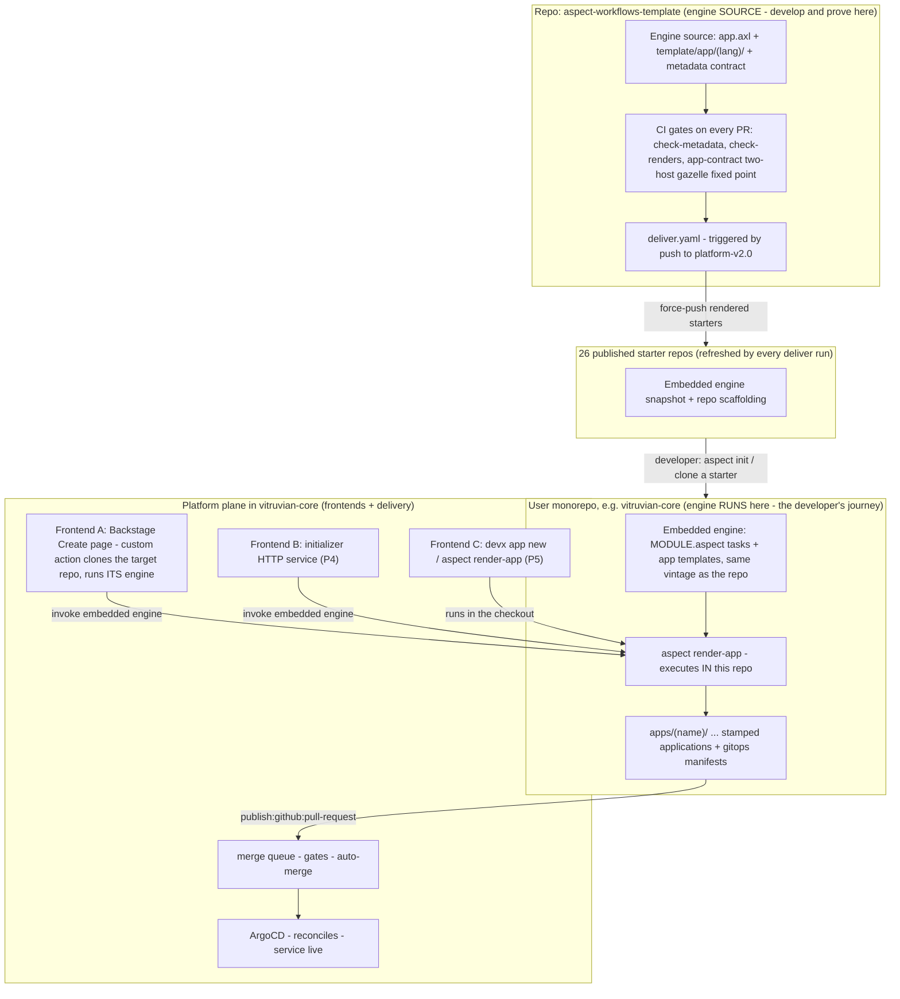
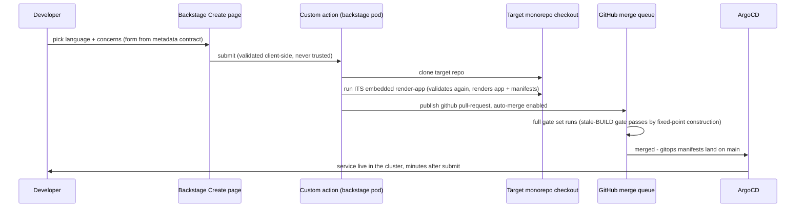

# Application Initializer — Design

**Date:** 2026-08-18 (revised through 2026-08-19, see §14)
**Status:** Approved in conversation; awaiting written-spec review
**Branch:** `docs/universal-initializer-spec`
**Requested by:** James Nguyen
**Scope:** Spring-Initializr-class **application** stamping into existing Bazel monorepos,
for every language `aspect-workflows-template` supports, exposed through Backstage, a REST
service, and a local CLI — all driven by one composition core.

This is the initiative's **root spec**. Per-phase implementation plans derive from it
(spec-driven flow, §13), architecture and technology decisions are recorded as ADRs (§11)
including ones made after this document lands, and decisions needed from James are
consolidated in §12 and referenced inline as `OQ-n`.

## 1. The distinction this initiative rests on

**Repo stamping and application stamping are different products.** Conflating them was the
central error of this spec's first draft (§14).

| | Repo stamping — **exists today** | Application stamping — **this initiative** |
|---|---|---|
| Produces | a brand-new monorepo: Bazel, CI, lint, release tooling, `hello/<lang>` example apps | one application **inside an existing monorepo** |
| Consumed | once, at repo birth | many times, over the repo's whole life |
| Delivered by | the 13 `backstage-*` templates + 26 starter repos, force-pushed by `deliver.yaml` | the initializer described here |
| Spring analogy | — | **this is what start.spring.io does** |

The two compose: stamp a monorepo, then stamp applications into it over time. The existing
13 templates and their skeleton machinery are **not** superseded and are **not** retired
(ADR-011).

Grounding, verified 2026-08-18:

- `vitruvian-core` lays applications out as **top-level directories**, each with its own
  `catalog-info.yaml`: `backstage/`, `devx/`, `homelab/`, `mcp-slack/`, `nexus-agent/`,
  `oauth-user-inspector/`, `tabula/`.
- A rendered starter monorepo contains `MODULE.bazel`, `bazel/`, `tools/`, `.github/`, and
  `hello/{cpp,go,java,js,kotlin,py,ruby,rust,scala,shell,swift}` — toy example apps.

So `hello/<lang>` is the placeholder for what this initializer should generate properly
(ADR-013 proposes unifying the two).

## 2. Purpose and success criteria

Success bar (chosen 2026-08-18): **"deploys itself."** A stamped application, out of the
box:

1. builds and its tests pass **inside the target monorepo**, with Bazel wiring that is
   already correct (BUILD files at gazelle fixed point — §6.3);
2. runs a real HTTP service: routing, graceful shutdown, `/healthz` + `/readyz`,
   structured JSON logging, typed config loading;
3. ships observability pre-wired: **OpenTelemetry SDK → OTLP → the platform
   Prometheus/Grafana stack** (open frameworks preferred everywhere — explicit
   requirement);
4. optionally ships a Postgres data layer (client + migrations);
5. deploys itself: OCI image build, k8s manifests, ArgoCD Application, image-updater
   wiring — live in the cluster minutes after Create, **with no human gate** (ADR-007).

Wave-1 languages for the full concern stack: **Go, TypeScript/JS, Python, Java+Kotlin**
(JVM is one track). Remaining languages get app templates without the concern stack until
a later wave.

## 3. Context: what exists today (verified 2026-08-18)

Established by direct inspection of `aspect-workflows-template@platform-v2.0` and the
deployed Backstage (`plugin-scaffolder-backend@4.0.2`, `plugin-scaffolder-node@0.13.6`,
`plugin-scaffolder@1.38.1`, RJSF 5.24.13):

- `template-config.json` declares **21 boolean flags** (11 language, 10 feature) and **28
  presets** (flag dicts, plus derived non-flag keys `platforms` and
  `copybara_components`). `rules` is a file-inclusion gate (AND/OR over flags, no NOT),
  `no_render` lists verbatim-copy files, `executable` lists chmod+x globs.
- The renderer is the Aspect CLI's embedded AXL runtime (`render.axl` + minijinja).
  `render()` **already accepts an arbitrary flags dict**; only the CLI task
  (`aspect render-preset`) is preset-locked. Rendering is pure templating — no bazel, no
  network — but needs the `aspect` binary (AXL has no standalone interpreter).
- **Nothing validates flag combinations.** The 28 presets are the only known-good points,
  enforced socially by CI's per-preset build matrix.
- Post-render normalization (lockfile repin, `bazel mod deps`, gazelle, format, license
  headers) lives in CI/deliver workflows, not the renderer, and needs a full bazel
  toolchain.
- The `backstage` flag makes a render emit `template.yaml` + a `skeleton/` copy that
  Backstage re-templates with Nunjucks at create time — 83 escaped `${{ '{{' }}` idioms
  across 6 files, populated by `_populate_skeleton()` in `dev.axl`. **This machinery
  serves repo stamping and is retained**; the application initializer does not use it.
- Backstage scaffolder: custom actions register via `scaffolderActionsExtensionPoint` from
  `@backstage/plugin-scaffolder-node` (main entry, not `/alpha`); `ctx.checkpoint`
  idempotency is GA; a programmatic dry-run endpoint exists
  (`POST /api/scaffolder/v2/dry-run`); shell-outs use `executeShellCommand` with the action
  logger (the UI stalls if a step is silent >60s). RJSF conditional schemas are broken in
  Backstage for deep nesting (upstream #30090, #7343) — custom field extensions are the
  sanctioned escape hatch.
- **`publish:github:pull-request` is registered and live** in the deployed action registry
  (confirmed in the running backend's startup log alongside `publish:github`). That is this
  initiative's terminal action — not `publish:github`, which creates repositories.
- Stale-doc warning: `test.sh`, `README.md`, `AGENTS.md` and the template repo's Backstage
  quick-start still describe the **removed** `hay-kot/scaffold` engine. Trust
  `render.axl` / `dev.axl` / the workflows.

## 4. Architecture: one foundation, three frontends, three planes

Spring Initializr is one core library and one metadata contract behind several frontends
(web UI, `curl` API, `spring init` CLI, IDE wizards). We adopt that shape (ADR-001) — with
one deliberate divergence (ADR-026): the engine is not a central service but is **embedded
in every repo it serves**, delivered the way `tools/` and `bazel/` already are.

### 4.1 The three planes and what flows between them



### 4.2 What gets triggered where

| Event | Repo | What runs | Effect |
|---|---|---|---|
| PR to `platform-v2.0` | aspect-workflows-template | `check-metadata`, `check-renders`, `app-contract` (two-host gazelle fixed point), preset matrix | engine change is proven before it can ship |
| Merge to `platform-v2.0` | aspect-workflows-template | `deliver.yaml` | all 26 starter repos force-pushed with fresh renders, embedded engine included (P0.5+) |
| Developer creates a repo | starter repo → their repo | repo stamping (13 Backstage templates / `aspect init`) | new monorepo carrying its own engine snapshot |
| Create page submit / `devx app new` / service call | **target monorepo** | that repo's embedded `render-app` | app rendered; PR opened into the same repo |
| Stamping PR opened | target monorepo (vitruvian-core) | the repo's own merge-queue gates (incl. stale-BUILD) | gazelle fixed point means the PR arrives green |
| Stamping PR auto-merges | vitruvian-core | ArgoCD reconciles the gitops manifests in the same PR | service live, no human gate (ADR-007) |
| Engine bug fixed centrally | aspect-workflows-template → starters | deliver refresh | future repos and refreshed starters healed; existing user repos keep their snapshot (ADR-026 trade) |

### 4.3 The stamp-to-deploy journey (Frontend A, the P1 flow)



The engine executes **in the target repo's context** in every flow; the frontends are
transports plus credentials. `aspect-workflows-template` never participates at stamp time
— it is upstream of the journey, not part of it (ADR-026).

## 5. Foundation: the composition core

### 5.1 Application metadata contract

Extend `template-config.json` with an `app` section (schema-checked in CI; drift fails the
build):

```jsonc
"app": {
  "languages": {
    "go":     { "label": "Go", "wave": 1, "concerns": ["svc_http","svc_config", ...] },
    "python": { "label": "Python", "wave": 1, ... },
    "ruby":   { "label": "Ruby", "wave": 2, "concerns": [] }
  },
  "concerns": {
    "svc_http":   { "label": "HTTP service", "requires": ["svc_config"],
                    "description": "routing, graceful shutdown, health endpoints" },
    "svc_otel":   { "label": "OpenTelemetry", "requires": ["svc_logging"] },
    "svc_deploy": { "label": "Deploy to cluster", "requires": ["svc_http","oci"] }
  },
  "presets": {
    "go-service": { "language": "go",
                    "concerns": ["svc_http","svc_config","svc_logging","svc_otel"] }
  }
}
```

Every consumer reads this one section: the Backstage field extension, the service's
`GET /metadata`, the CLI's `--help`, `render-app` validation, and CI's generated test
matrix.

### 5.2 `render-app` task

New AXL task beside `render-preset`, same engine, same `rules`/`no_render`/`executable`
semantics:

```
aspect render-app --language go --concerns svc_http,svc_otel \
                  --name payments --out DIR [--module-path ...]
aspect render-app --metadata          # print the app section (the /metadata analog)
```

Behavior:

1. Parse language + concerns; reject unknown names.
2. **Validate against the contract — fail loudly on violation.** This is the system's first
   validation of any kind and is shared by every frontend (never trust a form).
3. Render the app template tree (§6.1) for that language/concern combination into
   `out/<name>/`.
4. Emit BUILD files that are already a gazelle fixed point (§6.3).

`render-preset` is untouched; repo stamping keeps its own path.

## 6. The application template asset

### 6.1 A new tree, not the monorepo tree

`template/` is monorepo-shaped (MODULE.bazel, tools/, .github/). Application stamping needs
app-shaped templates, which live at **`template/app/<language>/`** (ADR-024), rendered by
the same engine with the same conditional machinery. `render()` accepts an arbitrary
`template_dir`, so `render-app` points it at one language's subtree.

Two mechanics this depends on, both verified against `render.axl` on 2026-08-18:

- **An exclusion rule is required, not optional.** `is_included` includes any path matched
  by no rule, so without a gate `template/app/**` would be emitted into every stamped
  monorepo. One entry, `{"flag": "app_template", "globs": ["app/**"]}`, excludes it: an
  undeclared flag reads as false (`flags.get(name, False)`), so no preset needs editing.
- **App templates need their own `rules`/`no_render`/`executable`.** Globs are relative to
  whichever `template_dir` is passed — `cmd/**` for `render-app`, `app/go/cmd/**` for repo
  stamping — so one shared array cannot serve both. The `app` section carries its own,
  which also keeps two products' inclusion logic from entangling.

ADR-013's unification now costs little: `hello/<lang>` and the app templates sit in one
tree, so deriving one from the other is a path question rather than a cross-tree sync.

### 6.2 Application concerns (Spring-Boot-parity layer)

An application is **one language** (ADR-008), so concerns compose within a single track:

| Concern | Wires | Go | TS/JS | Python | JVM |
|---|---|---|---|---|---|
| `svc_http` | server, routing, graceful shutdown, `/healthz` `/readyz` | chi, or gin / stdlib `net/http` (ADR-022) | Fastify | FastAPI | **Spring Boot** |
| `svc_config` | typed env/file config | koanf | zod-config | pydantic-settings | Spring config |
| `svc_logging` | structured JSON logs | slog | pino | structlog | logback-json |
| `svc_otel` | OTel SDK traces + metrics → OTLP → platform Prometheus/Grafana | OTel-Go | OTel-JS auto-instr | OTel-Py | Spring Boot OTel starter |
| `svc_db_postgres` | Postgres client + migrations **and provisioning**, provider chosen per deploy target (ADR-020, ADR-023) | pgx + goose | drizzle | SQLAlchemy + alembic | Spring Data + Flyway |
| `svc_deploy` | rules_oci image, image-build CI, k8s manifests, ArgoCD Application, image-updater CR (the buzz pattern) | — language-agnostic — | | | |

Requires-chains: `svc_http → svc_config`; `svc_otel → svc_logging → svc_config`;
`svc_deploy → svc_http + oci`; `svc_db_postgres → svc_config`. The database *provider* is
a selectable dimension keyed by deploy target, not a boolean (ADR-023). The JVM track uses **actual Spring Boot** — it *is* the open
framework there (ADR-009); the other tracks replicate its concerns with consensus open
libraries. All four emit the same operational surface (identical endpoint names, OTLP
wiring, log shape) so the deploy bundle and dashboards stay language-agnostic.

### 6.3 Bazel integration — the hard part

"Wire up Bazel so it works well in our monorepo" is the core engineering problem, and it
has two halves:

**BUILD files.** The renderer knows exactly which files it emits, so app templates emit
BUILD files that are **already what gazelle would generate**. This is testable: a tier-2
check renders an app into a real monorepo and asserts `gazelle` is a no-op (fixed point).
Without this the first PR fails the repo's stale-BUILD gate, which already exists.

**Toolchain gaps.** A monorepo can only build languages its `MODULE.bazel` sets up.
Stamping a Rust app into a Go-only starter repo needs `rules_rust`, a crate lockfile,
toolchain registration and gazelle configuration — none of which exist there, so the
stamped app cannot build until someone adds them. Adding them is a surgical edit to a
hand-maintained file the initializer does not own.

**This does not arise for `vitruvian-core`**, which already declares every toolchain
(`rules_go`, `rules_python`, `rules_rust`, `rules_jvm_external`, `rules_kotlin`,
`rules_scala`, `rules_swift`, `rules_ruby`, `rules_cc`, `rules_nodejs`, `rules_oci`, …
verified 2026-08-18). It arises only for narrow starter-derived monorepos, i.e. only once
ADR-015's "choose another repo" is pointed at one.

The initializer **discloses the gap and includes the onboarding edits in the same
reviewable PR** (ADR-019): the frontend states, before submission, which toolchain the
target lacks and that the stamp will add it; the `MODULE.bazel` edit, lockfile and gazelle
configuration land as clearly-separated commits in the same PR the application arrives in.
Nothing is mutated silently, and the target repository's own merge-queue gates are what
verify the onboarding — the same gates that verify any other change to that file.

## 7. Frontend A — Backstage (built first)

- **One template**, `stamp-application`, alongside the 13 repo-stamping templates. Its form
  is a custom field extension, `AppInitializerPicker`, rendering language + concerns from
  the metadata contract with live `requires`/`conflicts` enforcement (ADR-005).
- **Form parameters**: target monorepo (ADR-015, defaulting to `vitruvian-core`),
  application name, owner, language, concerns, and an optional path override (ADR-014).
- **Custom action `vitruvian:app:render`** (new backend module, same pattern as our
  auth/permission modules): invokes the `aspect` binary vendored into the backstage image
  (ADR-004, delivery half revised by ADR-026) via `executeShellCommand`, streaming output
  to the task log, wrapped in `ctx.checkpoint` for idempotent retries. The engine it runs
  is **the target repository's own embedded initializer** (ADR-026) — the action clones the
  target (needed for the PR anyway) and runs `aspect render-app` from that checkout, so
  engine and repo are the same vintage by construction.
- **Steps**: clone/fetch target repo → its embedded `render-app` → *(if `svc_deploy`)* add
  gitops manifests → `publish:github:pull-request` → `catalog:register` for the new
  `catalog-info.yaml`.
- **Preview**: "Explore before create" via the scaffolder dry-run endpoint — see the file
  tree for the current selection with no side effects.

### 7.1 The fully-automatic deploy step (ADR-007)

James chose "fully automatic — no human gate." Because the application and its gitops
manifests live in the **same repository** for `vitruvian-core`, this is a **single PR**
with auto-merge enabled: the merge queue runs the normal gates, merges unattended on green,
ArgoCD reconciles, and the service is live minutes after Create with zero human action. The
gitops closed loop and every-change-through-CI invariants hold, and no merge-queue-bypass
credential is minted. A red gate blocks the deploy exactly as it would any other change —
correct behavior, surfaced in the scaffolder task log.

## 8. Frontend B — initializer HTTP service

In-cluster service, the start.spring.io analog:

- `GET /metadata` — serves the contract (drives any future frontend or IDE plugin).
- `POST /render` — language + concerns → app subtree.
- `GET /starter.zip?language=go&concerns=svc_http,svc_otel&name=payments` — the `curl`
  experience.

Unlike A it can carry a full bazel toolchain, so it can validate the rendered app builds
before returning. It offers all three output shapes for a subtree, defaulting to
**PR-on-request** (ADR-016). Once it exists, A may switch from embedded binary to calling
B — same contracts, swappable transport.

**Dogfood milestone:** B is itself stamped by A into `vitruvian-core`
(`go + svc_http + svc_otel + svc_deploy`) — the initializer creating the initializer service
is the acceptance test for the whole program.

## 9. Frontend C — local CLI

A developer standing in a monorepo runs one command and the application appears in the
working tree, correctly wired, with no Backstage and no network round-trip. This is
Initializr's `spring init`, and it is the frontend most likely to get daily use.

Shipped on **both** hosts (ADR-017): `aspect init-app` as a task in the template repo, and
`devx app new` as a subcommand of the platform CLI. Both are thin wrappers over the same
`render-app` core, so neither owns composition logic. Because the CLI runs on a developer
machine with bazel available, it can run gazelle and repin immediately — the one frontend
with no fixed-point caveat.

## 10. Testing: what "green" warrants

The valid space is exponential; CI cannot build it. Four tiers:

1. **Metadata self-consistency** — constraint graph acyclic, `requires` targets exist,
   presets valid, contract/flags drift fails CI.
2. **Render smoke over pairwise-sampled valid combinations** — render only, no bazel: no
   Jinja residue, no orphaned references, `executable`/`no_render` honored. Pairwise covers
   every concern-pair interaction, which is where template conditionals actually couple.
3. **Build + test for every app preset, stamped into a real monorepo** — including the
   gazelle fixed-point assertion (§6.3). These are the only **warranted** combinations,
   the same warranty model Spring Initializr uses.
4. **Backstage e2e** — dry-run-based stamp test in vitruvian-core CI so the
   action/form/renderer contract cannot silently drift.

## 11. Architecture Decision Records

Lightweight ADRs (context → decision → consequences). **Accepted** = decided in the
2026-08-18 sessions; **Proposed** = recommended, awaiting James. Later decisions append
(ADR-014+) rather than rewriting history; an answered OQ converts into an ADR.

- **ADR-001 (Accepted) — One foundation, several frontends.** A/B/C are transports over one
  composition core and metadata contract, mirroring Spring Initializr. *Consequence:*
  foundation ships first; no frontend forks composition logic.
- **ADR-002 (Accepted) — Metadata lives in `template-config.json`.** The generator repo
  stays the single source of truth; frontends read, never redefine.
- **ADR-003 (Accepted) — Extend the AXL renderer; do not reimplement.** `render-app` reuses
  the existing engine, and validation becomes the shared enforcement point. *Consequence:*
  every frontend needs the `aspect` binary — accepted; porting minijinja and the glob
  semantics would invite drift.
- **ADR-004 (Accepted; delivery half superseded by ADR-026) — Frontend A embeds the renderer binary in the backstage image.**
  Rendering is pure templating; ~50MB buys zero new runtime infrastructure.
  *Consequence:* renderer version pins to image releases; later extraction to B is a
  transport swap.
- **ADR-005 (Accepted) — Custom field extension over RJSF conditional schemas.** Upstream
  conditional rendering is broken at our depth (#30090, #7343). *Consequence:* we own a
  React component, and constraint logic must also run server-side.
- **ADR-006 (Accepted) — Frontend A does not run bazel.** Normalization that needs a
  toolchain is handled by emitting gazelle-fixed-point BUILD files (§6.3) and, where that
  is insufficient, by the target repo's own CI on the stamping PR. *Consequence:* the PR is
  the verification point, which is where the repo's gates already live.
- **ADR-007 (Accepted) — "Fully automatic" = auto-merge PR through the merge queue.** Zero
  human action, live in minutes, gates still run, no bypass credential.
- **ADR-008 (Accepted, revised) — An application is one language.** The first draft applied
  concerns to every selected language, an artifact of conflating repo and app stamping.
  Multi-language monorepos are composed by stamping several applications.
- **ADR-009 (Part-Accepted) — Framework choices.** Accepted: OpenTelemetry everywhere
  (explicit requirement); Spring Boot for JVM; FastAPI for Python; Fastify for TS.
  Go framework settled separately in ADR-022.
- **ADR-010 (Accepted) — Warranty model.** App presets are the fully-built combinations;
  arbitrary combinations get constraint validation plus pairwise render-smoke.
  *Consequence:* an exotic combination can render and still fail its first build — surfaced
  immediately by the stamping PR's CI, not silently.
- **ADR-011 (Accepted) — Repo stamping is retained, untouched.** The 13 `backstage-*`
  templates, the 26 starter repos, the `backstage` flag, `skeleton/`,
  `_populate_skeleton()` and the 83 Nunjucks escapes all serve a different product (§1) and
  are not superseded by this initiative. *Resolves OQ-5.*
- **ADR-012 (Superseded by ADR-019) — Toolchain-gap behaviour.** The first draft proposed
  refusing outright. Superseded: the initializer discloses and includes instead.
- **ADR-019 (Accepted) — On a toolchain gap: disclose, then include the onboarding in the
  same PR.** Chosen by James 2026-08-18, option (c) of the reworded OQ-9. The frontend
  states before submission which toolchain the target repository lacks and that stamping
  will add it; the `MODULE.bazel` edit, lockfile and gazelle configuration land as separate
  commits in the same PR. Rejected: refusing outright (a dead end the user must resolve
  elsewhere) and onboarding silently (a bad edit to a shared file breaks the build for
  everyone in that repository, not just the new application). *Consequence:* the
  initializer does write to a file it does not own — mitigated by disclosure, commit
  separation, and the target repository's merge-queue gates, which are the same gates any
  hand-written `MODULE.bazel` change passes through.
- **ADR-020 (Accepted) — `svc_db_postgres` provisions the database, not just the client.**
  Chosen by James 2026-08-18: client plus migrations **plus** provisioning. On the homelab
  target that means CNPG `Cluster` manifests in the deploy bundle. *Consequences worth
  naming:* a stamped application then owns a database's lifecycle, so the bundle must carry
  backup and storage settings rather than defaults; and CNPG does not exist on the Cloud Run
  target (ADR-021), so the provider varies with the target — settled in ADR-023.
- **ADR-023 (Accepted) — The database provider is a selectable dimension keyed by deploy
  target.** Chosen by James 2026-08-18: homelab → CNPG; Cloud Run → **Cloud SQL for
  Postgres by default, Neon offered**; further cloud and SaaS providers added later.
  *Consequence for the model:* provider is therefore not a boolean but an enumeration whose
  valid values depend on the chosen target, and the metadata contract must express that
  from the start — retrofitting a dimension into a boolean is the expensive version of this
  change. *Consequences worth naming:* Cloud SQL is provisioned Pulumi-side in the
  application's own `infrastructure/` stack, which matches the platform's boundary rule
  that each application owns its Cloud Run workload and infrastructure while the foundation
  stage stays scaffolding-only, and it needs the deploy identity that stage-4
  `gcp-projects` issues; it also costs real money per instance, so a stamped application
  provisioning one is a spend decision the form should surface rather than bury. Neon, by
  contrast, is external — no Pulumi surface, a connection string as a sealed secret, and
  the lineage `tabula` and `oauth-user-inspector` already prove.
- **ADR-021 (Accepted) — Deploy target defaults to homelab ArgoCD, with Cloud Run
  offered.** Chosen by James 2026-08-18. *Consequence:* two deploy bundles to template and
  keep working — the buzz pattern (image, manifests, ArgoCD Application, image-updater CR)
  and the stage-5 Cloud Run pattern (oauth-user-inspector / tabula lineage, deploy identity
  issued by stage-4 `gcp-projects`). They differ in more than YAML: identity, image
  registry, and the database story all change with the target, which is what OQ-13 exists
  to settle.
- **ADR-022 (Accepted) — Go HTTP: chi by default, gin and stdlib `net/http` offered.**
  Chosen by James 2026-08-18. *Consequence:* the Go track carries three server
  implementations, so every HTTP-touching concern (`svc_http` routing and health endpoints,
  `svc_otel` middleware, `svc_db_postgres` handler wiring) is written and tested three
  times. The mitigation is a hard rule: all three must expose an identical operational
  surface — same endpoint paths, same log shape, same OTLP wiring — so nothing downstream
  of the application can tell which was chosen. Tier-3 warranty (§10) therefore builds all
  three Go variants, not one.
- **ADR-014 (Accepted) — Applications default to `apps/<name>/`, and the path is
  overridable.** Chosen by James 2026-08-18. *Consequence, stated plainly:* `vitruvian-core`
  currently keeps applications as top-level directories (`backstage/`, `devx/`, `tabula/`
  …), so its first stamped application introduces an `apps/` directory and the repo will
  carry two layouts. That is accepted — existing applications are not migrated — and the
  override exists precisely so a repo can pin whichever convention it prefers. A per-repo
  default is the natural later refinement.
- **ADR-015 (Accepted) — Target repository defaults to the one in hand, and is
  selectable.** Chosen by James 2026-08-18. For Frontend C "the one in hand" is the
  monorepo the CLI is run inside; for Frontends A and B there is no ambient repo, so the
  default is `vitruvian-core` and the field offers the other valid targets. *Consequence:*
  "valid target" needs a definition — a repo with a `MODULE.bazel` and our tooling markers
  — and the toolchain-gap question (OQ-9) becomes reachable as soon as a narrow repo is
  selected.
- **ADR-016 (Accepted) — Frontend B offers zip, git patch and PR-on-request, defaulting to
  PR-on-request.** Chosen by James 2026-08-18. *Consequence:* B needs the same repository
  write credential as A for its default path (ADR-018); the zip and patch modes stay
  credential-free, which keeps a pure `curl` experience available.
- **ADR-017 (Accepted) — The CLI ships on both `aspect` and `devx`.** Chosen by James
  2026-08-18. `aspect init-app` serves anyone holding a starter monorepo without the
  platform CLI; `devx app new` serves platform engineers where the rest of the workflow
  already lives. Both are thin wrappers over `render-app` (ADR-003), so the duplication is
  surface, not logic. *Consequence:* `devx` shells out to the `aspect` binary exactly as
  Frontend A does, and the copybara export of `devx` carries the subcommand to the mirror.
- **ADR-018 (Accepted) — Reuse `backstage-github-token` by default; a GitHub App is an
  option.** Chosen by James 2026-08-18. The sealed token already holds repository
  Administration write (verified 2026-08-18 by a non-mutating probe returning 422 rather
  than 403), so it can open the stamping PR with no new credential. *Consequence:* PRs are
  authored by the token's identity rather than a named app, so the audit line is thinner;
  minting a GitHub App later is a drop-in swap behind the same action.
- **ADR-024 (Accepted) — App templates live at `template/app/<language>/`.** Proposed by
  James 2026-08-18, in preference to a sibling `app-template/` tree. Keeps one tree and one
  renderer, and makes ADR-013 cheap. *Consequence:* the exclusion rule in §6.1 is
  load-bearing — omit it and every stamped monorepo silently gains an `app/` directory,
  which would surface as mysterious files in 26 starter repos rather than as an error.
- **ADR-025 (Accepted) — Tiers 1 and 2 run as AXL check-tasks in the template repo.**
  `aspect check-metadata` and `aspect check-renders`, invoked by CI. Rationale: the repo has
  **no test harness at all** today — CI verifies the renderer only indirectly by rendering
  each preset and building the result — and no root build system to host one (`docs/`,
  `infrastructure/`, `template/`, `user_stories/`). `aspect test` is the task for testing a
  rendered Bazel workspace, not a unit-test harness. AXL already has the JSON and fs
  primitives these checks need, so this adds no toolchain. *Consequence:* the checks are
  written in Starlark, which has no recursion and no `while` — the same constraint
  `render.axl` already works around with worklists.
- **ADR-026 (Accepted, 2026-08-19) — The engine embeds in every starter repo; runtime is
  fully decoupled from `aspect-workflows-template`.** Proposed by James: the developer's
  journey starts in their own repo, so the initializer must live there, like `tools/` and
  `bazel/` already do. Mechanics verified before accepting: descendants already carry their
  own `MODULE.aspect` with `use_task` (vitruvian-core does today) and `.aspect/*.axl`, so
  embedding tasks is the existing extension surface. The engine (`app.axl`, app templates,
  check tasks) moves into `template/` and renders into every starter; embedded app
  templates ride the repo-level `no_render` list so their `{{ }}` placeholders survive repo
  stamping verbatim — no return of the escaping idiom. *What this dissolves:* the
  pinned-vs-floating template-repo ref question for the frontends (there is no ref — the
  engine is local); much of the `--host-oci` runtime probe (templates can be specialized at
  repo-stamp time to the host's actual features); and it makes the initializer
  **user-extensible per repo** — teams add their own concerns to their own templates, which
  a central engine could never safely allow. *The trade, stated:* engine development stays
  in `aspect-workflows-template` (fix once), delivery is embedding — the 26 published
  starters refresh on every `deliver.yaml` push, but user-created repos own their snapshot
  and do not heal, the same ownership trade already accepted for stamped applications.
  *Consequences:* ADR-004's delivery half is superseded (the backstage image still vendors
  the `aspect` binary, but fetches no template repo); ADR-015's "valid target" gains its
  real definition — a repository carrying an embedded initializer; the two-host
  fixed-point CI gate stays in `aspect-workflows-template` as the pre-ship proof.
- **ADR-013 (Proposed) — Derive `hello/<lang>` from the app templates.** Repo stamping would
  render its example apps from the same source the initializer uses, so the two cannot
  drift and every app template is exercised inside a real monorepo on every CI run.

## 12. Open questions

**None. Every question raised during design is resolved.**

2026-08-18: OQ-5 → ADR-011, OQ-7 → ADR-014, OQ-8 → ADR-015, OQ-10 → ADR-016,
OQ-11 → ADR-017, OQ-12 → ADR-018, OQ-9 → ADR-019, OQ-3 → ADR-020, OQ-4 → ADR-021,
OQ-6 → ADR-022, OQ-13 → ADR-023. OQ-1 was dissolved by the repo→app correction
(application and gitops manifests share a repository, so one same-repo PR replaces the
cross-repo write); OQ-2 was dropped with the Frontend B rescope.

New questions are expected to surface during implementation. They belong here first, then
convert to ADRs in §11 once decided — the same loop this section has already run five
times.

## 13. Rollout

| Phase | Delivers | Depends on |
|---|---|---|
| **P0** | App metadata contract, `render-app` + validation, **the base Go app template**, tiers 1–2 as AXL check-tasks; **P0.5**: embed the engine into `template/` so every starter ships it (ADR-026) | — |
| **P1** | Frontend A: stamp an application into `vitruvian-core` (no concerns yet) — the mechanism, end to end | P0 |
| **P2** | Concern stack per track: **Go → TS → Python → JVM**; each ships its base app template (Go's arrives in P0), app preset, CI leg, and tier-3 build (three Go HTTP variants, ADR-022) | P0 |
| **P3** | `svc_deploy` (homelab bundle, then Cloud Run) and the fully-automatic single-PR deploy | P2 (Go) |
| **P4** | Frontend B, itself stamped by A (dogfood) | P2 (Go), P3 |
| **P5** | Frontend C, the local CLI on both `aspect` and `devx` | P0 |

Each phase gets its own implementation plan. P2 is the bulk of the program and its four
tracks are independent, so they can run in parallel across sessions.

## 14. Process, and this document's revision history

1. **This document is the root spec.** Scope and architecture changes land here first.
2. **Every phase gets its own implementation plan** (superpowers writing-plans flow) in
   `docs/superpowers/plans/`, referencing this spec.
3. **Decisions get ADRs** — appended to §11 with date and status, never rewritten.
4. **Cross-repo note:** the metadata contract, `render-app`, and app templates land in
   `aspect-workflows-template`; Frontend A and the gitops wiring land in `vitruvian-core`;
   this spec, the coordination point, lives in `vitruvian-core`.
5. **Verification discipline:** each plan defines falsifiable checks up front (§10),
   matching the repo's test-the-real-path norms.

**Revision 2026-08-19g — the engine embeds in the starter repos (ADR-026).** During P0
James redirected the delivery model: the initializer lives in each generated repo,
decoupled at runtime from the template repo, because that is where the developer's journey
is. Accepted after verifying the extension mechanics already exist. This dissolves the
frontend version-pinning question, most of the `--host-oci` probe, and makes the
initializer user-extensible per repo; the cost is that user-created repos own their
snapshot of the engine and do not heal — the ownership trade this design already accepts
for stamped applications. P0's engine logic (merged as aspect-workflows-template #44) is
unchanged; the embedding is P0.5, a packaging move.

**Revision 2026-08-18f — two gaps found while preparing the P0 plan.** Writing an
implementation plan surfaced what the design had left implicit. First, **P0 had nothing to
render**: no app-template tree exists, and the rollout assigned the *base* app template to
no phase at all — P1 assumed one, P2 covered only concerns. The base Go template moves into
P0, which also makes the phase demonstrable end to end, including the gazelle fixed-point
assertion that is the highest-value test in the program. Second, **the test tiers had no
runner**: the repo has no test harness and no root build system, and CI exercises the
renderer only indirectly by rendering each preset and building it. Resolved as ADR-025.
James also placed the app templates at `template/app/<language>/` (ADR-024) rather than a
sibling tree — better, and it makes ADR-013 nearly free, at the cost of one exclusion rule
that is load-bearing: without it every stamped monorepo silently gains an `app/` directory.

 James settled
OQ-13: on the Cloud Run target, Cloud SQL for Postgres by default with Neon offered, and
further providers added later (ADR-023). "Added later" is the load-bearing half of that
answer — it makes the provider an enumeration keyed by deploy target rather than a boolean,
and the metadata contract has to express that from P0, because retrofitting a dimension
into a boolean is the expensive version of this change. Two consequences are named rather
than discovered later: Cloud SQL is provisioned in the application's own `infrastructure/`
Pulumi stack, matching the platform rule that an application owns its Cloud Run workload
and infrastructure while the foundation stage stays scaffolding-only; and it costs real
money per instance, so the form should surface that rather than bury it. No open questions
remain, and no phase is blocked.

**Revision 2026-08-18d — the last four questions answered; the design is decided.** James
chose disclose-and-include on a toolchain gap (ADR-019), database provisioning alongside
client and migrations (ADR-020), homelab ArgoCD by default with Cloud Run offered
(ADR-021), and chi by default with gin and stdlib `net/http` offered (ADR-022). Two of
these widen the build materially and the spec says so rather than letting it surface during
implementation: three Go server implementations means every HTTP-touching concern is
written and tested three times, held together by a rule that all three expose an identical
operational surface; and provisioning means a stamped application owns a database's
lifecycle, so its bundle carries backup and storage settings rather than defaults. Those
two answers also collide — CNPG cannot provision on Cloud Run — which is recorded as OQ-13
rather than quietly assumed, with provisioning constrained to the homelab target until it
is settled. No open question now blocks P0, P1 or P2.

**Revision 2026-08-18c — five open questions answered.** James decided: applications
default to `apps/<name>/` with an overridable path (ADR-014); the target repository defaults
to the one in hand and is selectable (ADR-015); Frontend B offers zip, patch and
PR-on-request, defaulting to PR-on-request (ADR-016); the CLI ships on both `aspect` and
`devx` (ADR-017); the stamping PR reuses `backstage-github-token` with a GitHub App as an
option (ADR-018). A consistent principle runs through all five — a sensible default, every
alternative still reachable — and it is now also the recommendation for the one question
left open. OQ-9 was rewritten because James could not tell what it was asking; the reworded
version names the concrete failure (a Rust app stamped into a Go-only repo cannot build),
records that it never arises for `vitruvian-core` since that repo already declares every
toolchain, and adds a third option — disclose the gap and include the onboarding edits in
the same reviewable PR — which fits the same principle. P1 is no longer gated on any open
question.

**Revision 2026-08-18b — repo stamping vs application stamping.** The first draft designed
the initializer to create new repositories via `publish:github`. That is repo stamping,
which the 13 existing templates already do. James corrected the framing: this initiative
stamps **applications into existing monorepos**, and must wire Bazel so the result works in
that monorepo. Consequences: the terminal action became
`publish:github:pull-request`; a new app-template asset replaced the monorepo-shaped tree;
ADR-008 inverted (one language per app, a simplification); the gitops step collapsed to a
single same-repo PR; Frontend C changed from "curated starters" (which are repo stamping,
not a frontend of this core) to a local CLI, matching Initializr's actual third frontend;
and OQ-5 resolved to ADR-011.
