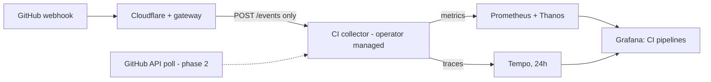

# CI pipeline telemetry: the first job for the OpenTelemetry operator

> **Status:** Proposed (spec for review)
> **Date:** 2026-09-28
> **Owner:** platform
> **Related:** #2562 (operator 0.159), #2565 (operator NetworkPolicy fix),
> `gitops/argocd/platform/opentelemetry-collector/` (the existing collector)

## 1. What we want

**Now:** see how the GitHub Actions pipelines of `VitruvianSoftware/vitruvian-core`
perform, in this priority order:

1. **Speed.** How long runs take, how long they wait for a runner, and which
   jobs and steps are slowest and getting slower.
2. **Reliability.** Failure rate per workflow and job, and how often runs need
   a retry (a flakiness signal).
3. **Delivery flow.** Time from PR opened to merged, merge-queue time to green,
   open PRs and merges per week.

**Later:** homelab applications send their traces and metrics through the same
OpenTelemetry operator, using the same pattern set up here.

**Success:** a Grafana dashboard answers the questions above from real data,
without anyone collecting it by hand, and the operator runs a real workload
that apps can copy.

## 2. What exists today (verified 2026-09-28)

- The OpenTelemetry operator runs (0.159.0, chart 0.123.1, 2 replicas) but
  manages nothing: there are no `OpenTelemetryCollector` or `Instrumentation`
  resources in the repo or on the cluster.
- A separate collector, installed from its own Helm chart
  (contrib 0.160.0), takes OTLP and sends traces to Tempo and metrics to both
  Prometheus replicas by remote-write. It also turns spans into metrics with
  custom labels (`host.name`, `model.name`, `tool.name`).
- **Tempo keeps traces for 24 hours** (`block_retention: 24h`). Long-term
  trends must therefore come from metrics, which Prometheus/Thanos keep.
- Public traffic reaches the cluster through a Cloudflare tunnel, then the
  Envoy gateway `platform`, then one `HTTPRoute` + `DNSEndpoint` per hostname
  (ntfy is the reference pattern).
- Cluster secrets are SealedSecrets (38 of them). Repository settings are
  managed by the Pulumi program `infrastructure/pulumi/platform/repo-config`,
  which reads secret values from CI environment variables.
- The repo has no webhooks today.
- The collector image already includes the GitHub receiver (alpha). It turns
  `workflow_run` and `workflow_job` webhook events into traces, and can also
  poll GitHub's API for repository delivery metrics.

## 3. Design

### 3.1 Parts and data flow

- **CI collector.** One `OpenTelemetryCollector` resource, `mode: deployment`,
  in a new `cicd-telemetry` namespace. Same image as the existing collector
  (`otel/opentelemetry-collector-contrib`, 0.160.0). Two replicas, required
  anti-affinity across nodes, a PodDisruptionBudget of `minAvailable: 1`,
  wired-node selector like the operator.
- **It sends straight to Tempo and Prometheus**, not through the existing
  collector. That avoids the existing collector's span-to-metrics step
  producing a second, differently-labelled set of CI metrics.
- **Why a separate collector (approach A):** it is the only internet-facing
  telemetry component, so it is isolated from the internal collector that
  everything else depends on, and it is the template for app collectors later
  (one collector resource per purpose).

### 3.2 Collector pipeline

**Receiver:** `github` with `webhook` (endpoint `0.0.0.0:19418`, path
`/events`, health path `/health`, `service_name: github-actions`,
`secret: ${env:GITHUB_WEBHOOK_SECRET}`, `include_span_events: false`). The
receiver requires a scraper block to validate; phase 1 sets a minimal one
with collection disabled, or the smallest valid config, confirmed at build
time against 0.160.0.

**What the receiver emits** (read from its source at v0.160.0):

| span | name | kind | key attributes |
|---|---|---|---|
| run | workflow name | SERVER | `cicd.pipeline.name`, `cicd.pipeline.run.status`, `vcs.ref.head`, `cicd.pipeline.run.url.full`, `cicd.pipeline.run.previous_attempt.url.full` |
| job | job name | INTERNAL | `cicd.pipeline.run.task.status` |
| step | step name | INTERNAL | `cicd.pipeline.task.name`, task status |
| queue | `queue-<job>` | INTERNAL | `cicd.pipeline.run.queue.duration` |

Status code is `Ok` for success, `Error` for failure, `Unset` otherwise.

**Processors, in order:**

1. `memory_limiter`.
2. `resource`/`attributes`: **delete** `vcs.ref.head.revision.author.name` and
   `vcs.ref.head.revision.author.email` (personal data we have no need for).
3. `transform` adds two low-cardinality labels:
   - `ci.trigger`: `merge_queue` when `vcs.ref.head` starts with
     `gh-readonly-queue/`, `main` when it is `main`, `branch` for anything else.
     The events don't say whether a branch has a PR, so `branch` means "PR or
     other branch run" (in this repo almost always a PR). This avoids one
     metric series per branch.
   - `ci.span.type`: `run` (SERVER kind), `queue` (name starts `queue-`),
     `step` (has `cicd.pipeline.task.name`), else `job`.
   - `ci.retry`: `true` when `cicd.pipeline.run.previous_attempt.url.full` is
     set.
4. `batch`.

**Connector:** `spanmetrics`, dimensions `cicd.pipeline.name`, `ci.span.type`,
`ci.trigger`, `ci.retry` (plus the connector's built-in span name and status
code). Histogram buckets sized for CI: 5s, 15s, 30s, 1m, 2m, 5m, 10m, 20m,
40m, 60m, 120m.

**Exporters:** `otlp` to `tempo.opentelemetry.svc.cluster.local:4317` (traces, TLS off inside the cluster, as the existing collector does);
`prometheusremotewrite` to **both** Prometheus replicas via their per-pod
headless DNS names, copying the existing collector (so Thanos can de-duplicate).

### 3.3 Dashboard

One JSON dashboard, `gitops/argocd/platform/grafana-dashboards/ci-pipelines.json`,
with filters for workflow and trigger.

| row | panels | source |
|---|---|---|
| Speed | run time p50/p95 per workflow (trend); runner wait p95 vs run time; slowest jobs top 10 + trend; slowest steps top 10; merge-queue time to green | metrics |
| Reliability | failure rate per workflow; failing jobs top 10; re-run rate; recent failures with links to the run | metrics; last row from Tempo (24h) |
| Delivery flow (phase 2) | PR open to merge p50/p95; open PRs count + age; merged per week | GitHub API poll |

Not included: per-step logs (GitHub has them), runner cost (not in the events),
backfill of runs before switch-on.

### 3.4 Security and secrets

- **Public surface:** hostname `github-otel.ipv1337.dev`, Cloudflare-proxied,
  routed through the `platform` gateway. The `HTTPRoute` matches **only**
  `POST /events` (exact path) to the collector's webhook port. The health port,
  metrics port and OTLP ports are not routed.
- **Rate limit:** an Envoy Gateway `BackendTrafficPolicy` with a local rate
  limit on that route (first use in the repo; exact limit chosen from GitHub's
  delivery rate, well above a busy CI hour).
- **Signature check (the real lock):** the receiver validates GitHub's
  `X-Hub-Signature-256` HMAC and returns 400 on a bad or missing signature.
  **Trap:** with an empty secret it validates nothing. Guards: the secret comes
  from a required env var that fails pod start if the Secret key is missing; a
  repo test fails if the config stops referencing it; and a live unsigned
  request must return 400 before GitHub is wired up.
- **Outbound:** a `CiliumNetworkPolicy` allows egress only to Tempo,
  Prometheus and DNS (and `api.github.com` in phase 2), and ingress only from
  the gateway's Envoy pods and Prometheus scraping. It uses endpoint/label
  selectors, **never node-IP `ipBlock`s** (they don't match under Cilium, the
  #2565 lesson). Pattern: `argocd-image-updater/resources/egress-policy.yaml`.
  The operator's own policy feature stays off (#2565).
- **Webhook scope:** repository webhook on `vitruvian-core` only, events
  `workflow_run` and `workflow_job` only, content type JSON, TLS verification on.
- **Secret handling:** `bazel run //tools/gitops:rotate-github-otel-webhook-secret`
  generates a random secret and, without printing it:
  1. seals it into `sealed-secrets-manifests/github-otel-webhook.sealedsecret.yaml`
     (namespace `cicd-telemetry`, key `GITHUB_WEBHOOK_SECRET`);
  2. stores it as the repo secret `OTEL_GITHUB_WEBHOOK_SECRET`.

  repo-config reads that secret from CI env and declares the webhook as a
  `github.RepositoryWebhook`. Re-running the tool rotates it (the sealed file
  lands via a PR; the GitHub side updates on the next repo-config apply).
- **Privacy:** committer name and email are deleted before storage; raw event
  bodies are not attached to spans.
- **Not now:** a Cloudflare rule allowing only GitHub's hook IP ranges. The
  signature check makes it optional.

### 3.5 Failure behaviour

- **GitHub does not retry failed webhook deliveries automatically.** If both
  collector replicas are down, those runs are missing. Mitigation: two
  replicas on different nodes and a PDB. Recovery: redeliver from the webhook's
  delivery log in GitHub.
- If Tempo or Prometheus is down, the collector's exporter queue retries for a
  bounded time, then drops. Metrics gaps show as gaps, not wrong numbers.

## 4. Rollout

Four PRs, each with a gate that must pass before the next.

| # | PR | gate |
|---|---|---|
| 1 | Secret tool + its test; tool run once | sealed secret decrypts in-cluster and is non-empty; GitHub secret exists |
| 2 | Namespace, collector resource, network policy, route, DNS, rate limit (no webhook yet) | pods ready and stable for ~10 min on every node; unsigned `POST /events` returns 400; a correctly signed sample event (from the receiver's testdata) produces a trace in Tempo and a metric in Prometheus |
| 3 | `github.RepositoryWebhook` in repo-config | Pulumi preview shows exactly one new webhook; after apply, GitHub deliveries return 200 and a real run appears in Tempo |
| 4 | Dashboard JSON | every phase-1 panel shows real data |

Phase 2 (GitHub API polling for delivery flow) gets its own short plan after
phase 1 is live. It needs a read-only token for the scraper and a
rate-limit-aware interval (≥ 5 minutes).

## 5. Tests

- **Secret tool:** hermetic `sh_test` with fake `kubeseal` and `gh` on PATH:
  secret never printed; sealed and GitHub copies identical; failures stop
  before anything is half-written.
- **Collector config:** a test over the committed resource that fails if the
  webhook secret isn't taken from the Secret env var, if the author-email
  deletion is removed, or if `include_span_events` is turned on.
- **repo-config:** Go unit test pinning the webhook to `vitruvian-core`, the two
  event types, and a non-empty secret source.
- **Existing gates:** gitops render / values-render / conformance checks cover
  the manifests.

## 6. Later: apps on the same operator

Each purpose gets its own `OpenTelemetryCollector` resource. For apps: an
internal-only collector that receives OTLP, plus an operator `Instrumentation`
resource that apps opt into with a pod annotation for automatic tracing. This
spec does not build that; it only fixes the pattern (namespace per purpose,
label-selector network policy, direct export to Tempo/Prometheus).

## 7. Open points to settle during implementation

- The smallest scraper block the receiver accepts in webhook-only mode at
  0.160.0 (validate with `otelcol-contrib validate`).
- Whether `transform` can read span kind and name reliably for `ci.span.type`
  in 0.160.0's OTTL (fallback: `span.name` prefix + attribute presence only).
- The rate-limit number, from observed delivery rates in the first day.
