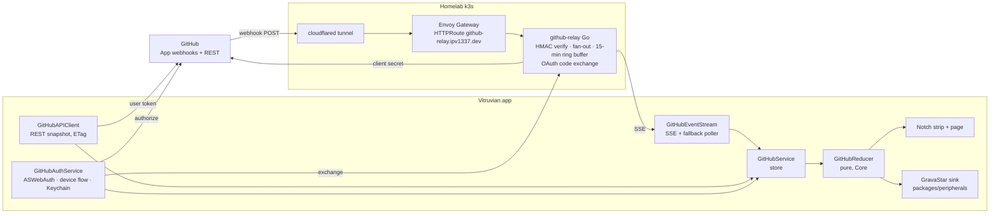
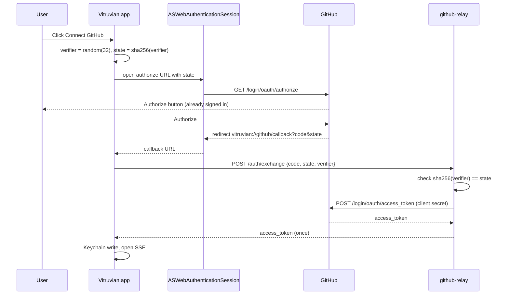
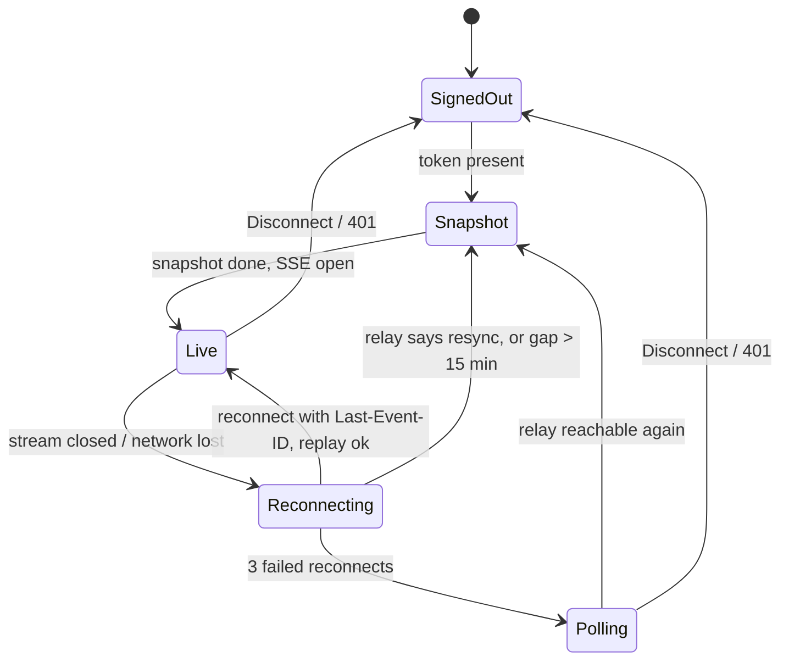

# GitHub status in the Vitruvian notch — design

**Date:** 2026-10-07 · **Status:** draft for review · **Owner:** beacon
**Scope:** `apps/desktop/vitruvian`, a new relay service, its GitOps manifests,
and `packages/peripherals` as a sink.

## 1. What this is

The Mac's notch island (and the GravaStar mouse light) shows, within seconds,
whether `main` is green on the repositories you watch and where your pull
requests stand. You connect GitHub with one click, pick the repositories to
watch, and never touch a token or a terminal.

Decisions James made on 2026-10-07, which this design takes as given:

| # | Decision |
|---|---|
| 1 | Event-driven, near real time. Polling is a fallback, not the design. |
| 2 | Zero-friction auth: a "Connect GitHub" button; no PAT, no shell command. |
| 3 | A multi-repository watchlist, defaulting to this repository. |
| 4 | A cancelled check on `main` counts as failed (red). |
| 5 | PR tracking covers PRs you authored plus PRs where your review is requested. |

## 2. The three architecture choices

### 2.1 Real-time delivery: GitHub App webhooks → homelab relay → SSE

GitHub pushes `check_run`, `check_suite`, `workflow_run`, `pull_request`,
`pull_request_review`, `status` and `push` webhooks to a small Go service,
**github-relay**, running on the homelab cluster. The desktop app holds one
Server-Sent Events (SSE) connection to the relay and receives each event
within a second or two of GitHub emitting it.

Why this and not the alternatives:

| Option | Verdict | Reason |
|---|---|---|
| GitHub Events API stream | Rejected | It carries no check or workflow events at all, and GitHub enforces a 60 s minimum poll interval. It cannot meet decision 1. |
| GraphQL / REST polling | Fallback only | Not event-driven; burns rate limit; 30–60 s latency. Kept as the offline fallback (§4.4). |
| Cloudflare Worker + Durable Object relay | Not now | Globally available, but the repo has no Worker toolchain, no Wrangler/Bazel integration and no Cloudflare IaC for Workers. Would be new build, IaC and ops surface for one feature. Revisit if homelab availability proves inadequate. |
| **Homelab Go relay behind the existing Cloudflare Tunnel** | **Chosen** | The exact ingress pattern already runs in production for `github-otel.ipv1337.dev` (`gitops/argocd/platform/cicd-telemetry/`): HTTPRoute on the platform Gateway, cloudflared tunnel, per-route rate limit, HMAC-verified webhook, SealedSecret, a `tools/gitops` rotate script with tests, and a smoke test. The relay copies that pattern file for file. Go is the repo's backend language; gazelle, OCI build and argocd-image-updater already handle deployment. |

**SSE, not WebSocket.** Traffic is one-way (relay → app). SSE rides on plain
HTTP through the tunnel, `URLSession.bytes(for:)` consumes it with no extra
dependency, and `Last-Event-ID` gives built-in replay after a reconnect. The
watchlist changes by a separate `PUT`, so there is nothing for the client to
send mid-stream. Cloudflare closes idle connections at 100 s, so the relay
writes a `: ping` comment every 25 s.

**Why the relay cannot be skipped.** GitHub has no client-side push channel.
Something publicly reachable must accept webhooks. The relay is also the only
place the GitHub App's client secret may live (§2.2), so it earns its keep
twice.

### 2.2 Zero-friction auth: GitHub App OAuth via `ASWebAuthenticationSession`, relay does the exchange

One GitHub App, **"Vitruvian Desktop"**, owned by the VitruvianSoftware org,
serves both halves of the feature: its installation delivers the webhooks, and
its OAuth flow ("user-to-server" tokens) signs the user in.

Flow (sequence in §3.2):

1. The app generates a random 32-byte `verifier` and sets
   `state = base64url(sha256(verifier))`.
2. `ASWebAuthenticationSession` opens
   `https://github.com/login/oauth/authorize?client_id=…&state=…&redirect_uri=vitruvian://github/callback`.
   If the browser is already signed in to GitHub, the user sees one
   "Authorize" button. That is the whole interaction.
3. GitHub redirects to `vitruvian://github/callback?code=…&state=…`. The
   session captures it; the app never has to handle a URL event.
4. The app calls `POST https://github-relay.ipv1337.dev/auth/exchange` with
   `{code, state, verifier}`. The relay checks
   `sha256(verifier) == state`, exchanges the code with GitHub using the
   client secret it alone holds, and returns the access token once.
5. The app stores the token in the Keychain and opens the event stream.

Why this shape:

- **The client secret never ships in the app.** GitHub's code exchange
  requires it, so a backend must do the exchange. The relay already exists.
- **The verifier closes the custom-scheme hole.** Any Mac app can claim
  `vitruvian://`. A hijacker would receive `code` and `state` but not the
  `verifier`, so it cannot redeem the code at the relay, and the code itself
  is single-use and expires in 10 minutes. This is PKCE enforced at the
  relay; GitHub's own PKCE support is to be re-checked at implementation time
  and used in addition if available (wren verifies against current docs,
  per the check-versions rule).
- **Device Flow (RFC 8628) is the fallback, not the default.** It needs no
  relay and no secret, but it asks the user to paste an 8-character code into
  a browser page: one more step than decision 2 wants. It ships behind a
  "Use a code instead" link so sign-in still works when the relay is down.
  Both paths use the same App client ID.
- **Non-expiring user tokens.** Refreshing requires the client secret too,
  which would make every refresh depend on the relay. For a single-person
  desktop app, "Expire user authorization tokens" stays off on the App;
  "Disconnect" deletes the Keychain item and makes a best-effort revoke call
  through the relay.

App permissions (read-only): `checks`, `actions`, `pull_requests`,
`contents`, `metadata`. Events: the seven listed in §2.1.

**Keychain caveat.** Items in the data-protection Keychain are bound to the
app's code-signing identity. A locally built, ad-hoc-signed app and a
notarized release will not see each other's token; each asks you to connect
once. The existing Command Bar deliberately avoids the Keychain to avoid
prompts (`CommandBarSupport.swift:735`); this feature accepts the Keychain
because a token is exactly what it is for, and uses
`kSecUseDataProtectionKeychain` so no legacy-ACL prompt appears for the app
that wrote the item.

### 2.3 Multi-repository watchlist

- **Source of candidates:** `GET /user/installations` →
  `GET /user/installations/{id}/repositories` with the user token. That is
  precisely the set of repositories where the App is installed *and* the user
  has access, which is the set the relay can deliver events for. Cached for
  one hour; "Refresh" button in the picker.
- **Default:** `VitruvianSoftware/vitruvian-core`. The app has no notion of a
  "current repository", so the repository it ships from is the default.
- **Storage:** a `Preference` in `Core/Preferences.swift`,
  `githubWatchedRepositories`, a JSON-encoded `[String]` of `owner/repo`,
  following the preference rule in the app's `AGENTS.md`.
- **On change:** the app `PUT`s the full list to the relay subscription
  (idempotent), takes a REST snapshot for newly added repositories, and drops
  state for removed ones. The relay filters the list to repositories the token
  can read (`GET /repos/{owner}/{repo}` once, cached 10 minutes) and silently
  drops the rest; the picker never offers them in the first place.
- **Picker UI:** a searchable list with toggles in Settings → GitHub, grouped
  by owner. No per-repository options in this iteration (YAGNI).

## 3. Diagrams

### 3.1 System

### 3.2 Sign-in

### 3.3 Client connection states

Colour in the notch and on the mouse: **green** every check on `main` passed;
**red** any check failed, timed out, was cancelled or needs action; **amber**
anything still queued or running; **grey** no data yet or signed out.

The mouse has one more state that the notch does not show: **awaiting
approval**. Something in the watched set is paused until James approves it,
for example a workflow run or deployment held at an environment approval gate.
The mouse shows it as fast breathing blue (speed 9, the fastest). It is the
one state that needs James to act right now, so it beats red on the mouse.
The notch behaviour is unchanged by this state unless the implementation says
otherwise.

## 4. Components

### 4.1 Desktop app (`apps/desktop/vitruvian`), by layer

| Layer | File | Responsibility |
|---|---|---|
| Core | `Core/GitHub/GitHubModels.swift` | `RepoKey`, `CheckRun`, `PullRequest`, `Verdict`, `RepoState`, `GitHubSummary`. Plain `Sendable` values. |
| Core | `Core/GitHub/GitHubEvent.swift` | Decoding of relay SSE payloads into typed events; `resync` and `ping` handling. |
| Core | `Core/GitHub/GitHubReducer.swift` | Pure `apply(_ event:, to state:) -> RepoState` and `verdict(for:)`. Rules in §5. |
| Core | `Core/GitHub/GitHubOAuthState.swift` | `verifier`/`state` generation and the device-flow state machine as pure values. |
| Core | `Core/Preferences.swift` | `githubWatchedRepositories`, `githubRelayURL` (default `https://github-relay.ipv1337.dev`), `githubMouseIndicator` (Bool, default on when the mouse is present). |
| Services | `Services/GitHub/GitHubTokenStore.swift` | `protocol GitHubTokenStore`; `KeychainTokenStore`; `InMemoryTokenStore` for tests. |
| Services | `Services/GitHub/GitHubAuthService.swift` | `ASWebAuthenticationSession` flow, device-flow fallback, disconnect. |
| Services | `Services/GitHub/GitHubAPIClient.swift` | REST snapshot per repository: head of default branch, its check runs, open PRs by author and by requested reviewer; conditional requests with ETags. |
| Services | `Services/GitHub/GitHubEventStream.swift` | SSE client over `URLSession.bytes`, `Last-Event-ID`, backoff, the fallback poller, and the state machine in §3.3. Takes a clock and a session so tests drive it. |
| Services | `Services/GitHub/GitHubService.swift` | `@MainActor @Observable` store: watchlist ↔ relay subscription, snapshot + events → reducer → `[RepoKey: RepoState]`, publishes `GitHubSummary`. |
| Services | `Services/GitHub/GitHubPeripheralSink.swift` | Maps the aggregate verdict to `packages/peripherals` signals; restores the saved lighting on quit and on sign-out. |
| Services | `Services/Notch/NotchCollaborators.swift` | New hook `githubSummary: () -> GitHubSummary?` and `githubSummaryDidChange`; wired in `main.swift`. `NotchService` still names no later service. |
| UI | `UI/Notch/NotchGitHubStrip.swift` | Compact pill per watched repository: colour + check counts. |
| UI | `UI/Notch/NotchGitHubView.swift` | Page: `main` checks and the PR list, each row opening `html_url`. |
| UI | `UI/Settings/GitHubSettingsView.swift` | Connect / Disconnect, watchlist picker, "Use a code instead". Exposed through `ServiceViewFactory`. |
| App | `Resources/Info.plist` | `CFBundleURLTypes` registering the `vitruvian` scheme. |

Every new file carries the GPL-3.0-or-later header and the VitruvianSoftware
copyright line; touched upstream files get an `UPSTREAM.md` entry; `BUILD` is
updated by hand.

### 4.2 Relay (`apps/services/github-relay`, Go)

A new `apps/services/` category holds backend services that are neither web
apps nor MCP servers; `go.work` gains `./apps/services/github-relay` and
gazelle generates its `BUILD`.

| Endpoint | Behaviour |
|---|---|
| `POST /webhook` | Verifies `X-Hub-Signature-256`; **400** on a missing or bad signature; refuses to start with an empty secret (the trap noted in the telemetry spec §3.4). Normalises the event to `{repo, kind, payload-subset, id}` and appends it to that repository's ring buffer (15 minutes, bounded count), then fans out to subscribed streams. |
| `GET /events` | SSE. `Authorization: Bearer <user token>`. Validates the token with `GET /user` (cached 10 min by token hash), reads the subscription for that user, streams events for repositories the token can read, `: ping` every 25 s. Honours `Last-Event-ID`: replays from the buffer, or sends `event: resync` if the id is older than the buffer. |
| `PUT /subscriptions` | Full watchlist for the token's user; filtered to readable repositories; stored in memory keyed by user id. |
| `POST /auth/exchange` | `{code, state, verifier}` → checks `sha256(verifier) == state` → GitHub exchange with the client secret → returns the token once. Never logs the code or token. |
| `POST /auth/revoke` | Best-effort `DELETE /applications/{client_id}/token`. |
| `GET /healthz`, `GET /metrics` | Liveness and Prometheus metrics (events in/out, subscribers, replay/resync counts, exchange failures). |

Single replica, in-memory state. A restart loses the ring buffer and the
subscriptions; clients handle both by re-`PUT`ting the watchlist on connect and
re-snapshotting on `resync`. This is deliberate: correctness comes from the
snapshot, not from the buffer.

GitOps (`gitops/argocd/platform/github-relay/`), mirroring `cicd-telemetry/`:
Deployment, Service, HTTPRoute (`github-relay.ipv1337.dev`; `POST /webhook`,
`GET /events`, `PUT /subscriptions`, `POST /auth/*` only), DNSEndpoint,
BackendTrafficPolicy rate limit, NetworkPolicy (ingress from the Gateway
only; egress to `api.github.com` and `github.com` on 443), and two
SealedSecrets: `github-relay-webhook` (`GITHUB_WEBHOOK_SECRET`) and
`github-relay-oauth` (`GITHUB_CLIENT_ID`, `GITHUB_CLIENT_SECRET`).
`tools/gitops/rotate_github_relay_secrets.sh` (with test) seals them without
printing values. Image build and digest bumps follow `mcp-slack`
(`tools/oci`, argocd-image-updater).

### 4.3 GitHub App registration (one-time, manual)

Pulumi's GitHub provider cannot create a GitHub App, so registration is a
browser step James does once. `docs/github-relay/app-manifest.json` holds the
App manifest (name, URL, callback `vitruvian://github/callback`, webhook URL,
permissions, events, `request_oauth_on_install: false`,
`"public": false`), and the runbook (§7, quill) walks the "create from
manifest" flow, ticking **Enable Device Flow** afterwards (the manifest
cannot set it), installing on the VitruvianSoftware org and on James's
personal account, and feeding the client secret and webhook secret to the
rotate tool. GitHub accepts a custom-scheme callback URL for GitHub Apps
(GitHub Desktop uses one); wren confirms this against current docs before
PR-3.

## 5. Reducer rules (decisions 4 and 5 made precise)

- **Scope of `main`:** check runs and workflow runs whose `head_sha` equals
  the current head of the repository's default branch. A `push` to the
  default branch replaces the head and **resets** that repository's check
  state to "no data" until the snapshot or the first event for the new head
  arrives. This fixes the PoC daemon's baseline loss
  (`tools/pipeline-status/pipeline-mouse-daemon.sh`).
- **Verdict:**
  - **red** if any check's conclusion is `failure`, `timed_out`,
    `cancelled`, `action_required` or `stale` (decision 4; the PoC's
    cancelled→green bug is the regression test).
  - **amber** if none is red and any status is `queued`, `in_progress`,
    `waiting`, `requested` or `pending`.
  - **green** if at least one check exists and all concluded `success`,
    `neutral` or `skipped`.
  - **grey** if there are no checks yet or the repository is unknown.
- **Aggregate** (for the mouse and the collapsed strip): red if any watched
  repository is red; else amber if any is amber; else green if all are
  green; else grey.
- **Mouse priority:** the mouse adds awaiting approval on top of the
  aggregate: **awaiting approval > red > amber > green > grey**. If anything
  in the watched set is waiting for James's approval, the mouse breathes fast
  blue (`breathe blue --speed 9`) even when another repository is red. When
  the approval clears, the mouse falls back to the normal aggregate verdict.
  Caveat: running and awaiting approval can both be blue breathing if the
  running colour is set to blue; only the speed differs. The running default
  is orange breathing at the CLI's default speed of 5 (the app sends
  `breathe orange` with no `--speed`), so by default the two also differ in
  colour. This rule is about the mouse only; the collapsed strip keeps the
  aggregate above.
- **PR set:** open PRs where `author == me` ∪ `requested_reviewers ∋ me` ∪
  `requested_teams ∩ my teams ≠ ∅` (decision 5), across watched repositories.
  Each row carries its own check verdict (same rules on the PR head), the
  review state (`approved`, `changes_requested`, `pending`) and `draft`.
  `pull_request_review` and `pull_request` events update rows; `closed`
  removes them.
- **Ordering:** events apply in relay id order; an event for a `head_sha`
  that is no longer the head is dropped (late check from a superseded push).
- **Clock:** the reducer takes `now` as an argument; nothing in Core reads
  the wall clock.

## 6. Error handling

| Situation | Behaviour |
|---|---|
| Relay unreachable at sign-in | "Use a code instead" (device flow) is offered inline; the message names the relay host. |
| Stream drops | Reconnect with jittered backoff 1 s → 30 s, `Last-Event-ID` replay; after three failures switch to polling every 60 s with ETags (304s cost no rate limit) and keep trying the stream every 5 min. |
| `401` from relay or GitHub | Token dropped, state → SignedOut, strip shows "Connect GitHub". |
| Rate-limit headers near zero | Poller stretches to the `X-RateLimit-Reset` time; the stream is unaffected. |
| Mouse absent | Sink is a no-op; the preference toggle greys out with "no GravaStar mouse found". |
| Webhook for a repository nobody watches | Buffered then aged out; no fan-out. |
| App quits or signs out | Mouse lighting restored from the saved baseline. |
| Approval is pending, then granted or rejected | Mouse breathes fast blue while it is pending, then falls back to the normal verdict (red, amber, green or grey) on the next update. |

## 7. Execution plan

Packages are isolated so PR-1 and PR-2 run in parallel.

| PR | Owner | Contents | Depends on |
|---|---|---|---|
| 0 | James | Create the GitHub App from the manifest; install it; run the rotate tool. | PR-2 merged (rotate tool exists) |
| 1 | wren | Core: models, events, reducer, OAuth state; Preferences. Tests for every rule in §5. | — |
| 2 | atlas (ridge verifies rollout over a window) | Relay service, gitops manifests, rotate tool, smoke test. Go tests: HMAC 400, empty-secret refusal, fan-out, replay/resync, access filtering with a fake GitHub, ping cadence. | — |
| 3 | wren | Auth: token store, `ASWebAuthenticationSession`, device-flow fallback, Settings view, `Info.plist` scheme. | 1 |
| 4 | wren | API client, event stream + fallback poller, `GitHubService`, watchlist picker. Tests drive the stream with fixture SSE bytes and a fake clock. | 1, 2, 3 |
| 5 | wren | Notch strip and page, `NotchCollaborators` hook, peripheral sink. | 4 |
| 6 | quill + scout | Runbook (App registration, relay ops, secret rotation); `mutation_checks.py` entries for the reducer; end-to-end smoke (`tools/gitops/github_relay_smoke.sh`). | 2, 5 |

Verification before each PR is called done: `bazel test --config=macos-app
//apps/desktop/vitruvian/...` and `bazel test //apps/services/github-relay/...`
pass; gitops render and schema checks pass; after PR-2 deploys, ridge watches
the rollout for 10 minutes, not a snapshot.

## 8. Out of scope

Notifications on state change, PR actions (merge, approve), issues, multiple
GitHub accounts, a Cloudflare Worker relay, Linux/Windows.
