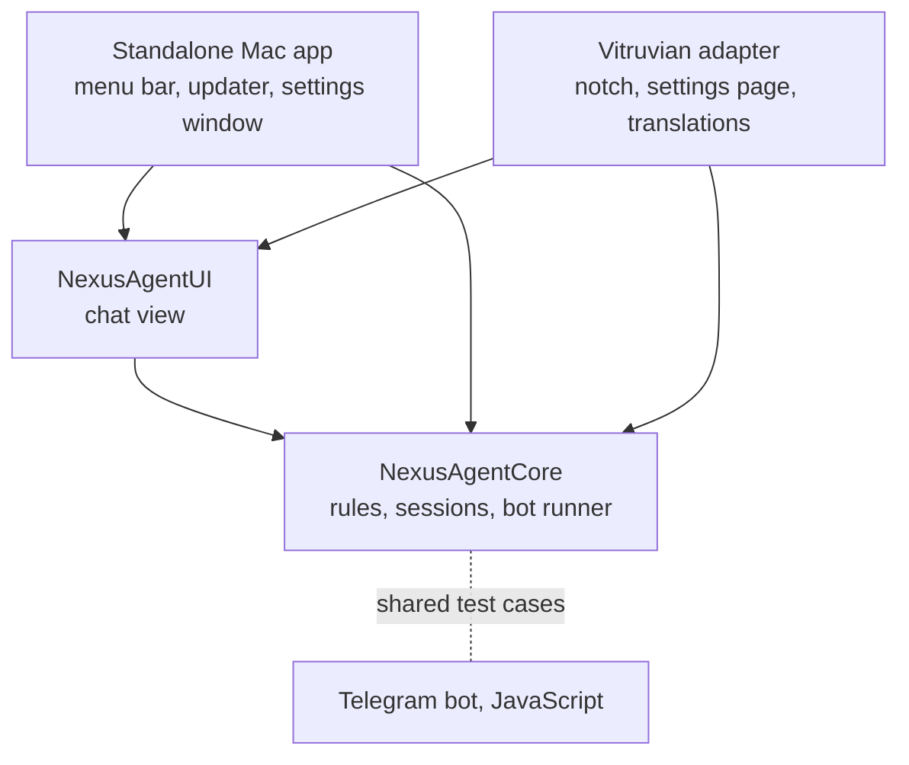

# One Nexus Agent codebase for two Mac apps — design

**Date:** 2026-10-08 · **Status:** draft for review · **Owner:** wren
**Scope:** `apps/desktop/nexus-agent`, the Nexus Agent feature inside
`apps/desktop/vitruvian`, and the rule every later "standalone app that also
becomes a Vitruvian feature" follows.

## 1. What this is

Today a Nexus Agent fix is written up to three times: in the standalone Mac
app, in the copy inside the Vitruvian desktop app, and in the JavaScript
Telegram bot. This design leaves one copy of the Swift code, which both Mac
apps build from, and gives the bot shared test cases so its copy cannot drift
unnoticed.

Decisions James made on 2026-10-08, which this design takes as given:

| # | Decision |
|---|---|
| 1 | The standalone Mac app keeps shipping as its own product, with its public MIT mirror. |
| 2 | Share the logic **and** the chat view, not the logic alone. |
| 3 | Vitruvian's Nexus Agent files, which carry only VitruvianSoftware's copyright, may be relicensed to MIT so they can become the shared code. |

## 2. What the review found

Evidence, all read from the repository on 2026-10-08:

- **The double work is real.** PRs #2857, #2883 and #2928 each changed both
  Swift copies. #2928 wrote one rule ("is this conversation archived?") three
  times: `AntigravityAnnotations.swift`, `NexusAgentQuickPromptLayout.swift`
  and `src/annotations.js`.
- **The copies have drifted apart.** Vitruvian's is a rewrite: about 5,500
  lines across six files plus 1,100 lines of translations and 1,400 lines of
  tests. The standalone is about 6,000 lines, 3,900 of them in one file
  (`QuickPromptWindow.swift`), with two small test files.
- **Vitruvian's copy leans on the rest of the app only lightly.** Four saved
  settings, the language lookup, the notch service, one telemetry call, and
  some shared view pieces. Its colours are plain system colours plus its own
  small theme.
- **Nexus Agent is the only same-language fork today.** Home-speaker,
  Roborock, Tabula and devx have no counterpart inside Vitruvian. (From a
  background survey; not re-checked file by file.)
- **Other repeated work is across languages** and is out of scope here; see
  section 10.

## 3. Constraints the design must satisfy

1. **Licence direction.** `apps/desktop/vitruvian` is GPL-3.0-or-later and a
   fork of `vorssaint/vorssaint-utils`. MIT code may be linked into it. Its
   upstream-derived code may never leave it.
2. **The mirror exports one folder.** Copybara exports
   `apps/desktop/nexus-agent/**` to `VitruvianSoftware/nexus-agent` and
   nothing else. Anything the standalone needs must live in that folder.
3. **The standalone has two build definitions.** Bazel builds it here;
   SwiftPM (`macos/Package.swift`) builds it on the mirror. When they
   disagreed, every mirror release failed from 2026-07-11 to 2026-08-20 and
   nothing here noticed (#1511, #1851).
4. **Vitruvian's live build is Bazel.** CI and releases use it. `build.sh`
   stays only as the list of test sources that `bazel/sources.bzl` is
   generated from; `Package.swift` there is not built by anything.
5. **Vitruvian's module order** `Core <- Design <- Services <- UI <- App` is
   enforced by the build.
6. **Behaviour must not change** in either app as a side effect of moving
   code. The bot's PID file and log stay shared between the two apps, as now.

## 4. The design in one picture

Everything in the two lower boxes lives in `apps/desktop/nexus-agent/macos`
and is MIT. The Vitruvian adapter stays in `apps/desktop/vitruvian` and is GPL.

## 5. Where the code lives

| Piece | Location | Licence |
|---|---|---|
| `NexusAgentCore` — rules, session state, bot runner | `apps/desktop/nexus-agent/macos/Sources/NexusAgentCore/` | MIT |
| `NexusAgentUI` — the chat view and its parts | `apps/desktop/nexus-agent/macos/Sources/NexusAgentUI/` | MIT |
| Standalone shell — app entry, menu bar, updater, settings window | `apps/desktop/nexus-agent/macos/Sources/NexusAgent/` | MIT |
| Vitruvian adapter — settings page, notch views, translations, wiring | `apps/desktop/vitruvian/Sources/Vitruvian/{Core,Services,UI}/NexusAgent/` | GPL |
| Shared test cases for Swift and JavaScript | `apps/desktop/nexus-agent/testdata/` | MIT |

`NexusAgentCore` already exists as a module with two files. It grows; no new
name is introduced for the logic. `NexusAgentUI` is new.

Why inside the standalone's folder and not `packages/`: constraint 2. The
mirror gets the shared code with no change to the export. Vitruvian reaches it
with one Bazel dependency on `//apps/desktop/nexus-agent/macos:NexusAgentCore`
and `:NexusAgentUI`, which need their visibility opened to
`//apps/desktop/vitruvian:__pkg__` and nothing wider.

## 6. The seam between shared code and each app

The shared code never reads an app's settings, strings or windows directly.
It is handed them. Three small pieces:

**`NexusAgentEnvironment`** — already exists in Vitruvian's
`NexusAgentService.Environment`: the file system, process launching, signals
and scheduling as replaceable functions. It moves to `NexusAgentCore`
unchanged. Tests keep passing doubles.

**`NexusAgentHost`** — new, a protocol each app implements:

| The shared code asks for | Standalone answers with | Vitruvian answers with |
|---|---|---|
| Saved settings: bot folder, start with app, shortcut on, plan mode | `UserDefaults` under its existing keys | `Preferences.nexusAgent*` |
| User-facing text | Built-in English | `NexusAgentStrings` for the current `AppLanguage` |
| "A turn started / is using a tool / finished / needs approval" | Nothing | `NotchService` and `NotchNotice` |
| A usage event to record | Nothing | Vitruvian's telemetry call |
| Extra header actions for the chat view | None | "Dock to notch", "pop out" |

Because each app keeps answering from its own storage, no saved setting moves
and no migration is needed.

**`NexusAgentTheme`** — a plain value of colours and corner sizes with a
default. Vitruvian's existing theme (warm coral, dark glass cards) becomes the
default, since #2883 already matched the standalone to it 1:1. The notch
passes a variant with no backdrop, as it does today.

Text is a struct of plain strings with English defaults, defined in
`NexusAgentCore`. Vitruvian's 1,100-line translation table stays in Vitruvian
and fills that struct, so `AppLanguage` (upstream's type) never crosses over.

Shared view pieces that come from `VitruvianDesign` (upstream code) do not
move. Where the chat view needs one, it either takes it from the host as a
view builder or uses a plain SwiftUI equivalent written fresh in
`NexusAgentUI`. Step 3 lists each one before moving anything.

## 7. Licence handling

- Only files whose header names VitruvianSoftware alone, and whose history
  shows no upstream-authored lines, are moved. Each migration PR lists the
  files and states that check was done.
- Moved files change header to the MIT notice used in
  `apps/desktop/nexus-agent`.
- `apps/desktop/vitruvian/UPSTREAM.md` gains a short section recording
  decision 3: which files left, the date, and that the copyright holder
  approved. Its rule against copying code out stays in force for everything
  else.
- This is the owner's decision, not legal advice.

The platform spec in PR #2934 says no code is copied out of the Vitruvian
folder into a permissive SDK. This design is a named exception for
VitruvianSoftware-only files, not a change to that rule. The two designs
otherwise fit: #2934 decides how a feature plugs into the app; this decides
where a feature's code lives. The Vitruvian adapter here is what #2934 later
gives a manifest.

## 8. Build, CI and releases

- **Both build definitions gain the same targets in the same PR.**
  `macos/BUILD` and `macos/Package.swift` each declare `NexusAgentCore`,
  `NexusAgentUI` and the app.
- **New guard: build the standalone the mirror's way, here.** A CI job runs
  `swift build` in `apps/desktop/nexus-agent/macos` on every change under that
  folder. A library missing from `Package.swift` then fails in this
  repository, before export.
- **Language mode.** Vitruvian's code is written for Swift 6 mode; the
  standalone's manifest says tools 5.9. Step 1 moves the manifest to 6.0 and
  confirms the mirror's release runner builds it. If it cannot, the fallback
  is to compile the shared modules in Swift 5 mode with strict concurrency on,
  which the code must then satisfy in both.
- **Access level.** Vitruvian's code uses `package` visibility, which only
  works inside one package. Moved declarations become `public`.
- **Tests move with the code.** Vitruvian's Nexus tests use upstream's own
  test harness. The ones covering moved code are ported to XCTest beside the
  two existing files in `macos/Tests`, and run under the existing
  `nexus-agent-macos` pipeline unit. Tests of the adapter (settings page,
  notch wiring) stay in Vitruvian. `build.sh`, `bazel/sources.bzl` and
  `upstream/upstream.py` are updated in the same PR so their checks stay
  green.
- **Releases.** Each app releases when files under its own folder change. A
  fix made only in the shared code would therefore release the standalone and
  not Vitruvian. Until that is automated, the rule is: a shared-code fix that
  Vitruvian users should get carries a `fix(desktop):`-style footer for the
  `vitruvian` component in the same PR (release-please's multi-component
  commit footer). Step 1 proves this works on a real PR; if it does not, a
  one-line change note in Vitruvian's folder is the fallback.

## 9. Migration, in four steps

Each step is one pull request, changes no behaviour, and leaves both apps
green.

1. **Move the pure rules.** `NexusAgentSupport.swift` and
   `NexusAgentQuickPromptLayout.swift` (about 1,400 lines, Foundation only)
   go to `NexusAgentCore`. The standalone's `AntigravityAnnotations` and the
   matching parts of `ConfigManager` are deleted in favour of them. Adds the
   `swift build` guard, settles the language mode and proves the release
   footer.
2. **Move sessions and the bot runner.** `NexusAgentQuickPromptSession` and
   `NexusAgentService` move, split so the app-specific parts (hotkey
   registration, window ownership, notch calls) stay behind `NexusAgentHost`.
   The standalone's `BotManager` and the rest of `ConfigManager` are replaced.
3. **Move the chat view.** `NexusAgentQuickPromptView` becomes
   `NexusAgentUI`. The standalone deletes `QuickPromptWindow.swift` and hosts
   the shared view in its window. Before merging, both apps are compared
   screen by screen; any visible difference in the standalone is listed in
   the PR for James to accept or reject.
4. **Share test cases with the bot.** Rules that exist in both Swift and
   JavaScript get their examples as data files in `testdata/`, read by the
   XCTest suite and by the bot's tests. Start with the archive rule from
   #2928, then approval-mode parsing and `.env` reading. A rule changed on one
   side then fails the other side's tests.

Step 1 is worth doing even if the rest stalls. Step 3 is the largest and the
only one that can change what a user sees.

## 10. The rule for the next fork

When a standalone app also becomes a Vitruvian feature:

1. The standalone's folder owns the shared code, split into a logic library
   and, if needed, a view library.
2. Shared code takes its settings, text, theme and host hooks as inputs.
3. Vitruvian holds only an adapter.
4. Nothing upstream-derived leaves the Vitruvian folder.

This goes into `apps/desktop/vitruvian/AGENTS.md` in step 1.

Out of scope, noted for later: the same idea is written in several languages
elsewhere (the CI red/amber/green verdict in Swift, bash, C++, Python and Go;
Claude Code transcript reading and Mac system stats three times each). A
shared library cannot fix those. Step 4's shared test cases are the pattern
that can, and each would be its own design.

## 11. Risks

| Risk | What contains it |
|---|---|
| The standalone's look changes in step 3 | Screen-by-screen comparison, differences listed for approval |
| Mirror breaks again | `swift build` guard in this repository's CI |
| A shared fix never reaches Vitruvian users | Release rule in section 8, proven in step 1 |
| A moved file turns out to contain upstream code | Per-file check in every PR; such a file stays in Vitruvian behind the host |
| Upstream sync gets harder | Moved files are VitruvianSoftware-only, which upstream never edits; `upstream.py` map updated per step |
| Vitruvian now builds code from another app's folder | One narrow Bazel visibility grant; both apps' tests run on any change to the shared code |

## 12. Testing

- Ported unit tests cover every moved rule and the session state machine,
  run by Bazel here.
- The `swift build` guard covers the mirror's build.
- Vitruvian keeps its adapter tests and its existing mutation checks.
- Step 3 adds the manual screen comparison; there is no automated visual test
  today and this design does not add one.
- Step 4's data files are run by both languages.

## 13. Not verified

- That the mirror's release runner can build a Swift 6 manifest (step 1).
- That release-please's multi-component footer works with this repository's
  per-app configs (step 1).
- Which `VitruvianDesign` pieces the chat view uses, one by one (step 3).
- That the two chat views really match 1:1 today; #2883 says so, no one has
  compared them (step 3).
- The survey's claim that no other same-language fork exists.
