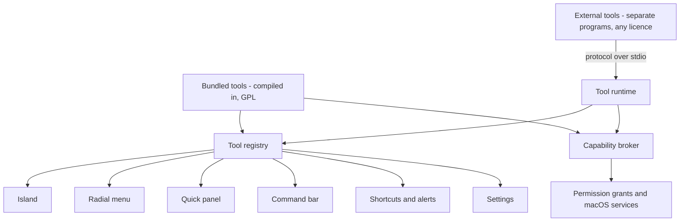

# Vitruvian as a platform: tools, an SDK and a marketplace — design

**Date:** 2026-10-08 · **Status:** draft for review · **Owner:** compass
**Scope:** `apps/desktop/vitruvian`, a new permissively licensed
`packages/vitruvian-sdk`, and later a public tool registry.

## 1. What this is

Today every Vitruvian feature is compiled into the app. This design turns the
app into a host that **tools** plug into. A tool is what the code calls a
feature today. A developer writes one against a published SDK, declares what it
adds to each surface (the notch island, the radial menu, the Quick panel, the
command bar, shortcuts), and ships it without touching the app's source. Our
own features move onto the same contract one at a time, so the SDK is proven
on real work before anyone else depends on it.

Decisions James made on 2026-10-08, which this design takes as given:

| # | Decision |
|---|---|
| 1 | One tool registry, two ways to host a tool: inside the app for ours, as a separate program for everyone else's. |
| 2 | Outside developers choose their own licence, closed-source and paid included. |
| 3 | Built-in features migrate one by one onto the contract, as the test of it. |
| 4 | A marketplace comes later. The design must not block it and need not build it. |

This is too large for one implementation plan. Section 12 splits it into six
sub-projects. Each gets its own spec, plan and review. This document is the
shape they all share.

## 2. What the assessment found

Five read-only assessments ran on 2026-10-08 against version 3.32.0. Counts
marked *estimate* come from searches, not a line-by-line tally.

- **There is no feature interface.** A feature is one case of `AppFeature`
  (`Core/FeatureCatalog.swift`) plus about 15 hand-wired places. The compiler
  enforces roughly half of them. Quit cleanup, settings backup, registered
  defaults and Settings page gating are by convention.
- **The same tool is listed five times.** `UtilityPanelItem`,
  `QuickLauncherItem`, `RadialMenuTool`, `GlobalShortcutRole` and the
  command-bar builders are separate fixed lists, each mapped back to
  `AppFeature` by hand. Nothing joins them.
- **The island is closed.** What it can show is fixed in `NotchModule` (17
  pages), `NotchCompactActivity` (7 strips) and `NotchEvent` (14 notices).
  Adding a simple island add-on touches about 35 files (*estimate*).
- **Some surfaces are nearly data already.** `RadialMenuItem` is Codable.
  `CommandBarEntry` is a title, subtitle, icon and an action. The command bar
  already runs a user's own executable and shows what it prints.
  `QuickToolHUD.show` and `Notifier.post` take plain values.
- **Users can already reorder and hide** items on most surfaces, and that saved
  state is keyed by plain text ids. It can carry over unchanged.
- **The 79 features split three ways** (assessment, one service opened per
  feature): 12 could run as a separate program today; 32 could once the app
  offers shared services such as clipboard and screen capture; 35 must stay
  inside the app because they rewrite every keystroke or scroll event, call
  private Apple internals, or own a privileged helper.
- **Every mature comparable runs outside code as a separate program** that
  describes what to show, and the host draws it: Raycast, VS Code, Stream
  Deck. None hands outside developers a native view.
- **macOS will not police tools for us.** A program the app launches normally
  runs under the app's own Accessibility and Screen Recording grants. Apple
  does not document this formally; section 12 tests it on a real Mac.

## 3. Constraints the design must satisfy

1. Everything under `apps/desktop/vitruvian/` is GPL-3.0-or-later and cannot
   be relicensed (`UPSTREAM.md`).
2. No code may be copied from that directory into a permissive SDK. The SDK is
   written fresh.
3. Non-GPL code must not link the app. A permissive library the app links is
   fine in the other direction.
4. Outside tools may carry any licence (decision 2). So they cannot be loaded
   into the app's process.
5. Each migrated feature must stay portable from upstream. 189 upstream
   commits were triaged between 2026-09-24 and 2026-10-07.
6. Releases are signed ad hoc today, so permission grants reset on every
   update. The update check points at a repository that does not exist.
7. `docs/PRIVACY.md` promises no telemetry and lists every network connection.
   Outside tools break that unless the promise is re-scoped.
8. The module order `Core <- Design <- Services <- UI <- App` is enforced by
   the build. New code must fit it.

## 4. Vocabulary

| Term | Meaning |
|---|---|
| **Tool** | One installable unit with one manifest. What a feature is today. |
| **Contribution** | One thing a tool adds to one surface: a radial item, a command-bar row, an island notice. |
| **Surface** | A place the app shows or triggers things: island, radial menu, Quick panel, command bar, shortcuts, menu-bar readouts, alerts, Settings. |
| **Capability** | Something the host does on a tool's behalf that needs trust: read the clipboard, capture the screen, register a hotkey. |
| **Registry** | The app's live table of installed tools and their contributions. |
| **Bundled tool** | A tool compiled into the app. Ours. |
| **External tool** | A tool that runs as its own program and talks to the app over the protocol. Anyone's. |

## 5. Architecture



Five parts, each with one job:

- **Tool registry.** Holds one descriptor per tool and per contribution, keyed
  by text id. Every surface asks it for its own list. It replaces the five
  hand-kept lists.
- **Capability broker.** The only door to trusted services. It checks that the
  calling tool declared the capability and that the user granted it, then does
  the work.
- **Tool runtime.** Starts, supervises and stops external tools. Speaks the
  protocol. Turns their messages into registry entries and broker calls.
- **Surface renderers.** The app's own views. They draw contributions. A tool
  never draws.
- **SDK.** The protocol definition, a client library, a command-line tool and
  documentation. Lives outside the GPL directory.

The rule that keeps the two hosting modes honest: a bundled tool and an
external tool produce **the same descriptors** and call **the same broker
operations**. A bundled tool does it through Swift calls. An external tool does
it through messages. A surface cannot tell which kind it is drawing.

### 5.1 Where the code lives

| Piece | Location | Licence |
|---|---|---|
| Protocol schema (JSON Schema) and manifest schema | `packages/vitruvian-sdk/protocol/` | Permissive |
| Swift protocol types and client library | `packages/vitruvian-sdk/swift/` | Permissive |
| `vitruvian-tool` command-line tool, samples, conformance tests | `packages/vitruvian-sdk/` | Permissive |
| Registry, broker, runtime, renderers | `apps/desktop/vitruvian/Sources/Vitruvian/` | GPL |

The app depends on the SDK's protocol types, never the reverse.
`packages/peripherals` is the precedent: an MIT Swift package beside the GPL
app. The exact permissive licence is open question 5.

Inside the app, descriptors are plain values and live in `Core`. The registry,
broker and runtime own live state and live in `Services`. Renderers live in
`UI`. That fits constraint 8 with no new layer.

## 6. The tool manifest

One file per tool. It is the raw material the registry reads, and it is what a
marketplace would display and review. Every field below exists in the app
today in some hand-wired form; the right column says where.

| Field | Purpose | Today |
|---|---|---|
| `id` | Stable identity, reverse-DNS: `com.acme.deploys` | `AppFeature` raw value |
| `name`, `description` | Shown in the Features hub and the marketplace. Localised; English required | `FeatureHubText`, 15-language string tables |
| `version`, `protocol` | Tool version; the protocol range it supports | none |
| `publisher`, `license`, `homepage` | Who made it and on what terms | none |
| `icon` | SF Symbol name or a bundled image | `symbolName` |
| `group` | Features hub section | `FeatureGroup` |
| `capabilities` | What it needs from the broker, each with a one-line reason shown to the user | `permissions` |
| `contributes` | Its contributions, per surface (section 7) | the five lists |
| `preferences` | Typed settings with defaults; drives a generated Settings page and backup | `Preferences.swift`, `Defaults.swift` |
| `activation` | When to start it: at launch, on a shortcut, when a contribution is first shown | `FeatureRuntime.actions(for:)` |
| `runtime` | `bundled`, or `external` with the executable path | none |
| `platform` | Minimum app and macOS version; hardware requirement | `hardwareGate` |

An external tool's manifest, in full:

```json
{
  "id": "com.acme.deploys",
  "name": "Deploys",
  "description": "Shows the state of your latest deploy.",
  "version": "1.2.0",
  "protocol": "1",
  "publisher": "Acme",
  "license": "MIT",
  "icon": "shippingbox",
  "group": "tools",
  "capabilities": [
    { "id": "network", "reason": "Reads deploy status from api.acme.dev." },
    { "id": "notify", "reason": "Tells you when a deploy fails." }
  ],
  "contributes": {
    "commands": [{ "id": "open", "title": "Open latest deploy" }],
    "radial": [{ "command": "open" }],
    "shortcuts": [{ "command": "open" }],
    "island": { "strip": true, "page": { "title": "Deploys" } }
  },
  "preferences": [
    { "id": "project", "type": "string", "title": "Project", "default": "" }
  ],
  "activation": ["onLaunch"],
  "runtime": { "kind": "external", "exec": "bin/deploys" }
}
```

The central idea is the **command**: a named action a tool can run. Radial
items, Quick panel tiles, command-bar rows and shortcuts are all ways to
trigger a command. A tool declares the command once and lists the surfaces it
should appear on. That is the one declaration the five lists lack.

## 7. Contributions, surface by surface

Version 1 covers what is plain data. Anything that needs a hand-built view
stays bundled-only until a later version.

| Surface | Contribution in version 1 | Ready today |
|---|---|---|
| Alerts | A brief on-screen confirmation; a system notification | High |
| Command bar | Static rows from commands; live rows returned for a typed query | High |
| Radial menu | An item that runs a command | High |
| Quick panel | A tile that runs a command; a toggle tile with on/off state | Medium |
| Shortcuts | A user-recordable global shortcut for a command | Medium |
| Menu-bar readout | A short label and value, refreshed by the tool | Medium |
| Island notice | Title, detail, symbol, optional level, priority, tap command | Medium |
| Island strip | Symbol, short text, optional progress, tint | Low |
| Island page | A page built from the content vocabulary below | Low |
| Settings | A page generated from `preferences` | Low |

**Out of version 1:** custom menu-panel sections, free-floating windows, and
island content that needs per-frame drawing, text editing, a camera feed or
drag and drop. The music player, the scratchpad and the camera stay ours.

### 7.1 The content vocabulary

Island pages (and, later, panel sections) are described with a small fixed set
of parts. The host sizes, scrolls, animates and themes them.

```
Node   = Stack(axis, children) | Text(value, style) | Icon(symbol, tint)
       | Progress(value) | List(rows) | Button(label, command)
       | Toggle(label, value, command) | Divider
Row    = title, detail?, symbol?, trailing?, command?
```

A tool sends a whole tree the first time and changes after that. The host
never runs tool code to draw a frame, so a slow tool cannot stall the island.

The vocabulary is deliberately small. Every part added must be drawn in five
places today: the hanging island, the capsule, the mirror on other displays,
the lock screen and the Settings preview. Growing it is a cost paid five times.
Section 13 names this as the main risk.

## 8. Capabilities and trust

A tool gets nothing it did not declare. The user sees the list, with each
tool's stated reason, before the tool first runs, and can revoke any item
later in Settings.

| Capability | What the broker offers | macOS grant it rides on |
|---|---|---|
| `notify` | Alerts and notifications | Notifications |
| `clipboard.read`, `clipboard.write` | Read, write, change events | none |
| `hotkey` | Register a shortcut; the host owns id allocation | none |
| `keystrokes` | Synthesised paste and key presses | Accessibility |
| `windows` | List, raise, read titles | Accessibility |
| `screen.capture` | Region, display, stream | Screen Recording |
| `audio.devices` | List, default, mute, events | none |
| `calendar` | Read events | Calendars |
| `files` | Folders the user picked; Trash | Files and Folders |
| `metrics` | CPU, memory, network, battery, sampled by the host | none |
| `network` | Outbound requests to declared hosts | none |
| `secrets` | A Keychain item the tool owns | none |
| `storage` | The tool's own preferences and a private data folder | none |

What this does and does not protect:

- **It does** stop a tool from using the app's sensitive grants without the
  user knowing. The broker is the only way to reach Accessibility or Screen
  Recording through the app.
- **It does not**, on its own, stop an external tool from reading the user's
  files or the network directly. It is a normal program running as the user.
- **So version 1 treats external tools as trusted once installed**, the way
  Raycast and VS Code do, and relies on review, signing and a clear consent
  screen. Whether the runtime can also launch tools inside a restrictive
  macOS sandbox profile is the second spike in section 12. If it can, `files`
  and `network` become enforced, not advisory.

`docs/PRIVACY.md` is re-scoped in the same change that ships the first external
tool: the app's own promises stay, and a new section says tools are separate
programs with their own stated network use.

## 9. Running an external tool

- **One process per tool**, started by the runtime on the tool's first
  activation event and stopped when idle or when the tool is switched off.
- **Messages are JSON-RPC 2.0 over standard input and output**, with a length
  prefix per message. This is the framing the Language Server Protocol and the
  Model Context Protocol use, so libraries exist in most languages.
- **Handshake first.** The tool and the host exchange a protocol version and a
  list of supported capabilities. A missing capability means unsupported; the
  tool must cope. This is how the protocol grows without breaking old tools.
- **The host calls the tool** to run a command, to answer a command-bar query,
  to say a page became visible or hidden, and to say a preference changed.
- **The tool calls the host** to publish or update contributions, to post a
  notice, and to use a capability.
- **Failure is contained.** A tool that crashes, hangs past a deadline or
  floods the channel is stopped, its contributions are greyed out, and the user
  is told once. Restarts back off. The app never waits on a tool to draw.

Version 1 does not offer in-process scripting, a web view, or Apple's
ExtensionKit. ExtensionKit forces every extension into the App Sandbox and
inside its own carrier app, which rules out most utility tools.

## 10. Identity and saved state

- Every tool and contribution has a text id. A contribution's full id is
  `<tool id>/<contribution id>`.
- **Bundled tools keep the ids users already have saved.** `AppFeature` raw
  values, `PanelSectionID` strings, command-bar `stableKey`s and radial item
  payloads become ids as they are. No migration of user settings.
- `AppFeature` stays during the migration. The registry is seeded from it, and
  a feature leaves the enum only when its last switch arm is gone.
- A tool's preferences are stored under its id. Bundled tools keep their
  existing keys. Settings backup includes any preference a manifest declares,
  which closes today's "forgot to add it to the backup list" gap.

## 11. Moving our own features across

"Migrated" has a precise meaning: the feature is described by a manifest, its
contributions come from the registry, and it reaches trusted services only
through the broker. It does **not** mean it runs outside the app.

| Bucket | Count | Ends up as |
|---|---|---|
| Could run outside today | 12 | External tool, shipped in the app bundle |
| Could once the broker exists | 32 | External tool, or bundled if latency matters |
| Must stay inside | 35 | Bundled tool; manifest and registry only |

First five, easiest first, chosen to exercise the most of the contract:

1. **Port manager.** Subprocess and files only. Proves manifest, command,
   command-bar row and generated Settings page.
2. **URL cleaner.** Proves `clipboard` and the start/stop lifecycle.
3. **Paste as plain text.** Adds `hotkey`, `keystrokes` and a permission that
   can be granted or revoked while running.
4. **AI agents in the island.** Proves island strip, page and notice, plus
   `files` and `network`.
5. **Screen text capture.** Adds `screen.capture` and moving image data across
   the process boundary. Forces the shared capture service out, which the
   colour picker and screenshots then reuse.

Each migration is its own pull request, keeps behaviour identical, keeps its
existing tests green, and adds a test that the contribution appears on each
surface it declares.

### 11.1 Upstream porting

Moving a feature relocates files upstream edits daily. Three rules contain it:

- New platform code goes in new files. A migrated feature's logic stays in its
  existing file where it can; only the wiring moves.
- Each migration updates the file map in `upstream/upstream.py` in the same
  pull request, and `upstream_test` checks it.
- Bucket-three features, which are most of what upstream touches, change
  least: they gain a manifest and lose switch arms.

Whether to keep tracking upstream indefinitely is open question 1.

## 12. Sub-projects

Each is a separate spec and plan. Each leaves the app shippable.

| # | Sub-project | Delivers | Done when |
|---|---|---|---|
| 0 | **Foundations** | Developer ID signing and notarisation; a working update channel; a legal opinion on the process boundary and marketplace hosting; two spikes on a real Mac: whose permission grants a launched tool gets, and whether a sandbox profile can confine one | Permission grants survive an update; both spikes have written answers |
| 1 | **Registry** | Descriptors, the registry, commands. Alerts, command bar, radial menu, Quick panel tiles and shortcuts read from it. No outside code | Those five surfaces have no fixed list of tools; saved user layouts are unchanged |
| 2 | **Broker and bundled tools** | The capability broker; the bundled tool interface; migrations 1 to 3, bundled | Three features have manifests and reach services only through the broker |
| 3 | **External runtime and SDK alpha** | Protocol 1; the runtime; the Swift client library; `vitruvian-tool init`, `run`, `validate`; consent screen; island notice, strip and page; migrations 4 and 5 as external tools shipped in the bundle | A sample tool written only from the public docs runs; killing it does not disturb the app |
| 4 | **SDK beta** | Generated Settings pages; menu-bar readouts; packaging and signing of a tool bundle; install from a file; versioning and deprecation policy; published docs and public SDK mirror | An outside developer can build, sign, install and update a tool |
| 5 | **Marketplace** | A public registry repository; submission by reviewed pull request; an index the app reads; in-app browse, install, update and revoke | A tool goes from pull request to installed without a new app release |

Sub-project 0 runs in parallel with 1 and 2. Nothing in 1 or 2 runs outside
code, so neither waits on signing or the legal opinion. Sub-project 3 does.

### 12.1 SDK versioning

- The protocol has one integer major version. Additions arrive as new
  capabilities inside a major version and never break an existing tool.
- New, unsettled API is marked **proposed**: usable in development builds,
  refused by the marketplace. This is VS Code's rule and it keeps mistakes
  from becoming permanent.
- A removed capability is announced one major version ahead.
- A conformance test suite ships with the SDK. The app runs it in CI against
  the runtime, and tool authors run it against their tool.

## 13. Risks

- **The content vocabulary grows into a UI framework.** It is the largest
  long-term cost; Raycast needed two attempts at theirs. Mitigation: keep
  version 1 to the eight parts in section 7.1, add a part only when a real
  bundled tool needs it, and collapse the five island renderers toward one
  before adding the second part.
- **Trust without confinement.** Until the sandbox spike says otherwise, an
  installed external tool is as trusted as any app the user runs. The consent
  screen must say so plainly.
- **The licence position weakens as the protocol gets richer.** A separate
  program exchanging simple messages is widely treated as a separate work; one
  exchanging intricate internal structures is less clear. Sub-project 0
  obtains an opinion before sub-project 3 ships. This document is not legal
  advice.
- **Upstream porting cost rises** with every migration (section 11.1).
- **Latency across the process boundary.** Sliders and scrubbing over
  messages may feel slow. Tools that need them stay bundled.
- **Scope.** This is the most expensive of the three options considered.
  Sub-projects 1 and 2 pay off on their own, by making our own features
  cheaper to add, even if 3 to 5 never ship.

## 14. Testing

- Descriptors, the registry and the broker's permission checks are pure logic
  and get unit tests in the existing `TestSuite`, with injectable defaults.
- The runtime is tested against a scripted fake tool: handshake, version
  mismatch, crash, hang, flood, malformed message.
- Each migration keeps the feature's existing tests and adds a mutation in
  `Tests/mutation_checks.py` for its registry wiring.
- The conformance suite (section 12.1) runs in the `vitruvian-desktop-macos`
  pipeline unit.
- Windows, permissions and hardware are not covered by automated tests today.
  Each sub-project states what was checked by hand, on which Mac and macOS
  version, and what remains untested.

## 15. Open questions for James

Each has a default this design assumes until told otherwise.

1. **Upstream.** Keep porting indefinitely, or set a cut-off once sub-project
   2 lands? *Default: keep porting; revisit after the first five migrations
   with real conflict numbers.*
2. **Developer ID.** Fund an Apple Developer account now? *Default: yes;
   sub-project 3 cannot ship without it.*
3. **Legal opinion.** Commission one on the process boundary and on hosting
   third-party tools? *Default: yes, before sub-project 3 ships.*
4. **SDK languages.** Swift first, TypeScript second? *Default: yes. Swift is
   what we write; TypeScript is what most launcher-extension authors write.*
5. **SDK licence.** MIT or Apache-2.0? *Default: Apache-2.0, matching the
   monorepo and carrying a patent grant.*
6. **Marketplace policy.** Curated and reviewed, or open? Paid tools?
   *Default: reviewed, free only, decided properly in sub-project 5.*
7. **"Toolbox".** The word is not in the code. This design reads it as the
   Quick panel, the floating grid of tool tiles. *Default: that reading.*
