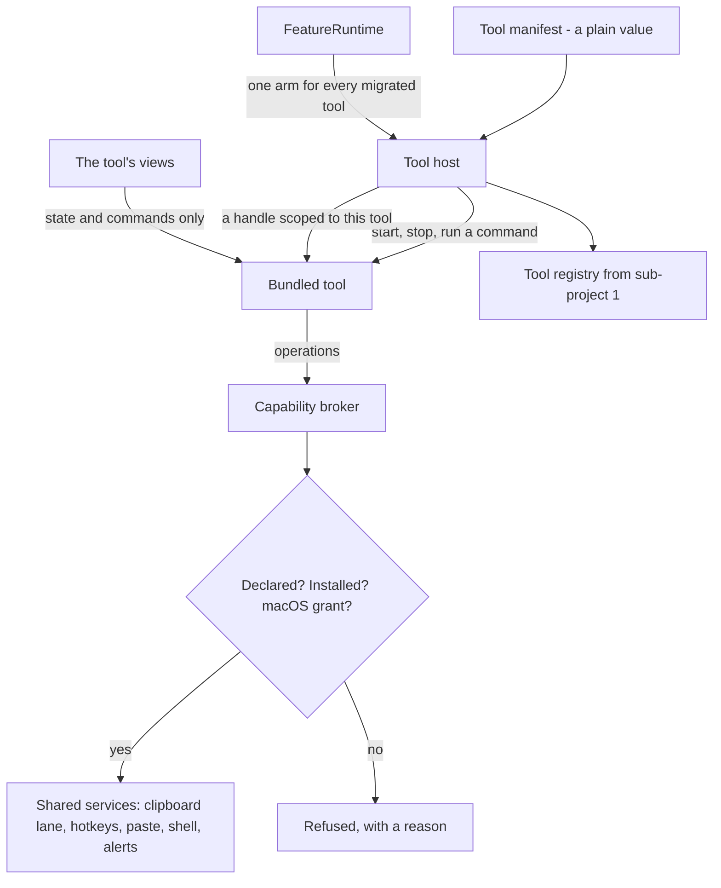

# Vitruvian sub-project 2: the capability broker and the first three bundled tools — design

**Date:** 2026-10-09 · **Status:** approved by James 2026-10-09, with every default in section 13 · **Owner:** compass
**Scope:** `apps/desktop/vitruvian` only. No SDK package, no outside code.
**Parent:** `docs/superpowers/specs/2026-10-08-vitruvian-tool-platform-design.md`
(sections 5, 6, 8, 10 and 11; sub-project 2 in section 12).

## 1. What this is

Sub-project 1 gave the app one list of commands. A feature is still wired in
by hand, though, and it still reaches the clipboard, the keyboard and other
sensitive services directly.

This sub-project adds the three things that turn a feature into a **tool**:

- a **manifest**: one value that says what the tool is, what it needs and
  what it adds;
- a **bundled tool interface**: how the app starts and stops a tool that is
  compiled in, and hands it what it may use;
- a **capability broker**: the one door to sensitive services. A tool gets
  through it only for what its manifest declares.

Then it moves three real features onto them, bundled: the **Port manager**,
the **URL cleaner** and **Paste as plain text**.

Nothing a user sees changes. Every step is a refactor that keeps behaviour
identical. The point is to prove the contract on our own work before
sub-project 3 puts a process boundary and a stranger's code behind it.

**Done when** all of these hold:

1. The three features each have a manifest, registered at launch.
2. In the files that belong to them, no code touches a sensitive service
   except through the broker. A lint proves it (section 8).
3. Their arms are gone from `FeatureRuntime`'s switches, and their lines are
   gone from the quit list in `AppDelegate`. The tool host does both jobs.
4. Their existing tests pass unchanged, and the new tests in section 10 pass.
5. The by-hand checks in section 10 are recorded with the Mac and macOS
   version they were run on.

## 2. What the assessment found

Two read-only assessments ran on 2026-10-09 against `main` at `3ad6ed46d`.
Counts marked *search* come from text searches, not a line-by-line tally.

**The three features are less clean than the parent design assumed.** It
picked them as the easiest. Each has a catch the broker has to answer.

- **The Port manager's dangerous half belongs to another feature.** Listing
  ports is one `lsof` call through the shared `Shell` helper. Killing a
  process goes through `KillProcessService`, which is a different, beta
  feature. `PortManagerService.terminate` does nothing unless that other
  feature is installed. The kill path includes an administrator-password
  prompt. Nothing tests it.
- **The URL cleaner does not read and write the clipboard. It rewrites it in
  place.** Every 0.8 seconds it checks whether the clipboard changed, and if
  the text is a link with tracking parts it replaces the contents, keeps
  another app's source marker, and relies on exact change counts so that
  clipboard history does not record the rewrite as a new copy. A broker that
  hands back a copy of the text and takes a new string cannot do this.
- **Paste as plain text is three sensitive things in one press.** A global
  hotkey; a walk through the front app's menus over Accessibility to press
  "Paste and Match Style"; and, when that fails, a paste dance that swaps the
  clipboard, synthesises Command-V with hard-coded delays, and restores the
  clipboard half a second later. The dance lives in `TransientPaste`, which
  text snippets also use. Nothing tests the press path.
- **None of the three has a registry command.** `BuiltinCommand` has fifteen
  cases and none is theirs. Their command-bar rows call services directly.
- **Their views call services directly too.** The Port manager and URL
  cleaner Settings pages and panel views reach `NSPasteboard`, `NSWorkspace`
  and `KillProcessService` from view code. Paste as plain text has no page;
  it is a section of the clipboard history page.

**What a feature costs to wire today.** Traced through the URL cleaner: 21
places. Eleven are exhaustive switches the compiler checks. The rest are by
convention: registered defaults, the quit list, the service's own "am I
installed and enabled" check, and each optional surface.

**What exists to build on.**

- The registry (`ToolDescriptor`, `ToolRegistry`, `BuiltinTools`) knows a
  tool's id, name, symbol and commands. It has no capabilities, preferences,
  activation, or start and stop.
- Shared helpers already sit in front of most sensitive services:
  `GeneralPasteboardAccess` (a serial lane for the clipboard), `TransientPaste`,
  `QuickToolHotkey`, `Shell` and `AdminShell`, `QuickToolHUD`, `Notifier`,
  `Permissions`, `PrivateFileStore`. None checks who is calling.
- Services follow one shape: a main-actor singleton with an injectable
  `Environment` struct, and tests that pass a fake one. The broker follows it.

**What the broker is up against.** In `Services` alone: 124 singletons and
about 1,070 `.shared` references; 80 direct Accessibility checks in 37 files;
51 direct clipboard uses in 24 files; 35 direct `CGEvent` constructions;
14 direct `Process()` launches (*search*). This sub-project does not try to
clear that. It draws the line around three tools and leaves everything
outside it as it is.

**Two corrections to the parent design.**

- Section 11.1 says each migration updates "the file map in
  `upstream/upstream.py`". There is no static file map. The tool derives
  renames from `git diff`. The rule that matters is the other one: logic
  stays in its existing file.
- Section 11 says migration 1 "proves the generated Settings page".
  Section 12 puts generated Settings pages in sub-project 4. This spec follows
  section 12: the three tools keep their hand-built views (section 7).

## 3. Decisions this spec makes

These are the calls that shape everything below. Each is a default, with what
it costs if it is wrong.

| # | Decision | Why | If wrong |
|---|---|---|---|
| 1 | The broker offers **operations, not raw services**. A tool asks to "rewrite the clipboard if it still holds what I saw", not for the pasteboard. | A raw service cannot cross a process boundary later, and cannot be checked. An operation can. | Operations are too narrow for the next tool, and the broker grows one per feature. Section 9 limits this. |
| 2 | **Add a `processes` capability** the parent design does not list: list listening ports, end a process. | The Port manager needs it, and the admin escalation behind "end a process" is exactly what must sit behind the broker. | One more capability to carry into the protocol. |
| 3 | **The Port manager keeps depending on the Kill process feature** for ending a process, as today. The broker's operation refuses when that feature is not installed. | Behaviour stays identical. Untangling two features is its own change. | The odd dependency is now written into the broker. It is one `guard`, easy to lift. |
| 4 | **One clipboard watcher in the broker**, at the URL cleaner's 0.8 seconds. Only migrated tools use it. Clipboard history and auto-clear keep their own timers. | A tool must not own a system timer. Merging all three watchers changes timing for features this sub-project does not touch. | Three watchers run until those features migrate, as now. |
| 5 | **Bundled tools keep their hand-built views.** A view talks to its tool, never to a service. | Generated pages are sub-project 4. The rule still removes sensitive calls from view code. | None for users. Sub-project 4 has more to convert. |
| 6 | **Bundled tools are always granted what they declare.** The broker still checks the macOS permission and that the tool is installed. | A consent screen for our own features is noise. The grant store exists so sub-project 3 only has to fill it. | None until external tools arrive. |
| 7 | **A tool's existing shortcut stays a `GlobalShortcutRole`**, with its saved key and hotkey id. The broker registers it. | Saved settings must not move (parent section 10). Part 3 already decided our own commands do not also ask for the shortcut surface. | Bundled and external tools bind hotkeys through two operations for a while. |
| 8 | **Characterisation tests come before each move.** The kill path and the paste path have no tests today. | "Behaviour identical" is a claim nobody can check without them. | Slower start to migrations 1 and 3. |
| 9 | **Three stages, three plans, at least three pull requests.** Port manager, then URL cleaner, then Paste as plain text. | Each adds capabilities the next needs, and each leaves the app shippable. | None. |

## 4. Architecture



Four new parts. Each has one job and its own file.

- **Tool manifest** (`Core/Platform/ToolManifest.swift`). A plain value. It
  wraps the `ToolDescriptor` that exists and adds what is missing.
- **Tool host** (`Services/Platform/ToolHost.swift`). Owns the live tools:
  builds them, starts and stops them, registers their commands. It replaces
  the per-feature arms in `FeatureRuntime` and the per-feature lines in the
  quit list.
- **Capability broker** (`Services/Platform/Broker/`). Checks, then does the
  work by calling the shared helpers that exist. One file per capability.
- **Tool services** (`Services/Platform/ToolServices.swift`). The handle a
  tool is given. It carries the tool's id, so the tool cannot ask as someone
  else, and exposes one small interface per capability.

The parent design's rule holds here in its in-process form: a bundled tool
calls **the same operations, with the same names and the same plain-value
arguments**, that an external tool will send as messages. So every operation's
arguments and results are values that could be written as JSON. No closures
that capture app state, no `NSPasteboard`, no `CGEvent`, no view types cross
the broker.

## 5. The manifest

`ToolManifest` in `Core`. Field names match section 6 of the parent design so
that the JSON schema in sub-project 3 is a transcription, not a redesign.

| Field | Type | For a bundled tool it comes from |
|---|---|---|
| `tool` | `ToolDescriptor` (id, name, symbol, commands) | as today |
| `group` | `FeatureGroup` | `AppFeature.group` |
| `capabilities` | `[CapabilityRequest]`: a `Capability` and a reason | new |
| `preferences` | `[PreferenceDeclaration]`: storage key and default (a `PreferenceDeclaration.Value`, which carries the type) | the keys the feature has today, unchanged |
| `activation` | `[Activation]`: `.onLaunch`, `.onCommand`, `.onShown` | what `FeatureRuntime.actions(for:)` does today |
| `enabledBy` | a preference key, or none | `AppFeature.enabledKeys` |
| `runtime` | `.bundled` | fixed |

Not in this sub-project: `version`, `protocol`, `publisher`, `license`,
`homepage`, `platform`. They mean nothing for code compiled into the app, and
adding empty fields invites wrong values.

Rules the initializer enforces, returning nil otherwise (the pattern
`ToolDescriptor` uses):

- A capability is listed once.
- Every preference key is listed once, and the `enabledBy` key is one of them.
- A bundled-form id still names an `AppFeature`.

Rules a test enforces, because they compare against the app:

- **A manifest agrees with its `AppFeature`.** Group and symbol match. Every
  macOS permission the feature declares is implied by a capability the
  manifest declares (`keystrokes` implies Accessibility, and so on), and the
  reverse. This is what stops the two descriptions drifting while both exist.
- **Every preference key a manifest declares is registered with the same
  default, and no key belongs to two tools.** So settings backup keeps
  working with no per-tool list, and the "forgot to add it to the backup" gap
  closes for migrated tools. The test does not check "exactly the tool's
  keys": nothing in the app says which registered key belongs to which
  feature. The default's type in code is `PreferenceDeclaration.Value`; it is
  nested because `Core` already has a `PreferenceValue` protocol.

The reason text on a capability is not shown to anyone in this sub-project.
It is still required, in English, because writing it is the cheapest check
that the capability is needed. It becomes a localised string when the consent
screen exists.

## 6. The bundled tool interface and the host

```swift
@MainActor
package protocol BundledTool: AnyObject {
    static var manifest: ToolManifest { get }
    init(services: ToolServices)
    /// Begin whatever the tool does in the background. Called when the tool
    /// is installed, enabled, and has what its capabilities ride on.
    func start()
    /// Undo everything `start` did. Must be safe to call twice.
    func stop()
    /// Run one of the manifest's commands.
    func run(_ command: CommandID)
    /// Whether a command can run right now.
    func canRun(_ command: CommandID) -> Bool
}
```

**As built in stage A.** The protocol requires only `manifest`,
`init(services:)` and `stop()`. `start`, `run`, `canRun`, the run rule below
and the `FeatureRuntime` action arrive in stage B, with the first tool that
needs them. The Port manager has no background work, so stage A's host only
builds a tool on first use and stops every built tool at quit. The rest of
this section describes the design those pieces grow into.

A tool holds no singleton of its own and reaches for none. Everything it may
touch arrives through `services`. The existing service class for each feature
becomes its tool: `URLCleanerService` conforms to `BundledTool`, keeps its
file and its logic, and loses its `static let shared`.

**The host decides when a tool runs.** One function, `shouldRun(tool)`, is
true when all of these hold: the tool is installed in the Features hub; its
`enabledBy` preference is on, or it has none; every macOS permission its
capabilities ride on is granted, or the tool declared it can start without
(Paste as plain text does: it registers its hotkey and asks on first press).
The host calls `start` and `stop` so that the tool's state matches. That
replaces the "am I installed and enabled" check each service does for itself.

**When the host re-decides.** At launch; when the hub installs or removes a
tool; when a preference a manifest declares changes; when a macOS permission
changes. The first two and the last already reach `FeatureRuntime`. For
migrated tools `FeatureRuntime` gets one action, `.tool(ToolID)`, that calls
the host, and the tool's own arm in `actions(for:)` and `perform` goes.
The exhaustive switches stay exhaustive: the arm now says "this one is a
tool".

**At quit** the host stops every running tool, in the reverse of start order.
The tool's hand-written line leaves `AppDelegate`. Today that line builds the
URL cleaner's singleton at quit even when the feature is not installed; the
host never builds a tool it has not started.

**Commands.** The host registers each manifest's commands with the registry
and sets handlers that call the tool's `run` and `canRun`. `BuiltinTools`
stops registering a tool the host owns. The two command-bar rows that exist
keep their saved keys (`action.cleanURL`, `action.pastePlain`) as command
ids, so nobody's reordered or hidden rows move. The Port manager has no
command today and gets none: adding one adds a string in 15 languages and a
row users did not ask for.

**Views.** A view gets its tool from the host and reads published state or
calls a command. It does not call a service. Where a view needs something
sensitive (the Port manager row copies a PID, opens a link), the tool offers
it as a method and the tool goes through the broker.

## 7. The broker

### 7.1 What a call goes through

Every operation runs the same three checks, in this order, before any work:

1. **Declared.** The calling tool's manifest lists the capability. If not,
   the call is refused and, in a debug build, traps: it is a programming
   error, never a user state.
2. **Installed.** The tool is installed in the hub. A tool removed while a
   call is in flight gets a refusal, not a crash.
3. **Granted.** Any macOS permission the capability rides on is granted, and
   the grant store says the user allows it. For a bundled tool the grant
   store always says yes (decision 6).

A refusal is a value, `BrokerRefusal`, with one of four reasons: those three,
and **unavailable**, when the host cannot offer the operation right now.
Ending a process while the Kill process feature is not installed is the
first case. The tool decides what to do: Paste as plain text beeps or asks for Accessibility
once, exactly as today.

The broker never shows UI of its own in this sub-project.

### 7.2 Capabilities and operations

Only what the three tools need. Each operation names the helper it calls
today, which is what keeps behaviour identical.

| Capability | Operations | Rides on | Backed by | First needed by |
|---|---|---|---|---|
| `notify` | `hud(icon, message)`; `beep()`. Stage A builds `beep()` only. | none | `QuickToolHUD`, `NSSound` | Port manager |
| `open` | `openURL(url)` | none | `NSWorkspace` | Port manager |
| `processes` | `scanner()` (start times and the listening-sockets report); `canTerminate`; `isProtected(pid, name)`; `terminate(pid, name, startedAt, force)` | none (admin prompt on demand) | `Shell` running `lsof`; `KillProcessService` | Port manager |
| `clipboard.write` | `write(text, kind)` | none | `GeneralPasteboardAccess` | Port manager |
| `clipboard.read` | `readText()`; `changes` (a stream of change counts) | none | the lane; the broker's watcher | URL cleaner |
| `clipboard.rewrite` | `rewrite(ifChangeCount:, with:)` | none | the lane; clipboard history's "ignore next change" | URL cleaner |
| `storage` | `value(for:)`; `set(_:for:)`, for keys the manifest declares | none | `UserDefaults` | URL cleaner |
| `hotkey` | `bind(role)`; `unbind(role)`; `onPress` | none | `QuickToolHotkey`, `SystemShortcutTakeover` | Paste as plain text |
| `keystrokes` | `paste(text)`; `pressFrontAppMenuItem(matching:)` | Accessibility | `TransientPaste`; the Accessibility menu walk | Paste as plain text |

The listening-sockets report is `lsof`'s text, not parsed ports. The parser
and the stability rule are the tool's own logic and stay in its file.

Notes on the ones that are not obvious:

- **`clipboard.rewrite`** is the answer to the URL cleaner's catch. The tool
  is told "the clipboard changed, count N". It reads the text, decides, and
  asks the broker to replace the contents **only if the count is still N**.
  The broker does the read-check-clear-write on the clipboard lane, keeps a
  foreign source marker and the remote-clipboard marker, and tells clipboard
  history to ignore the change. All of that is today's code, moved behind one
  operation. It is its own capability because replacing what the user copied
  is a bigger thing to allow than reading it or adding to it.
- **`keystrokes.paste`** is `TransientPaste` unchanged, timings included.
  Text snippets keep calling `TransientPaste` directly; they are not a tool
  yet.
- **`pressFrontAppMenuItem`** takes a list of acceptable titles and key
  equivalents and returns whether it pressed one. The walk, its 0.35-second
  limit per element and its cap of 600 elements stay as they are.
- **`processes.terminate`** carries the process's start time, as the call
  does today, so a recycled PID is never killed by mistake.
- **`storage`** refuses a key the manifest did not declare. That one rule is
  what makes a manifest's preference list true.

Not offered yet, though the parent design lists them: `windows`,
`screen.capture`, `audio.devices`, `calendar`, `files`, `metrics`, `network`,
`secrets`. No tool in this sub-project needs them. An operation is added when
a migration needs it, never ahead.

### 7.3 Shape in code

`CapabilityBroker` is a main-actor class with an `Environment` of closures
over the shared helpers and a `.live` value, the shape `ToolShortcutRegistrar`
and `FeatureRuntime` have. Tests build it with fakes. Each capability is a
small type in its own file under `Services/Platform/Broker/`, so the broker
does not become one large file.

`ToolServices` is what a tool holds: `services.clipboard`, `services.notify`
and so on. Asking for a capability the manifest does not declare returns a
facade whose every operation refuses, so a tool's code reads the same either
way and the mistake surfaces as a refusal a test can assert on.

## 8. "Only through the broker", made checkable

The done-when is worthless as a promise. It is a lint.

`migrated_tools_reach_services_through_the_broker` in `bazel/source_lints.py`
holds a table: tool id, and the files that belong to it (service, support,
views). In those files it fails on any of:

`NSPasteboard`, `GeneralPasteboardAccess`, `CGEvent`, `CGEventSource`,
`AXIsProcessTrusted`, `AXUIElement`, `QuickToolHotkey(`, `RegisterEventHotKey`,
`Process()`, `Shell.`, `AdminShell.`, `NSWorkspace.shared`, `UserDefaults`,
`Notifier.`, `QuickToolHUD.`, `TransientPaste`, and `.shared` on any type that
is not on a short allow-list.

The last one is the strong one: a migrated tool's files name no service
singleton at all. The allow-list as built is `ToolHost`, `L10n` (the
language a view draws in), `SettingsRouter` and `PanelInteractionState`. It
grows only by review. The table of files grows
by one row per migration, in the same pull request.

One exception, checked by the same rule: a view may bind a preference with
`@AppStorage`, but only to a key its tool's manifest declares. A toggle that
writes straight to defaults is how every Settings page works today, and
rewriting those bindings buys nothing while the key is one the tool owns.

A second rule keeps the other side honest: under `Services/Platform/Broker/`
no file may import or name a tool. The broker serves tools; it does not know
them.

Both rules get a planted-regression entry in `Tests/mutation_checks.py`.

## 9. Risks

- **The broker grows one operation per feature and becomes the app.** The
  defence is decision 1 plus a review rule: an operation is named for what it
  does to the system, never for the tool that wanted it. `clipboard.rewrite`
  passes. `cleanURLOnClipboard` would not. If the third migration needs more
  than two new operations that only it will ever use, stop and revisit.
- **Timing changes in the paste path.** The delays are tuned by hand against
  real apps. The plan moves `TransientPaste` behind the broker without
  editing it, and the by-hand list checks the apps that are known to be
  fussy.
- **Characterisation tests pin a bug.** They record what the code does, not
  what it should. Anything that looks wrong is written down, not fixed, in
  the migration; fixing it is a separate change.
- **Upstream keeps editing these files.** All three features and every helper
  behind the broker carry the upstream header, and URL cleaner fixes were
  ported as recently as #2814. Logic stays in its file; a service class gains
  a conformance and loses its singleton. Each migration logs every touched
  upstream file in `UPSTREAM.md`.
- **Two descriptions of one feature.** `AppFeature` and the manifest both
  exist until a later sub-project removes the enum case. The agreement test
  in section 5 is what keeps them from drifting.
- **The host starts something the old code did not, or the reverse.** The
  rule in section 6 is new code deciding old behaviour. Each migration has a
  table test: every combination of installed, enabled and permission, against
  what the old `syncWithPreferences` did.

## 10. Testing

Automated, in the existing `TestSuite` under the `platform` group:

- **Manifest rules**: each rejection in section 5, and the agreement test
  against `AppFeature` and the registered defaults.
- **Broker checks**: for every operation, the three refusals and the success,
  against fake services. A refused call does no work: the fake records zero
  calls.
- **`clipboard.rewrite`**: replaced when the count matches; left alone when
  it moved; foreign markers kept; clipboard history told to ignore.
- **Host**: the start-and-stop table for each tool; stop is safe twice; quit
  stops in reverse order; a tool that was never started is never built.
- **Per migration**: the feature's existing tests unchanged; the
  characterisation tests written first (decision 8); one test that each
  command the manifest declares appears on each surface it names.
- **Lints**: the two rules in section 8, each with a mutation.

By hand, because no test presses a real key or reads the real clipboard.
Recorded in each pull request with the Mac and macOS version.

- **Port manager**: the list fills; a row's copy and open-in-browser work;
  ending a process works, including one that needs the admin prompt; with the
  Kill process feature removed, the end button does what it did before.
- **URL cleaner**: copy a link with tracking parts and it is cleaned within a
  second; clipboard history shows one entry, not two; copy from an app that
  marks its source and the mark survives; switch the feature off and copying
  is left alone.
- **Paste as plain text**: the shortcut pastes plain text in an app with
  "Paste and Match Style" and in one without; the clipboard holds the
  original afterwards; with Accessibility revoked the press beeps or asks
  once; recording another shortcut does not kill this one.

## 11. Stages

Each is its own plan and at least one pull request, a `refactor`, and cuts no
release.

| Stage | Builds | Migrates | Capabilities added |
|---|---|---|---|
| A | Manifest, tool interface, host, broker skeleton, both lints | Port manager | `notify`, `open`, `processes`, `clipboard.write` |
| B | The broker's clipboard watcher, the host's start and stop, the `FeatureRuntime` action | URL cleaner | `storage`, `clipboard.read`, `clipboard.rewrite` |
| C | Permission changes reaching the host | Paste as plain text | `hotkey`, `keystrokes` |

Stage A is built; its by-hand checks are in its pull request.

Stage A is the large one: it carries all the new structure and the feature
with the least to move. B and C are mostly one capability and one feature
each.

## 12. Out of scope

- External tools, the protocol, the runtime, the SDK package, the consent
  screen. Sub-project 3.
- Generated Settings pages. Sub-project 4.
- Removing any `AppFeature` case.
- Migrating Kill process, text snippets, clipboard history or any feature
  that shares a helper with the three.
- Clearing direct service use outside the three tools' files.
- Island, menu-bar or Quick panel contributions beyond what the three
  features have today.
- Any change a user can see.

## 13. Open questions

Each had a default. James accepted every one on 2026-10-09. They are
decisions now. The stage A plan is
`docs/superpowers/plans/2026-10-09-vitruvian-broker-stage-a.md`; it changes
three details of this spec, listed in its decisions table, and its last task
brings this document in line.

1. **`processes` as a new capability** (decision 2). *Default: yes.*
2. **Keep the Port manager's dependency on Kill process** (decision 3).
   *Default: yes for now; untangle when Kill process migrates.*
3. **`clipboard.rewrite` as its own capability**, separate from write.
   *Default: yes. Replacing what the user copied deserves its own line on a
   consent screen.*
4. **Paste as plain text stays a section of the clipboard history page.**
   *Default: yes. Giving it a page is a visible change.*
5. **Order.** The parent design says Port manager first. It has the least to
   move but the most awkward dependency. *Default: keep the order; Stage A
   needs a tool with no background work to prove the host simply.*
