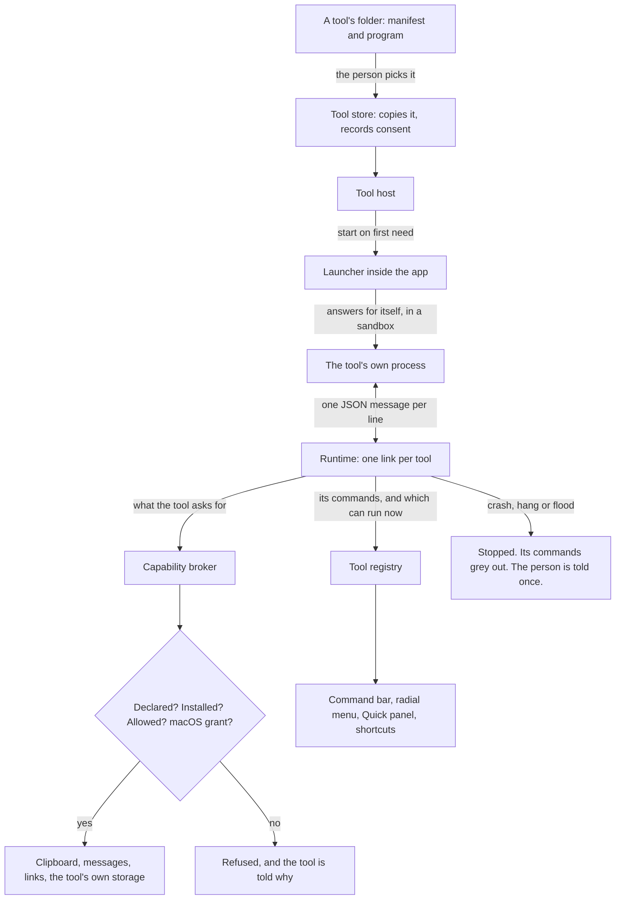

# Vitruvian sub-project 3: tools that run as their own programs — design

**Date:** 2026-10-10 · **Status:** draft, awaiting James · **Owner:** compass
**Scope:** `apps/desktop/vitruvian`, and a new `packages/vitruvian-sdk`.
**Parents:** `2026-10-08-vitruvian-tool-platform-design.md` (sections 5 to 10,
and sub-project 3 in section 12); `2026-10-09-vitruvian-broker-and-bundled-tools-design.md`;
`2026-10-10-vitruvian-tool-permission-spikes.md`.

## 1. What this is

Sub-projects 1 and 2 made a feature into a tool that lives inside the app. This
one lets a tool live outside it: a separate program, written by anyone, in any
language, that the app starts, talks to, and can stop without being disturbed.

It delivers four things:

- a **protocol**: the messages a tool and the app exchange;
- a **runtime** in the app that installs, starts, confines, supervises and
  stops such tools;
- a **consent screen** and a place in Settings to see and remove them;
- an **SDK**: the protocol written down, a Swift library, a command-line
  tool, a sample, and tests any tool can be run against.

**Done when** all of these hold:

1. A sample tool, written using only what the SDK publishes, installs from a
   folder, shows its consent screen, and runs its commands from the command
   bar, the radial menu, the Quick panel and a shortcut.
2. Killing that tool, hanging it, or making it flood the app leaves the app
   responsive, and the person is told once.
3. A tool can do nothing it did not declare and the person did not allow.
   The tests in section 12 show it for files, the network, the clipboard and
   the privacy permissions the app holds.
4. A release build with no outside tool installed looks and behaves as it
   does today.
5. The by-hand checks in section 12 are recorded with the Mac and macOS
   version they were run on.

## 2. What the assessment found

Two read-only assessments ran on 2026-10-10 against `main` at `d1b2a2357`,
after the two spikes. Counts marked *search* come from text searches.

**The sub-project as first drawn is several times too big.** The parent
design gave it the runtime, the SDK, the consent screen, three kinds of island
contribution, and two features moved out as external tools. Measured:

| Piece | What it touches |
|---|---|
| Island notice | 8 files, 4 exhaustive switches. The two notice views are shared. |
| Island page | 5 files, 11 exhaustive switches, and its size is a hard-coded arm of one central switch. No page today is drawn from data. |
| Island strip | 16 files, 11 exhaustive switches, a hand-built view for each of two shapes, and a separate enum for the lock screen. |
| Screen text capture, moved out | The feature's own code is one 148-line file. It stands on a 2,157-line selection overlay shared with screenshots, the recorder and the colour picker. It has no tests of its own. |
| AI agents in the island, moved out | 21 files and 10,140 lines, 20 preferences, about 39 switch arms in 14 other files, three subprocesses, file watching across six apps' folders, a local TLS bypass, and an embedded chat view. |

The claim in the parent design that every island part is drawn in five places
is only partly true: a notice is drawn in two, a page in one view shown three
ways, a strip in three or four. The page and the strip are still the costly
ones.

**What already fits.**

- The command bar, the radial menu, the Quick panel and shortcuts work on
  text command ids. Saved layouts keep an id they do not recognise. A tool
  with an id like `com.acme.deploys` needs no change in any of them.
- The broker already refuses what a manifest does not declare. Its "does the
  person allow this" check exists and always says yes today.
- The app already runs other people's programs in three places: a script row
  in the command bar, the music adapter, and the Codex command-line tool,
  which speaks JSON lines over standard input and output. None is confined.
- `packages/peripherals` already holds a hand-written JSON-RPC server, one
  message per line.

**What fights it.**

- Every list asks a command "can you run?" while it draws. Today that is a
  direct call on the main thread. A tool in another process cannot be asked
  that way without stalling the app.
- The tool host keys tools by Swift type. An outside tool has none.
- "Installed" for a tool whose id is not a built-in feature is always true.
- Five kinds of thing in a manifest are closed Swift lists: capabilities,
  surfaces, groups, preference types and the permissions a capability rides
  on. A manifest from outside can name something the app does not know.
- Four broker operations answer at once (`open`, two in `processes`, reading
  a preference). One asks the tool three questions in the middle of a job on
  the shared clipboard lane, with no deadline; that lane has wedged before.
- A tool cannot write a preference and has no folder of its own.
- A new sentence on screen costs 15 translations and about 17 lines.
- The repository's licence check enforces MIT headers outside the app. The
  parent design chose Apache-2.0 for the SDK.

## 3. Decisions this spec makes

Each is a default, with what it costs if it is wrong.

| # | Decision | Why | If wrong |
|---|---|---|---|
| 1 | **This sub-project is the runtime, the consent screen and the SDK. Nothing on the island, and no feature moved out.** The proof is the sample tool, which is the parent's own done-when. | Section 2. The island pieces and the two migrations are each as large as everything else here, and none is needed to prove a tool can run. | The SDK ships able to add commands and messages, not island content. That is section 13. |
| 2 | **Every outside tool is launched to answer for itself, inside a sandbox.** If either cannot be applied, the tool is not started. | Spike 1: launched the ordinary way, a tool has the app's privacy permissions and the broker is decoration. Spike 2: a sandbox holds it to its folder and off the network. | Both rest on interfaces Apple does not promise. Section 11. |
| 3 | **One message per line**, JSON-RPC 2.0, on standard input and output. The parent said length-prefixed. | It is what the Model Context Protocol uses for programs started this way, what Codex and the peripherals server already do here, and what a tool author can write in ten lines of any language. | A message containing a raw newline breaks the stream. JSON never needs one; the library never writes one. |
| 4 | **The app never waits on a tool to draw.** A tool tells the app which of its commands can run now; the app keeps the last answer. | Lists ask while drawing. | A row can be a moment out of date. Running a command the tool then refuses beeps, as a built-in one does. |
| 5 | **First capabilities: `notify`, `open`, `clipboard.read`, `clipboard.write`, `storage`.** Not `processes`, `hotkey`, `keystrokes`, `clipboard.rewrite`, the network or files outside the tool's folder. | Each of the five is a plain request and reply today. Typing into other apps and ending processes are the riskiest things to hand a stranger. Rewriting the clipboard needs the tool to answer mid-job on a shared lane. | The first outside tools are simple ones. More arrive one at a time, each with its own tests. |
| 6 | **`storage` gains writing and a folder**, both per tool. | A tool with no memory is a script. Keys are held under the tool's id so two tools cannot collide, or read the app's own. | None. Built-in tools keep their existing keys. |
| 7 | **A tool gets a shortcut the way part 3 built it**: its command asks for the shortcut surface and the person records one. The tool never sees a key. | Already built, already checked against every other shortcut. | None. |
| 8 | **Installing is choosing a folder.** The app copies it into its own support folder and runs the copy. | No Developer ID, so no signed packages. A copy means the tool cannot change after the person agreed to it. | Updating a tool is choosing its folder again. Sub-project 4 adds a Git address. |
| 9 | **Agreement is per capability, shown before first run, and changing what a tool asks for asks again.** | A manifest that grows after consent is how a harmless tool becomes a harmful one. | An update that adds a capability interrupts the person once. |
| 10 | **Tool-supplied words are shown as the tool wrote them.** A manifest may carry its name and reasons in several languages; English is required. | The app cannot translate a stranger's sentence. It already shows other programs' text unlocalised: script output, process names, GitHub data. | A tool in a language the person does not read. The hub shows the publisher beside it. |
| 11 | **The SDK is MIT.** The parent design said Apache-2.0. | The repository's licence check enforces MIT headers on everything outside the app, and `packages/peripherals`, the precedent the parent names, is MIT. | No patent grant. If that matters later, the check gains an exception; nothing here depends on it. |
| 12 | **The app links the SDK's protocol types.** One definition of each message, used by both sides. | Two hand-kept copies drift. A GPL app may link an MIT library; the app already links one. | A change to a message is a change in two places' build. That is the point. |
| 13 | **A small launcher program inside the app starts each tool.** | Something has to put the tool in its sandbox, close what it must not inherit and set its limits, before any of the tool's code runs. | One more binary in the bundle to sign and test. |

## 4. Architecture



New parts, each with one job:

- **Tool store** (`Services/Platform/External/ExternalToolStore.swift`). The
  list of installed outside tools, where their files are, and what the person
  agreed to. It answers "installed?" and "allowed?" for the broker.
- **Runtime** (`Services/Platform/External/`). One link per running tool:
  starts it through the launcher, reads and writes messages, enforces
  deadlines and limits, restarts with a growing wait, and stops it.
- **Launcher** (a small program in the app bundle). Applies the sandbox,
  then becomes the tool.
- **Protocol types** (`packages/vitruvian-sdk`, a Swift module both sides
  link).
- **Consent screen and the tools section of Settings** (`UI/Settings/`).

Changed parts:

- **Tool host.** It holds "something that can start, stop, run a command and
  say what can run", with two kinds behind it: a compiled-in tool, as today,
  and a link to an outside one.
- **Broker.** "Installed" and "allowed" ask the tool store for an outside
  tool. Each operation an outside tool may use gets a form that takes and
  returns only values.
- **Manifest.** It can be read from JSON, and refuses what it does not know.

## 5. A tool on disk

A folder with a manifest and a program:

```
deploys/
  vitruvian-tool.json
  bin/deploys
```

```json
{
  "id": "com.acme.deploys",
  "name": { "en": "Deploys", "fr": "Déploiements" },
  "description": { "en": "Copies the address of your latest deploy." },
  "version": "1.2.0",
  "protocol": "1",
  "publisher": "Acme",
  "license": "MIT",
  "icon": "shippingbox",
  "capabilities": [
    { "id": "clipboard.write", "reason": { "en": "Copies the deploy's address." } },
    { "id": "notify", "reason": { "en": "Says when the address is copied." } }
  ],
  "contributes": {
    "commands": [
      { "id": "copyLatest", "title": { "en": "Copy latest deploy" }, "icon": "link",
        "surfaces": ["commandBar", "radial", "shortcut"] }
    ]
  },
  "preferences": [ { "id": "project", "type": "string", "default": "" } ],
  "activation": ["onCommand"],
  "runtime": { "kind": "external", "exec": "bin/deploys" }
}
```

Rules:

- **The id has a dot** and is at most 128 characters. An id with no dot is a
  built-in feature's and is refused.
- **Unknown fields are ignored.** That is how a later protocol adds one.
- **An unknown capability, surface or preference type refuses the install**,
  with a message that names it. The alternative, installing with part of the
  manifest dropped, has the person agree to something other than what runs.
- **`exec` stays inside the folder.** A path that leaves it is refused.
- **The icon is an SF Symbol name.** One the Mac does not have draws as a
  plain puzzle piece, as an unknown command does today.
- **Size limits**: the manifest 64 KB, the folder 50 MB, 32 commands,
  16 preferences. A tool that needs more is not the tool this stage is for.

Installed, it lives in the app's support folder, in two places the tool
cannot reach across:

```
~/Library/Application Support/<bundle id>/Tools/com.acme.deploys/     its files, read-only to it
~/Library/Application Support/<bundle id>/ToolData/com.acme.deploys/  its own folder, writable
```

## 6. Starting and holding a tool

**The launcher** is started by the app with the option that makes it answer
for itself (spike 1). So it, and the tool it becomes, has none of the app's
privacy permissions. It then:

1. applies a sandbox profile written for this tool;
2. closes every file it inherited except standard input, output and error;
3. sets a memory limit and a limit on open files;
4. changes to the tool's data folder and replaces itself with the tool.

If any step fails, it exits with a code the runtime reads as "do not run".
There is no path that starts a tool without its sandbox.

**The profile** is the strict one from spike 2:

| The tool may | The tool may not |
|---|---|
| read its own files | read anything else under the home folder |
| read and write its own data folder | write anywhere else |
| read the system libraries a program needs | reach the network, at all |
| talk on standard input and output | look up the services Accessibility and Screen Recording are reached through |
| start a program that is inside its own files, held by the same rules | start anything else |

**When it runs** follows the manifest:

- `onCommand`: started the first time one of its commands runs. Stopped after
  two minutes with nothing asked of it.
- `onLaunch`: started with the app, kept running.

A tool that is removed in Settings, or whose agreement is withdrawn, is
stopped at once.

**Stopping** is: say goodbye, close its input, wait two seconds, end it, wait
one more, kill it. The app does this for every running tool at quit.

**When it misbehaves:**

| What happens | What the app does |
|---|---|
| It exits or crashes | Its commands grey out. It is started again at the next need, after a wait that doubles from 1 second to 5 minutes. Three crashes within a minute and it stays stopped until the person starts it from Settings. |
| It does not answer within the deadline (2 seconds, 10 for the first message) | The request fails. Three in a row and it is treated as crashed. |
| It sends a line over 1 MB, or more than 200 messages a second for 5 seconds | Stopped, treated as crashed. |
| It sends something that is not a message | That line is dropped and counted. Twenty in a minute and it is stopped. |
| It writes to standard error | Kept, up to 256 KB per tool, where the person can read it in Settings. Never shown as a message. |

The person is told once per tool per launch, with one sentence, that a tool
stopped working. The command bar, the radial menu and every built-in feature
carry on.

## 7. The protocol, version 1

JSON-RPC 2.0. One message per line. UTF-8. The tool's standard output carries
nothing else.

**The app starts.** It sends `initialize` with the protocol versions it
speaks, the capabilities this tool has been allowed, the language in use, and
the path of the tool's data folder. The tool answers with the version it
picked and its own version. A tool that picks a version the app did not offer
is stopped. Nothing else may be sent first.

**What the app asks the tool:**

| Message | Meaning | Answer |
|---|---|---|
| `initialize` | as above | the version chosen |
| `command/run` | run this command | done, or refused with a reason |
| `preferences/changed` | these values changed | none (a notice) |
| `language/changed` | the person changed language | none (a notice) |
| `shutdown` | stop | none; the tool exits |

**What the tool asks the app:**

| Message | Capability | Meaning |
|---|---|---|
| `commands/state` | none | which of its commands can run now. A notice; sent whenever that changes. Until the first one, all can. |
| `notify/hud` | `notify` | show a short message with a symbol |
| `notify/beep` | `notify` | the alert sound |
| `open/url` | `open` | open a link. `http`, `https` and `mailto` only. |
| `clipboard/readText` | `clipboard.read` | the clipboard's text, if it holds text |
| `clipboard/writeText` | `clipboard.write` | replace the clipboard with this text |
| `storage/get`, `storage/set` | `storage` | read or write one of the preferences the manifest declares |
| `log` | none | a line for the tool's log in Settings |

**A refusal** is a JSON-RPC error with one of the broker's four reasons as
its code: not declared, not installed, not allowed, not available. A tool
must cope with any request being refused: the person can withdraw an
agreement while it runs.

**Growing it.** A new message or field is added without a new version when an
old tool can ignore it. Anything an old tool would misread needs version 2,
and the app goes on offering 1. This is the parent design's section 12.1,
unchanged.

**What version 1 leaves out, on purpose:** anything the app would have to ask
a tool in the middle of its own work (the clipboard rewrite), anything drawn
on the island, live command-bar rows for a typed query, and a command that
takes an argument.

## 8. Agreement, and where tools live in Settings

This is new screen, so its layout is settled with mock-ups at the planning
step, before code. What it must do:

**Adding a tool.** The Features hub gets a section for tools from outside,
with an "Add a tool" button that opens a folder picker. The app reads the
manifest and shows one sheet before anything is copied or run:

- the tool's name, publisher, version and description, as the tool wrote them;
- each capability it asks for, in the app's own words ("Read what you copy"),
  with the tool's reason under it, marked as the tool's words;
- a plain statement of what the app holds it to: its own folder, no network,
  none of the privacy permissions Vitruvian has;
- a plain statement of what the app cannot promise: that the tool does what
  it says with what it is given;
- Allow, and Cancel.

**Afterwards.** Each installed tool has a row: name, publisher, a switch, and
a detail view with its capabilities (each can be switched off on its own),
its commands, its log, and Remove. Remove deletes its files and, after
asking, its data.

**When a tool changes.** Choosing the folder again for an installed id shows
what is different. New capabilities need agreement. Fewer need none.

**The words.** The app's own sentences here are new and are written in all
15 languages: about 25 of them, counted at the planning step. The tool's
sentences are shown as given (decision 10).

**With no outside tool installed** the hub shows one quiet line and the
button. Nothing else in the app changes.

`docs/PRIVACY.md` gains a section in the change that ships this: the app's
own promises stand; a tool from outside is a separate program, confined as
above, and in this version cannot reach the network at all.

## 9. Inside the app: what changes

- **`ToolManifest` from JSON**, in `Core`, with the rules of section 5. The
  closed lists stay closed: reading a name the app does not know is a
  refusal the install sheet can show, never a crash.
- **`ToolHost`** holds hosted tools behind one small protocol (start, stop,
  run a command, which commands can run), with the compiled-in kind and the
  outside kind as its two implementations. The compiled-in kind is today's
  code, unchanged in behaviour.
- **The registry's "can it run?"** for an outside tool reads the last
  `commands/state` and whether the tool is installed, allowed and not stopped
  for misbehaving. It never sends a message.
- **Broker operations for outside tools** take and return values only. The
  five in decision 5 already do, apart from `open` answering at once, which
  becomes a reply. The compiled-in forms stay as they are.
- **`storage`**: `set`, keys held under the tool's id, and the data folder.
- **`isInstalled` and `allows`** in the broker ask the tool store for an id
  with a dot. The `?? true` for an unknown id becomes `false`.
- **Lints**: the rule that the broker names no tool also covers the runtime.
  A new rule: nothing under `Services/Platform/External/` starts a process
  except through the launcher.

## 10. The SDK

`packages/vitruvian-sdk`, MIT, beside `packages/peripherals` and built the
same way: a hand-written `BUILD` that mirrors `Package.swift`, its own
pipeline unit.

| Piece | What it is |
|---|---|
| `protocol/` | The manifest and every message as JSON Schema, and a plain-language description of each. The source of truth. |
| `Sources/VitruvianToolProtocol` | The same messages as Swift types. The app links this. |
| `Sources/VitruvianToolKit` | A library a Swift tool is written with: declare commands, handle them, call the app. |
| `Sources/vitruvian-tool` | A command-line tool: `init` (a new tool from a template), `validate` (check a folder the way the app will), `run` (play the app's side in a terminal, so a tool can be developed without the app). |
| `Samples/` | Two sample tools: one in Swift using the kit, one in plain Python using nothing, to prove the protocol does not need the kit. |
| `Conformance/` | A scripted app's side that any tool can be run against: the handshake, a refusal, a withdrawn agreement, a shutdown. |

Tests check that the Swift types and the schemas describe the same messages,
so the two cannot drift.

Not in this sub-project: publishing the package anywhere, a TypeScript kit,
and versioned documentation on a website. Sub-project 4.

## 11. Risks

- **The option that makes a tool answer for itself is not in Apple's public
  headers.** Browsers and terminals depend on it. If a macOS release removes
  it, the launcher fails and no outside tool starts: the failure is closed,
  not open. Built-in tools are unaffected.
- **The sandbox interface is marked deprecated**, and has been for years
  while Apple's own software and every browser use it. Same closed failure.
- **A sandbox profile is easy to get subtly wrong**: one rule too wide and
  the confinement is a notice again. The tests in section 12 run a hostile
  sample tool against the real sandbox and assert each refusal.
- **Trust.** Confinement limits what a tool can reach. It does not make a
  tool honest with what it is given: a tool allowed to read the clipboard
  reads everything copied while it runs. With no network in this version
  there is nowhere to send it; when the network arrives, that changes, and
  the consent screen must say so.
- **No Developer ID.** A tool folder downloaded from the web is quarantined
  by macOS and its program will not start. The app says so and says how to
  clear it. It never clears it for the person.
- **The cost of words.** About 25 sentences in 15 languages is the largest
  single piece of non-code work here.
- **Scope again.** This is still the largest sub-project so far. Section 14
  cuts it into four stages, each of which leaves the app shippable, and the
  first two add nothing a person can see.

## 12. Testing

Automated:

- **Manifest from JSON**: every rule of section 5, including each refusal.
- **Runtime against a scripted fake tool** (no real process): the handshake,
  a version the app did not offer, an exit, no answer, a flood, a line too
  long, a line that is not a message, and that each ends as section 6 says
  with the registry showing the right state.
- **Broker for an outside tool**: each operation's four refusals and its
  success; an agreement withdrawn mid-run refuses the next request.
- **The real sandbox**, on a Mac runner: a hostile sample tool tries to read
  a file outside its folder, write outside it, reach the network, start
  another program, and read the screen. Each is asserted refused. The same
  tool, launched without the option that makes it answer for itself, is the
  control that shows the test can tell the difference.
- **The launcher fails closed**: with the sandbox step forced to fail, no
  tool process exists afterwards.
- **Conformance**: the Swift sample and the Python sample both pass.
- **Release build unchanged**: with no outside tool installed, every list of
  commands is what it was.

By hand, recorded in each pull request with the Mac and macOS version:

- Add the sample tool from a folder; the sheet shows what section 8 says.
- Run its command from the command bar, the radial menu, the Quick panel and
  a recorded shortcut.
- Kill it from Activity Monitor while idle and while running a command.
- Switch one capability off while it runs; its next use is refused and the
  tool carries on.
- Remove it; its commands are gone everywhere and its files are deleted.
- Quit the app with it running; no process is left behind.
- Update the app (permissions reset, as today); the tool still works with no
  new prompt, because it holds no permission of its own.

## 13. Out of scope, and where it goes

| Left out | Why | Where |
|---|---|---|
| Island notice | Smallest island piece, but still new screen surface for a stranger's words | The first thing after this sub-project |
| Island strip and page | Need the content vocabulary, and collapsing five renderers toward one first | Their own sub-project |
| Moving AI agents out | 10,000 lines, and needs files, subprocesses, the network and all three island pieces | After the island page exists |
| Moving screen text capture out | Its own code is small; it needs a shared capture service the app does not have yet | After that service is cut out of the selection overlay |
| The network | The sandbox cannot name hosts. The app would make requests for the tool, checked against the manifest. | A stage of its own, with its consent wording |
| Files the person picks | Needs a picker flow and per-tool additions to the profile | With the network stage |
| Hotkeys a tool binds itself, keystrokes, ending processes | The riskiest things to give a stranger | Case by case, each with a reason |
| Rewriting the clipboard as it changes | The app asks the tool mid-job on a shared lane | Needs a deadline design first |
| Install from a Git address, publishing the SDK, a TypeScript kit | | Sub-project 4 |

## 14. Stages

Each is its own plan and pull request.

| Stage | Builds | Can a person see it? |
|---|---|---|
| A | The SDK package with the protocol, its Swift types and the conformance script. The manifest read from JSON. | No |
| B | The launcher and the runtime, tested against the fake tool and, on a Mac runner, against the real sandbox with the hostile sample. The tool host's two kinds. A development switch installs one tool from a folder with no screen. | No, without the switch |
| C | The tool store, the consent sheet, the tools section of Settings, the privacy section. Mock-ups first. | Yes |
| D | The tool kit, the command-line tool, the two samples, the documentation. The by-hand checks. | Only to a tool's author |

Stages A and B carry the risk and show nothing. If B's sandbox tests cannot
be made to pass on the Mac runner, stop there: the rest stands on them.

## 15. Open questions

Each has a default. Unless James says otherwise, the default stands and the
stage A plan is written against it.

1. **Nothing on the island and no feature moved out in this sub-project**
   (decision 1). *Default: yes.*
2. **MIT for the SDK**, not Apache-2.0 (decision 11). *Default: MIT, because
   the repository's licence check enforces it.*
3. **No network at all for outside tools in this version** (decision 5).
   *Default: yes. It makes the first consent screen honest and short.*
4. **One message per line**, not length-prefixed (decision 3). *Default: yes.*
5. **A tool's reasons and name are shown in its own words** (decision 10).
   *Default: yes.*
6. **Remove deletes a tool's data after asking.** *Default: yes.*
