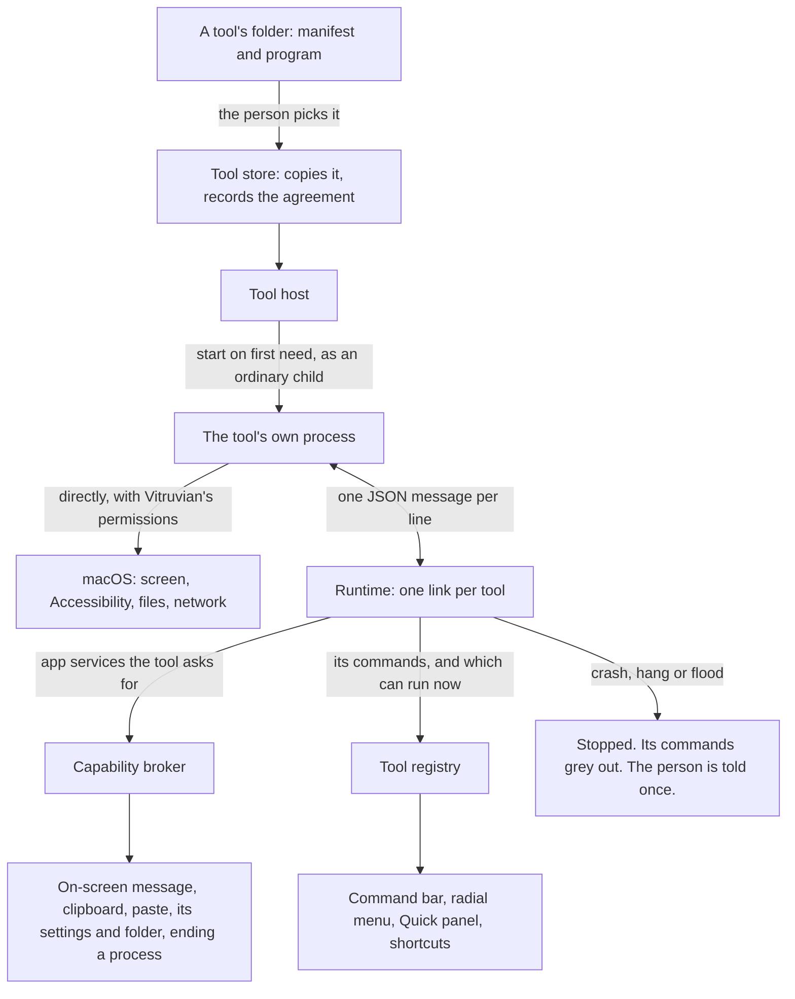

# Vitruvian sub-project 3: tools that run as their own programs — design

**Date:** 2026-10-10 · **Status:** draft, awaiting James; the trust model in
section 3 decided by James 2026-10-10 · **Owner:** compass
**Scope:** `apps/desktop/vitruvian`, and a new `packages/vitruvian-sdk`.
**Parents:** `2026-10-08-vitruvian-tool-platform-design.md` (sections 5 to 10,
and sub-project 3 in section 12); `2026-10-09-vitruvian-broker-and-bundled-tools-design.md`;
`2026-10-10-vitruvian-tool-permission-spikes.md`.

An earlier draft of this document confined every outside tool to a sandbox.
James decided against that on 2026-10-10. Section 3 says what replaced it.

## 1. What this is

Sub-projects 1 and 2 made a feature into a tool that lives inside the app. This
one lets a tool live outside it: a separate program, written by anyone, in any
language, that the app starts, talks to, and can stop without being disturbed.

It delivers four things:

- a **protocol**: the messages a tool and the app exchange;
- a **runtime** in the app that installs, starts, supervises and stops such
  tools;
- an **agreement sheet** and a place in Settings to see and remove them;
- an **SDK**: the protocol written down, a Swift library, a command-line
  tool, two samples, and tests any tool can be run against.

**Done when** all of these hold:

1. A sample tool, written using only what the SDK publishes, installs from a
   folder, shows its agreement sheet, and runs its commands from the command
   bar, the radial menu, the Quick panel and a shortcut.
2. That tool can do what a built-in feature can: a second sample reads the
   title of the window in front, with no permission prompt of its own.
3. Killing a tool, hanging it, or making it flood the app leaves the app
   responsive, and the person is told once.
4. A release build with no outside tool installed looks and behaves as it
   does today.
5. The by-hand checks in section 12 are recorded with the Mac and macOS
   version they were run on.

## 2. What the assessment found

Two read-only assessments ran on 2026-10-10 against `main` at `d1b2a2357`,
after the two spikes. Counts marked *search* come from text searches.

**The sub-project as first drawn is several times too big.** The parent
design gave it the runtime, the SDK, the consent screen, three kinds of island
contribution, and two features moved out as external tools. Measured:

| Piece | What it touches |
|---|---|
| Island notice | 8 files, 4 exhaustive switches. The two notice views are shared. |
| Island page | 5 files, 11 exhaustive switches, and its size is a hard-coded arm of one central switch. No page today is drawn from data. |
| Island strip | 16 files, 11 exhaustive switches, a hand-built view for each of two shapes, and a separate enum for the lock screen. |
| Screen text capture, moved out | The feature's own code is one 148-line file. It stands on a 2,157-line selection overlay shared with screenshots, the recorder and the colour picker. It has no tests of its own. |
| AI agents in the island, moved out | 21 files and 10,140 lines, 20 preferences, about 39 switch arms in 14 other files, three subprocesses, file watching across six apps' folders, and an embedded chat view. |

This is about the size of the work, not about trust, and the decision in
section 3 does not change it.

**What already fits.**

- The command bar, the radial menu, the Quick panel and shortcuts work on
  text command ids. Saved layouts keep an id they do not recognise. A tool
  with an id like `com.acme.deploys` needs no change in any of them.
- The app already runs other people's programs in three places: a script row
  in the command bar, the music adapter, and the Codex command-line tool,
  which speaks JSON lines over standard input and output. All three run with
  the app's permissions, as an outside tool now will.
- `packages/peripherals` already holds a hand-written JSON-RPC server, one
  message per line.

**What fights it.**

- Every list asks a command "can you run?" while it draws. Today that is a
  direct call on the main thread. A tool in another process cannot be asked
  that way without stalling the app.
- The tool host keys tools by Swift type. An outside tool has none.
- "Installed" for a tool whose id is not a built-in feature is always true.
- Five kinds of thing in a manifest are closed Swift lists. A manifest from
  outside can name something the app does not know.
- A tool cannot write a preference and has no folder of its own.
- A new sentence on screen costs 15 translations and about 17 lines.
- The repository's licence check enforces MIT headers outside the app. The
  parent design chose Apache-2.0 for the SDK.

## 3. The trust model: a tool is trusted like an app

**Decided by James, 2026-10-10.** A tool from outside has the same reach as a
built-in feature. No sandbox, no reduced permissions.

How: the app starts a tool the ordinary way. Spike 1 showed what that means on
macOS: the tool has every privacy permission Vitruvian has (Accessibility,
Screen Recording, and the rest), with no prompt of its own. It is also an
ordinary program running as the person: it can read and write their files and
reach the network.

This is how extensions work in VS Code and in Raycast. Installing one is
trusting it.

**What follows from it.**

- **The agreement sheet says one true thing**: this tool can do anything
  Vitruvian can. It does not offer a list of permissions to tick, because
  macOS would not hold the tool to one.
- **A bad tool is as bad as a bad app.** It can read the screen, type into
  other apps, read files and send them anywhere, and nothing shows. The only
  defence is where tools come from.
- **So there is no public store.** A tool is added by pointing at a folder,
  and later a Git address. That is deliberate, not only a consequence of
  having no Developer ID.
- **What a tool does is done in Vitruvian's name.** If a tool triggers a
  macOS permission prompt, the prompt says Vitruvian is asking. A permission
  granted for a tool's sake is granted to Vitruvian and to every tool.
- **Vitruvian's permissions still reset on each update**, as today. After an
  update a tool has them back when the app does, with nothing extra to do.
- **Nothing here changes built-in features**, the broker's rules for them, or
  the lint that holds them to the broker.

**What stays from the spikes.** The option that makes a launched program
answer for itself, and the sandbox, both work on macOS 27 with an ad hoc
build. They are not used. If a "confined" kind of tool is ever wanted, for
tools from people James does not know, the mechanism is proven and the
earlier draft of this document in the repository's history describes it.

## 4. Decisions this spec makes

Each is a default, with what it costs if it is wrong. Decision 1 is James's.

| # | Decision | Why | If wrong |
|---|---|---|---|
| 1 | **A tool is trusted like an app** (section 3). | James, 2026-10-10: outside tools get the reach of built-in ones, with no compromise. | A bad tool can do anything Vitruvian can. |
| 2 | **This sub-project is the runtime, the agreement sheet and the SDK. Nothing on the island, and no feature moved out.** | Section 2. Each island piece and each migration is as large as everything else here. | The first outside tools add commands and messages, not island content. Section 13. |
| 3 | **One message per line**, JSON-RPC 2.0, on standard input and output. The parent said length-prefixed. | It is what the Model Context Protocol uses for programs started this way, what Codex and the peripherals server already do here, and what a tool author can write in ten lines of any language. | A message containing a raw newline breaks the stream. JSON never needs one; the library never writes one. |
| 4 | **The app never waits on a tool to draw.** A tool tells the app which of its commands can run now; the app keeps the last answer. | Lists ask while drawing. | A row can be a moment out of date. Running a command the tool then refuses beeps, as a built-in one does. |
| 5 | **A tool may use the system directly, and may also ask the app.** The app offers what is better done through it: its on-screen message, the clipboard handled the way clipboard history expects, a paste, settings and a folder, ending a process with the admin prompt. | Full reach comes from decision 1. These are conveniences, so a tool behaves like a built-in feature without re-implementing it. | None. A tool that ignores them still works. |
| 6 | **A manifest lists the app services a tool calls**, and the app refuses one that is not listed. It is not a list of what the tool is allowed to do. | One code path with built-in tools, and a wrong manifest is caught the first time it runs. | A reader takes the list for a permission list. The sheet's wording (section 8) is written to prevent that. |
| 7 | **`storage` gains writing and a folder**, both per tool. | A tool with no memory is a script. Keys are held under the tool's id so two tools do not collide by accident. | None. Built-in tools keep their existing keys. |
| 8 | **A tool gets a shortcut the way part 3 built it**: its command asks for the shortcut surface and the person records one. | Already built, and already checked against every other shortcut in the app. | A tool can still register a key of its own, in its own process, outside that check. The SDK's documentation says to use the surface instead. |
| 9 | **Installing is choosing a folder.** The app copies it into its own support folder and runs the copy. | The original can move or be deleted. No Developer ID, so no signed packages. | Updating a tool is choosing its folder again. Sub-project 4 adds a Git address. The copy is for stability, not safety: a trusted tool can rewrite itself. |
| 10 | **Tool-supplied words are shown as the tool wrote them.** A manifest may carry its name in several languages; English is required. | The app cannot translate a stranger's sentence. It already shows other programs' text unlocalised: script output, process names, GitHub data. | A tool in a language the person does not read. The hub shows the publisher beside it. |
| 11 | **The SDK is MIT.** The parent design said Apache-2.0. | The repository's licence check enforces MIT headers on everything outside the app, and `packages/peripherals`, the precedent the parent names, is MIT. | No patent grant. If that matters later, the check gains an exception; nothing here depends on it. |
| 12 | **The app links the SDK's protocol types.** One definition of each message, used by both sides. | Two hand-kept copies drift. A GPL app may link an MIT library; the app already links one. | A change to a message is a change in two places' build. That is the point. |

## 5. Architecture



New parts, each with one job:

- **Tool store** (`Services/Platform/External/ExternalToolStore.swift`). The
  list of installed outside tools, where their files are, and that the person
  agreed. It answers "installed?" for the broker.
- **Runtime** (`Services/Platform/External/`). One link per running tool:
  starts it, reads and writes messages, enforces deadlines and limits,
  restarts with a growing wait, and stops it.
- **Protocol types** (`packages/vitruvian-sdk`, a Swift module both sides
  link).
- **Agreement sheet and the tools section of Settings** (`UI/Settings/`).

Changed parts:

- **Tool host.** It holds "something that can start, stop, run a command and
  say what can run", with two kinds behind it: a compiled-in tool, as today,
  and a link to an outside one.
- **Broker.** "Installed" asks the tool store for an outside tool. Each
  operation an outside tool may call gets a form that takes and returns only
  values.
- **Manifest.** It can be read from JSON, and refuses what it does not know.

## 6. A tool on disk

A folder with a manifest and a program:

```
deploys/
  vitruvian-tool.json
  bin/deploys
```

```json
{
  "id": "com.acme.deploys",
  "name": { "en": "Deploys", "fr": "Déploiements" },
  "description": { "en": "Copies the address of your latest deploy." },
  "version": "1.2.0",
  "protocol": "1",
  "publisher": "Acme",
  "license": "MIT",
  "icon": "shippingbox",
  "uses": ["clipboard.write", "notify", "storage"],
  "contributes": {
    "commands": [
      { "id": "copyLatest", "title": { "en": "Copy latest deploy" }, "icon": "link",
        "surfaces": ["commandBar", "radial", "shortcut"] }
    ]
  },
  "preferences": [ { "id": "project", "type": "string", "default": "" } ],
  "activation": ["onCommand"],
  "runtime": { "kind": "external", "exec": "bin/deploys" }
}
```

Rules:

- **The id has a dot** and is at most 128 characters. An id with no dot is a
  built-in feature's and is refused.
- **`uses` names the app services the tool calls** (decision 6). For an
  outside tool it carries no reasons: there is nothing to approve one by one.
- **Unknown fields are ignored.** That is how a later protocol adds one.
- **An unknown service, surface or preference type refuses the install**,
  with a message that names it. The alternative, installing with part of the
  manifest dropped, leaves a tool that half works.
- **`exec` stays inside the folder.** A path that leaves it is refused.
- **The icon is an SF Symbol name.** One the Mac does not have draws as a
  plain puzzle piece, as an unknown command does today.
- **Size limits**: the manifest 64 KB, 32 commands, 16 preferences. These
  keep the app's lists sane; they are not a safety measure.

Installed, it lives in the app's support folder:

```
~/Library/Application Support/<bundle id>/Tools/com.acme.deploys/     its files
~/Library/Application Support/<bundle id>/ToolData/com.acme.deploys/  a folder for what it saves
```

## 7. Starting and holding a tool

**Starting.** The app starts the tool's program as an ordinary child process,
in the tool's data folder, with the person's environment. Its standard input
and output are the link to the app. Its standard error is its log.

**When it runs** follows the manifest:

- `onCommand`: started the first time one of its commands runs. Stopped after
  two minutes with nothing asked of it.
- `onLaunch`: started with the app, kept running.

A tool that is removed or switched off in Settings is stopped at once.

**Stopping** is: say goodbye, close its input, wait two seconds, end it, wait
one more, kill it. The app does this for every running tool at quit. A tool
that started programs of its own is responsible for them; the app ends the
process it started.

**When it misbehaves.** Trusting a tool does not mean letting it take the app
down. These limits protect the app's responsiveness, not the person's data:

| What happens | What the app does |
|---|---|
| It exits or crashes | Its commands grey out. It is started again at the next need, after a wait that doubles from 1 second to 5 minutes. Three crashes within a minute and it stays stopped until the person starts it from Settings. |
| It does not answer within the deadline (2 seconds, 10 for the first message) | The request fails. Three in a row and it is treated as crashed. |
| It sends a line over 1 MB, or more than 200 messages a second for 5 seconds | Stopped, treated as crashed. |
| It sends something that is not a message | That line is dropped and counted. Twenty in a minute and it is stopped. |
| It writes to standard error | Kept, up to 256 KB per tool, where the person can read it in Settings. Never shown as a message. |

The person is told once per tool per launch, with one sentence, that a tool
stopped working. The command bar, the radial menu and every built-in feature
carry on.

## 8. The agreement sheet, and where tools live in Settings

This is new screen, so its layout is settled with mock-ups at the planning
step, before code. What it must do:

**Adding a tool.** The Features hub gets a section for tools from outside,
with an "Add a tool" button that opens a folder picker. The app reads the
manifest and shows one sheet before anything is copied or run:

- the tool's name, publisher, version and description, as the tool wrote them;
- the commands it adds;
- **one plain statement, in the app's words: this tool is a separate program.
  It can do anything Vitruvian can on this Mac, including reading the screen,
  controlling other apps, reading your files and using the network. Vitruvian
  does not limit or check what it does. Add it only if you trust who made it.**
- Add, and Cancel.

The sheet shows no list of permissions. A list would read as a promise the
app cannot keep.

**Afterwards.** Each installed tool has a row: name, publisher, a switch, and
a detail view with its commands, its log, where its files are, and Remove.
Remove deletes its files and, after asking, what it saved.

**When a tool changes.** Choosing the folder again for an installed id shows
the old and new version and asks once more.

**A downloaded tool.** macOS quarantines a folder downloaded from the web, and
its program will not start. The app says so and says how to clear it. It
never clears it for the person.

**The words.** The app's own sentences here are new and are written in all
15 languages: about 15 of them, counted at the planning step. The tool's
words are shown as given (decision 10).

**With no outside tool installed** the hub shows one quiet line and the
button. Nothing else in the app changes.

`docs/PRIVACY.md` gains a section in the change that ships this: the app's
own promises and its list of network connections stand, and cover the app
alone. A tool from outside is a separate program the person chose to add. It
has the app's permissions and makes its own connections, which the app
neither lists nor limits.

## 9. The protocol, version 1

JSON-RPC 2.0. One message per line. UTF-8. The tool's standard output carries
nothing else.

**The app starts.** It sends `initialize` with the protocol versions it
speaks, the language in use, and the path of the tool's data folder. The tool
answers with the version it picked and its own version. A tool that picks a
version the app did not offer is stopped. Nothing else may be sent first.

**What the app asks the tool:**

| Message | Meaning | Answer |
|---|---|---|
| `initialize` | as above | the version chosen |
| `command/run` | run this command | done, or refused with a reason |
| `preferences/changed` | these values changed | none (a notice) |
| `language/changed` | the person changed language | none (a notice) |
| `shutdown` | stop | none; the tool exits |

**What the tool asks the app.** Each is optional: a tool may do the same
thing itself (decision 5).

| Message | In `uses` | Meaning |
|---|---|---|
| `commands/state` | none | which of its commands can run now. A notice; sent whenever that changes. Until the first one, all can. |
| `notify/hud` | `notify` | show the app's short on-screen message, with a symbol |
| `notify/beep` | `notify` | the alert sound |
| `open/url` | `open` | open a link |
| `clipboard/readText` | `clipboard.read` | the clipboard's text, read on the app's clipboard lane |
| `clipboard/writeText` | `clipboard.write` | replace the clipboard with this text, marked as Vitruvian's so clipboard history files it correctly |
| `keystrokes/paste` | `keystrokes` | paste this text into the app in front, with the app's tuned paste |
| `keystrokes/pressMenuItem` | `keystrokes` | press the menu item with this key equivalent in the app in front |
| `processes/terminate` | `processes` | end this process, with the app's checks and its admin prompt when needed |
| `storage/get`, `storage/set` | `storage` | read or write one of the preferences the manifest declares |
| `log` | none | a line for the tool's log in Settings |

**A refusal** is a JSON-RPC error with one of the broker's reasons as its
code: not listed in `uses`, not installed, a macOS permission Vitruvian does
not have, or not available right now. A tool must cope with any request
being refused.

**Growing it.** A new message or field is added without a new version when an
old tool can ignore it. Anything an old tool would misread needs version 2,
and the app goes on offering 1. This is the parent design's section 12.1,
unchanged.

**What version 1 leaves out, for reasons of design and not of trust:**

- **Rewriting the clipboard as it changes.** The app would have to ask the
  tool three questions in the middle of a job on a lane every clipboard
  feature shares, and wait. That needs a deadline design first.
- **Binding a hotkey by itself.** Decision 8.
- **Anything on the island**, live command-bar rows for a typed query, and a
  command that takes an argument.

## 10. Inside the app: what changes

- **`ToolManifest` from JSON**, in `Core`, with the rules of section 6. The
  closed lists stay closed: reading a name the app does not know is a
  refusal the sheet can show, never a crash.
- **`ToolHost`** holds hosted tools behind one small protocol (start, stop,
  run a command, which commands can run), with the compiled-in kind and the
  outside kind as its two implementations. The compiled-in kind is today's
  code, unchanged in behaviour.
- **The registry's "can it run?"** for an outside tool reads the last
  `commands/state` and whether the tool is installed, switched on and not
  stopped for misbehaving. It never sends a message.
- **Broker operations for outside tools** take and return values only, with a
  reply where today's answer at once. The compiled-in forms stay as they are.
- **`storage`**: `set`, keys held under the tool's id, and the data folder.
- **`isInstalled`** in the broker asks the tool store for an id with a dot.
  The `?? true` for an unknown id becomes `false`.
- **Lints**: the rule that the broker names no tool also covers the runtime.
  The rule that holds a migrated built-in tool to the broker is unchanged:
  it is about our own code staying honest, and an outside tool is not our
  code.

## 11. The SDK

`packages/vitruvian-sdk`, MIT, beside `packages/peripherals` and built the
same way: a hand-written `BUILD` that mirrors `Package.swift`, its own
pipeline unit.

| Piece | What it is |
|---|---|
| `protocol/` | The manifest and every message as JSON Schema, and a plain-language description of each. The source of truth. |
| `Sources/VitruvianToolProtocol` | The same messages as Swift types. The app links this. |
| `Sources/VitruvianToolKit` | A library a Swift tool is written with: declare commands, handle them, call the app. |
| `Sources/vitruvian-tool` | A command-line tool: `init` (a new tool from a template), `validate` (check a folder the way the app will), `run` (play the app's side in a terminal, so a tool can be developed without the app). |
| `Samples/` | Three sample tools: one in Swift using the kit; one in plain Python using nothing, to prove the protocol does not need the kit; one that reads the front window's title directly, to prove decision 1. |
| `Conformance/` | A scripted app's side that any tool can be run against: the handshake, a refusal, a shutdown. |

Tests check that the Swift types and the schemas describe the same messages,
so the two cannot drift.

Not in this sub-project: publishing the package anywhere, a TypeScript kit,
and versioned documentation on a website. Sub-project 4.

## 12. Testing

Automated:

- **Manifest from JSON**: every rule of section 6, including each refusal.
- **Runtime against a scripted fake tool** (no real process): the handshake,
  a version the app did not offer, an exit, no answer, a flood, a line too
  long, a line that is not a message, and that each ends as section 7 says
  with the registry showing the right state.
- **Runtime against a real child process**, on a Mac runner: the Python
  sample is started, runs a command, and is stopped; killed mid-command, the
  app's side recovers; at shutdown no process is left.
- **Broker for an outside tool**: each operation's refusals and its success;
  a service not in `uses` is refused.
- **Conformance**: the Swift sample and the Python sample both pass.
- **Release build unchanged**: with no outside tool installed, every list of
  commands is what it was.

By hand, recorded in each pull request with the Mac and macOS version:

- Add the sample tool from a folder; the sheet says what section 8 says.
- Run its command from the command bar, the radial menu, the Quick panel and
  a recorded shortcut.
- Add the sample that reads the front window's title. It works, and no
  permission prompt appears. This is the check for decision 1.
- Kill a tool from Activity Monitor while idle and while running a command.
- Switch a tool off; its commands are gone everywhere. Remove it; its files
  are deleted.
- Quit the app with a tool running; no process is left behind.
- Update the app (permissions reset, as today); once Vitruvian has them
  back, the tool does too, with nothing extra to do.

## 13. Out of scope, and where it goes

None of these is held back for safety. Each is its own piece of work.

| Left out | Why | Where |
|---|---|---|
| Island notice | Smallest island piece: 8 files, 4 switches | The first thing after this sub-project |
| Island strip and page | Need the content vocabulary, and collapsing the island's renderers toward one first | Their own sub-project |
| Moving AI agents out | 10,000 lines, and needs all three island pieces | After the island page exists |
| Moving screen text capture out | Its own code is small; it stands on a selection overlay shared with three other tools | After a shared capture service is cut out of that overlay |
| Rewriting the clipboard as it changes | The app asks the tool mid-job on a shared lane | Needs a deadline design first |
| Install from a Git address, publishing the SDK, a TypeScript kit | | Sub-project 4 |
| A confined kind of tool, for tools from strangers | Decided against for now (section 3). The mechanism is proven. | Only if tools from people James does not know are ever wanted |

## 14. Risks

- **A bad tool.** It has everything Vitruvian has, silently. This is the
  accepted cost of decision 1. What limits it: tools are added by hand from
  a folder, the sheet says plainly what adding one means, and there is no
  store.
- **Blame.** macOS and the person see Vitruvian doing whatever a tool does.
  A tool that misbehaves makes the app look as if it did.
- **A tool can change itself after it is added.** The app runs a copy, but a
  trusted program can rewrite that copy. The app does not pretend otherwise.
- **The cost of words.** About 15 sentences in 15 languages.
- **Scope.** Section 15 cuts this into four stages. With no launcher and no
  sandbox, the risky part is now the runtime's handling of a misbehaving
  process, which is ordinary engineering and well covered by tests.

## 15. Stages

Each is its own plan and pull request.

| Stage | Builds | Can a person see it? |
|---|---|---|
| A | The SDK package with the protocol, its Swift types and the conformance script. The manifest read from JSON. | No |
| B | The runtime, tested against the fake tool and, on a Mac runner, a real child process. The tool host's two kinds. The broker's forms for outside tools; `storage` writing and the folder. A development switch installs one tool from a folder with no screen. | No, without the switch |
| C | The tool store, the agreement sheet, the tools section of Settings, the privacy section. Mock-ups first. | Yes |
| D | The tool kit, the command-line tool, the three samples, the documentation. The by-hand checks. | Only to a tool's author |

## 16. Open questions

Each has a default. Unless James says otherwise, the default stands and the
stage A plan is written against it.

1. **Nothing on the island and no feature moved out in this sub-project**
   (decision 2). *Default: yes. It is about size, not trust.*
2. **MIT for the SDK**, not Apache-2.0 (decision 11). *Default: MIT, because
   the repository's licence check enforces it.*
3. **One message per line**, not length-prefixed (decision 3). *Default: yes.*
4. **The sheet shows one statement and no permission list** (section 8).
   *Default: yes.*
5. **A tool records its shortcut through the app, and does not register its
   own** (decision 8). *Default: yes. The app offers no message for
   registering a key, so that a tool's shortcut is checked against every
   other one. It cannot stop a tool registering one by itself.*
6. **Remove deletes what a tool saved, after asking.** *Default: yes.*
