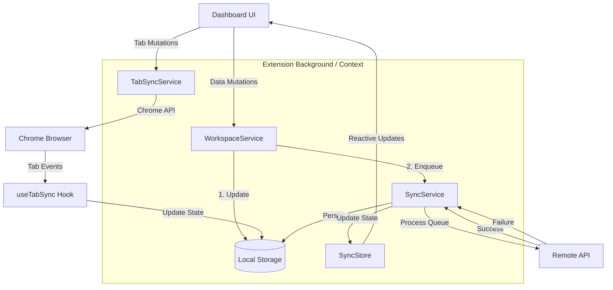
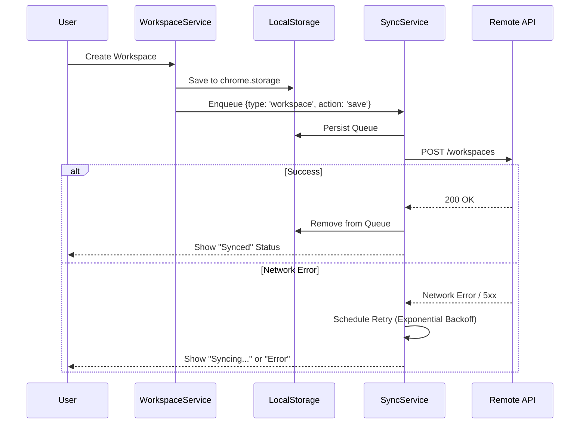
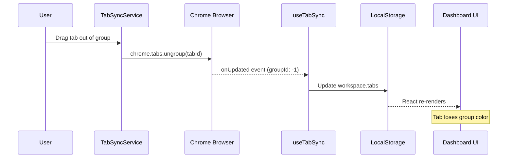
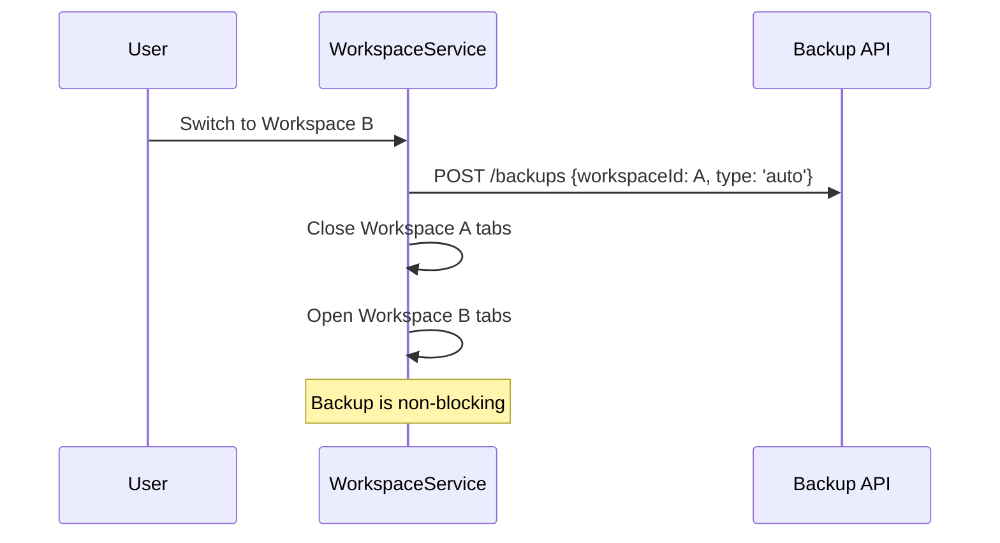
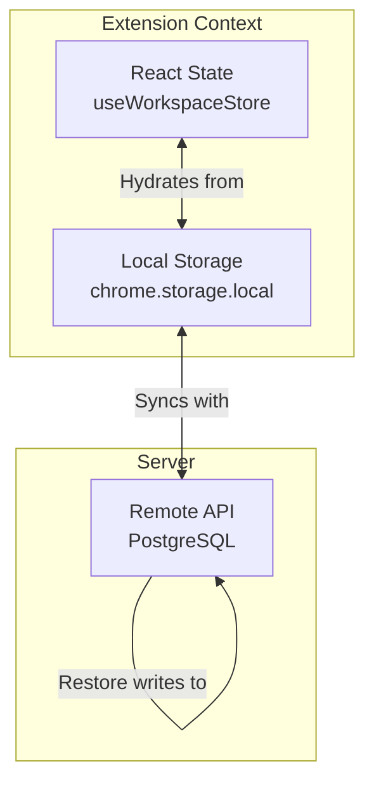
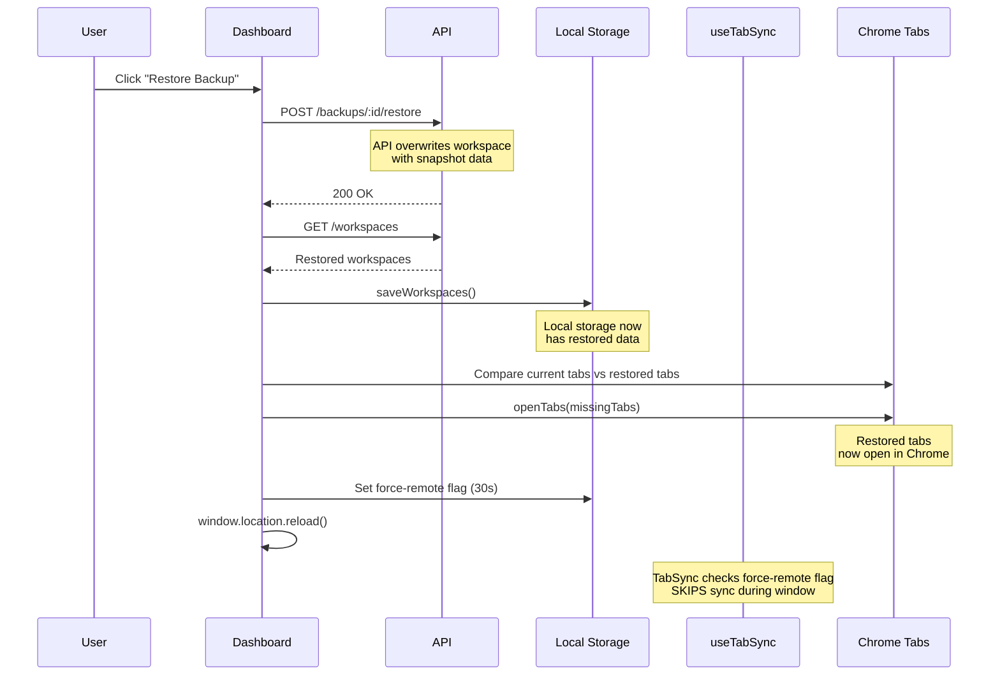
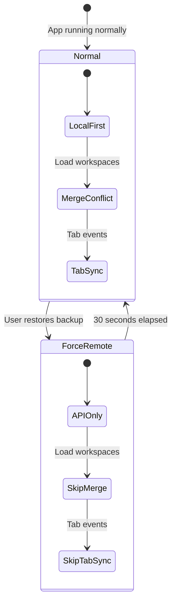
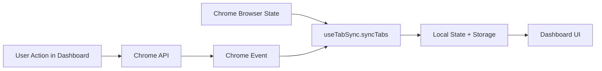

# Sync Strategy & Architecture

## Overview

Tabula uses a **Local-First, Robust Sync** strategy to ensure users never lose data, regardless of
network conditions. The system is designed to provide immediate UI feedback while reliable
synchronization happens in the background.

## Core Principles

1.  **Local-First (for Workspace Data)**: Workspace mutations (resources, notes, tasks, settings)
    are immediately applied to local storage (chrome.storage.local) and the UI updates instantly.
2.  **Queue-Based Sync**: Mutations are queued for background synchronization with the remote API.
3.  **Robust Retry**: Failed operations use exponential backoff to handle transient network issues.
4.  **Persistence**: The operation queue is persisted to disk, ensuring pending changes survive
    browser restarts.
5.  **Visual Feedback**: The user is always aware of the sync status (Synced, Syncing, Error,
    Offline).
6.  **Chrome as Source of Truth for Tabs**: For browser tab state (tabs, tab groups, positions),
    Chrome's live state is the authority. All tab mutations go through Chrome APIs first, and Chrome
    events drive workspace state updates.

## Architecture

The sync system consists of five main components:

1.  **WorkspaceService**: The primary entry point for data mutations. It updates local storage and
    enqueues operations in the SyncService.
2.  **SyncService**: A singleton service that manages the operation queue, processes sync tasks,
    handles retries, and monitors network status.
3.  **SyncStore (Zustand)**: Provides reactive state to the UI components given the current status
    of the SyncService.
4.  **TabSyncService**: A unified layer for Chrome tab mutations. All Dashboard actions go through
    this service, which calls Chrome APIs first and lets events drive workspace updates.
5.  **useTabSync (Hook)**: Listens to Chrome tab events (created, updated, removed, moved) and syncs
    browser state to the workspace. This is the bridge between Chrome and local storage.



## Sync Flow & Lifecycle

### 1. Mutation Flow

When a user performs an action (e.g., creates a workspace):

1.  **Local Update**: The new workspace is added to `chrome.storage.local`.
2.  **Queueing**: A `save` operation is added to the SyncService queue.
3.  **Processing**: If online, the SyncService attempts to send the data to the API.



### 2. Tab Mutation Flow

When a user performs a tab action in the Dashboard (e.g., drags a tab to ungroup it):

1.  **Chrome API Call**: TabSyncService calls the Chrome tabs API directly.
2.  **Chrome Event**: Chrome fires an event (onUpdated, onMoved, etc.).
3.  **Sync**: useTabSync hook receives the event and syncs to local storage.



## Conflict Resolution

We utilize a **Last-Modified-Wins** strategy based on high-precision client-side timestamps.

### Data Model

Every synchronized entity (`Workspace`, `SpaceGroup`) includes an `updatedAt` timestamp:

```typescript
interface SpaceGroup {
  id: string;
  title: string;
  // ... other fields
  updatedAt: number; // Unix timestamp
}
```

### Resolution Logic

When fetching data from the server (e.g., on startup or manual refresh):

1.  **Merge**: We compare the local object and remote object by ID.
2.  **Decision**:
    - If `remote.updatedAt > local.updatedAt`: Overwrite local with remote.
    - If `local.updatedAt > remote.updatedAt`: Keep local (and potentially queue a sync up).
    - If ID exists only in remote: Add to local.
    - If ID exists only in local: Keep local (it might be a new unsynced item).

## Retry Mechanism

The SyncService implements **Exponential Backoff** to prevent battery drain and API spam during
outages.

- **Initial Retry**: 1 second
- **Backoff Factor**: 2x
- **Max Delay**: 30 seconds
- **Max Retries**: 5 attempts before marking as "Error"

In "Error" state, the user can purely manually retry via the UI, or the system will auto-retry upon
detecting an `online` event.

## Sync States

The UI reflects the internal state representation:

- **Idle / Synced**: Queue is empty, last operation successful.
- **Syncing**: Operations are in the queue and being processed.
- **Error**: Retries exhausted for an operation. User intervention (retry button) or network
  recovery needed.
- **Offline**: Browser reports no network connection. Operations are queued but paused.

## Real-Time Sync (SSE)

The SyncService connects to a Server-Sent Events (SSE) stream for real-time notifications from other
devices.

### Connection

```typescript
// Connect to SSE stream
SyncService.connectToSSE();

// Subscribe to events in UI components
const unsubscribe = SyncService.subscribeToSSE((event) => {
  if (event.type === 'workspace_updated') {
    // Refresh workspace data
  }
});
```

### Event Types

| Event               | Description                         |
| ------------------- | ----------------------------------- |
| `connected`         | Initial connection established      |
| `workspace_updated` | Workspace changed on another device |
| `backup_created`    | New backup created (auto or manual) |

### Reconnection

On connection error, the service schedules automatic reconnection with a 5-second delay.

## Auto-Backup on Workspace Switch

When a user switches workspaces, the current workspace is automatically backed up:



### Backup Behavior

- **Automatic**: Creates backup before every workspace switch (if logged in)
- **Non-blocking**: Failures are logged but don't prevent the switch
- **Type**: Backups are tagged with `type: 'auto'` for identification
- **Tier-based Retention**: Backup retention depends on user tier (30/90/365 days)

---

## Backup Restore Flow

Restoring a backup is a complex operation that involves multiple state layers and requires careful
handling to prevent race conditions.

### State Layers



### Restore Sequence



---

## Race Conditions & Solutions

### Problem 1: Tab Sync Overwrites Restored Tabs

**Symptom**: After restore, tabs appear briefly then disappear on refresh.

**Root Cause**: `useTabSync` continuously syncs current browser tabs to workspace state. After
restore, the tab sync would capture current browser tabs (which don't include restored tabs) and
overwrite the restored data.

**Solution**: "Force-Remote Window" pattern (see below).

### Problem 2: Conflict Resolution Prefers Stale Local Data

**Symptom**: Restore completes but old data reappears on refresh.

**Root Cause**: The conflict resolution logic (`getAllWorkspaces`) merges local and remote data
using `updatedAt` timestamps. If local data has a newer timestamp, it wins over restored data.

**Solution**: Set `tabula_force_remote_until` flag to bypass conflict resolution.

### Problem 3: Restored Tabs Not Opening in Browser

**Symptom**: Tabs appear in Active Tabs panel but not in browser tab bar.

**Root Cause**: "Active Tabs" are real-time synced with actual browser tabs. Restoring only puts
data in storage - it doesn't actually open Chrome tabs.

**Solution**: After restore, explicitly call `TabService.openTabs()` for tabs not currently in
browser.

---

## Force-Remote Window Pattern

The "force-remote window" is a time-based pattern that temporarily disables local-first behaviors to
allow restored data to take precedence.

### Implementation

```typescript
// Set the flag (30-second window)
const forceRemoteUntil = Date.now() + 30000;
await chrome.storage.local.set({ tabula_force_remote_until: forceRemoteUntil });
```

### Where It's Checked

1. **`WorkspaceService.getAllWorkspaces()`** - Skips local/remote merge, uses API data directly
2. **`useTabSync.syncTabs()`** - Skips tab sync entirely to preserve restored tabs

### Flow Diagram



---

## Testing Strategy

### Unit Tests That Prevent Regressions

| Test File                | What It Tests                                     |
| ------------------------ | ------------------------------------------------- |
| `useTabSync.test.ts`     | Tab sync skipping during force-remote window      |
| `WorkspaceSync.test.ts`  | Conflict resolution logic, force-remote bypassing |
| `backup.routes.test.ts`  | API backup/restore endpoints                      |
| `backup.service.test.ts` | Snapshot creation and restoration                 |

### Key Test Patterns

**1. Force-Remote Flag Mocking**

```typescript
// Mock force-remote being active
(chrome.storage.local.get as jest.Mock).mockResolvedValue({
  tabula_force_remote_until: Date.now() + 10000, // Active
});

// Verify sync is skipped
await result.current.syncTabs();
expect(TabService.getCurrentTabs).not.toHaveBeenCalled();
```

**2. Conflict Resolution Testing**

```typescript
// Set up local with older timestamp
const localWorkspace = { id: 'ws1', updatedAt: 1000 };
const remoteWorkspace = { id: 'ws1', updatedAt: 2000 };

// Verify remote wins
const result = await WorkspaceSync.mergeWorkspaces([localWorkspace], [remoteWorkspace]);
expect(result[0].updatedAt).toBe(2000);
```

### E2E Tests

- `backup-restore.spec.ts` - Full backup/restore flow with browser verification
- `sync-edge-cases.spec.ts` - Race condition scenarios

---

## Recommendations for Improvement

### 1. Extend Force-Remote to More Services

Currently, only `getAllWorkspaces` and `useTabSync` check the force-remote flag. Consider adding
checks to:

- Resource fetching
- Space group loading
- Any other local-first services

### 2. Add Restore Progress Indicator

The restore process has multiple async steps. A progress indicator would help users understand
what's happening.

### 3. Consider Per-Workspace Force-Remote

The current implementation is global. A per-workspace flag would allow more targeted control.

### 4. Add Automated Regression Tests

Create a dedicated E2E test that:

1. Creates a specific state
2. Makes a backup
3. Changes the state
4. Restores the backup
5. Verifies the original state is restored (including browser tabs)

### 5. Add Telemetry for Restore Failures

Log restore failures to identify common issues:

- How often does conflict resolution override restored data?
- How often do tabs fail to open?

---

## Dashboard UI Stale State Management

Beyond cloud sync, the Dashboard UI must manage stale local state when interacting with Chrome's
real-time browser state (tabs, tab groups).

### Core Principle: Chrome as Authority

> **Chrome's current state always takes precedence** over stored/cached state for entities that
> already exist in storage.



### Pattern 1: Chrome-First Mutations

❌ **Anti-pattern (Causes Stale State):**

```typescript
// Optimistically update local state
setTabs(newTabs);
// Then update Chrome
await chrome.tabs.move(tabId, { index });
// Problem: If Chrome API fails, local state is stale
```

✅ **Correct Pattern:**

```typescript
// Only update Chrome
await TabSyncService.moveTab(tabId, newIndex);
// Chrome event → useTabSync.syncTabs → updates local state
```

### Pattern 2: Storage Preservation Guards

When syncing, only preserve cached values for **new entities** not yet in storage:

```typescript
// From useTabSync.ts
const storedTabUrls = new Set(storedTabs.map((t) => t.url).filter(Boolean));

const tabsWithPreservedGroups = currentTabs.map((tab) => {
  // Only preserve groupId for NEW tabs (not in storage yet)
  const isNewTab = tab.url && !storedTabUrls.has(tab.url);
  if (!tab.groupId && isNewTab && storedGroupIdByUrl.has(tab.url)) {
    return { ...tab, groupId: storedGroupIdByUrl.get(tab.url) };
  }
  return tab; // Trust Chrome's state for existing tabs
});
```

### Pattern 3: Ref-Based State Access

Event handlers capture closure values at registration time. Using refs ensures handlers always
access current state:

```typescript
const activeWorkspaceRef = useRef<Workspace | null>(null);

// Keep ref in sync with state
useEffect(() => {
  activeWorkspaceRef.current = activeWorkspace;
}, [activeWorkspace]);

// Event handler uses ref (not stale closure)
const handleTabCreated = useCallback(() => {
  const currentWorkspace = activeWorkspaceRef.current; // Always current!
  if (currentWorkspace) {
    /* ... */
  }
}, []);
```

### Pattern 4: Debounced Sync

Prevents excessive updates during rapid changes:

```typescript
const debouncedSync = useCallback(() => {
  clearTimeout(timeoutRef.current);
  timeoutRef.current = setTimeout(syncTabs, debounceMs);
}, [syncTabs, debounceMs]);
```

### Key Stale State Tests

| Test File            | What It Tests                                   |
| -------------------- | ----------------------------------------------- |
| `useTabSync.test.ts` | Ungrouped tabs clear groupId (Chrome authority) |
| `useTabSync.test.ts` | Storage preservation guards for new tabs only   |

### Common Stale State Bugs and Fixes

| Issue                                 | Root Cause                        | Fix                               |
| ------------------------------------- | --------------------------------- | --------------------------------- |
| Tab retains group color after ungroup | Preservation logic too aggressive | Only preserve for new tabs        |
| Wrong workspace tabs after switch     | Stale closure in event handler    | Use refs for state access         |
| Duplicate tabs in UI                  | Race condition during sync        | Add sync lock (`isSyncingRef`)    |
| Old data after restore                | Force-remote window not respected | Check `tabula_force_remote_until` |

---

## Summary

The sync and restore system in Tabula is complex due to the interaction of three state layers
(React, Local Storage, Remote API) and real-time browser state. The key patterns for maintaining
correctness are:

1. **Force-Remote Window**: Temporarily bypass local-first logic after restore
2. **Explicit Tab Opening**: Don't just save tabs - actually open them in Chrome
3. **Comprehensive Testing**: Unit tests for each race condition scenario
4. **Local Storage Priming**: Save restored data to local storage before reload
5. **Chrome-First Mutations**: Let Chrome events drive UI state updates
6. **Storage Preservation Guards**: Only preserve cached values for new entities
