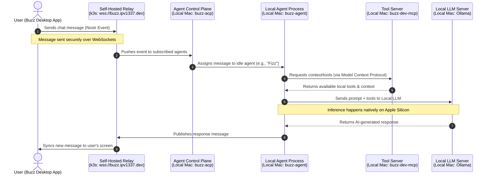

# Buzz Homelab Architecture

This document outlines the architecture and data flow for the self-hosted Buzz relay and local agent pool. It explains the division of labor between the Kubernetes cluster (Homelab) and the user's local macOS machine.

## Architecture Overview

The system is split into two primary environments:
1. **The Relay (Homelab Cluster)**: Acts strictly as a secure, real-time message broker and database.
2. **The Client (Local OS)**: Handles all UI rendering, agent processing, tool execution, and local LLM inference.

## Division of Labor

### 1. The Relay (Homelab Server)
The Buzz Desktop app uses the homelab relay (`wss://buzz.ipv1337.dev`) **exclusively as the database and real-time message broker**. 

* **Trigger**: Used every time a user sends a chat message, creates a channel, updates a profile, or uploads media.
* **Function**: It stores messages in the Postgres database, saves files to MinIO (S3), and instantly broadcasts those messages via WebSockets to any connected clients (users or agents). 
* **Scope**: It does **no AI processing or heavy computing**. It is strictly a fast, secure chat server backend.

### 2. Native OS (Local Mac)
The desktop app relies on the Mac's native OS for all "thinking" and "doing."

* **The UI**: The Buzz app itself runs locally to render the chat interface.
* **The Agents (`buzz-acp` & `buzz-agent`)**: These are background processes running natively on the Mac. They sit silently, watching the Relay for new messages in their subscribed channels.
* **The AI Brain (Ollama)**: When an agent decides to reply, it sends the prompt to the local `ollama` process (`/opt/homebrew/opt/ollama/bin/ollama serve`). The Mac's Apple Silicon churns through the math to generate the text entirely offline, maintaining low system load.
* **The Tools (`buzz-dev-mcp`)**: If an agent is asked to "read a file" or "run a script," it uses the local Model Context Protocol (MCP) server on the Mac to safely interact with the local filesystem and terminal.

**In summary**: The Homelab acts as the "Room" where all participants gather to communicate. The Local Mac provides the "Brain" (Ollama) and the "Hands" (Local Tools) for the personal AI agents sitting in that room.
