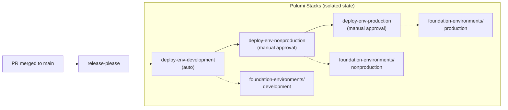

# Promote 2-environments to Live Foundation with Promotion Workflow

## Background

The environments phase (2-environments) introduces per-environment folders (`fldr-development`, `fldr-nonproduction`, `fldr-production`) and their KMS/Secrets projects. In the upstream Terraform foundation, this stage uses a **branch promotion strategy** where three long-lived branches (`development`, `nonproduction`, `production`) each trigger deploys to their respective environments.

Our monorepo can't use environment-specific branches (merging `development → nonproduction` would carry all monorepo changes). Instead, we'll use **Pulumi stacks + GitHub Environment protection rules** to achieve the same sequential promotion flow.

## Architecture: Stacks + Reusable Workflow (Option C)



Each environment is a **separate Pulumi stack** with its own config and state:
- `Pulumi.development.yaml` — deploys `fldr-development`, `prj-d-kms`, `prj-d-secrets`
- `Pulumi.nonproduction.yaml` — deploys `fldr-nonproduction`, `prj-n-kms`, `prj-n-secrets`
- `Pulumi.production.yaml` — deploys `fldr-production`, `prj-p-kms`, `prj-p-secrets`

The reusable workflow chains them with GitHub Environment gates:
- `foundation-env-development` → auto-approve
- `foundation-env-nonproduction` → require manual approval
- `foundation-env-production` → require manual approval

## Key Refactoring Decision

> [!IMPORTANT]
> ### Single-loop → per-stack refactor
> The current example ([main.go](file:///Users/james/Workspace/gh/application/vitruvian/vitruvian-core/pulumi/examples/go-foundation/2-environments/main.go)) deploys **all 3 environments in one `for env := range envCodes` loop** within a single Pulumi stack. For the promotion strategy to work, each environment must be its own stack. This means refactoring `main.go` so it reads `env` and `env_code` from config (instead of hardcoding the loop), and deploying a single environment per invocation.

## Proposed Changes

### Source Code (Pulumi project)

---

#### [NEW] `infrastructure/pulumi/foundation/gcp-environments/`
Copy from [pulumi/examples/go-foundation/2-environments/](file:///Users/james/Workspace/gh/application/vitruvian/vitruvian-core/pulumi/examples/go-foundation/2-environments) with the following modifications:

#### [MODIFY] `main.go`
Refactor to deploy **one environment per stack** instead of looping over all three:
- Read `env` (e.g., `"development"`) and `env_code` (e.g., `"d"`) from Pulumi config
- Remove the `for env, code := range envCodes` loop
- Call `deployEnvBaseline(ctx, cfg, env, envCode, tagsOutput)` once
- Export outputs without env prefix (each stack is its own namespace)

#### [MODIFY] `Pulumi.yaml`
Rename project: `foundation-environments` (matching our naming convention)

#### [NEW] `Pulumi.development.yaml`
```yaml
config:
  foundation-environments:org_id: "90456063361"
  foundation-environments:billing_account: "013EEF-107C95-8E11BD"
  foundation-environments:org_stack_name: "ipv1337/foundation-org/production"
  foundation-environments:parent_folder: "823326946563"
  foundation-environments:env: "development"
  foundation-environments:env_code: "d"
```

#### [NEW] `Pulumi.nonproduction.yaml`
Same as above with `env: "nonproduction"` and `env_code: "n"`

#### [NEW] `Pulumi.production.yaml`
Same as above with `env: "production"` and `env_code: "p"`

#### [NEW] `release-please-config.json` + `.release-please-manifest.json`
Standard release-please config for this foundation stage.

#### [COPY] `env_baseline.go`, `config_test.go`, `go.mod`, `go.sum`
Copied from the example, with import path adjustments as needed.

---

### CI/CD Workflows

---

#### [NEW] `.github/workflows/foundation-env-deploy.yaml` (reusable)
Reusable workflow that accepts `environment` as input and runs `pulumi up` against the matching stack:

```yaml
name: Foundation Environment Deploy (Reusable)
on:
  workflow_call:
    inputs:
      environment:
        required: true
        type: string
        description: "Target environment: development, nonproduction, or production"
    secrets:
      PULUMI_ACCESS_TOKEN: { required: true }
      GCP_WORKLOAD_IDENTITY_PROVIDER: { required: true }
      GCP_SERVICE_ACCOUNT: { required: true }

jobs:
  deploy:
    runs-on: ubuntu-latest
    timeout-minutes: 60
    environment: foundation-env-${{ inputs.environment }}
    env:
      GOWORK: off
    steps:
      - uses: actions/checkout@v7
      - uses: google-github-actions/auth@v3
        with:
          workload_identity_provider: ${{ secrets.GCP_WORKLOAD_IDENTITY_PROVIDER }}
          service_account: ${{ secrets.GCP_SERVICE_ACCOUNT }}
      - uses: pulumi/actions@v7.0.0
      - name: Pulumi up (${{ inputs.environment }})
        env:
          PULUMI_ACCESS_TOKEN: ${{ secrets.PULUMI_ACCESS_TOKEN }}
        working-directory: infrastructure/pulumi/foundation/gcp-environments
        run: |
          set -euo pipefail
          pulumi stack select -c "${{ inputs.environment }}"
          pulumi up --yes --non-interactive
```

#### [MODIFY] `.github/workflows/foundation-release.yaml`
Add release-please job for `gcp-environments` and chain the three deploy jobs:

```yaml
release-gcp-environments:
  # ... release-please config for gcp-environments ...

deploy-env-development:
  needs: release-gcp-environments
  if: needs.release-gcp-environments.outputs.release_created == 'true'
  uses: ./.github/workflows/foundation-env-deploy.yaml
  with: { environment: development }
  secrets: inherit

deploy-env-nonproduction:
  needs: deploy-env-development
  uses: ./.github/workflows/foundation-env-deploy.yaml
  with: { environment: nonproduction }
  secrets: inherit

deploy-env-production:
  needs: deploy-env-nonproduction
  uses: ./.github/workflows/foundation-env-deploy.yaml
  with: { environment: production }
  secrets: inherit
```

---

### GCP Identity Map

#### [MODIFY] `infrastructure/gcp-identities.tsv`
Add entry for the new environments stage:
```
infrastructure/pulumi/foundation/gcp-environments  james@vitruviansoftware.dev  -  Foundation Phase 2 – Environments
```

---

### Documentation

#### [NEW] `docs/foundation-promotion-strategies.md`
Document all three promotion strategies for future reference (see appendix below).

---

## Verification Plan

### Automated Tests
- `bazel test //infrastructure/pulumi/foundation/gcp-environments/...` (config test)
- `bazel build //infrastructure/pulumi/foundation/gcp-environments/...`

### Manual Verification
- `pulumi preview --stack development` from local to verify expected resources
- Merge PR → confirm development auto-deploys
- Approve nonproduction gate → confirm nonproduction deploys
- Approve production gate → confirm production deploys
- Verify folders and projects appear in GCP Console under `fldr-foundation-1`

---

## Appendix: All Three Promotion Strategies

### Option A: Pulumi Stacks with Sequential Deploy (Simplest)
One Pulumi project, three stacks. A single deploy job runs `pulumi up` against each stack in sequence within the same workflow run. GitHub Environment protection rules gate nonproduction and production.

**Pros:** Minimal workflow complexity. Single workflow file.
**Cons:** All environments deploy in a single workflow run. No way to "hold" at nonproduction for days before promoting to production without blocking the workflow.

### Option B: Path-Filtered Promotion via Dispatch (Flexible)
On merge to `main`, only `development` auto-deploys. `workflow_dispatch` events (or `/promote nonproduction` comment triggers) advance to the next environment.

**Pros:** Maximum control. Can wait arbitrarily long between environments. Can re-promote a single environment without touching others.
**Cons:** Requires manual dispatch. Easy to forget or skip an environment. More workflow files to maintain.

### Option C: Reusable Workflow with Chained Deploys (Recommended) ✅
A reusable workflow accepts `environment` as input. The release workflow chains three calls (dev → nonprod → prod), each gated by a GitHub Environment with protection rules. Each environment is a separate Pulumi stack with isolated state and config.

**Pros:** Clean separation. GitHub UI shows pending approvals. Each environment has isolated Pulumi state. Scales to 3-networks and 4-projects. Reusable workflow can also be called from `workflow_dispatch` for ad-hoc deploys.
**Cons:** Slightly more workflow boilerplate than Option A.
