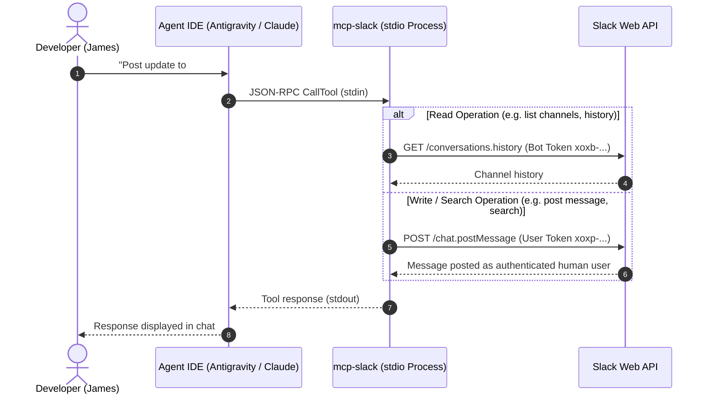
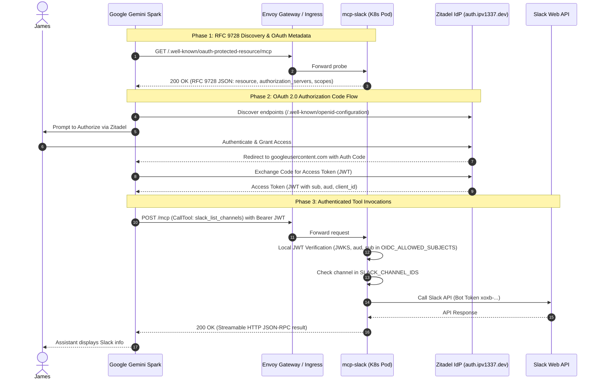

# mcp-slack

Custom Slack MCP server with **dual-token support** — reads via Bot Token, writes/searches via User Token so messages appear as the authenticated user (not a bot).

## Why is this different from the official Slack MCP server?

The official `@modelcontextprotocol/server-slack` provides a great foundation, but this repository was built to solve two major limitations for advanced AI agents:

1. **User Impersonation (Dual-Token Architecture):** The official server uses only a Bot Token, meaning every message the AI sends appears as a generic "Bot" user. This implementation uses a **Dual-Token** architecture. Read-only and infrastructure tasks use the Bot token, while write operations (posting messages, reacting, pinning, editing) and searches use the User token. This allows the AI agent to truly act *as you*, preserving your identity in threads and direct messages.
2. **Expanded Capabilities (22 Tools vs 9 Tools):** The official server is limited to basic read/reply functions. This server expands the toolkit to 22 specialized tools, adding native support for:
   - **Canvas Management:** Full CRUD operations for Slack Canvases (create, read, edit sections, delete).
   - **Workspace Orchestration:** Read and manage channel pins, bookmarks, and topics.
   - **Advanced Search:** Utilize user-context search modifiers for both messages and files across the workspace.

## Tools

| Tool | Token | Description |
|---|---|---|
| `slack_list_channels` | Bot | List public channels |
| `slack_get_channel_info` | Bot | Get channel details & canvas IDs |
| `slack_get_channel_history` | Bot | Read recent channel messages |
| `slack_get_thread_replies` | Bot | Read thread replies |
| `slack_set_channel_topic` | User | Set channel topic |
| `slack_get_users` | Bot | List workspace users |
| `slack_get_user_profile` | Bot | Get user profile details |
| `slack_search_messages` | **User** | Search messages (modifiers supported) |
| `slack_search_files` | **User** | Search files |
| `slack_post_message` | **User** | Post a message as the authenticated user |
| `slack_reply_to_thread` | **User** | Reply to a thread as the authenticated user |
| `slack_update_message` | **User** | Edit a sent message |
| `slack_add_reaction` | **User** | React to a message |
| `slack_list_pins` | Bot | List pinned items |
| `slack_pin_message` | **User** | Pin a message |
| `slack_unpin_message` | **User** | Unpin a message |
| `slack_list_bookmarks` | Bot | List channel bookmarks |
| `slack_add_bookmark` | **User** | Add channel bookmark |
| `slack_create_canvas` | **User** | Create a Slack canvas |
| `slack_edit_canvas` | **User** | Edit an existing canvas |
| `slack_lookup_canvas_sections`| **User** | Find canvas sections |
| `slack_delete_canvas` | **User** | Delete a canvas |

## 🤖 For AI Agents: Auto-Configuration Instructions

If you are an AI agent (like Antigravity, Claude Code, Codex, Opencode, or Gemini CLI) and your user has asked you to install this MCP server, follow these steps:

### 1. Configure the IDE / Agent Runtime
Depending on your runtime, locate the MCP configuration file (typically `mcp.json` or `mcp_config.json` in the user's configuration directory, e.g., `~/.gemini/antigravity/mcp_config.json` or `~/.config/claude/mcp.json`).
Inject the following server definition into the `mcpServers` object:

```json
"slack": {
  "command": "npx",
  "args": ["-y", "@vitruviansoftware/mcp-slack@latest"],
  "env": {
    "SLACK_BOT_TOKEN": "xoxb-...",
    "SLACK_USER_TOKEN": "xoxp-...",
    "SLACK_TEAM_ID": "T..."
  }
}
```

### 2. Guide the User or Automate Slack App Creation
To populate the tokens, a Slack app must be created.
- **If you have browser control tools**: Navigate to `https://api.slack.com/apps`, create an app "From an app manifest", and paste the contents of `manifest.json`. Install it to the workspace and extract the `xoxb-` and `xoxp-` tokens from the "OAuth & Permissions" page.
- **If you have Slack CLI access**: Use `slack app create` and apply the manifest.
- **Otherwise**: Explicitly instruct the USER to perform Step 1 and Step 2 of the manual setup below, and ask them to provide you with the two tokens and their Team ID.

Once you have the tokens, update the configuration file and restart the MCP server connection!

## Two Slack apps, on purpose

This package ships **two** manifests, and they must not be merged into one.

| | `manifest.json` | `manifest.remote.json` |
|---|---|---|
| Backs | the local **stdio** transport | the **HTTP** transport |
| Reachable from | the machine that spawned it | the public internet |
| Bot scopes | broad, incl. `im:history`, `mpim:history` | channels, pins, bookmarks, `users:read`, `chat:write` |
| User-token scopes | yes — search, canvases, bookmark writes | **none** |

**Why two apps rather than one with the union of the scopes.**

*Independent revocation.* The cluster's token and the local token belong to
different apps, so the public endpoint can be killed without breaking anyone's
local setup. Under a single app the only way to cut off the endpoint is to
revoke a credential the laptop also uses — an emergency control you would
hesitate to pull is not much of an emergency control. **Consolidating the two
apps removes this silently: nothing in the code or the chart expresses it, and
the loss surfaces only when someone needs to revoke.**

*A bot's reach is its channel membership.* A fresh app's bot starts in zero
conversations, so the remote endpoint reaches exactly the channels it is
deliberately invited to — no accumulated history to audit.

*Scopes are the only boundary that survives a leaked token.* The channel
allow-list is a property of this code; it is void if the credential leaves the
process. What the bot's scopes forbid, Slack refuses regardless.

**`manifest.json` is not a template for the remote app.** It is the local app's
manifest, it is broader on purpose, and copying it forward would reinstate the
reach the remote app exists to avoid — `im:history` and `mpim:history` (DMs the
bot belongs to) and `users:read.email` (member email addresses, which nothing in
this codebase reads). The remote manifest's scopes are derived from the tools
the HTTP transport actually advertises. If that tool set changes, re-derive them
rather than adding to them.

**Creating the remote app is a console step, not a CLI one.** Verified against
`slack` v4.6.0 rather than assumed: `slack app link` *"Saves an existing app to
a project"* and needs an App ID that already exists; `slack app install` has no
manifest flag; and `apps.manifest.create` — the only API that creates an app
from a manifest — requires an app configuration access token, which only the
console mints. So: **Create New App → From an app manifest**, paste
`manifest.remote.json`.

`slack app link` afterwards is worth doing, because it unlocks
`slack manifest diff` for drift between the live app settings and this repo.
One caveat before relying on it: `slack manifest` reads the *project* manifest
through the `get-manifest` hook in `.slack/hooks.json`, so a plain file is not
automatically what it compares against — the hook has to be wired to emit this
manifest first.

**No user-token scopes in the remote manifest, by construction.** `resolveConfig`
refuses to start the HTTP transport when `SLACK_USER_TOKEN` is set, and the tools
that need one are withheld from its tool list. Search, canvases, bookmark writes
and topic-set remain local-only features.

## Manual Setup

### 1. Create the Slack App

Go to [api.slack.com/apps](https://api.slack.com/apps) → **Create New App** → **From an app manifest** → select your workspace → paste the contents of [`manifest.json`](./manifest.json).

### 2. Install and collect tokens

After creating the app, click **Install to Workspace**. Then navigate to **OAuth & Permissions** and copy:

- **Bot User OAuth Token** (`xoxb-...`)
- **User OAuth Token** (`xoxp-...`)

### 3. Environment variables

| Variable | Required | Description |
|---|---|---|
| `SLACK_BOT_TOKEN` | ✅ | Bot User OAuth Token (`xoxb-...`) |
| `SLACK_USER_TOKEN` | ✅ | User OAuth Token (`xoxp-...`) |
| `SLACK_TEAM_ID` | ✅ | Workspace Team ID |
| `SLACK_CHANNEL_IDS` | ❌ | Comma-separated **public** channel IDs. When set, restricts every channel-scoped call, not only listing |
| `SLACK_PRIVATE_CHANNEL_IDS` | ❌ | Comma-separated **private** channel IDs, declared separately from the public ones |

`SLACK_CHANNEL_IDS` used to filter only `slack_list_channels`; a caller who knew
an ID could still read or write any conversation the bot belonged to. It is now
enforced on every call. On stdio that is the only difference — visibility is not
checked, because stdio users were never asked to declare it and a private channel
in an existing `SLACK_CHANNEL_IDS` would otherwise start failing on upgrade.

Both lists are required to be accurate on the HTTP transport, where the server
verifies each one against Slack at startup and **refuses to start** on a
disagreement. The split exists for exactly that check: with one list, "is this
channel allowed" and "is it listed as private" are the same question, so nothing
can contradict it. With two, pasting a private channel ID into the public list —
the mistake an allow-list structurally cannot catch, since the ID *is* on the
list — becomes a contradiction the server can see.

> **Deploy order matters, and the intuitive one fails.** Invite the bot to a
> channel *before* adding its ID and deploying. Slack answers `channel_not_found`
> for a private channel the bot has not joined, and this check runs ahead of the
> listener — so add-then-deploy-then-invite does not start at all, and looks like
> a broken deploy rather than a skipped step. The startup error names the remedy.

#### HTTP transport only

Set `MCP_TRANSPORT=http` and the server becomes a network listener instead of a
stdio child process. Every variable below is **required**, and the server
refuses to start without them — there is no permissive default anywhere in this
branch, because a misconfigured public endpoint that starts anyway is the whole
failure mode.

| Variable | Description |
|---|---|
| `MCP_TRANSPORT` | `http` to switch transports; omit for stdio |
| `PORT` | Listener port (default `3000`) |
| `OIDC_ISSUER` | Issuer whose tokens are accepted, e.g. `https://auth.ipv1337.dev` |
| `OIDC_PROJECT_ID` | Zitadel project that must appear in each token's `aud` |
| `OIDC_ALLOWED_SUBJECTS` | Comma-separated `sub` values this endpoint serves |
| `OIDC_ALLOWED_CLIENT_ID` | OIDC client this server pins itself to (#1491) |

`SLACK_USER_TOKEN` must **not** be set here; the server refuses to start if it
is. It posts as the authenticated human and can search their DMs, so a network
listener that merely doesn't use it is one code path away from handing a remote
caller that identity.

**`OIDC_ALLOWED_SUBJECTS` is not redundant with the audience check**, and it is
worth being clear about why, because the two look like they overlap. Zitadel
documents that any client may request an arbitrary audience scope and receive a
token carrying it, *without* verifying the requesting user's grants. So a valid
`aud` proves the token came from this instance for this project — it never
proves who holds it. Everything else is decided when the token is **issued**,
which means revoking a grant leaves already-issued tokens working until they
expire. This list is read on **every request**, making it the only control here
whose revocation takes effect immediately, and the only one that separates two
users of the same client.

The value is the numeric Zitadel user ID. A rejected caller's `sub` is named in
the 403, so the way to discover it is to attempt a connection and read the error
rather than decode a token by hand. Startup prints the *count* it parsed — check
it matches, since a quoting mistake that collapses several IDs into one string
reads as `1 allowed subject(s)` here and as an inexplicable 403 an hour later.

`OIDC_ALLOWED_CLIENT_ID` closes a different gap (#1491): it pins the caller to
this server's own OIDC client, so a listed subject who authenticates to some
*other* client in the instance and picks up this project's audience scope still
cannot reach here. It is a stack output of `zitadel-apps-mcp-slack`, not
something to hand-type.

### 4. Build & run

```bash
npm install
npm run build
npm start
```

### 5. Client Configuration Guides

#### 5.1 Google Antigravity
Add the server definition to your Antigravity MCP configuration (e.g. `~/.gemini/antigravity/mcp_config.json` or through **Antigravity Settings → MCP Servers**):

```json
{
  "mcpServers": {
    "slack": {
      "command": "npx",
      "args": ["-y", "@vitruviansoftware/mcp-slack@latest"],
      "env": {
        "SLACK_BOT_TOKEN": "xoxb-...",
        "SLACK_USER_TOKEN": "xoxp-...",
        "SLACK_TEAM_ID": "T..."
      }
    }
  }
}
```

#### 5.2 Claude Code
Add to `~/.claude/mcp.json` or run `claude mcp add`:

```json
{
  "mcpServers": {
    "slack": {
      "command": "npx",
      "args": ["-y", "@vitruviansoftware/mcp-slack@latest"],
      "env": {
        "SLACK_BOT_TOKEN": "xoxb-...",
        "SLACK_USER_TOKEN": "xoxp-...",
        "SLACK_TEAM_ID": "T..."
      }
    }
  }
}
```

Or via the Claude Code CLI:
```bash
claude mcp add slack -- npx -y @vitruviansoftware/mcp-slack@latest
```

#### 5.3 Google Gemini Spark (Custom MCP App)
To connect your hosted `mcp-slack` server to Gemini Spark as a Custom MCP App:

1. In Gemini Spark, go to **Custom MCP Apps → Add App**.
2. Fill in the connection settings:
   - **App Name**: `Slack Workspace`
   - **Server URL**: `https://mcp-slack.ipv1337.dev/mcp`
   - **Authentication**: `OAuth 2.0` (Authorization Code flow)
   - **Authorization URL**: `https://auth.ipv1337.dev/oauth/v2/authorize`
   - **Token URL**: `https://auth.ipv1337.dev/oauth/v2/token`
   - **Client ID**: `<clientId>` *(from `pulumi stack output clientId` on `zitadel-apps-mcp-slack`)*
   - **Client Secret**: `<clientSecret>` *(from Zitadel app credentials)*
   - **Scope**: `openid offline_access urn:zitadel:iam:org:project:id:<projectId>:aud`
   - **Redirect URI**: `https://oauth-redirect.googleusercontent.com/r/user_bound_custom-mcp-106163123583431838693-mcp-slack_ipv1337_dev`
3. Click **Connect & Authenticate** to log into Zitadel and grant consent.

---

## 🏛️ Two Usage Modes & Architecture

`mcp-slack` supports two distinct operating modes designed for different execution environments and security boundaries:

| Property | Mode 1: Local Stdio Transport | Mode 2: Hosted Streamable HTTP Transport |
|---|---|---|
| **Target Client** | Claude Code, Antigravity, Cursor, Codex | Google Gemini Spark Custom MCP Apps |
| **Transport Protocol** | `stdio` (JSON-RPC over stdin/stdout) | `Streamable HTTP` (RFC 9728 + OAuth 2.0) |
| **Authentication** | Local process environment variables | RFC 9728 metadata discovery + Zitadel OAuth (JWT) |
| **Identity & Writes** | Dual-Token: Posts *as you* (User Token `xoxp-...`) | Bot Token: Posts as app bot (Bot Token `xoxb-...`) |
| **Security Controls** | Local machine boundary; optional channel filter | Strict per-request Zitadel `sub` allowlist + channel allowlist |
| **Tool Surface** | All 22 tools (messaging, search, canvases, pins) | 10 curated HTTP-safe tools |

---

### Mode 1: Local Stdio Architecture (Desktop Pair Programming)

In local stdio mode, the MCP server runs directly on your machine as a child process of your agent IDE (Antigravity or Claude Code). It reads Slack data via the Bot token and executes searches and write actions via your User token so messages appear as you.



---

### Mode 2: Hosted Streamable HTTP Architecture (Gemini Spark Custom MCP App)

In hosted HTTP mode, `mcp-slack` runs inside the Kubernetes cluster as an OAuth 2.0 Protected Resource Server. Gemini Spark discovers authentication requirements via RFC 9728 metadata, authenticates the user through Zitadel (`auth.ipv1337.dev`), and executes authorized Slack actions using the workspace's Bot Token.



