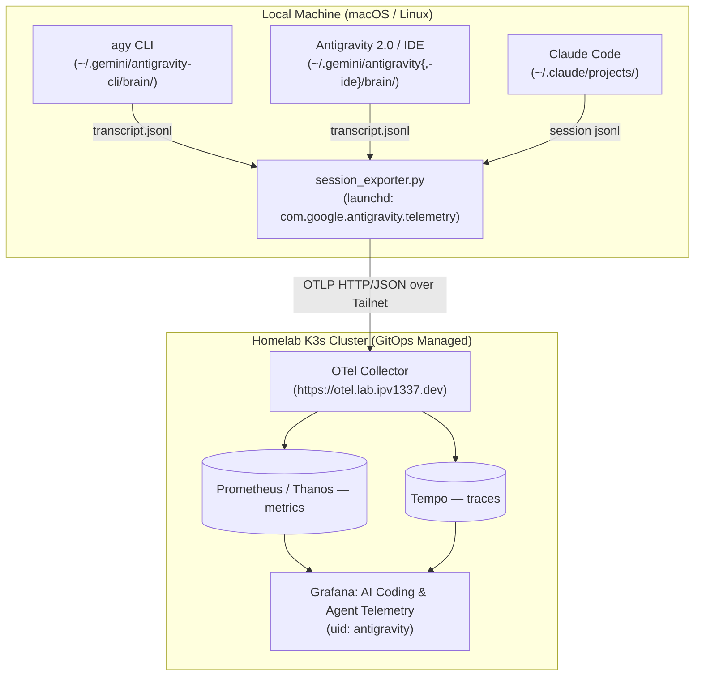

<!--
Copyright (c) 2026 VitruvianSoftware

Permission is hereby granted, free of charge, to any person obtaining a copy
of this software and associated documentation files (the "Software"), to deal
in the Software without restriction, including without limitation the rights
to use, copy, modify, merge, publish, distribute, sublicense, and/or sell
copies of the Software, and to permit persons to whom the Software is
furnished to do so, subject to the following conditions:

The above copyright notice and this permission notice shall be included in
all copies or substantial portions of the Software.

THE SOFTWARE IS PROVIDED "AS IS", WITHOUT WARRANTY OF ANY KIND, EXPRESS OR
IMPLIED, INCLUDING BUT NOT LIMITED TO THE WARRANTIES OF MERCHANTABILITY,
FITNESS FOR A PARTICULAR PURPOSE AND NONINFRINGEMENT. IN NO EVENT SHALL THE
AUTHORS OR COPYRIGHT HOLDERS BE LIABLE FOR ANY CLAIM, DAMAGES OR OTHER
LIABILITY, WHETHER IN AN ACTION OF CONTRACT, TORT OR OTHERWISE, ARISING FROM,
OUT OF OR IN CONNECTION WITH THE SOFTWARE OR THE USE OR OTHER DEALINGS IN THE
SOFTWARE.
-->

# Antigravity & `agy` Telemetry System

A zero-dependency Python 3 exporter that streams AI coding metrics and traces
from Antigravity, the `agy` CLI and Claude Code to the homelab collector.

> **How telemetry actually gets out.** `agy` has no OTLP exporter and reads no
> telemetry settings — verified against agy 1.2.7: its binary contains no
> `go.opentelemetry.io/otel/exporters` code, no `OTEL_*` environment handling,
> and no `telemetry` settings key. Everything here works by **tailing the
> transcript JSONL files** the agents already write, and posting OTLP to the
> collector. Earlier versions of this tool wrote lifecycle hooks into Gemini
> CLI's `~/.gemini/settings.json`; Google retired that CLI for individual
> accounts and `agy` never opens the file, so `setup` now *removes* them.

---

## Architecture Overview



Each surface is labelled separately, so the dashboard's `service` filter can
split them:

| `service` label | Source directory |
| :--- | :--- |
| `agy` | `~/.gemini/antigravity-cli/brain/` |
| `antigravity` | `~/.gemini/antigravity/brain/` |
| `antigravity-ide` | `~/.gemini/antigravity-ide/brain/` |
| `claude-code` | `~/.claude/projects/` |

---

## Quickstart

### 1. Install the exporter

```bash
bazel run //tools/antigravity-telemetry -- setup
```

This installs `session_exporter.py` to `~/.gemini/hooks/`, writes and loads the
`com.google.antigravity.telemetry` launchd job (KeepAlive, so it survives
reboots and crashes), and strips any dead telemetry hooks left in Gemini CLI's
`settings.json`.

### 2. Check health

```bash
bazel run //tools/antigravity-telemetry -- status
```

Reports whether `agy` is installed, how many transcripts each surface has, and
whether the exporter is running and the collector reachable.

### 3. Emit test telemetry

```bash
bazel run //tools/antigravity-telemetry -- emit \
  --tokens-input 10000 --tokens-output 2500 \
  --model gemini-3.8-flash --tool run_command --tool-latency-ms 180
```

### Backfill history

```bash
python3 ~/.gemini/hooks/session_exporter.py --backfill
```

---

## Grafana

The dashboard (uid `antigravity`) is provisioned by GitOps from
`gitops/argocd/platform/grafana-dashboards/antigravity.json`. Its `host` and
`service` template variables are `label_values()` queries, so a new surface
appears in the filter on its own once metrics arrive.

---

## Metrics Reference

| Metric Name | Type | Labels | Description |
| :--- | :--- | :--- | :--- |
| `antigravity_token_usage_total` | Counter | `host`, `service`, `model`, `token_type` (`input`, `output`, `thinking`, `cached`) | Cumulative tokens consumed |
| `antigravity_api_request_count_total` | Counter | `host`, `service`, `model`, `status_code` | LLM backend API requests |
| `antigravity_tool_call_count_total` | Counter | `host`, `service`, `tool_name`, `status` | Total tool executions |
| `antigravity_tool_call_latency_milliseconds` | Histogram | `host`, `service`, `tool_name`, `status`, `le` | Tool execution latency |
| `antigravity_session_count_total` | Counter | `host`, `service` | Conversations seen |
| `antigravity_active_session_count` | Gauge | `host`, `service` | Conversations active in the last 24h |
| `antigravity_subagent_spawn_count_total` | Counter | `host`, `service`, `subagent_type` | Subagents spawned |
| `antigravity_turn_count_total` | Counter | `host`, `service`, `model` | Agent turns executed |

The `antigravity_` prefix is kept deliberately: renaming it would orphan the
history already in Prometheus and Thanos.

---

## Legacy pieces

`telemetry_hook.py`, `telemetry_loader.py` and the `export` subcommand
implement the Gemini CLI lifecycle-hook protocol. Nothing invokes them now —
they are retained because `export` is still a usable way to post a single
event from a script, and removing the modules would break that. They are not
installed by `setup`.
