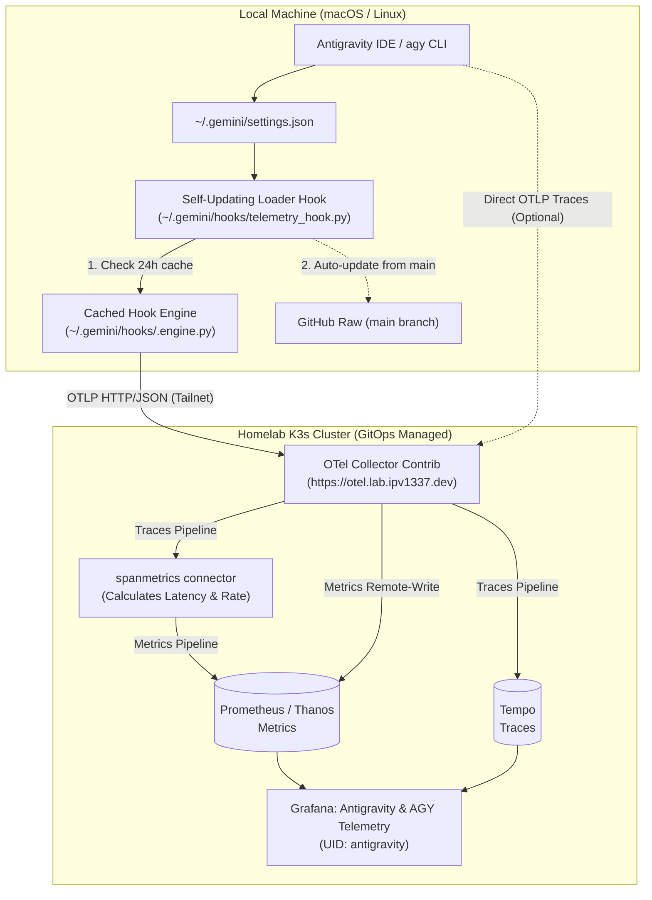

<!--
Copyright (c) 2026 VitruvianSoftware

Permission is hereby granted, free of charge, to any person obtaining a copy
of this software and associated documentation files (the "Software"), to deal
in the Software without restriction, including without limitation the rights
to use, copy, modify, merge, publish, distribute, sublicense, and/or sell
copies of the Software, and to permit persons to whom the Software is
furnished to do so, subject to the following conditions:

The above copyright notice and this permission notice shall be included in
all copies or substantial portions of the Software.

THE SOFTWARE IS PROVIDED "AS IS", WITHOUT WARRANTY OF ANY KIND, EXPRESS OR
IMPLIED, INCLUDING BUT NOT LIMITED TO THE WARRANTIES OF MERCHANTABILITY,
FITNESS FOR A PARTICULAR PURPOSE AND NONINFRINGEMENT. IN NO EVENT SHALL THE
AUTHORS OR COPYRIGHT HOLDERS BE LIABLE FOR ANY CLAIM, DAMAGES OR OTHER
LIABILITY, WHETHER IN AN ACTION OF CONTRACT, TORT OR OTHERWISE, ARISING FROM,
OUT OF OR IN CONNECTION WITH THE SOFTWARE OR THE USE OR OTHER DEALINGS IN THE
SOFTWARE.
-->

# Antigravity & `agy` Telemetry System

A zero-dependency Python 3 telemetry exporter and lifecycle hook suite that streams real-time AI development metrics and distributed traces from Antigravity and the `agy` CLI to the homelab Kubernetes cluster.

---

## Architecture Overview



---

## Grafana Dashboard Layout

```mermaid
flowchart TB
    subgraph Dashboard["Grafana Dashboard: Antigravity and AGY Telemetry (UID: antigravity)"]
        direction TB
        HostSelector["Top Filter: Host Dropdown ($host: All, james-mbp32, fedora)"]

        subgraph Section1["1. Token Economy"]
            T1["Cumulative Input Tokens"]
            T2["Cumulative Output Tokens"]
            T3["Cumulative Thinking Tokens"]
            T4["Cumulative Cached Tokens"]
            T5["Token Consumption Rate (tokens/sec)"]
        end

        subgraph Section2["2. Model and Cost Distribution"]
            M1["Token Usage by Model (Donut)"]
            M2["Model API Invocations (Timeseries)"]
        end

        subgraph Section3["3. Tool and MCP Execution"]
            L1["Tool Execution Throughput (calls/min)"]
            L2["P50 / P95 / P99 Latency per Tool (ms)"]
            L3["Tool Success vs Failure Rates"]
        end

        subgraph Section4["4. Session and Multi-Agent Activity"]
            S1["Active and Completed Sessions"]
            S2["Turn Duration and Concurrency"]
        end

        subgraph Section5["5. Distributed Tracing (Tempo TraceQL)"]
            Tr1["Live Trace Waterfall Table (service.name: antigravity, agy)"]
        end

        HostSelector --> T1
        HostSelector --> M1
        HostSelector --> L1
        HostSelector --> S1
        HostSelector --> Tr1
    end
```



---

## Quickstart

### 1. Configure Host Telemetry (Repo Checkout)
Run `setup` on any developer host running Antigravity or `agy` with repository access:
```bash
bazel run //tools/antigravity-telemetry -- setup
```
This performs:
- Configures `otlpEndpoint: "https://otel.lab.ipv1337.dev"` in `~/.gemini/settings.json`.
- Installs the self-updating loader in `~/.gemini/hooks/telemetry_hook.py` and pre-seeds the cache in `~/.gemini/hooks/.engine.py`.
- Registers post-execution lifecycle hooks for `AfterModel`, `AfterTool`, and `AfterAgent`.

### 2. Verify Telemetry Health
Check network connectivity and endpoint status:
```bash
bazel run //tools/antigravity-telemetry -- status
```

### 3. Emit Test Telemetry
```bash
bazel run //tools/antigravity-telemetry -- emit \
  --tokens-input 10000 \
  --tokens-output 2500 \
  --tokens-thinking 600 \
  --tokens-cached 40000 \
  --model gemini-3.7-flash \
  --tool run_command \
  --tool-latency-ms 180
```

---

## Zero-Clone Agent Setup Prompt

To configure any machine without checking out this repository, copy and paste the prompt in [`docs/guides/antigravity-telemetry.md#4-zero-clone-agent-setup-prompt-self-verifying`](file:///Users/james/Workspace/gh/application/vitruvian/vitruvian-core/docs/guides/antigravity-telemetry.md) directly into an active `agy` or Antigravity session.

---

## Metrics Reference

| Metric Name | Type | Labels | Description |
| :--- | :--- | :--- | :--- |
| `antigravity_token_usage_total` | Counter | `host`, `model`, `token_type` (`input`, `output`, `thinking`, `cached`) | Cumulative tokens consumed |
| `antigravity_api_request_count_total` | Counter | `host`, `model`, `status_code` | LLM backend API requests |
| `antigravity_tool_call_count_total` | Counter | `host`, `tool_name`, `status` (`success`, `failure`) | Total tool executions |
| `antigravity_tool_call_latency_milliseconds` | Histogram | `host`, `tool_name`, `status`, `le` | Tool execution latency in milliseconds |
| `antigravity_session_count_total` | Counter | `host`, `status` (`started`, `completed`, `error`) | Total Antigravity sessions |
| `antigravity_subagent_spawn_count_total` | Counter | `host`, `subagent_type` | Total subagents spawned |
| `antigravity_turn_count_total` | Counter | `host`, `model` | Total agent turns executed |
